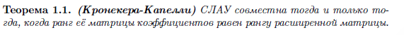

# Раздел 2:  

**1.Линейное пространство. Определение, аксиомы и их следствия. Примеры.**  

  

  

  

**2.Линейная комбинация. Линейная оболочка. Линейная зависимость и независимость.**  

  

  

**3.Базис линейного пространства. Размерность линейного пространства.**  

  

  

**4.Линейное подпространство. Определение, примеры.**  

  

  

**5.Линейное многообразие. Гиперплоскость. Определения, примеры.**  

  

  

**6.Изоморфизм линейных пространств.**  

  

**7.Ранг матрицы. Теорема о базисном миноре.**  

  

**8.Ранг матрицы. Связь с элементарными преобразование. Ранг суммы и произведения матриц.**  

  

  

  

**9.Теорема Кронекера-Капелли. Следствия о рангах.**  

  

  

  

  

**10.Однородная СЛАУ. Степень неопределенности однородной СЛАУ. Общее решение.**  

  

  

  

**11.Однородная СЛАУ. Пространство решений. Задание линейного подпространства однородной СЛАУ.**  

  

  

  

**12.Неоднородная СЛАУ. Общее решение. Альтернатива Фредгольма.**  

  

  

**13.Сумма подпространств. Нахождение базиса суммы подпространств.**  

  

  

**注意**：\( U + W \) 是包含 \( U \) 和 \( W \) 的最小子空间。换句话说，它是 \( U \cup W \) 并集的线性包络。

如果子空间被定义为向量系统的线性包络，那么子空间的和就是这些向量系统并集的线性包络。要找到 \( U + W \) 的基，只需从并集的向量系统中排除多余的（可以通过其他向量线性表示的）向量。为此，只需将它们写入矩阵并将其转换为阶梯形式。子空间和的基将对应于阶梯矩阵中的非零行向量。如果子空间由齐次线性方程组（SLAU）定义，则需要找到这些子空间的基，即这些 SLAU 的基本解系。  

**14.Пересечение подпространств. Нахождение базиса пересечения подпространств.**  

  

  

**注意**：\( U \cap W \) 是同时包含在 \( U \) 和 \( W \) 中的最大子空间。

要确定子空间交集的基，需要将它们定义为齐次线性方程组（SLAU）。由于任何属于交集的向量必须属于每个子空间，因此它必须满足每个系统。因此，它也必须满足合并后的 SLAU。这意味着要找到 \( U \cap W \) 的基，需要找到该 SLAU 的基本解系。  

  

  

  

  

https://www.zhihu.com/question/459757946  

**15.Базис, согласованный с подпространством. Формула Грассмана**  

  

空间 \( V \) 的基被称为与子空间 \( U \) 一致，如果 \( U \) 是空间 \( V \) 的某些基向量的线性包络。  

  

**16.Прямая сумма. Критерий прямой суммы. Прямое дополнение. Проекции вектора.**  

# Раздел 3:  

**1.Метод координат. Системы координат.**  

  

  

  

  

**2.Направленные отрезки. Свободные векторы.**  

  

  

**3.Множество векторов. Группа параллельных переносов.**  

  

**4.Аффинное пространство. Точечный базис. Базис в ДПСК.**  

  

  

  

**5.Общий подход к рассмотрению прямых и плоскостей.**  

  

**6.Векторные уравнения прямых и плоскостей.**  

  

  

**7.Взаимное расположение прямых, плоскостей и прямых относительно плоскостей.**  

  

  

  

  

**8.Прямая на плоскости: координатные уравнения.**  
**9.Плоскость в пространстве: координатные уравнения.**  
**10.Прямая в пространстве: координатные уравнения.**  
见3.A

**11.Линии на плоскости. Способы задания. Алгебраическая кривая. Общее уравнение кривой 2-го порядка.**  

  

  

**12.Эллипс. Определения, связанные понятия. Каноническое уравнения. Свойства эллипса**  

  

  

**13.Гипербола. Определения, связанные понятия. Каноническое уравнения. Свойства гиперболы.**  

  

见3.4  

**14.Парабола. Определения, связанные понятия. Каноническое уравнения. Свойства параболы.**  

  

见3.4  

**15.Полярные уравнения кривых 2-го порядка.**  
**16.Уравнение кривых 2-го порядка через эксцентриситет.**
**17.Приведение общего уравнения кривых 2-го порядка к каноническому виду: поворот.**
**18.Приведение общего уравнения кривых 2-го порядка к каноническому виду: выделение полного квадрата.**
**19.Классификация кривых 2-го порядка: эллиптический тип.**
**20.Классификация кривых 2-го порядка: гиперболический тип.**
**21.Классификация кривых 2-го порядка: параболический тип.**

见3.5