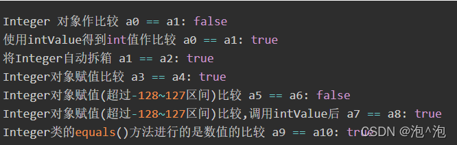

* 集合。集合元素的排序。接口 java.util.Comparable 和 java.util.Comparator。

https://cloud.tencent.com/developer/article/1918856

* 集合类别——列表、集合。接口 java.util.Map 及其实现。

https://www.hello-algo.com/chapter_hashing/hash_map/#613

- 将哈希值对桶数量（数组长度）capacity 取模，从而获取该 key 对应的数组索引 index 。
- Определите модуль хэш-значения по длине массива, чтобы получить индекс массива, соответствующий ключу.

- 在 Java 中，当负载因子超过 0.75
 时，系统会将哈希表扩容至原先的 2
 倍。
- В Java, когда коэффициент загрузки превышает 0,75, система автоматически увеличивает размер хэш-таблицы в два раза.

- 链式地址（separate chaining）将单个元素转换为链表，将键值对作为链表节点，将所有发生冲突的键值对都存储在同一链表中。
- Раздельное связывание преобразует один элемент в связанный список, использует пары ключ-значение в качестве узлов связанного списка и сохраняет все конфликтующие пары ключ-значение в одном и том же связанном списке.

* 参数化类型。创建参数化类。通配符参数。

https://developer.aliyun.com/article/640124

* 包装类。用途、应用领域、优缺点。自动装箱和自动拆箱。

- 装箱就是自动将基本数据类型转换为包装器类型。
- 拆箱就是自动将包装器类型转换为基本数据类型。
- Упаковка — это автоматическое преобразование базовых типов данных в соответствующие им типы-обёртки.  
- Распаковка — это автоматическое преобразование типов-обёрток в базовые типы данных.  

- 装箱缓存
- 装箱才会使用到缓存。
- Byte, Short, Long有固定范围: -128 到 127。对于Character, 范围是 0 到 127。除了Integer以外，这个范围都不能改变。
- Упаковка с кэшированием
- При упаковке используется кэширование. Для типов Byte, Short и Long диапазон фиксирован: от -128 до 127. Для Character диапазон составляет от 0 до 127. За исключением Integer, этот диапазон не может быть изменён. 
- Для типа Integer также существует кэширование в диапазоне от -128 до 127, но этот диапазон можно настроить через JVM параметры. Однако, для других типов таких как Byte, Short, Long и Character, указанные выше диапазоны являются фиксированными и не могут быть изменены. 
- Это делает процесс упаковки более эффективным при работе с объектами в пределах этих диапазонов, так как повторное использование уже созданных объектов из кэша снижает потребление памяти.  

```java

public class Test {
 
    public static void main(String[] args) {
 
        // 两个new出来的Integer类型的数据比较，相当于把new出来的地址作比较
        Integer a0 = new Integer(1);
        Integer a1 = new Integer(1);
        System.out.println("Integer 对象作比较 a0 == a1: " + (a0 == a1));
 
        // 调用intValue方法得到其int值
        System.out.println("使用intValue得到int值作比较 a0 == a1: " + (a0.intValue() == a1.intValue()));
 
        // 把Integer类型的变量拆箱成int类型
        int a2 = 1;
        System.out.println("将Integer自动拆箱 a1 == a2: " + (a1 == a2));
 
        // Integer对象赋值比较，其实也是内存地址的比较
        // 自动装箱，如果在-128到127之间，则值存在常量池中
        Integer a3 = 30;
        Integer a4 = 30;
        System.out.println("Integer对象赋值比较 a3 == a4: " + (a3 == a4));
 
        // Integer对象赋值(超过-128~127区间)比较
        Integer a5 = 128;
        Integer a6 = 128;
        System.out.println("Integer对象赋值(超过-128~127区间)比较 a5 == a6: " + (a5 == a6));
 
        // Integer对象赋值(超过-128~127区间)比较,调用intValue后再作比较
        Integer a7 = 128;
        Integer a8 = 128;
        System.out.println("Integer对象赋值(超过-128~127区间)比较,调用intValue后 a7 == a8: " + (a7.intValue() == a8.intValue()));
 
        // 使用Integer类的equals()方法进行的是数值的比较 
        Integer a9 = 129;
        Integer a10 = 129;
        System.out.println("Integer类的equals()方法进行的是数值的比较 a9 == a10: " + a9.equals(a10));
    }
}


```



* Java 中的输入输出流。字节流和字符流。流链（Stream Chains）。

Java中的串流链（Stream Chain）是指将多个输入/输出流串联在一起形成的流链，使得数据可以在这些流之间传递。
Цепочка потоков в Java — это цепочка потоков, образованная путем соединения нескольких потоков ввода/вывода таким образом, чтобы данные могли передаваться между этими потоками.

* Java 中的文件操作。类 java.io.File。


* 包 java.nio——用途、主要类和接口。


* 工具 javadoc。Java 代码自动文档化的特点。


