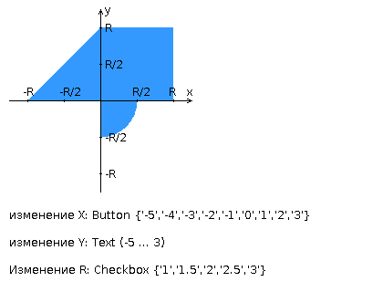

注意！不同题目的任务描述各不相同！

请使用 Java 语言开发一个 FastCGI 服务器，用于判断坐标平面上的点是否落入指定区域内，并创建一个 HTML 页面，用以生成数据并将其发送至该服务器进行处理。

参数 R 及点的坐标必须通过 HTTP 请求传递给服务器。服务器需对数据进行验证，并返回一个包含接收到的参数及计算结果（即判断该点是否落入区域）的 HTML 表格页面（服务器响应中允许返回 JSON 字符串代替 HTML 页面）。之前请求的结果必须在多次请求之间得以保留，并持续显示在表格中。

此外，响应内容还应包含当前时间以及脚本执行所花费的时间。

实验任务完成说明：

- 需要在 Helios 系统上以个人用户身份启动 Apache httpd Web 服务器（配置文件模板可从本页面顶部下载）。
- Web 服务器应负责提供静态内容服务（如 HTML、CSS、JS），并将动态内容请求转发给 FastCGI 服务器。
- FastCGI 服务器需使用 Java 语言实现（有用的 Java 库 jar 包可在本页面顶部下载），同样部署在 Helios 上。
- 必须通过 JavaScript 调用 FastCGI 服务器，以展示对 AJAX 原理的理解。
- 所开发的 HTML 页面需满足以下要求：
  - 使用块级布局来安排文本和图形元素。
  - 表单数据必须通过 GET 请求提交处理。
  - 样式表必须内嵌于网页文档中。
  - 在使用 CSS 时，必须展示子元素选择器、伪类选择器、属性选择器、伪元素选择器的使用，并体现 CSS 的继承性和层叠性等特性。
  - HTML 页面应包含一个“页眉”，其中标明学生的姓名、班级编号和题目编号。页眉的样式必须在 CSS 中显式设置字体（cursive）、颜色和字号。
  - 输入元素的边距必须以百分比方式设定。
  - 页面必须包含一段 JavaScript 脚本，用于验证用户在表单输入框中输入的值。任何无效输入（例如坐标中包含字母或半径为负数）都应被阻止。

    

实验答辩问题：

1. HTTP协议。请求和响应的结构、请求方法、服务器响应码、请求头和响应头。
2. 标记语言HTML。特点、主要标签及标签属性。
3. HTML页面结构。文档对象模型（DOM）。
4. HTML表单。HTTP请求方法的设定。表单在页面上的放置规则，输入字段的类型。
5. 层叠样式表（CSS）。结构——规则、选择器。选择器类型及其应用特点。规则的优先级。与直接通过标签属性设定样式相比，CSS的优势。
6. LESS, Sass, SCSS。主要特点，对比特性。浏览器兼容性，向“普通”CSS的转换。
7. 客户端脚本。特点，应用领域。JavaScript语言。
8. ECMAScript版本，ES6和ES7的新特性。
9. HTTP请求的同步和异步处理。AJAX。
10. jQuery库。用途，主要API。用于实现AJAX和操作DOM。
11. 使用SuperAgent实现AJAX。
12. 服务器端脚本。CGI——定义、用途、主要特点。
13. FastCGI——技术特点，与CGI相比的优势和劣势。
14. 使用Java语言实现的FastCGI服务器。
