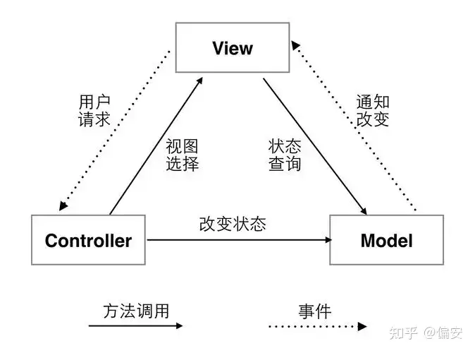
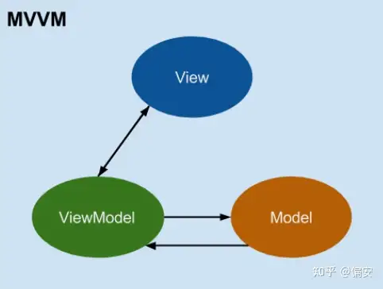
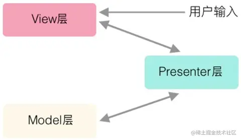

# MVC模式

* **模型(Model)** ：模型是应用程序的数据结构，不依赖于用户界面。它直接管理数据、逻辑和规则。
* **视图(View)** ：视图是用户看到的界面。它从模型中取得数据并呈现出来。
* **控制器(Controller)** ：控制器是模型和视图之间的链接。它处理用户的输入并更新模型。

# MVVM模式

* **模型(Model)** ：模型和MVC模式中的模型是一样的，它是应用程序的数据结构。
* **视图(View)** ：视图也和MVC模式中的视图是一样的，它是用户看到的界面。
* **视图模型(ViewModel)** ：视图模型是视图的抽象，它不仅包含视图的状态和行为，还包含了业务逻辑。视图模型通过双向数据绑定与视图进行通信，这样当模型的数据改变时，视图会自动更新。

# MVP模式

在 MVC 框架中，View 层可以通过访问 Model 层来更新，但在 MVP 框架中，View 层不能再直接访问 Model 层，必须通过 Presenter 层提供的接口，然后 Presenter 层再去访问 Model 层。

这看起来有点多此一举，但用处着实不小，主要有两点：

* 首先是因为 Model 层和 View 层都必须通过 Presenter 层来传递信息，所以完全分离了 View 层和 Model 层，也就是说，View 层与 Model 层一点关系也没有，双方是不知道彼此存在的，在它们眼里，只有 Presenter 层。
* 其次，因为 View 层与 Model 层没有关系，所以 View 层可以抽离出来做成组件，在复用性上比 MVC 模型好很多。

# **MVC与MVVM的区别**

MVC和MVVM最大的区别在于，MVC中的控制器(Controller)和MVVM中的视图模型(ViewModel)。

在MVC中，控制器负责处理用户的输入并更新模型，而在MVVM中，视图模型通过双向数据绑定与视图进行通信，当模型的数据改变时，视图会自动更新，这样可以减少视图和模型之间的依赖，使得代码更易于维护和扩展。
