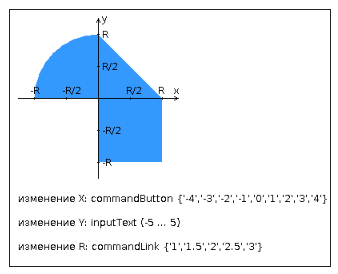

**注意！不同变体的任务文本不同！**

基于 JavaServer Faces 框架开发一个应用程序，用于检查坐标平面上点是否落入指定区域。

应用程序应包含 2 个 facelets 模板：起始页和应用程序主页面，以及一组实现服务器端逻辑的托管 Bean。

**起始页应包含以下元素：**

* 包含学生姓名、小组编号和变体编号的“页眉”。
* 显示当前日期和时间的交互式时钟，每 **8 秒**更新一次。
* 允许跳转到应用程序主页面的链接。

**应用程序主页面应包含以下元素：**

* 一组用于根据变体任务设置点坐标和区域半径的组件。可能需要使用额外的组件库 - **ICEfaces**（前缀 "ace"）和 **PrimeFaces**（前缀 "p"）。如果组件允许输入明显无效的数据（例如，点坐标中的字母或负半径），则应用程序必须对其进行验证。
* 根据变体编号和用户设置的坐标动态更新的图片，显示坐标平面上的区域和点。点击图片应触发一个脚本，确定新点的坐标并将其发送到服务器以检查其是否落入区域。点的颜色应根据是否落入区域而变化。半径更改也应触发图片的重新绘制。
* 包含先前检查结果列表的表格。
* 允许返回起始页的链接。

**对应用程序的附加要求：**

* 所有检查结果必须保存在 **HSQLDB 数据库管理系统**的数据库中。
* 必须使用 **Hibernate ORM** 来访问数据库。
* 必须使用 **Application-scoped Managed Bean** 来管理结果列表。
* 托管 Bean 的配置必须使用**注解**来指定。
* 应用程序页面之间的导航规则必须在单独的配置文件中定义。

**实验室答辩问题：**

1. **JavaServer Faces 技术** 。特点、与 Servlet 和 JSP 的区别、优缺点。JSF 应用程序的结构。
2. 在 JSF 应用程序中 **使用 JSP 页面和 Facelets 模板** 。
3. **JSF 组件** - 实现特点、类的层次结构。额外的组件库。JSF 应用程序中的事件处理模型。
4. 数据 **转换器和验证器** 。
5. 服务器端 JSF 页面的表示。 **UIViewRoot 类** 。
6. **托管 Bean** - 用途、配置方式。托管 Bean 的上下文。
7. **JSF 应用程序配置** 。`faces-config.xml` 文件。`FacesServlet` 类。
8. JSF 应用程序中的 **导航** 。
9. 从 Java 应用程序 **访问数据库** 。 **JDBC 协议** 、查询的构建、与数据库驱动程序的协作。
10. **ORM 概念** 。Java 应用程序中的 ORM 库。主要 API。ORM 提供程序与 JDBC 驱动程序的集成。
11. **Hibernate 和 EclipseLink ORM 库** 。特点、API、异同。
12. **JPA 技术** 。特点、API、与 ORM 提供程序的集成。
