# Архитектура компьютера — ответы к экзамену (2026.2)

Материал — курс «Архитектура компьютера» (Пенской А.В., ИТМО), источники — публичная копия `csa-rolling` и лекции курса. Номера вопросов совпадают со списком `exam-questions-blitz.md`.

Формат ответа — «суть» на 30–60–120 секунд: короткая структура, курсовые термины, без длинных отступлений. Уточняющие вопросы по деталям легко выводятся из ответа.

---

## Раздел 1. Вычислительные платформы и уровни абстракций (1–3)

**1. Что такое «вычислительная платформа» с точки зрения пользователя? Каков её состав?**

- С точки зрения пользователя/разработчика платформа — это среда, позволяющая описывать и выполнять вычисления, решать задачи.
- Состав: **язык** (модель описания вычислительного процесса), **базовые типы и операции** (для процессора — машинное слово, операции сложения/вычитания, «вшитые» в аппаратуру), **связующее звено** — паттерны/принципы реализации алгоритмов.
- Пример: процессор = машинный код + машинное слово + аппаратные операции.

**2. Какие уровни абстракций относятся к дисциплине «Архитектура компьютера»? Почему границы определены именно так?**

- Уровни абстракций идут от прикладного к физическому: приложение → языки высокого уровня → ОС/библиотеки → система команд (ISA) → микроархитектура → цифровая схемотехника → кремний.
- 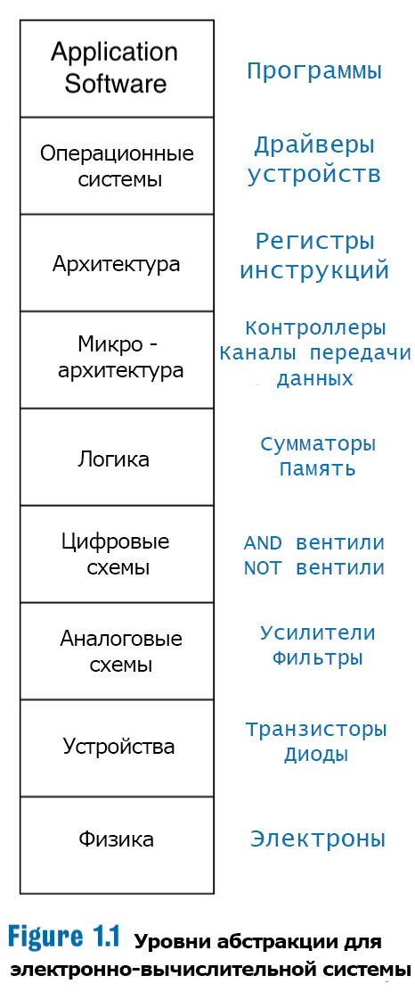
- 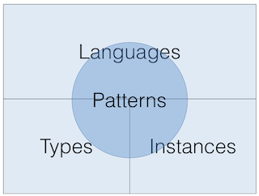
- Границы задаются **интерфейсами** между уровнями: каждый уровень общается с соседними через свой язык/API. Переход между уровнями — трансляция и виртуализация.
- Поэтому дисциплина фокусируется на интерфейсе «программист ↔ машина» (ISA) и на механизмах, которые повторяются между уровнями.

**3. В чём заключается отличие Platform-Based Design от проектирования для конкретной платформы?**

- Проектирование «под конкретную платформу» фиксирует целевые архитектурные решения сразу, без варьирования.
- Platform-Based Design (PBD): с одной стороны — пространство проектных решений (платформы, элементы, паттерны), с другой — пространство задач (способы решения, процессы, бизнес-требования); оба **сужаются**, чтобы получить оптимальную платформу под задачу.
- 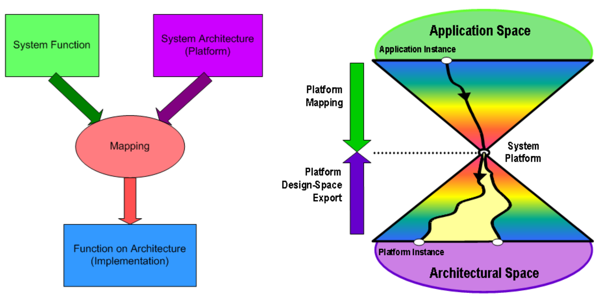
- Результат сужения — предметно-ориентированный язык (DSL). Пример: язык Python и поверх него Django/FastAPI как платформа для веба.

---

## Раздел 2. Системы, системная инженерия, понятие архитектуры (4–19)

**4. Почему большинство современных компьютерных систем считаются системами с преобладающей программной составляющей? Приведите примеры.**

- **Software-intensive systems**: системы, где доминируют разработка и/или интеграция ПО (ISO/IEC/IEEE 42010).
- ПО определяет функциональность и поведение системы; его можно менять после производства (гибкость, масштабируемость, экономия). Аппаратура — универсальная вычислительная основа.
- Примеры: смартфон (новые функции через обновления), ПК (одно железо — разные ОС), лампы, умные часы, автомобили.

**5. Что такое информационная и управляющая система? Каковы их отличия (функции, ПО, аппаратура)?**

- **Информационная система (ИС)** — получить данные, преобразовать/накопить и выдать в обработанном виде. Особенности: приоритет — производительность; спекулятивные вычисления, параллелизм, кластерные/облачные вычисления. Аппаратура: серверы, хранилища, ПК. ПО: СУБД, веб-приложения, аналитика.
- **Управляющая система (УС)** — взаимодействие с реальным физическим миром для контроля/управления. Особенности: встроенное исполнение, ограниченные ресурсы (энергия), специализация функций/платформы, автономная эксплуатация, работа в реальном времени. Аппаратура: микроконтроллеры (STM32, Arduino), датчики, ПЛК. ПО: realtime-ОС, прошивки, алгоритмы управления.
- Отличие: ИС — для данных (объёмы и скорость, но без жёстких сроков); УС — для физического управления с жёсткими временными рамками и высокой надёжностью.

**6. Что такое «требование реального времени»? Примеры систем.**

- Реальное время = **предсказуемо и в срок (±)**; ≠ быстро, ≠ абсолютно точно, ≠ без отказов.
- Пример: ГЭС/водосброс — водосброс должен открыться примерно через 7 минут (после прихода волны) и открывается медленно; мощности почти не нужны, но срок обязателен.
- Тот же код может быть ИС или УС в зависимости от задачи (пример: видеокодек).

**7. Каковы этапы эволюции информационных систем: от пакетной обработки до облачных систем?**

- Пакетная обработка (мейнфреймы, пакеты заданий) → мультипрограммирование и разделение времени (интерактив) → персональные компьютеры и локальные сети → интернет/клиент-сервер и веб → распределённые и облачные системы, кластеры, гетерогенные платформы, «вездесущие» (pervasive/ubiquitous) сервисы.
- Логика: рост интерактивности, масштабируемости и независимости уровней.

**8. Каковы этапы эволюции управляющих систем: от ИУС до КФС?**

- Индивидуальные управляющие системы (малые интегральные схемы, от аналога к цифре) → встроенные системы (микропроцессоры, сетевое взаимодействие) → распределённые встроенные системы (системы-на-кристалле, интеграция ИИ и облака) → киберфизические системы (КФС) (сети-на-кристалле, графические ускорители, нейропроцессоры).
- Примеры КФС: гироскутер, безопасные энергоэффективные вращающиеся двери, провис проводов и передаваемая мощность.

**9. Каковы задачи и предмет дисциплины «Системная инженерия»? Какова роль системных инженеров?**

- Системная инженерия (SE) — междисциплинарный подход и средство для создания **успешных** систем. Предмет: целостное понимание потребностей стейкхолдеров, изучение возможностей, документирование требований, синтез, проверка, приёмка и разработка решений — от концепции до вывода из эксплуатации.
- Применяется в сверхбольших системах, требующих множества дисциплин и участников.
- Роль системного инженера — **координация и структура**: команды разработки, процессы, передача информации; быть посредником между всеми участниками проекта.

**10. Что такое успешная система? Какие точки зрения (заинтересованные стороны) необходимы для построения успешной системы?**

- Успешная система — система, которой **довольны все её стейкхолдеры**.
- Для её разработки требуется рассмотреть: структуру, функциональное место, операционное окружение, жизненный цикл, обеспечивающие системы. (Те же результаты — в OMG Essence и СМД-методологии.)
- Три базовые точки зрения на систему: система как совокупность частей, как функциональное место, как жизненный цикл.

**11. Как можно рассматривать систему с точки зрения структуры? Каковы причины множественности структуры?**

- Система — комбинация взаимодействующих элементов, организованных для достижения заявленных целей; может рассматриваться как **продукт** или как **предоставляемые услуги**.
- Одна и та же система может быть представлена разными структурными моделями в зависимости от: уровня абстракций, цели анализа, масштабируемости/гибкости, технологического стека.
- Структурный подход позволяет декомпозировать сложную систему на управляемые части, оптимизировать взаимодействие компонентов, выбрать нужный уровень детализации.

**12. Как можно рассматривать систему с точки зрения функционального места? Что такое операционное окружение?**

- Система должна выполнять функцию, которую требуют стейкхолдеры и которая приносит им пользу; это позволяет систему назвать, определить, выделить.
- **Операционное окружение** — окружение, в котором система развёртывается и функционирует; в нём существует проблема/возможность, под которую система создавалась. Оно определяет возможности, желаемые результаты, выгоды и ограничения.

**13. Кто такие заинтересованные стороны (Stakeholders) системы и какова их роль в разработке?**

- Стейкхолдер — лицо или организация, имеющая право, долю, претензию или интерес к системе / к её характеристикам (ISO/IEC/IEEE).
- Роль: источник требований и «точек зрения»; именно их удовлетворённость определяет успешность системы. «Точка зрения» (viewpoint) — соглашения о правилах построения представления; «представление» (view) — система с данной точки зрения.

**14. Как можно рассматривать систему с точки зрения жизненного цикла? Что такое обеспечивающая система?**

- Жизненный цикл системы — эволюция от концепции до вывода из эксплуатации. Стадии: концептуальный этап → разработка → производство → утилизация (использование) → поддержка → вывод из эксплуатации.
- **Обеспечивающая система** — система, которая дополняет интересующую систему на этапах ЖЦ, но не обязательно вносит вклад в её эксплуатацию. Пример: вспомогательная производственная система. Каждая обеспечивающая система имеет собственный ЖЦ.

**15. Каковы цели архитектурного проектирования компьютерных систем?**

- Создать **эффективную, надёжную, масштабируемую** систему; принять стратегические и тактические решения, которые определяют все последующие этапы.
- Зафиксировать «всё важное» (архитектура — набор решений, которые, будучи ошибочными, могут привести к отмене проекта); управлять рисками до реализации.

**16. Что такое архитектура по Гради Бучу? Что представляют собой логическая и физическая структура?**

- Архитектура — **логическая и физическая структура** компонентов системы и их взаимосвязей, сформированная всеми стратегическими и тактическими проектными решениями.
- **Логический взгляд** — концепции концептуальной модели, существование и роль ключевых абстракций и механизмов.
- **Физическая модель** — конкретный программный и аппаратный состав реализации; зависит от технологии.

**17. Что такое архитектура согласно ISO 42010? Что такое архитектурное описание?**

- Архитектура — фундаментальные концепции или свойства системы в её окружении, воплощённые в элементах, связях и принципах проектирования и эволюции.
- **Архитектурное описание** — рабочий продукт, используемый для выражения архитектуры.
- «Существенное» может касаться: элементов системы; их расположения/взаимосвязей; принципов организации/дизайна; принципов эволюции в течение жизненного цикла.

**18. Как архитектурные решения влияют на проектные метрики? Что такое V-диаграмма и какую особенность разработки она демонстрирует?**

- Архитектурные решения фиксируют структуру, от которой зависят стоимость, сроки, качество и риски проекта.
- **V-диаграмма** показывает соответствие каждой стадии проектирования стадии верификации/тестирования; ошибки, заложенные рано, обнаруживаются поздно (справа от вершины V). Откладывание управления рисками резко увеличивает стоимость — чем дальше от вершины, тем дороже исправление.

**19. Почему плохой менеджмент может увеличить бюджет проекта быстрее, чем другие факторы? Проблема передачи информации.**

- Ключевые проблемы разработки компьютерных систем: формулирование/генерация информации, передача/сохранение информации, использование информации; плюс неполнота, неоднозначность, нераспределённость, противоречивость, подмена задач.
- Плохой менеджмент охватывает **весь** этот набор проблем одновременно, поэтому растёт бюджет быстрее всего (Boehm: poor management can increase software costs more rapidly than any other factor).
- Передача информации между специалистами — источник потери смысла: вопрос вне компетенции, шаблонное проектирование, искусственное сужение требований, подмена одной задачи другой, неверная расстановка приоритетов.

---

## Раздел 3. «Ещё не компьютеры». Вычисления без компьютеров (20–24)

**20. Сравните подходы к реализации вычислений в арифмометре и на логарифмической линейке. Аналогии с современными компьютерами.**

- **Арифмометр** — цифровое устройство: вычисление выполняется по шагам (алгоритмически), с учётом переноса между разрядами; медленный рост сложности устройства, средний рост длительности расчёта.
- **Логарифмическая линейка** — аналоговое устройство: принцип — воплощение таблицы значений в виде шкалы; выставляем положение и читаем результат; минимальное время расчёта, но быстрый рост размера/погрешности.
- Аналогии: арифмометр = последовательная цифровая машина (процессор); линейка/таблица = аналоговый и табличный подход (предвычисленные таблицы, кеш, мемоизация, SRT-деление).

**21. Каков был подход к расчёту артиллерийских таблиц группой людей? Аналогии с современными компьютерами.**

- Задача: многократный расчёт сложной формулы для разных параметров. Наивное решение (человек + лист + карандаш) плохо: ошибки выбора операции, ненадёжный «регистровый файл» (почерк), арифметические ошибки, склонность людей скрывать ошибки.
- Эффективное решение — **реконфигурируемый потоковый вычислитель**: формула представляется графом; каждому узлу — человек, выполняющий ровно одну операцию; люди расставлены по графу, каждый знает, кто подаёт входы и кто принимает результат; параметры подаются на вход, результат собирается на выходе; для надёжности — двоирование (две роты, сравнение, повтор при несовпадении).
- Аналогии: **параллелизм уровня инструкций** (независимые операции), **конвейеризация** расчётов, реконфигурация под задачу, повышение надёжности дублированием.

**22. Каково устройство электрического реле? Какие виды реле существуют и каковы области их применения?**

- Устройство: вход и выход, между ними ключ; **магнитная катушка** замыкает ключ, без тока ключ возвращается в нормальное состояние. Состояния 0/1 (есть/нет питания); работаем **уровнями**, а не сигналами.
- Виды: электрические, механические, пневматические, тепловые, оптические, акустические, магнитные.
- Применение: силовые шкафы управления (высокий ток, неблагоприятная среда), места, где электроника не работает (неэлектрические реле), исторически — компьютеры; ПЛК.

**23. Как реализуется булев базис на электрических реле?**

- Нормально разомкнутый контакт `[ ]` (повторитель) — замыкается при токе в катушке; нормально замкнутый `[\]` — инверсия (НЕ).
- **Последовательное** соединение контактов = И (AND); **параллельное** = ИЛИ (OR); нормально замкнутый контакт = НЕ (NOT).
- Так в релейных схемах строится полный булев базис {И, ИЛИ, НЕ}.

**24. Опишите классическую схему включения электродвигателя с аварийной остановкой. Объясните, как работает обратная связь.**

- Цепь управления: нормально замкнутый аварийный стоп (ES) → нормально замкнутая кнопка «Стоп» → узел с кнопкой «Пуск» и **параллельным контактом Run** → катушка Run.
- Нажатие «Пуск» подаёт питание на катушку Run; контакт Run замыкается и **самоподхватывает** цепь после отпускания кнопки — это и есть обратная связь (самоудержание).
- Нажатие «Стоп» или ES разрывает цепь, катушка обесточивается, контакт Run размыкается, двигатель останавливается. Отдельная ветвь Run питает мотор.

---

## Раздел 4. Реле → ПЛК. Булев базис и цифровая схемотехника (25–37)

**25. В чём заключается принцип развития иерархических систем Седова? Иллюстрируйте применительно к вычислительным платформам.**

- Принцип развития иерархических систем Седова: **ограничение разнообразия на нижележащем уровне для получения разнообразия на вышележащем уровне**.
- Связанное понятие — метасистемный переход (Турчин): несколько систем интегрируются в одну более сложную с новыми свойствами.
- Иллюстрация: из ограниченного набора транзисторов строятся регистры/АЛУ, из них — процессор, из процессора и ОС — платформа, из платформ — системы систем; «кирпичи» на нижнем уровне однотипны, на верхнем — богатство вариантов.

**26. Что такое программируемые логические контроллеры (ПЛК) и какова область их применения?**

- ПЛК — специальная разновидность электронной вычислительной машины; **управляющая система**.
- Особенности: законченные устройства встроенного использования; специализация ввода-вывода и модульность; выделение инструментальной составляющей; эксплуатация в тяжёлых условиях.
- Область применения: промышленное управление (АСУ ТП), автоматизация оборудования, замена релейных схем.
- Возникают из проблем релейной автоматизации: плохая масштабируемость, сложная настройка/поддержка, ненадёжность сложных схем, проблемы ведения документации.

**27. Какова структура ПЛК? Причины отделения инструментальной составляющей?**

- Типовое устройство ПЛК: процессорное ядро, память, модули ввода-вывода, блок питания; существуют и полностью программные реализации.
- Программирование одного ПЛК — IEC 61131: Ladder Diagram (релейные схемы), Function Block Diagram, Sequential Function Chart, Structured Text. Почему такие языки: используют не программисты; визуальность; формальные свойства и реальное время.
- Для множества ПЛК — IEC 61499 (распределённая автоматизация, system of systems): разделение управления и данных, интероперабельность.
- Отделение инструментальной составляющей (среды программирования от «железа») нужно, чтобы программировать удобно/наглядно, менять поведение без переделки контроллера.

**28. Каковы особенности аппаратного обеспечения ПЛК? Объясните причины таких особенностей.**

- Особенности: модульность ввода-вывода, специализация под контролируемое оборудование, устойчивость к тяжёлым условиям (температура, вибрация, помехи), надёжность, совместимость с промышленными датчиками/исполнительными устройствами (силовые уровни).
- Причины: ПЛК работает в реальном физическом окружении, долгое время автономно; важны надёжность и предсказуемость, а не максимальная производительность.

**29. Каковы особенности программного обеспечения ПЛК? Объясните причины таких особенностей.**

- Особенности: языки ориентированы на технологов/электриков (визуальные, релейно-контактные, функциональные блоки), формально проверяемые, поддерживают реальное время и циклический опрос.
- Причины: программируют не программисты; нужна наглядность и предсказуемость поведения; система должна гарантировать реакцию в срок, поэтому ПО формализовано и мало зависит от «произвола» компилятора.

**30. Что такое булев базис и какова его роль в вычислительной технике? Приведите примеры.**

- Булев базис — полный набор булевых функций, достаточный для реализации любых логических функций: {И, ИЛИ, НЕ}, а также штрих Шеффера `x|y = ¬(x·y)`, стрелка Пирса `x↓y = ¬(x∨y)`.
- Элементы цифровой схемотехники: двоичная логика, полный набор булевых функций, комбинационные схемы, триггеры (хранение состояния).
- Роль: на нём строятся все цифровые схемы (вентили, сумматоры, дешифраторы, мультиплексоры) и, в конечном счёте, процессоры.

**31. Что такое двоичное кодирование сигналов? Каковы его достоинства и недостатки? Что такое запретная зона?**

- Двоичное кодирование: информация представляется двумя уровнями (0/1); между уровнями — **запретная зона**, где значение не определено (пороговые уровни, шумовые поля). Это важно для помехоустойчивости.
- Достоинства: надёжно и помехоустойчиво; простая арифметика; диапазон и точность наращиваются разрядностью; погрешности «by design», а не «by implementation».
- Недостатки: нечитаемое представление; простые десятичные дроби — бесконечные двоичные; дискретное кодирование сигналов (ограничение точности).

**32. Какова роль машинного слова в устройстве процессора? Что такое Big- и Little-endian?**

- Машинное слово — единица данных, естественная для обработки данным вычислителем; может адресоваться в памяти, передаётся по шине за один раз, стандартная единица обработки. Связано с форматами инструкций, данных и адресов.
- **Big-endian** — старший байт слова по младшему адресу; **Little-endian** — младший байт по младшему адресу. Вопрос удобства байтовой адресации и копирования/переносимости; влияет на представление и распаковку чисел.

**33. Какие существуют способы кодирования целочисленных данных? Позиционное кодирование, дополнительный код, код Грея, BCD?**

- **Позиционная система счисления** — значение числа зависит от позиции разряда (двоичная, десятичная…).
- **Дополнительный код** (two's complement) — кодирование отрицательных чисел: инверсия + 1; сложение/вычитание через одну операцию, удобно для аппаратуры.
- **Код Грея** — соседние кодовые комбинации отличаются ровно в одном разряде; применяется в датчиках/энкодерах для исключения «ложных» промежуточных значений.
- **BCD** — каждый десятичный разряд записывается 4-битным двоичным кодом; удобно для отображения и обработки десятичных данных.

**34. Какие существуют способы кодирования бинарных данных? Что такое Base64, Base58?**

- Бинарные данные кодируются в текстовый/печатный алфавит для передачи (файлы, хеши, ключи).
- **Base64** — кодирование двоичных данных 64 символами ASCII: A–Z, a–z, 0–9 и 2 дополнительных символа; 3 байта → 4 символа.
- **Base58** — модификация Base64 без неоднозначных символов (0, I, O, l); в конце сообщения — контрольная сумма (checksum). Используется в криптовалютах/адресах.

**35. Что такое комбинационные схемы? Что такое переходный процесс и с чем связаны задержки?**

- Комбинационная схема — схема из логических элементов, реализующая заданную таблицу истинности; выход зависит только от текущего входа (нет запоминания).
- Свойства: при корректном входе устанавливается стабильное состояние (нет циклов); есть **задержка** установления после изменения входов; возможна накопительная ошибка (физический процесс), требуется буферизация.
- **Переходный процесс** — изменение сигналов на линиях за конечное время, пока значения не установятся; задержки связаны с физикой элементов и длиной/ёмкостью соединений.

**36. Как комбинационные схемы связаны с параллелизмом уровня бит?**

- В комбинационной схеме независимые подузлы работают **параллельно**; «ширина» схемы, шин данных и машинного слова даёт битовый параллелизм.
- Пример: каскадный сумматор n-бит — задержка ~O(n) (биты обрабатываются параллельно по разрядам), тогда как таблица истинности имеет размер O(n²). Чем шире машинное слово, тем больше битов обрабатывается за раз.

**37. Какие состояния существуют в комбинационных схемах (0, 1, x, z) и что они означают?**

- `0` и `1` — определённые логические уровни.
- `x` — **неизвестно**: значение может быть произвольным, так как таблица истинности определена частично (примеры: деление на 0, корень из отрицательного, неполный шифратор 4-to-2).
- `z` — **отключено / высокий импеданс**: источник (провод) «висит в воздухе»; 0 обычно не кодируют нулевым уровнем сигнала.

---

## Раздел 5. Условный оператор, память (триггеры), производство аппаратуры (38–47)

**38. Каковы особенности реализации «условного оператора» в комбинационных схемах?**

- Схема «не может не работать»: уровень не может не быть. Без состояния приходится **вычислять обе ветви и выбирать результат** — спекулятивные вычисления + мультиплексор.
- Мультиплексор: `out = sel ? in0 : in1`. Обе ветви вычислены заранее, выбор — по управляющему сигналу.
- Скрутки/циклы запрещены; «условный оператор» реализуется аппаратной селекцией данных.
- Пример (Verilog/Python): `in0 = f0(); in1 = f1(); out = sel ? in0 : in1;`
- 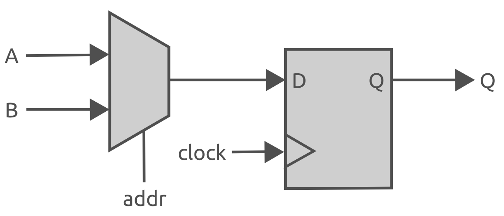

**39. Что такое триггеры в цифровых схемах? Каковы варианты их использования?**

- Триггер — класс электронных устройств, способных длительно находиться в одном из двух устойчивых состояний и менять их под внешними сигналами.
- Использование: **зафиксировать состояние линии** на время; **ограничить распространение сигнала** (разорвать цикл в схеме, сократить задержку комбинационной части).
- Виды по условию изменения: по фронту / по уровню; по интерфейсу: D-триггер, RS-триггер и др.

**40. Что такое D-триггер и RS-триггер? Какие существуют варианты условия изменения состояния?**

- **D-триггер** (Delay) — запоминает состояние входа и выдаёт его на выход по фронту/уровню синхронизации; одна линия данных.
- **RS-триггер** (Reset/Set) — асинхронный: сохраняет предыдущее состояние при неактивных обоих входах, меняет состояние при активном S или R; таблица: S=0,R=1 → Q=0; S=1,R=0 → Q=1; S=0,R=0 → Q(t-1); S=1,R=1 → оба выхода 0.
- Условие изменения: по фронту (0→1 или 1→0) или по уровню.
- Триггер вводит состояние → память; пример схемы с состоянием — 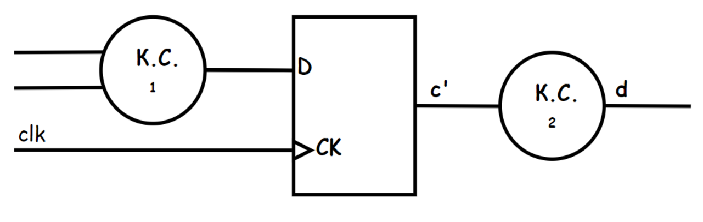

**41. Что такое пространственные и временные вычисления? Как они могут быть использованы для оптимизации процессоров?**

- **Пространственные (spatial)**: схема повторяет граф вычислений; чем больше «разбиений», тем ниже задержка и выше частота (параллелизм).
- **Временные (temporal)**: одна и та же схема последовательно выполняет несколько шагов, добавляется система управления (мультиплексоры, защёлки).
- Пример: 16-битное сложение — сумматор 16 бит за 1 такт (spatial) или сумматор 8 бит за 2 такта + управление (temporal). Trade-off между площадью и временем/частотой.

**42. Что называют синхронной схемотехникой? Каковы её достоинства и недостатки?**

- **Синхронная схемотехника** — все элементы работают от общего тактового сигнала; состояние фиксируется по такту.
- Достоинства: меньше гонок, проще синхронизация и верификация; предсказуемое поведение.
- Недостатки: частота ограничена самой медленной комбинационной схемой; входные сигналы дискретизируются по времени; «синхронность» выполняется лишь в заданном диапазоне.

**43. Почему цифровая схемотехника оперирует уровнями, а не сигналами? Какие возможности это открывает и какие проблемы создаёт?**

- Реальные линии — аналоговые физические процессы: есть питание и контакт — есть передача; сигнал «не может не идти». Работаем с уровнями (0/1) и запретной зоной, а не с событиями.
- Возможности: логическая интерпретация, помехоустойчивость, параллельная работа схемы.
- Проблемы: физические задержки, переходные процессы, накопление ошибок, неполная таблица истинности (результат случайный, но будет).

**44. Каковы ключевые тенденции в производстве радиоэлектронной аппаратуры и связанные с этим проблемы?**

- Тенденции: рост уровня интеграции; снижение стоимости изделия; усложнение производственной цепочки.
- Проблемы: длительный подготовительный период, дорогие серии, сложность внесения изменений (чем совершеннее технология, тем сложнее патч), необходимость специальных производств и специалистов.

**45. Какие виды монтажа электроники существуют? Как они соотносятся по гибкости и сложности производства?**

- **Навесной монтаж**: элементы на изолирующем шасси соединяются проводами/выводами. Простота подготовки и гибкость, но сложно автоматизировать, дорого в серии, низкая плотность, надёжность ниже (если не заливать компаундом).
- **Монтаж на печатную плату** (PCB): одно/двух/многослойные платы; виды монтажа компонентов — выводной (в отверстие), поверхностный (SMD/SMT), встроенный.
- Соотношение: рост автоматизации и плотности (SMD) ↔ рост стоимости подготовки производства и сложности внесения исправлений.

**46. Какова производственная цепочка поверхностного монтажа? Каковы её этапы?**

- SMT-линия (типово): нанесение паяльной пасты → установка компонентов (placement) → оплавление (reflow) → контроль/инспекция → отмывка → тестирование → (при необходимости) ремонт.
- Достоинства: автоматизация, плотность, размеры, стоимость в серии. Недостатки: длинная цепочка, сложность доработок; «гибкость» обеспечивается джамперами, разрезанием дорожек, навесными дорожками.

**47. Какова производственная цепочка кремниевого производства? Каковы особенности формирования цены изделия?**

- Цепочка: кремниевый песок → монокристалл (буля) → пластина (wafer) → фотолитография (свет-шаблон-фоторезист) → межсоединения (interconnect) → структура чипа → резка чипов → корпус и контакты (wire bonding / BGA).
- Особенности формирования цены: огромная стоимость литографии/степперов, неизбежный производственный брак (не все транзисторы работают), деление на сорта (**чип биннинг** — один кристалл продаётся под разными марками с отключёнными блоками), рост затрат с уменьшением размера транзистора.

---

## Раздел 6. Аппаратное/программное обеспечение. Модели вычислений (48–61)

**48. Какие трудности связаны с производством аппаратного обеспечения (подготовка производства, элементная база)?**

- Подготовка производства: длинная цепочка (логистика, склады, специалисты, тестирование, упаковка, дистрибуция, гарантийный ремонт); необходимость серийности для окупаемости.
- Элементная база: производственный брак неизбежен; устаревание элементной базы; зависимость от редких/дорогих технологий; сложность изменений после производства.

**49. Какие трудности связаны с эксплуатацией аппаратного обеспечения (амортизация, физический доступ, среда эксплуатации)?**

- Амортизация и выход оборудования из строя; физический доступ для обслуживания (дорого, не всегда возможен — Voyager); особенности среды эксплуатации (температура, вибрации, помехи); долгосрочные эффекты (олованные «усы», деградация).
- Обновление «патчем» для аппаратуры практически невозможно в отличие от ПО.

**50. Какие подходы к решению проблемы «устаревающей аппаратуры» существуют с точки зрения аппаратуры и ПО?**

- Аппаратура: перепроектирование на новой элементной базе; модульная организация и стандартные интерфейсы, имитация старых систем; виртуализация (эмуляция/виртуальные машины).
- ПО/системно: виртуализация, имитация (например, CD-ROM и дискеты — устаревшая периферия), перенос поведения на новое железо; Парадокс Тесея — система постепенно заменяется, оставаясь «той же».

**51. Что такое концепция 2-этапного производства? Какие подходы к «конфигурированию» продукции существуют?**

- **2-этапное производство**: сначала производится «универсальная» компьютерная система (Hardware), затем настраивается прикладное поведение (Software). Это Platform-Based Design.
- Возможности «конфигурирования» определены заранее (заложенные при проектировании или незадокументированные). Метод зависит от стадии ЖЦ:
  - **Сборка/комплектация**: джамперы, платы расширения, макетные платы.
  - **Реконфигурация/коммутация**: FPGA, CGRA (перепрограммируемые интегральные схемы).
  - **Программирование/настройка**: данные (программа) определяют прикладной процесс; количество уровней интерпретации ограничено только целесообразностью.

**52. Каково определение программной системы согласно OMG Essence? Каковы её части?**

- **Software system** — система, состоящая из программного обеспечения, аппаратного обеспечения и данных, которая приносит основную ценность за счёт исполнения ПО.
- Части: software (ПО), hardware (аппаратура), data (данные, необходимые системе). Вывод: в любой software-intensive системе есть эти три составляющие.

**53. Что такое программное и аппаратное обеспечение? Что означают понятия Hardware и Software? Сопоставьте их.**

- **Аппаратное обеспечение** — электронные и механические части вычислительного устройства (без ПО и данных).
- **Программное обеспечение** — совокупность программ, систем обработки информации и документов, позволяющая аппаратуре выполнять вычисления/управление; программа — данные (отчуждаема и передаваема).
- **Hardware/Software ≠ аппаратная/программная составляющая**: граница зависит от способа использования, языка и удобства изменения. Hardware — то, что трудно/долго/дорого поменять; Software — легко/быстро/дёшево (Weinberg: software — «flexibleware»). ПЛИС — аппаратура, потому что работает как схема.

**54. Какие возможности открывает программное обеспечение (цикл разработки, гибкость, контроль и т.д.)?**

- Быстрый цикл разработки; легко заменяется у пользователя; пользователь как бета-тестер; удалённое обновление (в т.ч. без согласия); сервис — вершина владения системой; CI/CD автоматизирует создание и внедрение; высокая сложность программ. Применение «патча», а не создание.

**55. Чем отличается типовое проектирование Hardware/Software от совместного (CoDesign)?**

- **Типовое** (последовательное): сначала проектируем аппаратуру (система команд, интерфейсы, схемотехника), затем пишем программу. Проблемы: шаблонность, риски интеграции, последовательные сроки.
- **CoDesign**: проектируем систему вместе: интерфейс HW/SW, модели HW/SW для обратной связи, верификация моделей, замена моделей на HW/SW. Достоинство — параллельная разработка, учёт взаимовлияния, сокращение сроков; недостаток — сложность и необходимость совместных моделей/инструментов.

**56. Что такое «Модель вычислений»? В чём назначение моделей вычислений? Приведите примеры.**

- **MoC (Model of Computation)** — модель, которая предоставляет язык для описания процессов/программ/структур; определяет возможности вычислительной машины; характеризует, как исполняется модель (состояния, переходы, детерминированность).
- Назначение: абстракция от конкретного вычислителя, формальная основа, ограничение творческого порыва, контроль сложности.
- Примеры: последовательные (конечные автоматы, стековые автоматы, машина Тьюринга, RAM); функциональные (арифметика, лямбда-исчисление, комбинаторная логика, рекурсивные функции, системы переписывания); параллельные (сети Кан, акторная модель, дискретные события, многопоточная модель, SDF).

**57. Что такое последовательные модели вычислений? Приведите примеры. Как в них представляется вычислительный процесс?**

- Последовательные модели описывают последовательный процесс как последовательность переходов состояний: конечные автоматы, автоматы с магазинной памятью, машина Тьюринга, Random Access Machine / машина фон Неймана.
- Вычислительный процесс — последовательность состояний вычислителя; относительно просто реализуются в виде аппаратных схем. Достоинства: таблица состояний, верифицируемость переходов, простая реализация.

**58. Что такое машина Тьюринга и почему она важна для теории вычислений?**

- Машина Тьюринга: неограниченная двусторонняя лента, разделённая на ячейки; управляющее устройство (головка) в конечном числе состояний; может двигаться влево/вправо, читать и записывать символы конечного алфавита.
- Важна тем, что обладает **полнотой по Тьюрингу** (позволяет реализовать любой известный алгоритм); это формальная основа вычислимости. Однако не может быть реализована на практике; есть проблема остановки; данные и управление разделены; ориентирована на реализацию.

**59. Что такое Random Access Machine? Каково её устройство и место сегодня? Какова её связь с машиной Тьюринга?**

- **RAM** — модель вычислительной машины с произвольным доступом к памяти (регистры + память с адресацией), по сути современный процессор (с оговорками).
- Связь с машиной Тьюринга: RAM — практически реализуемое развитие/уточнение машины Тьюринга; сохраняет последовательное исполнение и полноту, но использует память произвольного доступа.
- Место сегодня: базовая модель фон Нейманновских процессоров.

**60. Что такое функциональные модели вычислений? Приведите примеры. Как в них представляется вычислительный процесс?**

- Функциональные модели представляют вычислительный процесс как совокупность символов и правил их преобразования (математический объект).
- Примеры: арифметика, лямбда-исчисление (полнота по Тьюрингу), комбинаторная логика, общие рекурсивные функции, абстрактные системы переписывания.
- Возможна Тьюринг-неполнота; нет явной последовательности состояний, есть редукция выражений.

**61. Что такое параллельные модели вычислений? Приведите примеры. Как в них представляется вычислительный процесс?**

- Параллельные (concurrent) модели — системы из нескольких взаимодействующих процессов.
- Примеры: сети процессов Кан (однонаправленные каналы с буферами), акторная модель (сообщения в почтовые ящики), дискретные события, многопоточная модель (общая память), synchronous data flow (синхронные потоки данных), распределённые: OpenMP, IEC 61499, LabVIEW, Lingua Franca.
- Вычислительный процесс — обмен сообщениями/данными между параллельными агентами.

---

## Раздел 7. Универсальный процессор. Машина фон Неймана (62–71)

**62. Что такое Model-Driven Engineering (MDE)? Чем цепочка трансформации в MDE отличается от языков высокого уровня?**

- **MDE** — разработка через моделирование предметной области, автоматическая генерация кода из моделей, повышение уровня абстракции, сокращение разрыва между требованиями и реализацией, улучшение коммуникации, снижение сложности больших систем.
- Отличие цепочки трансформаций: в MDE есть цепочка моделей → генерация кода/артефактов (модель-ориентированная, например xtUML, Capella); языки высокого уровня — лишь одна ступень трансляции (текст → машинный код). MDE работает на уровне моделей, а не только текста.
- Примеры: BDD, DSL, Lingua Franca, CASE-технологии, JetBrains MPS, LabVIEW, IEC 61131.

**63. Что такое универсальный процессор? Каковы его особенности и свойства?**

- Информационный процессор — система, принимающая информацию в одной форме и обрабатывающая её в другую (ввод, процессор, хранилище, вывод). **Универсальный процессор** — позволяет решать широкий круг задач, настройка которых производится после производства (в run-time).
- Свойства: 2-этапное производство (Hardware + Software); полнота по Тьюрингу; нет «серьёзных» ограничений на объём программы; изменяемость ПО.
- Примечания: универсальность ≠ полнота по Тьюрингу; теоретическая ≠ практическая универсальность; универсальность противоречит эффективности; современный процессор — совокупность ПО и аппаратуры.

**64. В чём заключается противоречие между универсальностью и эффективностью в разных видах процессоров?**

- Универсальность (гибкость) и эффективность (производительность/энергия) противоречат друг другу.
- Ряд по гибкости/эффективности: ASIC (максимум эффективности, минимум гибкости) → CGRA → FPGA → DSP → GPU → CPU (максимум универсальности, ниже эффективность на конкретной задаче).
- CPU/GPU/DSP — временные (temporal) исполнение, универсальны; ASIC/FPGA/CGRA — могут быть пространственными (spatial), настраиваются под задачу.

**65. Как соотносятся вычислительные платформы и языки описания вычислительного процесса? Как это связано с эффективностью и областью применения?**

- Каждой платформе соответствует свой язык описания (модель вычислений): от машинного кода/ассемблера до высокоуровневых языков и DSL.
- Чем выше уровень языка и универсальность платформы — тем ниже пиковая эффективность, но шире область применения и меньше усилий на разработку. Чем ниже уровень (ближе к аппаратуре) — выше эффективность, но уже область применения.
- Выбор платформы/языка определяется задачей, командой и доступным железом (toolchain).
- 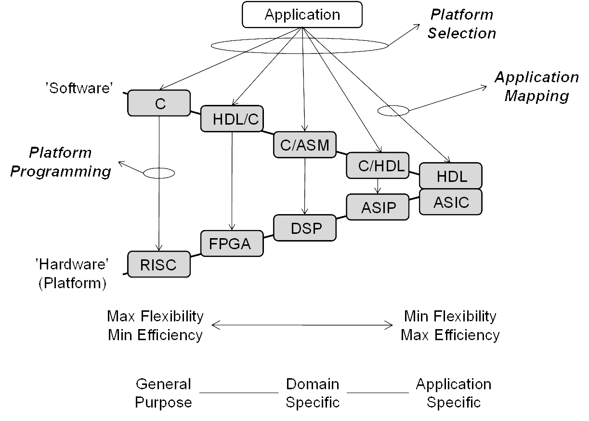

**66. Что такое архитектура и микроархитектура процессора? В чём различие между ними?**

- **Архитектура (architecture)** — то, как видит компьютер программист: набор команд (язык), расположение операндов (регистры/память), вычислительные механизмы (кеш, прерывания). Примеры: x86, MIPS, ARM, acc/cisc/risc/stack.
- **Микроархитектура (microarchitecture)** — соединение простейших цифровых элементов в логические блоки для выполнения команд данной архитектуры (регистры, АЛУ, конечные автоматы, память, интерфейсы).
- Различие: на одну архитектуру может быть много микроархитектур с разным соотношением цены/скорости/сложности; если ISA и микроархитектура различаются на уровне MoC — нужен уровень виртуализации.

**67. Что такое система команд и какова её роль в архитектуре процессоров? Что определяет система команд?**

- **Система команд (ISA)** — абстрактная модель процессора, интерфейс между ПО и процессором. Производительность/энергия/задержки обычно не рассматриваются.
- Определяет: типы данных; модель памяти, систему и методы адресации; набор инструкций; механизмы прерываний и исключений; методы ввода-вывода.
- Словарь языка компьютера — инструкции; словарный запас — система команд. Чтобы понять архитектуру, нужно знать её язык.

**68. Что такое машина фон Неймана? Какова её связь с машиной Тьюринга? Каковы её ключевые принципы?**

- Машина фон Неймана — развитие машины Тьюринга: лента заменена на RAM (память с произвольным доступом), инструкции и данные объединены в одной памяти. Призвана быть максимально простой в реализации и производстве. Процедурное программирование и ООП — тот же принцип.
- Ключевые принципы: двоичное кодирование; программное управление (последовательное исполнение команд); однородная память для данных и программ; адресуемая память с произвольным доступом; возможность условного перехода.
- 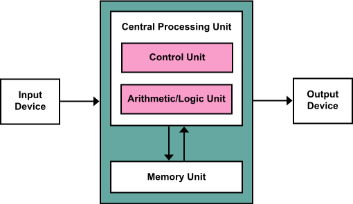
- В чистом виде практически не встречается, но влияние огромно; структурное программирование и ООП — наследие фон Неймана.

**69. Что такое микропроцессор и микроконтроллер? В чём их отличия?**

- **Микропроцессор** — цифровая схема, выполняющая операции с внешним источником данных (обычно памятью или потоком); ядро без периферии.
- **Микроконтроллер** — микросхема для управления электронными устройствами; сочетает функции процессора и периферии, содержит ОЗУ и/или ПЗУ.
- Отличие: контроллер = процессор + периферия + память на кристалле; предназначен для встроенного управления; процессор — вычислительное ядро для внешней памяти.

**70. Что такое Control Unit и Data Path? Каковы их назначение и принципы взаимодействия?**

- **Control Unit (CU)** — компонент ЦП, управляющий работой процессора; использует декодер для преобразования закодированных инструкций в управляющие сигналы, координирующие остальные блоки.
- **Datapath** — АЛУ, набор регистров и внутренние шины, по которым перемещаются данные.
- Взаимодействие: CU читает инструкцию, декодирует её в сигналы управления; эти сигналы управляют движениями данных в datapath (защёлки, мультиплексоры, чтение/запись памяти, выбор АЛУ).

**71. Какие виды инструкций существуют в машине фон Неймана? Приведите примеры. Каковы принципы кодирования?**

- Виды: работа с памятью (запись констант, копирование данных между памятью/регистрами/портами); арифметические/логические/битовые (int, float); управляющие (безусловный/условный/косвенный переход, вызов/возврат подпрограмм); инструкции сопроцессоров (загрузка/выгрузка, управление сопроцессором).
- Принципы кодирования: поле **opcode** (код операции) + поля операндов (номера регистров, непосредственные значения, адреса); пример `addi $r1, $r2, 350` → `r1 ← r2 + 350`; при переполнении флаг overflow.

---

## Раздел 8. Память инструкций/данных. DataPath. CISC. Микрокод. NISC (72–87)

**72. Сравните принстонскую и гарвардскую архитектуры: особенности, достоинства, недостатки и области применения.**

- **Принстонская (фон Неймановская)** — общая память для инструкций и данных, один канал; узкое место — поочерёдный доступ.
- **Гарвардская** — раздельные память и каналы инструкций и данных.
- Достоинства гарвардской: два физических канала, одновременный доступ, разная ширина слова/адресов (оптимизация под задачу), изоляция памяти инструкций. Недостатки: сложность и стоимость; изоляция инструкций от данных (нельзя запустить скомпилированный результат, указатели на функции).
- 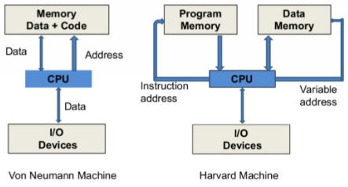

**73. Как организовано адресное пространство в гарвардской и принстонской архитектурах?**

- В принстонской — **единое** адресное пространство для данных и инструкций, одно пространство и одно машинное слово.
- В гарвардской — **два раздельных** адресных пространства (инструкции и данные), возможно с разной разрядностью адресов и машинных слов.
- Размерность машинных слов и адресных пространств зависит от решаемой задачи и физической реализации памяти.

**74. Какие существуют варианты обхода ограничений гарвардской архитектуры, включая «Модифицированную гарвардскую архитектуру»?**

- **Память инструкций как данные** (Instruction-memory-as-data): можно читать/писать в память программ (генерировать и запускать код).
- **Память данных как инструкции** (Data-memory-as-instruction): можно запускать инструкции из памяти данных, но параллельный доступ ограничен.
- **Модифицированная Гарвардская архитектура (main stream)**: независимые **кеши** данных и инструкций, доступ внутренне независим, но канал между процессором и памятью один.

**75. Что такое «аккумуляторная система команд»? Каковы основные элементы? Приведите примеры. Каковы достоинства и недостатки?**

- **Accumulator architecture**: один неявный операнд — аккумулятор (ACC); операции выполняются через него: `load ACC←A; mul ACC←ACC*X; add ACC←ACC+B; store Y←ACC`.
- Достоинства: простой компилятор, короткие инструкции. Недостатки: много пересылок, ограниченный параллелизм, один регистр неудобен.
- Примеры: ПДП-8, 8051, лаб. 4.

**76. Что такое Register-to-Memory системы команд? Каковы основные элементы? Приведите примеры. Каковы их достоинства и недостатки?**

- **Register-to-Memory**: арифметические операции могут иметь операнды и в регистрах, и в памяти (один операнд в памяти): `mul R1←A*X; add Y←R1+B;` (2 операнда).
- Достоинства: меньше пересылок, чем в аккумуляторной; память доступна прямо в арифметических инструкциях. Недостатки: переменная длина инструкций, сложнее конвейеризация, сложный компилятор. Это типичный CISC-стиль.

**77. Что такое Register-to-Register системы команд? Каковы основные элементы? Приведите примеры. Каковы их достоинства и недостатки?**

- **Register-to-Register (Load-Store)**: операции работают только с регистрами, доступ к памяти — отдельными инструкциями load/store: `load R1←A; load R2←X; mul R4←R1*R2; ...; store Y←R5;`.
- Достоинства: фиксированный формат, простота конвейеризации, однородные регистры, понятный компилятор (RISC). Недостатки: больше инструкций (больше кода), необходимы загрузки/сохранения.
- Примеры: ARM, MIPS, RISC-V.

**78. Что такое Memory-to-Memory системы команд? Каковы основные элементы? Приведите примеры. Каковы их достоинства и недостатки?**

- **Memory-to-Memory**: операнды и результат прямо в памяти: `lfn Y←A*X+B` (3 операнда в памяти).
- Достоинства: нет явных регистров, минимальный код. Недостатки: много обращений к памяти, длинный цикл, плохо конвейеризуется, сложно в реализации. Пример: VAX-подобные.

**79. Что такое CISC процессоры? Каковы их ключевые особенности, достоинства и недостатки?**

- **CISC** — архитектура, где одна инструкция может выполнять несколько низкоуровневых операций (загрузка из памяти, арифметика, запись в память) или использовать сложные многошаговые режимы адресации.
- Причины появления: низкоуровневые языки, разнообразие архитектур, неразвитость компиляторов, удобство программирования, высокая производительность, минимизация объёма программ и накладных расходов.
- Достоинства: компактный код, мощные инструкции. Недостатки: сложная система команд (использование/анализ), сложное устройство и Control Unit, сложно генерировать эффективный машинный код.

**80. Какие виды адресации аргументов инструкции в CISC процессорах?**

- Подразумеваемая (в opcode); непосредственная (константа); прямая (адрес числом); относительная (`addr + base`); косвенная (адрес в ячейке); автоинкрементная/автодекрементная; стековая; адресация слов переменной длины; укороченная (часть адреса).

**81. В каких случаях CISC инструкции эффективны? Приведите примеры.**

- Когда код должен быть компактным и выполняет частую/сложную операцию без пересылок (например, строковые операции, поиск, обращение к структурам через сложную адресацию).
- Примеры: x86 `rep movsb` (копирование строк), инструкции с косвенной адресацией через сегменты, операции над структурами БД/стеком; выигрыш при нехватке памяти программ.

**82. В чём выражается комплексность систем команд CISC?**

- Разнообразие форматов, размеров и длительностей инструкций; разнородные операнды; специальные регистры; сложность декодера и оптимизации; трудность эффективной генерации машинного кода; усложнение инструментария. Микрокод привносит все проблемы программирования (сложность, отладка).

**83. Какие существуют подходы к реализации Control Unit? Достоинства и недостатки Hardwired и микропрограммного управления?**

- **Hardwired** — аппаратные комбинационные схемы, декодирующие инструкции в последовательности управляющих сигналов. Быстрее, проще для простых ISA, но трудно менять, сложно для сложных CISC.
- **Microcoded** — исполнение микропрограммы, реализующей набор инструкций процессора. Гибко, легко расширяется/меняется ISA, но медленнее и требует памяти микрокода.

**84. Что такое микропрограммное управление? Что такое микроинструкция? В чём отличия инструкций и микроинструкций?**

- **Микропрограммное управление** — реализация Control Unit через исполнение микропрограмм (микрокода). **Микропрограмма** — программа, реализующая набор инструкций процессора.
- **Микроинструкция** — слово, задающее управляющие сигналы за один такт (какие защёлки, мультиплексоры, операции АЛУ, чтение/запись памяти).
- Отличие: машинная инструкция — внешний язык архитектуры (оператор верхнего уровня); микроинструкция — внутренние управляющие сигналы аппаратуры, на которые раскладывается инструкция.

**85. Как можно оптимизировать инструкции при помощи микропрограммирования? Приведите пример.**

- Можно «программировать» собственный набор команд: генерировать ISA под задачу (сократить объём, повысить эффективность). Пример: советский компьютер «Самсон», который позволял создавать заданный набор команд.
- Микропрограммированием добавляют удобные/частые сложные операции (например, команды работы со строками, со стеком, с плавающей точкой) без изменения аппаратуры.

**86. Какие существуют подходы к поиску первой микроинструкции для заданной инструкции?**

- **Алгоритмически**: сопоставление инструкции с условием + условный переход в рамках микропрограммы.
- **Отображение кода операции на адрес микроинструкции**: прямое отображение (opcode как адрес, например `0101` → `0x05`) или непрямое — через look-up table (см. лаб. 4).

**87. Что такое архитектура NISC? Каковы область её применения, достоинства и недостатки?**

- **NISC (No Instruction Set Computing)** — отказ от системы команд, остаётся только микрокод (управляющие сигналы). То, что в CISC/микрокоде — инструкция, здесь напрямую управляет процессором.
- Достоинства: упрощение аппаратуры, максимальная эффективность программного управления, нет проблем проектирования ISA.
- Недостатки: невозможность бинарной совместимости, низкая плотность машинного кода.
- Применение: ускорители, высокоуровневый синтез (HLS), специализированные вычислители; проект NITTA (CGRA), где управляющие слова генерируются напрямую, минуя ISA.

---

## Раздел 9. Стековые процессоры. Производительность. RISC. Конвейер (88–107)

**88. Что такое стековые системы команд? Каковы основные элементы? Что такое неявная адресация аргументов? Каковы их достоинства и недостатки?**

- **Стековая архитектура**: данные обрабатываются не в регистрах, а на стеке. `mul` = `a=pop(); b=pop(); push(a*b)`. Чтение/запись памяти через стек (`@` — читать, `!` — записать), переходы через стек.
- **Неявная адресация**: операнды берутся со стека автоматически, в инструкциях адреса/регистры не указываются (0 операндов). Пример: `A B + C D + *`.
- Достоинства: простая система команд, мощный компилятор, поддержка процедур/рекурсии/автоматической памяти (High-level-language computer), cache-friendly, потоки. Недостатки: сложно работать с большим объёмом данных на стеке, динамические структуры, слабый параллелизм уровня инструкций, непривычная модель программирования.
- 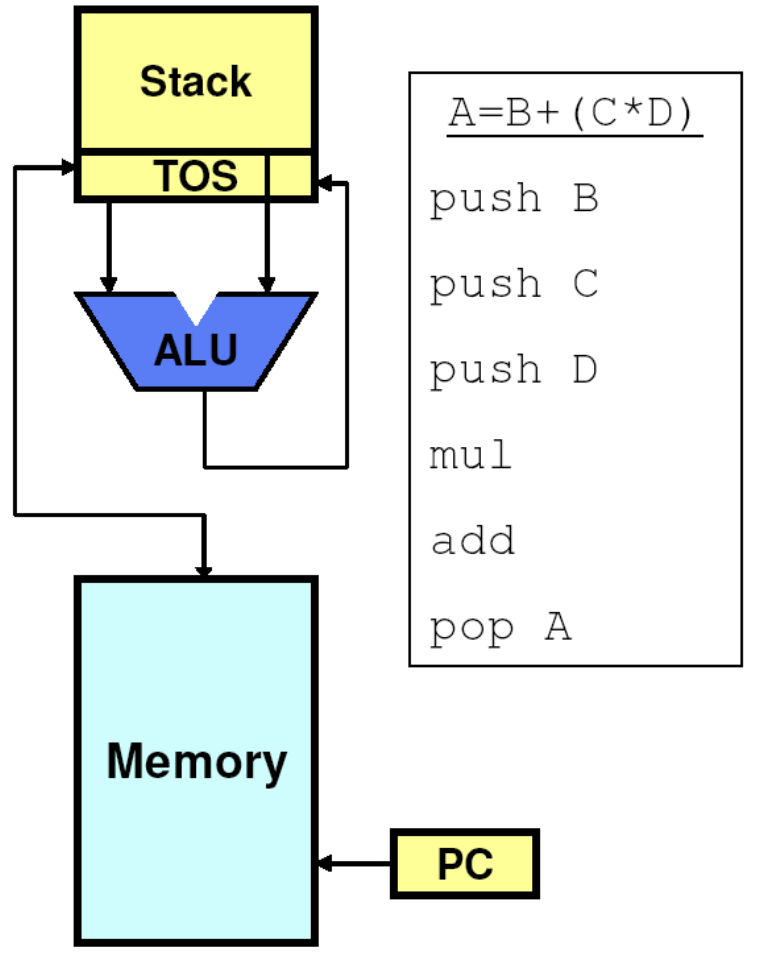

**89. Какие виды стеков есть в стековых процессорах? Их количества?**

- Различают **стек данных** (operand/data stack) — для операндов, и **стек вызовов** (return/call stack, frame) — для адресов возврата и локальных данных.
- Также разделяют **стеки операндов** (data stack) и **адресный стек** (для возвратов); количество/наличие уровней зависит от модели.

**90. Каковы основные принципы описания алгоритмов для стековых процессоров? Что такое Forth и High-level language computer?**

- Выражения записываются в **польской (постфиксной) записи**: `X=(A+B)*(C+D)` → `A B + C D + *`. Процедуры, автоматическая память, рекурсия.
- **Forth** — императивный язык на основе стека: структурное программирование, рефлексия, расширяемость (новые команды). **High-level language computer architecture** — процессор, который напрямую удобен для высокоуровневых конструкций (процедуры, выражения, рекурсия).
- Пример Forth-факториала: `: fac dup 1 > IF dup 1 - fac * ELSE drop 1 ENDIF ;`

**91. Каковы источники роста производительности процессоров?**

- Частота; специализация системы команд и аппаратуры; параллелизм уровня бит/инструкций/задач; адаптация структуры вычислителя под задачу и параллелизм (пространственные вычисления); динамическая адаптация.

**92. Какие законы и ограничения влияют на производительность современных процессоров?**

- Закон Мура, закон Амдала, закон Деннарда; Power Wall; Memory Wall. Также: накладные расходы на параллельные вычисления, объективная сложность параллельного программирования, доставка данных.

**93. Что представляют собой закон Мура и закон Деннарда?**

- **Закон Мура**: число транзисторов в плотной интегральной схеме удваивается примерно каждые два года.
- **Закон Деннарда** (масштабирование MOSFET): при уменьшении транзистора плотность мощности остаётся постоянной, потребление пропорционально площади; напряжение и ток масштабируются с длиной. Конец этого масштабирования → трудность уменьшения транзистора, токи утечки, Power Wall и тёмный кремний.

**94. Что представляет собой закон Амдала? На каком уровне параллелизма он работает?**

- **Закон Амдала** — фундаментальное ограничение на ускорение от параллелизма: прирост ограничен нераспараллеливаемой (последовательной) частью. Чем меньше последовательная часть, тем выше теоретический максимум ускорения.
- Работает на уровне параллелизма задач/потоков и ресурсов; определяет предел выигрыша от добавления параллельных вычислителей.

**95. Что такое Power Wall и тёмный кремний?**

- **Power Wall** — ограничение роста частоты из-за роста энергопотребления/тепловыделения (окончание масштабирования Деннарда); нельзя просто наращивать частоту и количество активных транзисторов.
- **Тёмный кремний (dark silicon)** — часть транзисторов/блоков на чипе, которая не может работать одновременно из-за энергобюджета; «тёмные» участки отключаются (patterns, троттлинг).

**96. Какие подходы существуют к решению проблемы Memory Wall в рамках процессоров семейства фон Неймана?**

- Иерархия памяти с кешами; предвыборка (prefetch); скрытие задержки через параллелизм уровня инструкций (суперскаляр, out-of-order); специализация/близость памяти; многоуровневые кеши; использование локальности (временной/пространственной), оптимизация доступа (AoS/SoA, транспонирование матриц).

**97. Что такое RISC? Каковы особенности и предпосылки появления (ПО и аппаратура)?**

- **RISC** — подход, где набор инструкций сокращён до часто используемых с единым форматом кодирования, что позволяет конвейеризировать исполнение.
- Предпосылки/особенности: сложные операции встречаются редко и заменимы группами команд; появились языки высокого уровня; единый формат инструкций и простой декодер; память микрокоманд/декодера можно отдать под регистры и кеш; оптимизация малого количества однообразных команд; параллелизм уровня инструкций (pipeline).
- Вывод: рост производительности «средней программы» за счёт ускорения частых инструкций; простой машинный код; "то, что раньше делали корпорации, теперь доступно двум аспирантам".

**98. Как сравниваются CISC и RISC с точки зрения архитектуры?**

- **CISC**: сложные инструкции переменной длины, специальные регистры, арифметика и доступ к памяти в одной инструкции, 1–3 операнда (смешанные), но «мощнее» на одну инструкцию.
- **RISC**: простые инструкции фиксированного размера, операции и работа с памятью — разные инструкции (только load/store), однородные регистры, 2–3 операнда только регистры. Архитектура проще и регулярнее.
- Таблица сравнения: операнды 1–3 (CISC) vs 2–3 регистровые (RISC); доступ к памяти в арифметике (CISC) vs только load/store (RISC).

**99. Как сравниваются CISC и RISC с точки зрения микро-архитектуры?**

- CISC требует сложный декодер, переменную длительность, часто микрокод; трудно конвейеризовать. RISC — простой декодер, фиксированная длительность, легко конвейеризуется, больше площади отдано под регистры/кеш.
- Современные x86 (CISC) внутри могут использовать RISC-подобное ядро с трансляцией в микрооперации — гибрид.

**100. Каковы особенности кодирования инструкций при сравнении CISC и RISC?**

- **CISC**: переменная длина и формат инструкций; меньше байт на выражение (высокая плотность кода); много полей/режимов адресации.
- **RISC**: фиксированный размер и единый формат; низкая плотность кода (больше инструкций), но простое и быстрое декодирование; кодирование часто равномерное (opcode + регистры + непосредственное).

**101. Каковы принципы конвейерного исполнения инструкций? Как это влияет на загрузку и производительность?**

- Разбиваем обработку инструкции на несколько этапов и выполняем их **параллельно для разных команд**; один такт — одна стадия. Процессор имеет вход (поступают команды) и выход (команды завершаются); сегменты связаны регистрами, комбинационные схемы сбалансированы, всё управляется одним тактовым сигналом.
- Результат: каждый такт загружается новая команда и завершается предыдущая — растёт пропускная способность (загрузка/утилизация), но латентность отдельной команды не уменьшается.
- 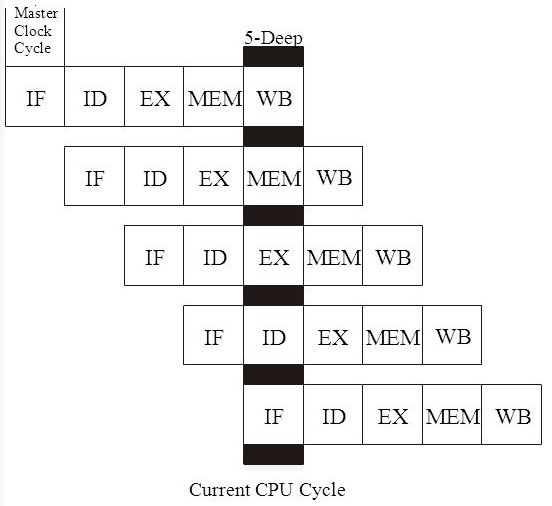

**102. Каковы типовые стадии RISC процессора?**

- Instruction Fetch (чтение инструкции по PC) → Instruction Decode (декодирование и чтение регистров) → Instruction Execute (АЛУ) → Memory Access (чтение/запись памяти) → Write Back (запись результата в регистр).
- Операции: register-register (1 такт), memory reference (2 такта), multi-cycle (умножение/деление/float — много тактов).
- 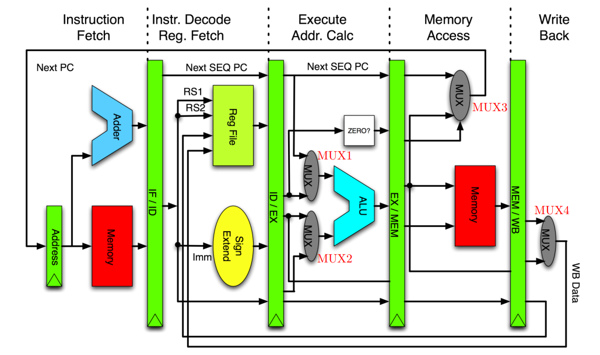

**103. Какие проблемы и архитектурные ограничения связаны с конвейеризацией?**

- Инструкции не независимы. Конфликты: **структурные** (нехватка ресурсов), **по данным** (data hazards: RAW/WAR/WAW/RAR), **по управлению** (branch hazards). Сложность: снижение скорости отдельной команды, необходимость разрешения конфликтов, непредсказуемое время исполнения, уязвимости косвенных каналов.

**104. Как разрешаются структурные конфликты в конвейере?**

- Структурный конфликт — нехватка аппаратных ресурсов (например, одновременный доступ к единой памяти инструкций/данных). Полные решения: **гарвардская архитектура** (раздельные каналы) или **двухпортовая память**; частично — дублирование функциональных блоков.

**105. Как разрешаются конфликты по данным в конвейере?**

- RAW (read-after-write) — истинная зависимость; WAR/WAW — ложные (для переупорядочивания и кешей); RAR — не проблема.
- Механизмы: **исполнение не по порядку** (out-of-order), **переименование регистров** (устранение ложных зависимостей), **вставка пузырька**, **проброс операндов** (bypassing/forwarding).
- 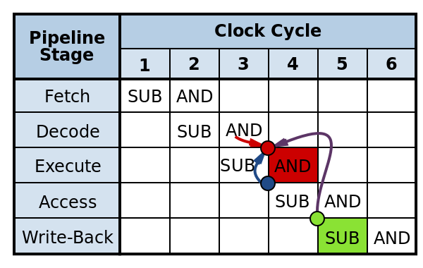

**106. Как происходит разрешение конфликтов при помощи пузырька в конвейере?**

- **Пузырёк (bubble)** — пустой такт в конвейере: занимает стадию, но не выполняет полезной работы; позволяет дождаться готовности данных или разрешения конфликта.
- Прост в реализации, но снижает эффективность (потерянные такты); применяется и для данных, и для структурных/управленческих конфликтов (в т.ч. сброс конвейера после перехода).

**107. Как происходит разрешение конфликтов при помощи проброса операндов в конвейере?**

- **Проброс (bypass/forwarding)**: результат со стадии выдачи/исполнения передаётся напрямую на стадию использования следующей инструкции, минуя регистровый файл.
- Это устраняет RAW-конфликт за один такт, если результат уже вычислен; когда результат ещё не готов — комбинируется с пузырьком.
- 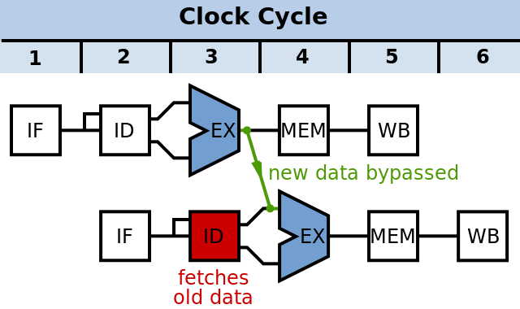

---

## Раздел 10. Конфликты по управлению. Ввод-вывод (108–117)

**108. Какие существуют способы разрешения конфликтов по управлению во время компиляции?**

- На этапе компиляции: минимизация количества условных переходов (разворачивание циклов — loop unrolling, условное перемещение данных — `cmov`), статическое **предсказание переходов** (по направлению вперёд/назад), планирование/перестановка инструкций; «задержанные переходы» (delay slot).

**109. Какие существуют способы разрешения конфликтов по управлению во время исполнения?**

- На этапе исполнения: вставка пузырька/сброс конвейера, **динамическое предсказание переходов** по истории, спекулятивное исполнение с откатом, аппаратная обработка (переупорядочение, predication).

**110. Какие существуют способы предотвращения конфликтов по управлению через branch prediction? Что такое статические предсказатели переходов?**

- **Предсказание переходов** — угадать направление/адрес перехода, чтобы не сбрасывать конвейер. **Статические** предсказатели определяются инструкцией перехода: условный переход вперёд — обычно не выполняется; переход назад — выполняется (циклы); некоторые процессоры поддерживают подсказки компилятора.

**111. Что представляют собой динамические предсказатели переходов в конвейере?**

- Используют историю переходов программы: счётчик с насыщением (2-битный) по каждому переходу; многоуровневые (correlation-based, local/global history) для периодических паттернов (например `TTT F TTT F`); таблицы с учётом адресов/контекстов.

**112. Как влияют различные виды конфликтов на производительность конвейера?**

- Структурные и данные конфликты приводят к пузырькам/ожиданию, снижая утилизацию. Конфликты по управлению (переходы) приводят к сбросу загруженных инструкций — самые дорогие. Производительность конвейера ≈ утилизация × частота; пузыри и сбросы уменьшают эффективную загрузку.

**113. Как связаны конвейерное исполнение и спекулятивное исполнение инструкций?**

- Конвейер позволяет выполнять инструкции «наперёд» до разрешения перехода (спекулятивно). При неверном предсказании конвейер сбрасывается, результаты отбрасываются. **Побочные следы** (например, в кеше) остаются — это основа Meltdown/Spectre. ISA «обещает» последовательное исполнение, микроархитектура исполняет спекулятивно.

**114. Каковы шаги типового взаимодействия с устройством ввода-вывода? Каков интерфейс устройства для процессора?**

- Шаги: конфигурация/доступ к устройству → проверка состояния → отправка данных → проверка статуса ответа → чтение ответа.
- Интерфейс для CPU: **регистры данных**, **регистры статуса**, **протокол взаимодействия**. Примеры устройств: кнопки, диоды, клавиатуры, таймеры, диски, сопроцессоры.

**115. Как реализуется ввод-вывод с точки зрения системы команд в Port Mapped IO?**

- **PMIO**: ввод-вывод через специальные инструкции (`in`, `out`); адресация регистров ввода-вывода отделена от памяти (Isolated I/O).
- Достоинства: малая логика управления (малое адресное пространство), разделение I/O и памяти, однородное адресное пространство памяти, простота системы. Недостатки: усложнение ISA, «данные второго сорта», лишние копирования, ещё одно адресное пространство.

**116. Как реализуется ввод-вывод с точки зрения системы команд в Memory Mapped IO?**

- **MMIO**: регистры внешних устройств отображаются в адресное пространство памяти; I/O реализуется обычными инструкциями доступа к памяти.
- Достоинства: простой процессор (без изменения микроархитектуры), единый набор механизмов (автоинкремент, векторные операции, барьеры), обработка данных без переноса в память, адресное пространство памяти.
- Недостатки: одна шина для I/O и памяти (разница скоростей), неоднородность памяти, избыточный адрес для устройств, проблемы с параллелизмом и кешами (flush, порядок записи).

**117. Как устроен ввод-вывод в Memory Mapped IO с точки зрения устройства процессора?**

- Устройство просто использует те же шины/адреса: процессор обращается к адресу (который «принадлежит» устройству) как к памяти; регистр устройства читается/пишется через load/store. CPU не различает память и устройство на уровне инструкций, но устройство может иметь свою скорость/логику; требуется учёт порядка и обход кеша при записи.
- Сравнение PMIO/MMIO: 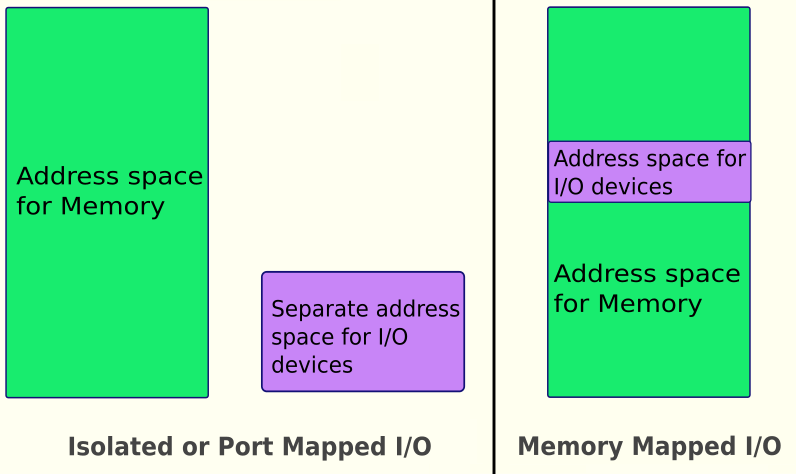

---

## Раздел 11. Параллелизм, многозадачность, прерывания, изоляция памяти, DMA (118–153)

**118. Как работает программно-управляемый ввод-вывод без прерываний? Каковы его ограничения и типовой сценарий? Как связан с теоремой Котельникова?**

- Управляется единым потоком управления: наблюдение за состоянием устройства (polling) и реакция. Процессор сам опрашивает устройство в цикле.
- Ограничения/проблемы: занимает процессор (включая имитацию таймера); процессор должен регистрировать сигнал с частотой **вдвое выше** частоты сигнала (теорема Котельникова); высокое энергопотребление; сложно совмещать с другими задачами и сложным протоколом.
- Типовой сценарий: подсчёт нажатий кнопки, работа с SPI.

**119. Что такое дребезг контактов? В чём разница между уровнем и сигналом применительно к кнопке? Как с дребезгом бороться программно?**

- **Дребезг контактов** — кратковременные случайные переключения уровня при нажатии/отпускании кнопки. Кнопка — это **уровень**, а не сигнал: нажатие = поднял и отпустил; нельзя просто ловить `if(switch())`.
- Программная борьба: отслеживать изменение, затем **выждать (sleep) и перепроверить**; учитывать `switch_prev` для обнаружения отпускания; использовать конечный автомат для устранения дребезга.

**120. Как реализовать псевдо-параллельный программно-управляемый ввод-вывод в одном потоке исполнения (state machine)?**

- Разорвать код цикла на состояния (wait1/hold1/wait0/hold0), хранить состояние и время в объекте; вызывать `process(input)` в общем цикле для каждой «задачи». Так несколько счётчиков/кнопок «работают параллельно» в одном потоке.
- Особенности: `now()` вынести на уровень общего цикла; инициализировать `prev` реальным состоянием; по сути это **кооперативная многозадачность**.

**121. Какие существуют уровни параллелизма: бит, инструкций и задач? Приведите примеры.**

- **Уровень бит** — ширина комбинационных схем/шин/машинного слова (сумматор, 16-битное сложение). **Уровень инструкций** — параллельное выполнение нескольких инструкций (конвейер, суперскаляр). **Уровень задач** — параллельное выполнение нескольких программ/потоков (многозадачность, multiprocessing).

**122. В чём разница между параллелизмом и конкурентностью (concurrency)?**

- **Параллелизм** — одновременное выполнение (больше работы за единицу времени; физическое). **Конкурентность** — управление несколькими задачами, чередующееся по времени; возможно на одном ядре. Мы в курсе смотрим на уровень задач — нужна конкурентность.

**123. В чём заключается проблема реализации параллелизма уровня задач в архитектуре фон Неймана?**

- Архитектура фон Неймана не рассчитана на параллелизм: один поток инструкций; процессор должен «молотить» инструкции до Halt. Для параллелизма уровня задач нужны кооперативная или вытесняющая многозадачность + механизмы остановки/сохранения/изоляции/синхронизации.

**124. Сравните кооперативную и вытесняющую многозадачность: достоинства, недостатки и область применения каждой.**

- **Кооперативная**: следующая задача выполняется, когда текущая явно отдаст управление (есть вызов `pause`/`yield`). Достоинства: контроль за ресурсами задачей, известные точки остановки (нет гонок), простота/эффективность. Недостатки: сбой задачи = глобальный сбой, низкая эффективность I/O, сложны интерактивные приложения. Применение: пакетный режим, bare-metal, реальное время со статическим планированием, event-loop, Node.js, green threads.
- **Вытесняющая**: ОС/прерывание забирает процессор независимо от задачи. Достоинства: простота ПО, контроль и изоляция ресурсов, интерактивность. Недостатки: лишние переключения, «тяжесть» процессов, гонки/непредсказуемость, проблемы реального времени. Применение: современные ОС.

**125. Какие механизмы необходимы для реализации кооперативной многозадачности?**

- Механизм **остановки** задачи (добровольная передача управления диспетчеру), **сохранения** состояния (регистры, стек, состояние сопроцессоров/кеша/предсказателя), **планирования** (какой задаче отдать время), **возобновления** (восстановление и передача управления); плюс **изоляция** и **взаимодействие** задач.

**126. Как взаимодействуют кооперативная многозадачность и система прерываний?**

- Кооперативная многозадачность по своей природе не требует прерываний (задачи сами отдают управление), но на практике может сочетаться с прерываниями для ввода-вывода: прерывание оповещает о событии, задача, когда «доходит» до точки передачи, обрабатывает его. Чистая кооперативность (без ОС) — базовая многозадачность; комбинируйте её с прерываниями для реакции на внешние события.

**127. Как реализуется кооперативная многозадачность на уровне приложения через Event-loop?**

- Один цикл событий: очередь событий/задач; обрабатываем одно событие, затем переходим к следующему. Долгие операции не блокируют цикл — вместо этого каждая «задача» является серией коротких шагов с `await`/`yield` (async/await). Примеры: Node.js event-loop, `asyncio`.

**128. Каковы достоинства и недостатки вытесняющей многозадачности?**

- Достоинства: простота разработки ПО, контроль и изоляция ресурсов, интерактивность (почти мгновенная реакция). Недостатки: лишние переключения, «тяжесть» процессов (состояния), разделяемые состояния/гонки/непредсказуемость, проблемы реального времени.

**129. Какие механизмы необходимы для реализации вытесняющей многозадачности?**

- Механизм **прерывания** процесса (забрать процессор независимо от желания), **сохранения** состояния, **планирования**, **возобновления**; плюс **изоляция** (память/регистры) и **взаимодействие** (разделяемые ресурсы) задач.

**130. Что даёт переход от программно-управляемого ввода-вывода (polling) к вводу-выводу через систему прерываний?**

- Снимает с процессора задачу наблюдения: процессор не опрашивает устройство, а реагирует на событие. Это даёт эффективность и **автоматически появляется параллелизм уровня задач** (основной поток + обработчик прерывания). Процессор может заниматься полезной работой, пока устройство не готово.

**131. Как по шагам происходит обработка прерывания?**

- Выполнение основного потока → запрос прерывания (HW) → сохранение адреса возврата → вызов обработчика прерывания (ISR — обычный код в специальном месте) → выполнение ISR → завершение ISR → восстановление адреса возврата → продолжение основного потока. (Контроллер прерываний определяет, какой ISR вызвать.)
- 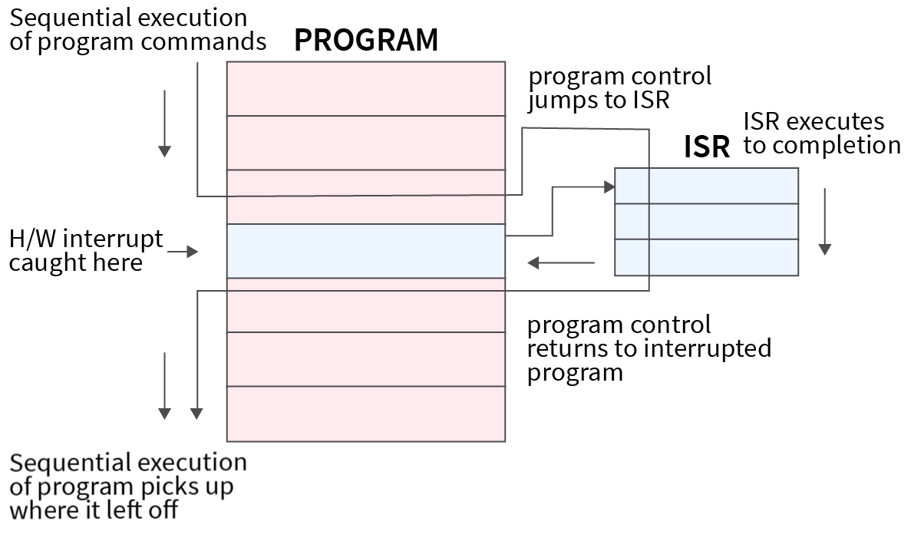

**132. Почему появление системы прерываний приводит к автоматическому появлению параллелизма уровня задач? Охарактеризуйте его.**

- Система прерываний обеспечивает минимум **два уровня задач**: основной поток исполнения и поток(и) обработчиков прерываний. Пока основной поток выполнялся, прерывание «вклинивается» и выполняется отдельный код — это и есть параллелизм задач (по событиям), хотя и с приоритетами/маскированием.

**133. Как классифицируются прерывания по источнику (синхронные/асинхронные, аппаратные/программные)?**

- **Аппаратные**: внешние (асинхронные для внутренних циклов: переполнение таймера, клавиша, пакет) и внутренние (синхронные: деление на 0, ошибка доступа к памяти). **Программные** — вызываются инструкцией (взаимодействие с ОС). Синхронные связаны с тактом/состоянием процессора, асинхронные — внешние события.

**134. Каковы задачи контроллера прерываний? Что такое маскируемые и немаскируемые прерывания? Относительный и абсолютный приоритеты?**

- Задачи контроллера: принимать запросы, разрешать конкуренцию (приоритеты, очереди, потери), реализовываться обычно аппаратно (скорость/параллелизм).
- **Маскируемые** можно временно запретить; **немаскируемые** — нельзя (критично). **Относительные/абсолютные приоритеты**: относительный — среди ожидающих выбирается более приоритетный; абсолютный — более приоритетное прерывание может **прервать** текущее прерывание.

**135. Какие виды событий существуют в системе прерываний (по фронту, по уровню, по сообщению, doorbell)?**

- **По фронту (edge)**: прерывание в момент изменения уровня; реагирует на переход; не требует сброса, но фронт может «потеряться», если контроллер занят.
- **По уровню (level)**: активно, пока сигнал активен; обработчик обязан сбросить; при объединении по ИЛИ возможны ложные (spurious) прерывания, зато ничего не теряется.
- **По сообщению (MSI)**: прерывание — запись сообщения в регистр; нет выделенной линии, лучше масштабируется (PCIe), сообщение несёт источник/тип.
- **Doorbell**: одно устройство уведомляет другое записью в регистр; сигнал и данные разнесены (данные в памяти); используется GPU/NIC/межъядерными взаимодействиями.

**136. Что такое сторожевой таймер и каков принцип его работы?**

- **Watchdog timer** — аппаратно реализованная схема контроля зависания: таймер переполняется, если программа/система не «кормит» его (периодически сбрасывает). При переполнении — аварийный сброс/перезапуск системы. Используется для восстановления после зависаний.

**137. Какие подходы существуют к решению проблемы изоляции регистров и инструкций в памяти при многозадачности?**

- Инструкции: размещать инструкции разных задач в разных областях памяти и **корректировать абсолютные адреса переходов**; данные: размещать в разных областях и корректировать адреса; регистры: использовать соглашение о вызове и сохранять/восстанавливать регистры при переключении; автоматическая память: выделять диапазоны (стек); динамическая: выделять диапазон. «Доверять добросовестному использованию»/изоляции аппаратурой.

**138. Какие подходы существуют к решению проблемы изоляции данных в памяти (статика, куча, стек) при многозадачности?**

- Разместить данные в разных областях памяти; корректировать все абсолютные адреса; для стека — выделить подходящий диапазон; для кучи — выделить диапазон. На уровне ОС — сегментация и виртуальная память с таблицами трансляции и правами доступа.

**139. Как банки памяти используются для расширения адресного пространства?**

- Когда память имеет большее адресное пространство, чем процессор: адрес процессора (8 бит) + **биты выбора банка** (2 бита) → 10 бит адреса; ОС управляет переключением банков (bank switching). В любой момент доступна только часть памяти.

**140. Как банки памяти используются для расширения машинного слова?**

- Два чипа памяти параллельно; младший бит адреса (0/1) выбирает чип; машинное слово процессора — 2×8 = 16 бит. Образуется более широкое слово из нескольких банков.

**141. Что такое сегментная память? Как происходит трансляция адресов? Каковы достоинства и недостатки?**

- Логическая адресация: адрес = **сегмент + смещение**; сегмент — область адресного пространства определённого размера; смещение — адрес относительно начала сегмента.
- Трансляция: по номеру сегмента — из таблицы сегментов берётся базовый адрес, к нему добавляется смещение.
- Достоинства: малые таблицы сегментов, простая обработка/перемещение, отсутствует внутренняя фрагментация, изоляция и общие сегменты. Недостатки: поддержка со стороны компилятора/ПО, участие программиста, устаревшая, **внешняя фрагментация**.
- 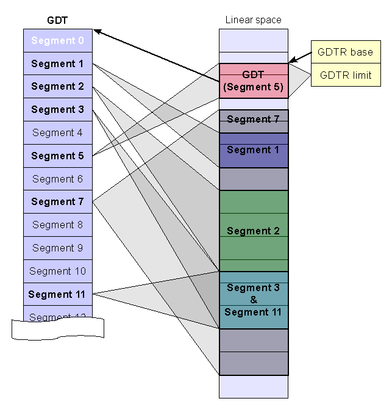

**142. Что такое виртуальная память? Как происходит трансляция адресов? Каковы достоинства и недостатки?**

- Каждой задаче — своё виртуальное адресное пространство, как будто «вся память её». Виртуальное пространство режется на **страницы**, которые отображаются на физические адреса по запросу. Когда физическая память кончилась — неиспользуемые страницы **выгружаются на диск**; когда страницы нет в памяти — загружается с диска (страничные прерывания).
- Трансляция: виртуальный адрес → (таблица страниц) → физический адрес; таблица страниц в памяти, кешируется (TLB).
- Достоинства: прозрачность, изоляция, «бесконечная» память, динамическое распределение, стабильность, нет внешней фрагментации. Недостатки: большие таблицы страниц и поиск, высокие накладные расходы (I/O), нет изоляции внутри пространства, непредсказуемая задержка, сложность реализации.
- 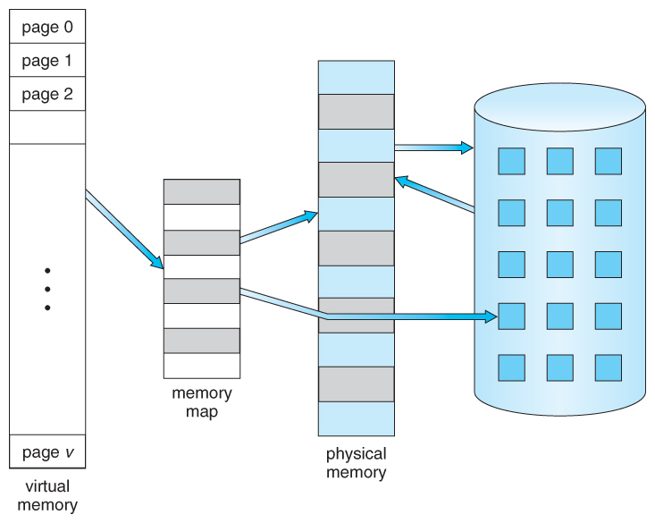

**143. Что такое внутренняя и внешняя фрагментация в контексте сегментной памяти?**

- **Внутренняя фрагментация** — данные в блоках фиксированного размера: процессу нужно 3 МБ, блок выделен 4 МБ (лишний кусок внутри блока «теряется»). Свойственна страничной памяти.
- **Внешняя фрагментация** — данные в блоках произвольных размеров: свободной памяти достаточно суммарно, но она разбросана, и цельный блок для процесса не набрать. Свойственна сегментации.

**144. Что такое внутренняя и внешняя фрагментация в контексте виртуальной памяти?**

- В чисто страничной (виртуальной) памяти **внешней фрагментации нет**, но есть **внутренняя фрагментация**: страница фиксированного размера, последняя страница процесса используется не полностью.

**145. Как появление сегментной памяти улучшило пользовательский опыт?**

- Многозадачность стала возможной без перекомпиляции под общую память: задачи изолированы, доступ к «чужим» сегментам запрещён, взаимодействие через общий сегмент; удобно для библиотек и модулей (ПО — 1, данные — N). Пользователь не думает о физическом адресе.

**146. Как появление виртуальной памяти улучшило пользовательский опыт?**

- Каждый процесс «видит» своё пространство: изоляция и безопасность, возможность использовать больше памяти, чем есть физически (выгрузка на диск), прозрачное динамическое распределение, стабильность при многозадачности. Программист не думает о доступной физической памяти.

**147. Какие уровни (виды) задач существуют: основной поток, прерывание, процессы, потоки, зелёные потоки?**

- **Main/Kernel/основной поток** — исходный поток инструкций; **прерывания** — особый код обработчиков; **процессы** — изолированные адресные пространства, нет прямого доступа; **потоки** — в адресном пространстве процесса, прямой доступ к данным; **зелёные потоки** — в рамках run-time/виртуальной машины.

**148. Как могут взаимодействовать процессы через основной поток? Какие бывают разделяемые ресурсы?**

- Основной поток может запускать/ожидать процессы; через изолированные пространства прямой доступ невозможен. Разделяемые ресурсы: процессорное время, память/регистры. Взаимодействие: shared memory, signals, I/O (сети, файлы, pipes).

**149. Что такое процессоры ввода-вывода? Каковы их назначение, интерфейс, достоинства и недостатки?**

- **Channel I/O / процессоры ввода-вывода** — специализированные процессоры, выполняющие программы взаимодействия с внешними устройствами. ISA канала адаптирована для I/O (например, `SEEK`, `SEARCH KEY EQUAL`, `READ DATA`).
- Назначение: разгрузить CPU; интерфейс — программа на языке канала. Достоинства: автономность, обработка сложных протоколов. Недостатки: сложность, сегодня вытеснено (упрощено до) DMA; применялось в мейнфреймах.

**150. Что такое контроллер прямого доступа к памяти (DMA)? Каковы его назначение, интерфейс, достоинства и недостатки?**

- **DMA** — контроллер, выполняющий перенос данных между памятью устройств и памятью процессора без участия CPU; «добавить процессоров», чтобы освободить CPU.
- Интерфейс: `SRC_ADDR`, `DST_ADDR`, `COUNT`, `CONTROL`, `STATUS`; данные идут память ↔ контроллер ↔ устройство.
- Достоинства: скорость/эффективность, интерактивность (CPU разгружен), параллелизм (несколько каналов). Недостатки: проблемы совместимости, сложность при непоследовательном доступе, ограниченный контроль шины, синхронизация и конфликты за DMA.
- 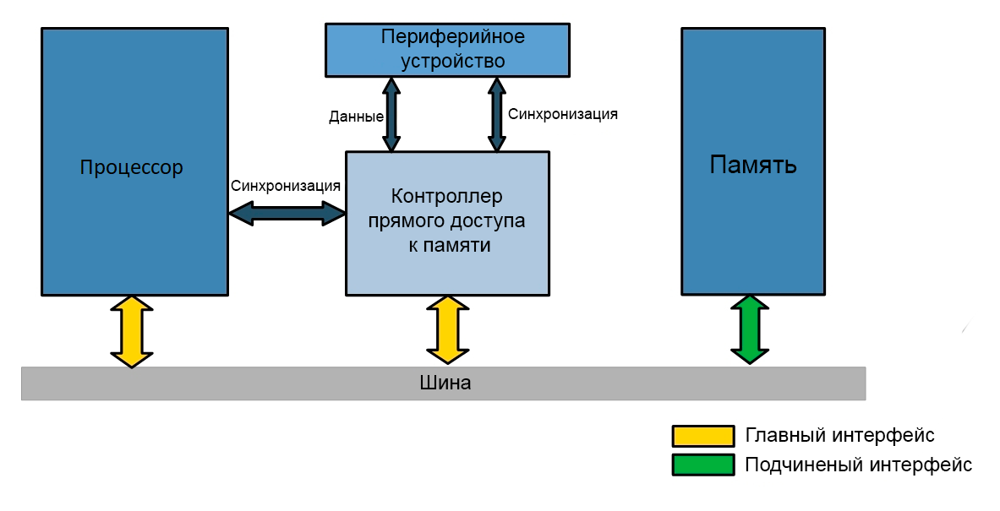

**151. Какие существуют способы интеграции и взаимодействия контроллера прямого доступа к памяти (DMA) с процессором?**

- Интеграция: **third-party** (DMA управляется процессором) или **bus mastering** (устройства I/O сами могут управлять шиной).
- Взаимодействие: **burst mode** (приоритет DMA, передача не прерывается CPU), **cycle stealing** (фиксированный слот времени для DMA и CPU), **transparent mode** (DMA работает, когда CPU не использует память; приоритет CPU).

**152. Что такое гонка состояний (race condition)? Почему она возникает при вытесняющей многозадачности?**

- **Гонка состояний** — результат зависит от порядка исполнения инструкций потоков, работающих с общими данными. Возникает при вытесняющей многозадачности, потому что переключение происходит между любыми двумя инструкциями, порядок непредсказуем; разделяемые состояния без синхронизации дают недетерминированный результат.

**153. Как синхронизируются потоки? Что такое атомарная операция, мьютекс и семафор?**

- Синхронизация — искусственное упорядочивание доступа к общим данным. **Атомарная операция** — неделимая (например, `compare&swap`, conditional store). **Мьютекс** — бинарный семафор (0/1), взаимоисключение. **Семафор** — счётчик 0..N, ограничение числа одновременных доступов. Также: [S]TM (транзакционная память), process network, promises/futures, actor-model.

---

## Раздел 12. Иерархия памяти. RAM (154–167)

**154. Почему необходима иерархия памяти в современных компьютерных системах?**

- Задачи хранения: исходные данные для запуска системы; рабочие данные, изменяемые в работе. Проблема: с ростом скорости памяти растёт её стоимость (производство и размещение) — она «нерешаема» в одной технологии.
- Решение — **иерархия**: выше — быстрее и дороже (регистры, SRAM), ниже — больше и дешевле (DRAM, диски, сетевые хранилища).
- 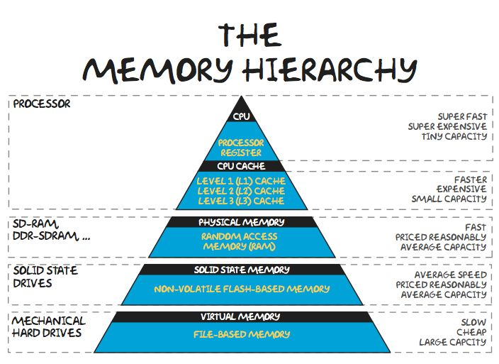

**155. Какие основные виды памяти входят в иерархию памяти и каковы их характеристики?**

- Сверху вниз: регистры (быстро, мало, дорого), кеш L1/L2/L3 (SRAM), основная память (DRAM), диски/SSD, сетевые/ленточные хранилища (медленно, много, дёшево). Характеристики: скорость (латентность), объём, стоимость за гигабайт, энергозависимость.

**156. В чём различие между явной иерархией памяти и скрытой? Приведите примеры.**

- **Явная (exposed)**: регистры, SRAM, DRAM, диски доступны как альтернативные хранилища; программист сам выбирает (scratchpad-based, пример: TMS320 DSP, вручную управляемый scratchpad).
- **Скрытая (hidden)**: модель «одна память, одно адресное пространство», про прозрачно для программиста (cache-based, аппаратные кеши; пример: обычные CPU).

**157. Какие типы доступа к памяти существуют (произвольный, последовательный, гибридный)? Приведите примеры.**

- **Произвольный (RAM)**: задержка не зависит от истории запросов (ОЗУ).
- **Последовательный**: длительная задержка при смене адреса, но высокая скорость последовательного чтения/записи (жёсткие диски, магнитные ленты, AWS Tape Gateway).
- **Гибридный**: библиотека магнитных лент, векторные операции.

**158. Каково устройство памяти с произвольным доступом (decoder, wordline, bitline)? Как устроена ROM-ячейка и как происходит чтение?**

- Массив ячеек; **адрес** → **дешифратор** активирует одну **wordline** (строку), которая выбирает ячейки нужного слова; значение бита выставляется/читается через **bitline**. Машинное слово формируется из нескольких бит.
- **ROM-ячейка**: физическое [не]размещение транзистора (на производстве) или пережигание перемычек (PROM). Чтение — активировать wordline и прочитать, есть ли ток по bitline (1/0).
- 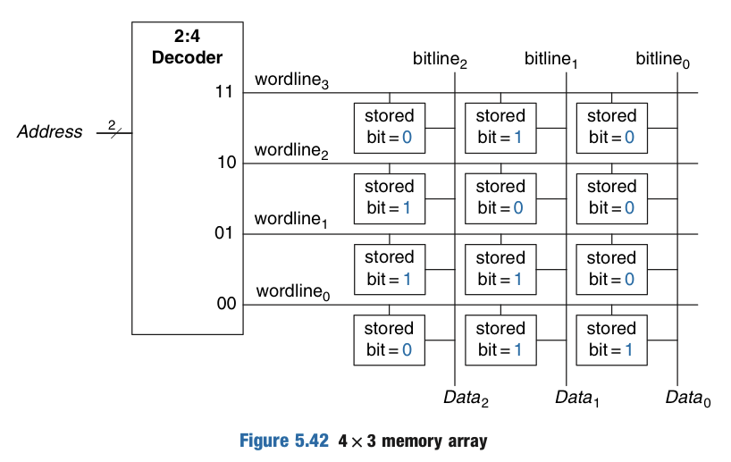

**159. Каково устройство многопортовой памяти? Как связана площадь с количеством портов?**

- **Многопортовая память** позволяет нескольким запросам одновременно обращаться к ячейкам (несколько пар wordline/bitline, или разделение по банкам). Количество портов увеличивает площадь (линии, компараторы, логика), поэтому порты дороги; необходимо для когерентности/параллельного доступа (например, в регистровых файлах).

**160. Сравните технологии реализации битовых ячеек (Flip-flop, ROM, SRAM, DRAM) по числу транзисторов, скорости, плотности и стоимости. В какой области иерархии памяти каждая из них применяется?**

- **Flip-flop** (триггер): ~20 транзисторов, ~20 пс, очень мало (килобайты), очень дорого — регистры.
- **ROM**: ≤1 транзистор, — — фиксированные данные.
- **SRAM**: 6 транзисторов, 1–10 нс, ~10 кБ–10 МБ, ~$1000/ГБ — кеши (регистры/кеши).
- **DRAM**: 1/2–1 транзистор + конденсатор, 80 нс, ~10 ГБ, ~$10/ГБ — основная память.

**161. Каковы технологии реализации SRAM ячеек? Как происходит чтение и запись?**

- Ячейка — **триггер из группы транзисторов**: 4 (инверторы, хранение) + 2 (доступ, pass-transistors). Хранит значение, пока есть питание; быстрая.
- Чтение: активировать wordline, транзисторы доступа соединяют биты с внутренними узлами, битные линии разряжаются/заряжаются, считывается дифференциальный сигнал.
- Запись: выставить значение на битных линиях, активировать wordline, принудительно переключить триггер.
- 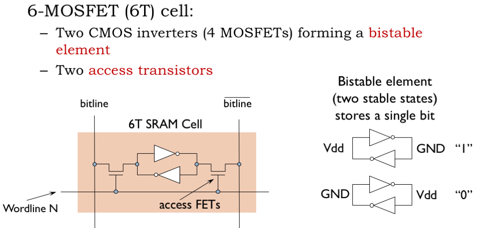

**162. Каковы технологии реализации DRAM ячеек? Как происходит чтение и запись? Что такое регенерация и зачем она нужна?**

- Ячейка — **конденсатор + один транзистор**. Состояние хранится в заряде конденсатора; заряд утекает.
- Чтение: конденсатор соединяется с bitline, заряд считывается (но чтение **разрушающее**). Запись: зарядить/разрядить конденсатор.
- **Регенерация** — периодическое обновление заряда (перезапись), так как конденсатор «течёт»; требуется контроллер памяти, что увеличивает задержку и блокирует доступ.
- 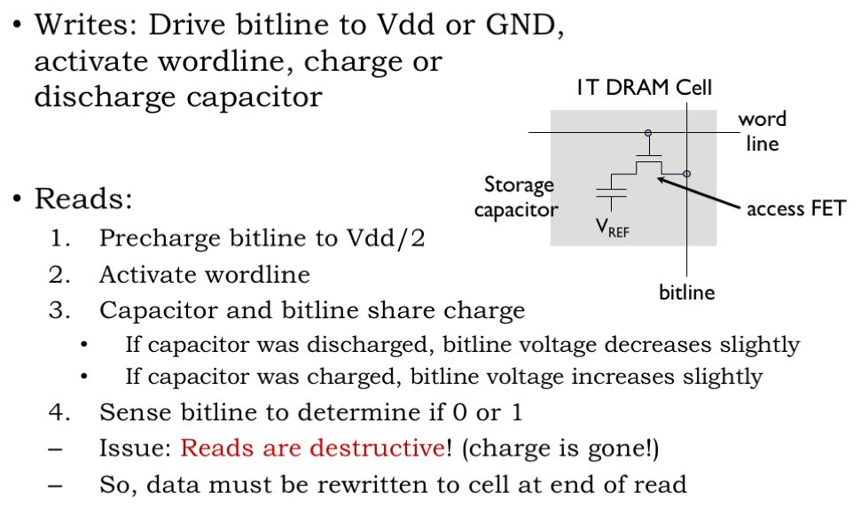

**163. Что такое кеш? Каково его назначение, место в иерархии памяти и основные метрики?**

- **Кеш** — промежуточный быстрый буфер, содержащий данные, которые могут быть запрошены с наибольшей вероятностью; малый объём быстрой памяти для текущих данных.
- Целесообразен, если доступ к памяти неравномерный (локальность). Метрики: **уровень попаданий (hit rate)**, время попадания/промаха, размер, ассоциативность.
- Состоит из **кеш-линий** с тегами; поиск по тегу → попадание/промах.

**164. Что такое принцип локальности и каковы его виды (временная, пространственная) применительно к механизму кеширования?**

- **Временная локальность**: если данные использованы, вероятно, снова понадобятся в ближайшем будущем (циклы). **Пространственная локальность**: используются соседние адреса (массивы, последовательный код). Кеш опирается на неравномерность доступа (локальность), иначе кеширование неэффективно.

**165. Как пошагово происходит процесс чтения данных через кеш-память процессора?**

- Проверяем тег запрашиваемого адреса: **тег найден → кеш-попадание** — данные читаются из кеш-линии в процессор. **Тег не найден → кеш-промах** — запрашиваем данные из памяти/следующего кеша, выбираем линию для замещения (есть пустая — берём; все заняты — вытесняем), загружаем данные. Длительность произвольна (многоуровневый кеш, блокировка памяти).

**166. Как пошагово происходит процесс записи данных через кеш-память? Политики записи при попадании (write-through, write-back) и при промахе (write-allocate, no-write-allocate)?**

- При **попадании**: **write-through** — немедленно обновить память (иногда медленнее без кеша); **write-back** — отложенное обновление при вытеснении/периодически, хранится признак «грязный», возможна неконсистентность с памятью.
- При **промахе**: **write-allocate (fetch on write)** — загрузить линию в кеш, затем исправить (два обращения); **no-write-allocate (write around)** — писать напрямую в память/через буфер.

**167. Что такое кеш-промах? Как промах по-разному влияет на чтение данных, запись данных и чтение инструкций?**

- **Кеш-промах** — тег не найден; данные берутся из памяти.
- Чтение данных — средняя задержка, может компенсироваться параллелизмом уровня инструкций. Запись данных — минимальная задержка (запись можно отложить). Чтение инструкций — большая задержка, процессор простаивает в ожидании инструкции.
- 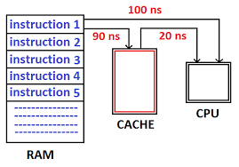

---

## Раздел 13. Кеш: устройство, ассоциативность, когерентность (168–190)

**168. Что такое ассоциативность кеша? Какова «структура» адреса с точки зрения кеша?**

- **Ассоциативность** — политика размещения данных памяти в кеше для оптимизации поиска (аналогия: array O(n), btree O(logn), hashmap Θ(1)-O(n)).
- Адрес делится на части: **тег** (старшие/уникальные биты — идентификатор области), **номер линии/набор** (средние биты), **смещение** (младшие биты, по байтам). Тег хранится в кеш-линии и сравнивается компараторами.
- 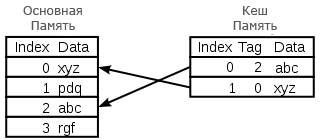

**169. Каковы особенности реализации полностью ассоциативного кеша?**

- Любая строка памяти может быть отображена в любую кеш-линию.
- Лучшая эффективность, но очень много логики: множество компараторов, сложное вытеснение; дорого и медленно на больших размерах.
- 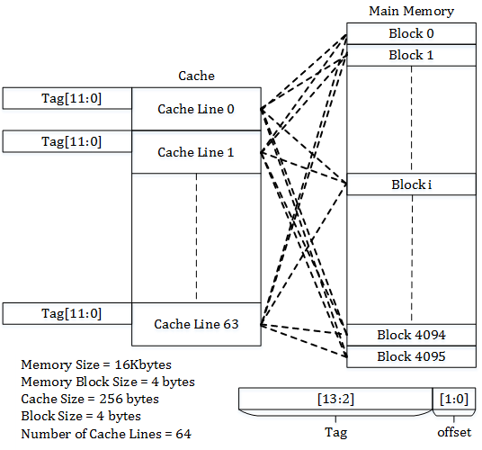

**170. Каковы особенности реализации кеша с прямым отображением?**

- Каждая ячейка может попасть только в **одну** конкретную кеш-линию (одна линия — много ячеек); средняя часть адреса — номер линии.
- Меньше памяти под теги, один меньший компаратор, однозначное вытеснение; но есть **коллизии** (два блока в одну линию) и «техническая выгрузка».
- 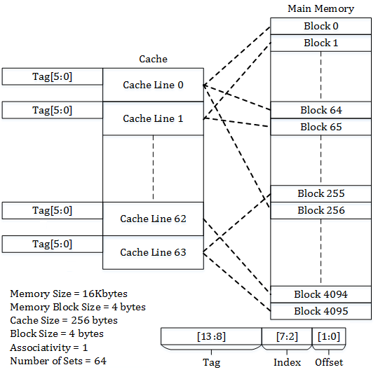

**171. Что такое множественно-ассоциативный кеш и что определяет уровень множественности?**

- **N-Way set associative** — прямой кеш (1 банк), воспроизведённый N раз: адрес делит на набор (set) и в наборе N линий; выбор линии — по алгоритму вытеснения.
- Уровень множественности N — число линий в наборе; растёт ассоциативность → выше эффективность, но ниже скорость и больше логики.
- 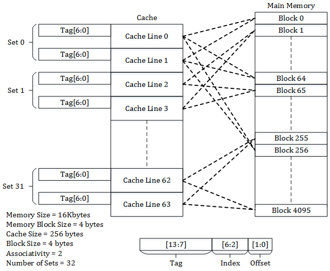

**172. Как связана ассоциативность кеша с механизмом вытеснения и замещения?**

- Ассоциативность задаёт **пространство выбора** кандидата на вытеснение: direct — 1 кандидат (алгоритм не нужен); N-way — N в наборе; fully — все линии. Чем больше пространство, тем сложнее и «умнее» нужен алгоритм замещения (LRU/PLRU).

**173. Как работает механизм вытеснения и замещения LRU в кеше?**

- **Least Recently Used** — хранится время/порядок последнего доступа; при вытеснении выбирается **самая давно не использованная** линия. Точный LRU требует много логики (счётчики/порядок), поэтому в процессорах часто применяют приближения.

**174. Как работает механизм вытеснения и замещения PLRU в кеше?**

- **Pseudo-LRU** — бинарное дерево: в вершинах — направление (left/right), листья — кеш-линии. Спуск по дереву по значениям в вершинах находит кандидата; при доступе инвертируются пройденные вершины. Значительно «легче» LRU, но приближённый.
- 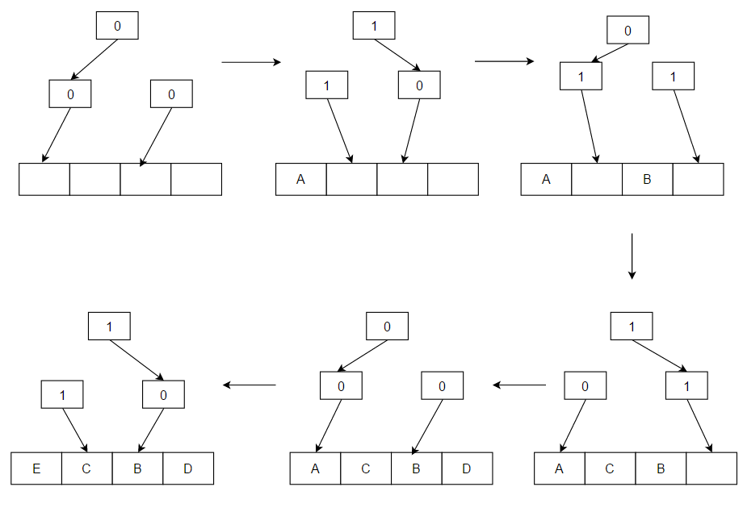

**175. Почему необходимо использование многоуровневой иерархии кеш-памяти в современных процессорах?**

- Один кеш не может быть одновременно быстрым, большим и дешёвым: уровни решают разные подзадачи — скорость доступа (L1), объём (L2/L3), синхронизация ядер, оптимизация интерфейса (L4). Свойства кеша определяются технологией ячеек и устройством (размер, ассоциативность).

**176. В чём разница между разделённым и унифицированным кешем и где они применяются?**

- **Разделённый (banked/split)** — несколько банков/каналов, разделение по типу данных (кеш данных, кеш инструкций, trace cache) или по ядру; больше каналов — выше скорость, но сложнее процессор и возможны конфликты банков. Применяется в L1 (код и данные отдельно).
- **Унифицированный** — один кеш для данных и инструкций; проще, но один канал. Применяется в L2/L3.
- 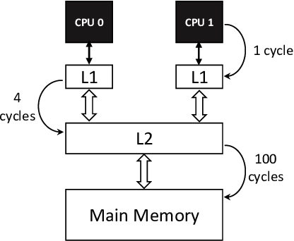

**177. В чём разница между включающим и исключающим кешем и где они применяются?**

- **Включающий (inclusive)** — данные верхнего уровня дублируются в нижнем; быстрый доступ, но часть памяти «теряется» (свойственно L1/L2).
- **Исключающий (exclusive)** — данные не дублируются; эффективнее по памяти.
- **NINE (non-inclusive, non-exclusive)** — гибридный вариант; компромисс.

**178. В чём разница между частным и общим кешем и как они применяются в многоядерных процессорах?**

- **Частный (private)** — ядро имеет эксклюзивный доступ (быстро, но дублирование и конфликты) — L1, L2. **Общий (shared)** — несколько ядер (меньше промахов, нет дублирования, но постоянная синхронизация) — L3.

**179. Что представляет собой типовой многоуровневый кеш: L1, L2, L3, L4? Каковы их назначение, тип ячеек, классификация?**

- **L0** (опция) — кеш стека/int/float, доступен за такт (SRAM/регистры). **L1** — быстрый, неотъемлемая часть процессора, обычно разделённый и частный (SRAM 6T). **L2** — часть процессора, 128 КБ–12 МБ, чаще унифицированный (SRAM). **L3** — до 24 МБ и более, общий, синхронизация ядер (SRAM). **L4** — экзотика (серверы/мейнфреймы), оптимизация интерфейса к памяти (eDRAM/DRAM).
- 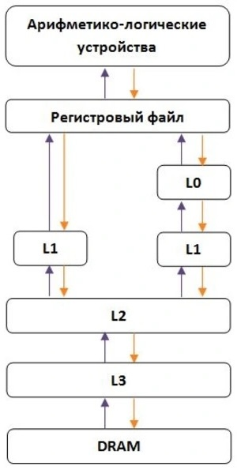

**180. Что такое когерентность кеш-памяти и каково её значение для многоядерных систем? Какие существуют возможные состояния кеш-линий?**

- **Когерентность** — целостность данных в кешах/памяти при параллельном доступе нескольких акторов (ядра, DMA). В многоядерных системах без когерентности разные ядра видят разные значения.
- Состояния MOESI: **Modified** (M), **Owned** (O), **Exclusive** (E), **Shared** (S), **Invalid** (I) — описывают, свежие ли данные и есть ли копии/записи в памяти.
- 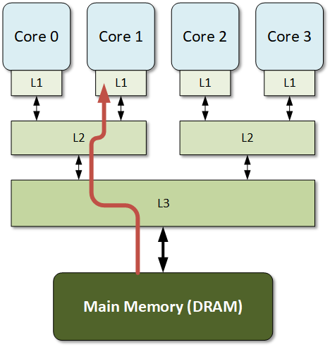

**181. Как происходит обмен информацией о кеш-линиях через справочник? Как этот подход масштабируется?**

- **Directory**: общий справочник со сведениями о разделяемых данных; перед загрузкой — проверка через справочник; при изменении каталог обновляет или аннулирует другие кеши.
- Достоинство: хорошо масштабируется (число процессоров может быть велико). Недостаток: задержка запроса к справочнику.

**182. Как происходит обмен информацией о кеш-линиях через отслеживание? Как этот подход масштабируется?**

- **Snooping**: кеши отслеживают **адресные линии** шины на предмет обращений к своим линиям; при записи — помечают линию неактуальной.
- Достоинство: скорость. Недостаток: ограниченная масштабируемость (наблюдение за общей шиной).

**183. Как происходит обмен информацией о кеш-линиях через перехват? Как этот подход масштабируется?**

- **Snarfing**: кеши отслеживают и **адресные**, и **данные** линии; при чужой записи — обновляют свою линию (нет повторного промаха).
- Достоинство: не нужно перечитывать после чужой записи. Недостаток: масштабируется хуже snooping (загружены и адрес, и данные).

**184. Какие существуют типы кеш-промахов (3C + 1: cold, capacity, conflict, coherence)? Какие способы смягчения характерны для каждого?**

- **Cold/compulsory** — первое обращение, данных нет; неизбежен, смягчается предвыборкой (prefetch). **Capacity** — рабочий набор больше кеша; смягчается увеличением кеша. **Conflict** — несколько блоков в одну линию (direct/set-assoc); смягчается ростом ассоциативности. **Coherence** — блок инвалидирован из-за модификации в другом кеше/DMA; возникает в многоядерных/многомастерных системах.

**185. Что такое CAP-теорема? Какова область её применения и как она применяется к когерентности кешей?**

- CAP: в распределённых системах **нельзя одновременно** обеспечить согласованность, доступность и устойчивость к разбиению (при разбиении сети выбирают CP или AP).
- Область применения: распределённые системы. Проекция на кеши: ядра — узлы, шина — «сеть»; внутри чипа разбиение маловероятно → **CP** (задержка ради консистентности); в распределённой shared memory при росте задержек → **AP** (eventual consistency).
- 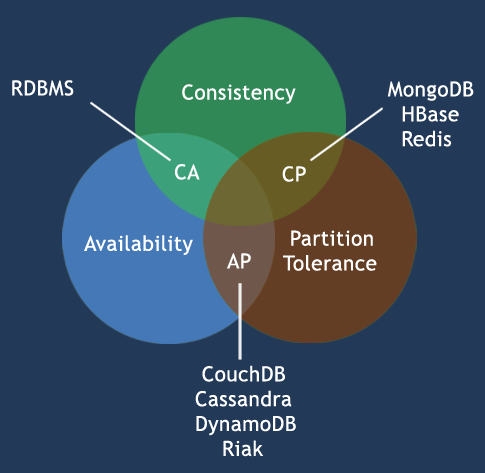

**186. Что означают термины Consistency, Availability и Partition tolerance в CAP-теореме?**

- **Consistency** — каждое чтение возвращает последнюю запись или ошибку. **Availability** — каждый запрос получает ответ (без ошибок), но без гарантии последней записи. **Partition tolerance** — система продолжает работать при произвольных потерях связи между узлами.

**187. Как кеш влияет на производительность памяти? Какие существуют способы оптимизации доступа, включая AoS и SoA?**

- Кеш ускоряет обращение за счёт локальности; оптимизация максимизирует попадания. **AoS** (массив структур) — чередуются поля объектов; **SoA** (структура массивов) — поля хранятся отдельными массивами. SoA лучше по локальности для покомпонентной обработки (пример: точка x,y,z).
- Также: транспонирование матриц для перемножения (улучшение кеша), блочные схемы.

**188. Как кеш работает с виртуальными и физическими адресами?**

- **Виртуальные адреса** (L1, часто): быстрый доступ без трансляции, но проблемы совместимости процессов и очистки кеша при смене контекста.
- **Физические адреса** (L2/L3): уникальны в системе, проще консистентность, но требуется трансляция перед проверкой кеша (задержка, сложность).
- Смешанные: L1 — виртуальные (мин. задержка), L2/L3 — физические (универсальность и консистентность).

**189. Что такое HyperThreading? Как два логических ядра делят физический кеш и как это влияет на производительность?**

- **HyperThreading** — на одно физическое ядро приходятся два логических (виртуальных) ядра; цель — увеличить число независимых инструкций в конвейере.
- Два логических ядра **делят физический кеш**: выше утилизация, но выше конкуренция и давление на вытеснение; производительность растёт не вдвое, зависит от параллелизма рабочих нагрузок.

**190. В чём суть уязвимостей Meltdown и Spectre? Как кеш и спекулятивное исполнение создают канал утечки данных?**

- Эксплуатируют **спекулятивное исполнение**: процессор предсказывает переход и выполняет инструкции «наперёд»; при ошибке конвейер сбрасывается, регистры откатываются, но **следы в кеше остаются**. Атакующий измеряет задержки доступа к памяти и восстанавливает «отброшенные» данные (Flush+Reload).
- **Meltdown** — утечка данных ядра ОС в пространство пользователя. **Spectre** — утечка данных между изолированными процессами (обучение предсказателя жертвы). Исправление — аппаратные изменения или потеря производительности 5–30%.

---

## Раздел 14. Уровневая организация. Низкоуровневый параллелизм. Языки высокого уровня (191–211)

**191. Что представляет собой концепция уровневой организации компьютерных систем и каковы её преимущества?**

- Уровневая организация — естественный способ организации вычислительных систем: уровни абстракций (Layered Style, OSI, уровни организации вычислительного процесса). Количество уровней — десятки.
- Преимущества: **модульность** и **вариативность** (можно менять отдельные уровни, стандартизировать интерфейсы, независимая разработка).

**192. Какие примеры уровневой организации вычислительных систем вы знаете? Чем они отличаются друг от друга?**

- Layered architectural style; OSI Model (7 уровней); уровни организации вычислительного процесса (библиотеки/фреймворки, языки, ОС, ISA/ПЛИС, виртуализированные ресурсы). Отличие — в том, что считается «уровнем» и как задан интерфейс между ними.

**193. Что такое явление разделения на уровни (disaggregation) и каково его современное положение? Что было до него?**

- **Disaggregation** — разделение уровней по индустриям/специальностям (вместо интегрированных in-house решений, где уровни переплетены). Эффект масштаба, независимое существование, закон Мура, Proebsting's Law.
- До него — интегрированные решения (in-house), уровни адаптированы друг к другу; сейчас уровни разделены и стандартизованы.
- 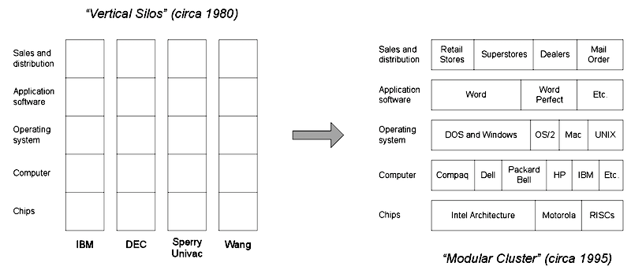

**194. Почему необходимо нарушение уровневой иерархии в современных системах? Приведите примеры.**

- Для обеспечения системных характеристик: энергопотребление, реальное время, производительность. Смешение уровней повышает связность и сложность. Пример: hard real-time на современном процессоре — спекулятивное исполнение, OoO, кеш, виртуальная память делают время недетерминированным, поэтому их приходится обходить/отключать на нижних уровнях; сквозные инструментальные решения.

**195. Какие проблемы возникают при обеспечении реального времени в современных процессорах?**

- Современные механизмы (суперскаляр, спекулятивное исполнение, кеш, виртуальная память, вытесняющее переключение) делают время исполнения **недетерминированным**. Для реального времени требуется предсказуемость; приходится отключать/обходить эти механизмы (смешение уровней) или использовать специализированные вычислители.

**196. Что такое низкоуровневый параллелизм? Приведите примеры.**

- **Низкоуровневый (low-level) параллелизм** — параллелизм, не влияющий на прикладное программирование: **конвейеризация** (разбиение исполнения на этапы) и **множественные функциональные узлы** в ЦПУ (независимые блоки для арифметики/булевой логики, выполняемые одновременно). Примеры: суперскалярный процессор, VLIW.

**197. Что такое суперскалярные процессоры и каковы принципы их работы, достоинства и недостатки?**

- **Суперскаляр** — процессор, который анализирует поток инструкций на лету и автоматически параллелизует их (несколько АЛУ, out-of-order), прозрачно для программиста. Проблема, которую решает: разные операции выполняются за разное время, конвейер простаивает на длинных операциях.
- Достоинства: рост производительности, сглаживание длительности, повышение загрузки ресурсов, совместимость с существующим кодом. Недостатки: конфликты по данным, высокое энергопотребление, проблемы детерминированности многоядерной работы.
- 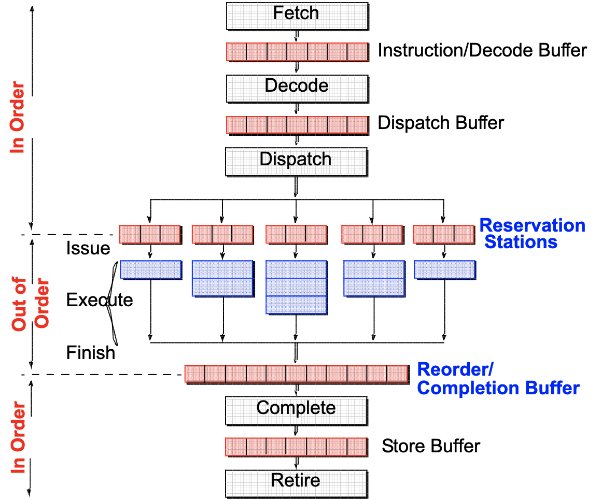

**198. Как пошагово выполняются инструкции в суперскалярном процессоре?**

- Инструкции читаются в **очередь команд по порядку** → декодируются → попадают на **станции резервирования** → станции **переупорядочивают** исполнение (по мере доступности данных и вычислительных ресурсов) → результаты записываются (возможно, с переупорядочиванием завершения).

**199. Что такое VLIW-процессоры? Какими достоинствами и недостатками они обладают?**

- **VLIW** — несколько АЛУ; группа инструкций объединяется в **одно длинное слово**; параллелизм переносится в **compile-time**; суперскалярные механизмы убираются; компилятор «знает всё».
- Достоинства: упрощение процессора (и декодера), снижение энергопотребления, рост частоты, компилятор лучше знает, что параллельно. Недостатки: сложный компилятор, нагрузка на каналы/регистры, конфликты конвейера останавливают все узлы, проблемы условных переходов, низкая плотность кода, ширина — ограничение микроархитектуры.
- 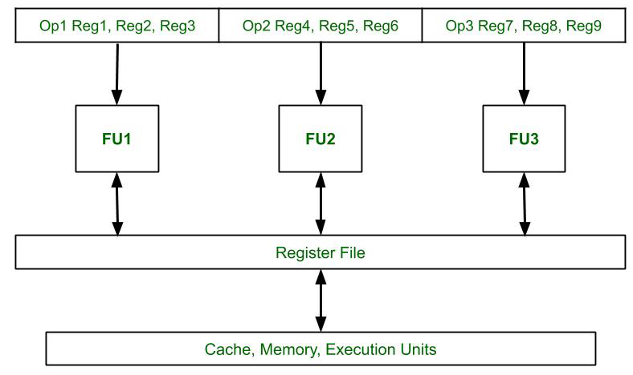

**200. Как соотносятся суперскалярные и VLIW процессоры применительно к разным классам задач?**

- **Суперскаляр** — general-purpose CPU (x86, ARM): неоднородные нагрузки, важна совместимость с уже скомпилированным кодом. **VLIW** — DSP, GPU shader cores, специализированные ускорители (TI C6000, Эльбрус, Itanium): регулярные нагрузки, компилятор знает структуру кода.

**201. Какие существуют промежуточные варианты между суперскалярным и VLIW процессором? Какие проблемы они решают?**

- **EPIC** (Intel Itanium): компилятор размечает параллелизм (bundle + stop-биты), но процессор сохраняет рантайм-механизмы (предикация, спекулятивные загрузки, rotating registers). Решает проблему статичности VLIW.
- **Dynamic VLIW**: VLIW-бандл собирается в run-time (бинарный транслятор кеширует бандлы), ISA статичен (x86/ARM) транслируется в широкое VLIW-слово. Примеры: Transmeta Crusoe/Efficeon, NVIDIA Denver/Carmel. Сохраняет совместимость, учитывает реальные промахи/ветвления.

**202. Что такое барьеры памяти и в каких ситуациях они применяются?**

- **Барьер памяти (fence)** — инструкция, приказывающая компилятору и процессору установить строгую последовательность между обращениями к памяти до и после барьера; все обращения до барьера выполняются до первого после барьера.
- Применяется там, где суперскаляр/OoO/store buffer переупорядочивают записи (memory reordering), и порядок важен для других ядер (многоядерные системы, синхронизация).

**203. Как суперскалярное исполнение и store buffers влияют на порядок обращений к памяти в многоядерных системах? Что такое барьер памяти (fence) и зачем он нужен?**

- Суперскаляр и store buffer переупорядочивают записи для производительности; на одном ядре это незаметно, в многоядерных — внешний порядок записей отличается от программного (например, флаг `f` может стать видимым раньше данных `x`). **Fence** восстанавливает порядок (запись `x` завершается до установки `f`).
- Пример: `x=42; fence; f=1;` на одном процессоре и `while(f==0); fence; print(x);` на другом.

**204. Какие ключевые элементы составляют структурное программирование? В чём отличие от кода на ассемблере?**

- Структурное программирование — последовательный код, условный оператор, циклы, подпрограммы; отказ от «примитивного» `goto`. Это естественные элементы для архитектуры фон Неймана.
- Отличие от ассемблера: вместо «инструкции и go-to» — структурные блоки и их последовательность; компилятор берёт на себя распределение регистров, автоматическую память, области видимости, управление.

**205. Как реализуются процедуры на уровне ассемблера? Что такое call/return и зачем нужен стек вызовов?**

- Процедуры через `call` (переход + сохранение адреса возврата) и `return` (возврат по сохранённому адресу). **Стек вызовов** хранит адреса возврата и локальные данные; позволяет вложенные вызовы и рекурсию.
- Рабочая память либо статическая (нет реентерабельности), либо автоматическая (стек) — рекурсия и параллелизм задач.

**206. Что такое реентерабельность и почему она важна? Приведите примеры.**

- **Реентерабельность** — способность процедуры корректно выполняться повторно/ещё раз до завершения своего вызова (например, при прерывании/рекурсии). Для этого нельзя использовать статическую память; нужна автоматическая память (стек).
- Пример: `swap` со статической переменной `tmp` ломается, если во время её выполнения сработает прерывание, тоже вызывающее `swap`; вариант с локальными данными в стеке — корректен.

**207. Как реализуется механизм рекурсии?**

- Рекурсия реализуется через `call/return` и **автоматическую память (стек)**: каждый вызов создаёт свой фрейм (локальные переменные, адрес возврата). Пример: `fact(n) = n * fact(n-1)`, базовый случай `n==0 → 1`. Проблемы: глубокие рекурсии → стек, утечки/перезапись адреса возврата.

**208. В чём заключается проблема распределения регистров и как работает алгоритм раскраски?**

- Проблема: число регистров конечно (ARM 15/31, x86 8/16, MIPS 32) и не все регистры одинаковы (особенно CISC); нужно сопоставить переменные/временные значения регистрам, согласовать вызовы процедур.
- **Раскраска графа (graph coloring)**: строится граф «живущих одновременно» переменных (рёбра — конфликт), затем граф раскрашивается в число цветов = число регистров; при нехватке — «выливание» переменных в память (spill).

**209. Как условный оператор может быть реализован через полиморфизм и замыкания?**

- Вместо встроенной конструкции языка — объектная модель: `Bool` с подклассами `True`/`False`; `ifTrue: aBlock ifFalse: bBlock` — метод, который в `True` возвращает `aBlock value`, в `False` — `bBlock value` (Smalltalk). Это переосмысление условного оператора как сообщения/замыкания.

**210. Что такое ленивые вычисления и как они связаны с реализацией условного оператора?**

- **Ленивые вычисления** — аргумент/выражение вычисляется только при необходимости (нормальный порядок вычислений, с кешированием). Это позволяет реализовать «условный оператор» как функцию: ветка не вычисляется, если она не нужна (иначе обе ветки вычислялись бы). Пример: `square (1+2)` раскрывается как `(1+2)*(1+2)`.

**211. Как `async`/`await` связан с кооперативной многозадачностью на уровне языка программирования?**

- `async`/`await` выглядит как последовательный код, но это **кооперативная многозадачность**: `await` отдаёт управление и возвращает замыкание с оставшимся кодом, которое выполнится после завершения ожидания (например, `await asyncio.sleep(1)`). Это event-loop + callbacks на уровне языка.

---

## Раздел 15. Не фон Неймановские процессоры. ПЛИС. Классификации. CGRA. HLS (212–238)

**212. Что такое FPGA и каковы его преимущества и недостатки?**

- **ПЛИС (FPGA, field-programmable gate array)** — интегральная микросхема для создания конфигурируемых цифровых схем; логика задаётся **данными** (конфигурацией), а не конструкцией; формирование конфигурации — через специальное ПО и HDL (Verilog/VHDL). «[Ре]конфигурируется», а не «программируется».
- Преимущества: гибкость, реконфигурация, параллелизм, быстрый прототип. Недостатки: ниже эффективность, чем ASIC; потребление; сложнее и дороже в серии (по сравнению с фиксированной логикой).

**213. Какие этапы включает в себя синтез для FPGA?**

- Проект (HDL/RTL) → синтез (логика) → отображение/упаковка → размещение и трассировка (place & route) → генерация битового потока (bitstream) → конфигурирование ПЛИС. Синтез, как правило, включает анализ/верификацию и оптимизацию.
- 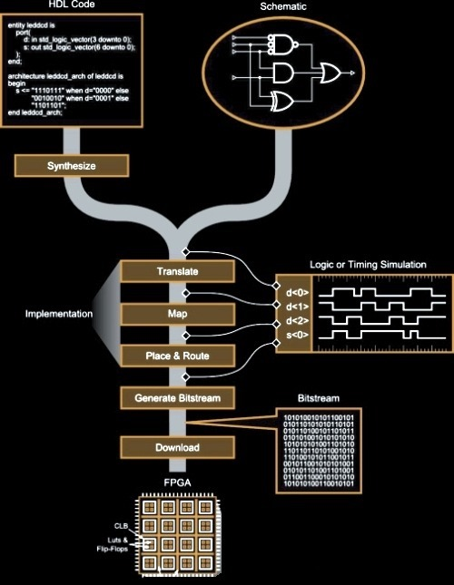

**214. Как FPGA устроены внутри?**

- Набор **логических блоков** (на основе **LUT** — таблиц поиска), переключательная матрица соединений (interconnect), блоки ввода-вывода, блоки памяти, возможно DSP-блоки. Конфигурация задаёт связи и функции блоков.
- 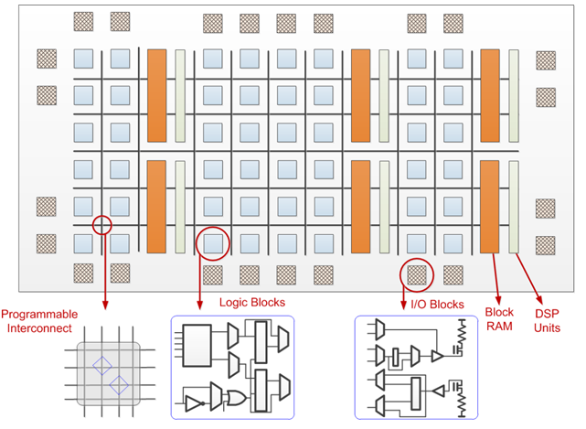
- 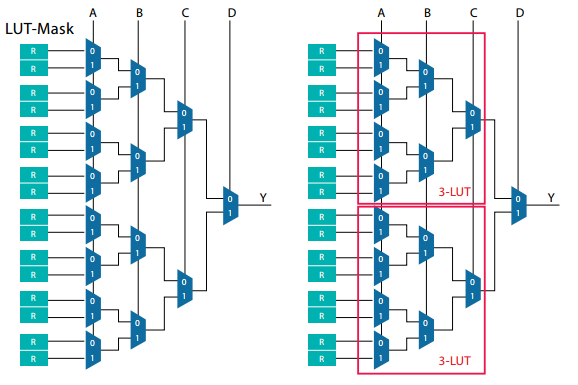

**215. Что такое HDL и RTL? Чем описание аппаратуры на HDL отличается от программирования на языках высокого уровня?**

- **HDL** — языки описания аппаратуры (Verilog, VHDL); **RTL (register transfer level)** — уровень описания передачи между регистрами (синтезируемый).
- Отличие от высокоуровневых языков: HDL описывает параллельную структуру/схему (комбинационные блоки, регистры, сигналы), а не последовательный алгоритм; «все процессы между регистрами происходят параллельно»; схема всегда работает при питании; нет понятия «остановилась».

**216. Как соотносятся CPU и FPGA с точки зрения модели программирования, модели вычислений, модели исполнения и элементов микроархитектуры?**

- **CPU** — временное (temporal) исполнение, последовательный поток инструкций, универсальность; MoC — последовательная машина фон Неймана. **FPGA** — пространственное (spatial) исполнение, конфигурация задаёт схему; MoC — «как используем аппаратные ресурсы» (параллелизм/конвейер); программируем через конфигурацию (HDL).
- Элементы микроархитектуры: CPU — АЛУ/дешифратор/конвейер; FPGA — LUT/логические блоки/матрица соединений.

**217. Что представляет собой классификация Флинна и какие классы архитектур она выделяет? Примеры.**

- Классификация по числу **потоков инструкций** и **потоков данных**: SISD (одинарный процессор), SIMD (одна инструкция, много данных), MISD (много инструкций, одни данные), MIMD (много инструкций, много данных).
- Недостатки: не применима к не фон Неймановским архитектурам; класс MIMD перегружен.
- 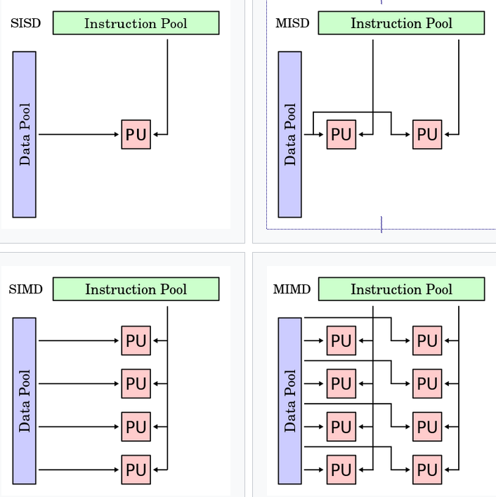

**218. Что такое SIMD и SIMT архитектуры? В чём их различия? Что такое lockstep execution?**

- **SIMD** — несколько процессоров одновременно выполняют одну инструкцию над разными данными (однообразная обработка; примеры GPU, поиск блока для Bitcoin). Ограничение — ветвления.
- **SIMT** — расширение SIMD, позволяющее работать с ветвлением (GPU/GPGPU, CUDA): «потоки» выполняют одну инструкцию, но с механизмами синхронизации для lock-step.
- **Lockstep** — засинхронизированное «шаг в шаг» исполнение одинаковых инструкций над разными данными (по существу SIMD-исполнение).

**219. Что представляет собой классификация Дункана и чем она отличается от классификации Флинна? Какие проблемы она решает? Что включает верхний уровень классификации?**

- **Дункан** — таксономия параллельных архитектур; задачи: абстрагироваться от низкоуровневого параллелизма (конвейер, суперскаляр, VLIW), переиспользовать элементы Флинна, актуализировать новинки на 1990 год, навести порядок в MIMD.
- Отличие/проблемы: Флинн слишком груб (MIMD перегружен, не подходит для не-фон-Неймана); Дункан детальнее, относительная полнота, но сложность/«искусственность».
- Верхний уровень: **синхронные архитектуры**, **MIMD-архитектуры**, **MIMD-парадигма**.
- 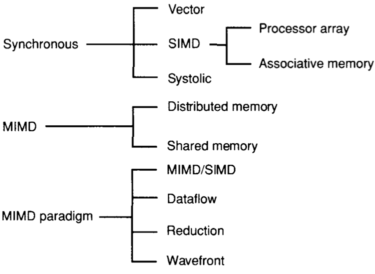

**220. Какие основные типы синхронных архитектур выделяются по классификации Дункана?**

- Синхронные архитектуры — единый механизм управления (глобальные часы, центральный блок); различаются механизмами синхронизации. Типы: векторные архитектуры; SIMD-архитектуры (процессорные массивы, ассоциативные массивы); систолические массивы; совмещение памяти и вычислений.

**221. Какие принципы лежат в основе работы векторных архитектур и где они применяются?**

- Векторные архитектуры работают с **векторами** (последовательности скаляров) и векторными операциями (`vadd v3, v1, v2`): сокращение количества инструкций, конвейерное исполнение векторных операций, множество функциональных узлов (суперскалярность).
- Применение: научные вычисления, обработка массивов/сигналов, GPU/DSP.

**222. Как работают ассоциативные массивы и где они применяются?**

- **Ассоциативный массив /CAPP** — процессор на основе ассоциативной памяти (Content-addressable memory, CAM): ищется не по адресу, а по содержимому (сравнение с образцом параллельно). Быстрый поиск в массивах данных.
- Применение: сетевые устройства (маршрутизация, поиск), кеш/теги, быстрый поиск.

**223. Как работают систолические архитектуры и где они применяются?**

- **Систолические** — конвейерные мультипроцессоры: данные **ритмично** поступают из памяти, проходят через сеть процессоров и возвращаются в память (синхронизация через глобальные часы/такт вычислений). Процессоры объединены локальными связями и каждый цикл выполняют короткие неизменные операции.
- Применение: матричные вычисления, цифровая обработка сигналов, свёртка.

**224. Какие основные типы MIMD-архитектур выделяются по классификации Дункана?**

- Ключевой вопрос — **организация памяти**: **разделяемая память** (координация через общую память, согласование кешей) и **распределённая память** (прямое взаимодействие процессоров, message passing). Для распределённой — топологии (кольцо, сетка, дерево, гиперкуб, реконфигурируемые).

**225. Что из себя представляют архитектуры с распределённой памятью? Каковы их особенности?**

- Координация через прямое взаимодействие процессоров; данные/сигналы явно передаются между процессорами (**message passing**). Мотивация — масштабируемость и доступ к локальным данным. Топология определяется характером потока данных задачи.
- 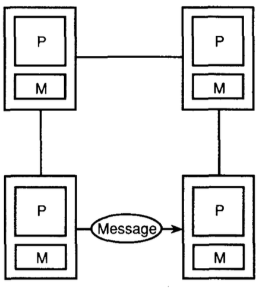

**226. Что из себя представляют архитектуры с разделяемой памятью? Каковы их особенности?**

- Координация через **общую память**; ключевая проблема — координация доступа и согласование кешей (когерентность). Подходы: шинное соединение, перекрёстная шина, сеть на кристалле. Привычны/прозрачны для программистов.
- 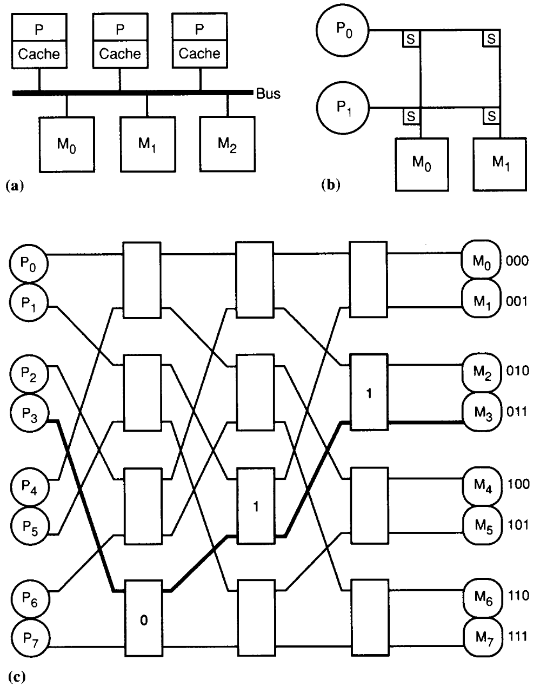

**227. Какие основные типы MIMD парадигм выделяются по классификации Дункана?**

- **MIMD-парадигма** — архитектура MIMD с точки зрения модели вычислений (MoC): **MIMD/SIMD** (гибрид), **потоковая архитектура (dataflow)**, **редукционная архитектура**, **wavefront**. Различаются MoC (потоки данных, взаимодействие, синхронизация).

**228. Что представляет собой MIMD/SIMD парадигма и где она применяется?**

- Гибрид: управление крупными задачами в стиле SIMD, внутри — небольшие задачи в стиле MIMD; отношение ведущий-ведомый может быть деревом (корень SIMD раздаёт задания, листья MIMD с локальной памятью). Аналогия: `fork/join`. Сюда включают TTA (transport-triggered): запуск вычислений инициируется пересылкой данных.

**229. Как работает архитектура потоков данных (dataflow)? Подходы к реализации.**

- **Dataflow**: возможность выполнения инструкций определяется **наличием входных аргументов**; порядок непредсказуем. Алгоритм — граф вычислений; нет «памяти/канала» как узкого места; проблема — передача данных между узлами.
- Реализация: распределённая память (кольцо), по кольцу рассылаются **токены** (метка + значение); когда у задачи все токены получены — задача запускается; результат уходит токеном.
- 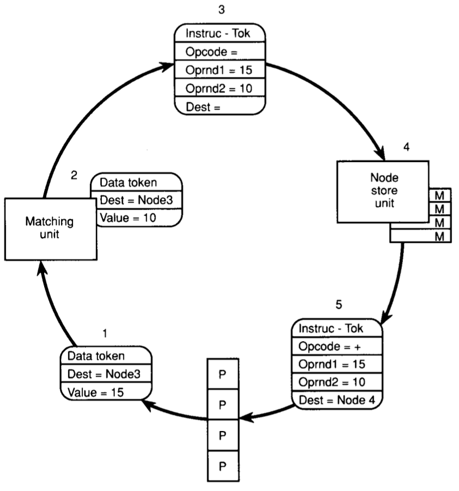

**230. Как работает редукционная архитектура? Каким образом она обеспечивает параллелизм?**

- **Редукционная (ориентированная на запрос)**: инструкция разрешается к выполнению, когда её **результат требуется** как операнд для уже разрешённых инструкций. Разрабатывалась для параллелизма и функционального программирования.
- Выполнение: выборка инструкции, замена её результатом в графе вычислений; проблемы — ссылочная прозрачность, разворачивание графа, нормальные/ленивые вычисления. В аппаратуре встречается редко, чаще в run-time/виртуальных машинах.

**231. Как работает wavefront архитектура? В чём её отличия от систолической архитектуры?**

- **Wavefront** — комбинация систолической архитектуры с **асинхронным потоковым исполнением**: управление динамическое, за счёт распространения сигнала по сети; синхронизация и режим выстраиваются динамически.
- Отличие от систолической: систолическая управляется глобальными часами (жёсткая синхронизация), wavefront — асинхронная/динамическая; проще в программировании, лучше масштабируется, но есть риски переполнения буферов в run-time.

**232. Что такое CGRA-процессоры и какие возможности они предоставляют?**

- **CGRA (coarse-grained reconfigurable architecture)** — крупногранулярная реконфигурируемая архитектура: вычислительные блоки (АЛУ/функциональные блоки) и соединения настраиваются после производства. Заполняет нишу между универсальностью и эффективностью.
- Возможности: domain-specific flexibility, сочетание пространственного и временного вычислений, управление конфигурацией и данными (configuration/data-driven execution). CGRA определяет: вычислительные блоки и интерфейсы, коммуникацию, механику управления, планирования, программы/программирование.

**233. В чём различие между пространственными (spatial) и временными (temporal) вычислениями на примере CGRA?**

- **Temporal**: «схема» последовательно выполняет требуемые задачи (одни и те же блоки используются на разных шагах). **Spatial**: схема повторяет граф вычислений, параллелизм/конвейер. CGRA — гибрид: часть вычислений «раскладывается» в пространстве (параллельные блоки), часть последовательно во времени.
- 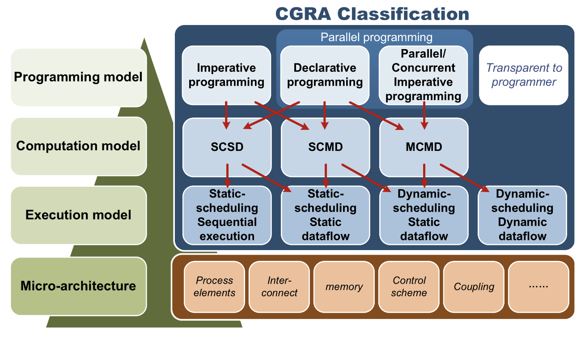

**234. Какие подходы существуют к решению проблемы Memory Wall в рамках ASIC и CGRA?**

- **ASIC/специализированные**: близкое размещение памяти и вычислений, память-в-вычислении (processing-in-memory), минимизация передач данных (вторая матрица загружается один раз), конвейер/массивы. **CGRA**: локальные буферы/память у вычислительных блоков, поток данных по конвейеру, снижение обращений к внешней памяти, специализация интерфейса.

**235. Что такое модели вычислений CGRA: SCSD, SCMD, MCMD? В чём различия и где применяется каждая?**

- **SCSD** (single configuration, single data) — одна конфигурация, один поток данных. **SCMD** (single configuration, multiple data) — одна конфигурация, много данных (параллельная обработка). **MCMD** (multiple configuration, multiple data) — несколько конфигураций и потоков данных (наиболее гибкая).
- Различие — число конфигураций и число потоков данных (насколько реконфигурируется в течение исполнения). Применение: от простых конвейерных ядер (SCSD/SCMD) до гибких ускорителей с переключением конфигураций (MCMD).
- 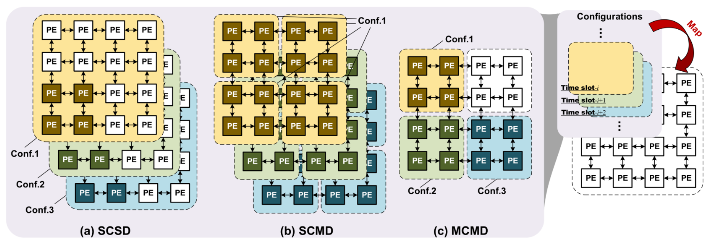

**236. Что такое высокоуровневый синтез (HLS) и какова его роль в современной разработке?**

- **HLS** — автоматическое отображение алгоритма (например, на C/C++) в цифровую схему (HDL/RTL). Проблемы, которые решает: множество вариантов отображения, зависимость выбора от требований, трудоёмкость разработки схем, медленные тесты.
- Роль: быстрое прототипирование, переносимость между платформами, адаптируемость микроархитектуры, автоматизация оптимизации. Недостатки: ограниченный контроль результата, кривая обучения, вариативная зрелость технологии.

**237. Как высокоуровневый синтез (HLS) автоматизирует процесс выбора микроархитектуры и ускоряет тестирование?**

- HLS автоматически перебирает варианты (spatial vs temporal, конвейеризация, развёртывание циклов), генерирует RTL и оптимизирует под ограничения (частота, площадь, задержка); microarchitecture становится настраиваемой. Моделирование на высоком уровне (быстрее, чем RTL), автоматическая генерация тестбенчей/checks, совместная симуляция ускоряют верификацию.

**238. Чем Chisel и Bluespec отличаются от классических HDL (Verilog/VHDL)? Каковы их ключевые особенности?**

- **Chisel** — язык описания аппаратуры, встроенный в **Scala**: конструктивная (structural), параметризуемая генерация схем, богатый язык и библиотеки.
- **Bluespec** — высокоуровневый HDL: мощная **система типов** (ошибки до синтеза) и **Guarded Atomic Actions** (модульные компоненты по инвариантам, компилятор выбирает планировщик).
- Отличие от Verilog/VHDL: выше уровень абстракции, «программные» языковые конструкции, генерация структуры, проверка на этапах до синтеза. Также: **Clash** (функциональный, от Haskell), **PyHDL** (от Python).
