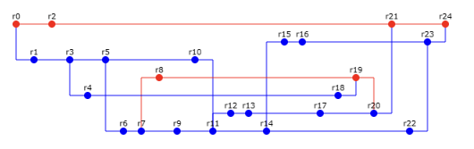

Сконфигурировать в своём домашнем каталоге репозитории mercurial и git и загрузить в них начальную ревизию файлов с исходными кодами (в соответствии с выданным вариантом).

Воспроизвести последовательность команд для систем контроля версий mercurial и git, осуществляющих операции над исходным кодом, приведённые на блок-схеме.

При составлении последовательности команд необходимо учитывать следующие условия:

* Цвет элементов схемы указывает на пользователя, совершившего действие (красный - первый, синий - второй).
* Цифры над узлами - номер ревизии. Ревизии создаются последовательно.
* Необходимо разрешать конфликты между версиями, если они возникают.

**Отчёт по работе должен содержать:**

1. Задание и блок-схему в соответствии с вариантом.
2. Список команд, использованных при создании и конфигурации репозиториев в домашнем каталоге пользователя.
3. Номера ревизий и соответствующие им последовательности команд с комментариями (для svn и git).
4. Выводы по работе.

**Вопросы к защите лабораторной работы:**

1. Системы контроля версий - назначение, примеры решений.
2. Ревизии и ветки.
3. Основные операции над данными в системах контроля версий. Основные команды svn и git.
4. Виды конфликтов и способы их решения.

在你的主目录中配置 mercurial 和 git 仓库，并将源代码文件的初始版本（根据所给方案）上传到这些仓库中。

根据流程图中给出的源代码操作，重现用于 mercurial 和 git 版本控制系统的命令序列。

在编写命令序列时，需考虑以下条件：

- 图中元素的颜色表示执行操作的用户（红色 – 第一个用户，蓝色 – 第二个用户）。
- 节点上方的数字表示版本号。版本按顺序创建。
- 如果版本之间出现冲突，必须解决冲突。

实验报告应包含：

1. 根据实验方案给出的任务和流程图。
2. 在用户主目录中创建和配置仓库时所使用的命令列表。
3. 各版本号及对应的命令序列（包括注释，分别针对 svn 和 git）。
4. 实验结论。

实验报告答辩问题：

1. 版本控制系统——用途及解决方案示例。
2. 版本与分支。
3. 版本控制系统中的基本数据操作。svn 和 git 的主要命令。
4. 冲突的类型及解决方法。
