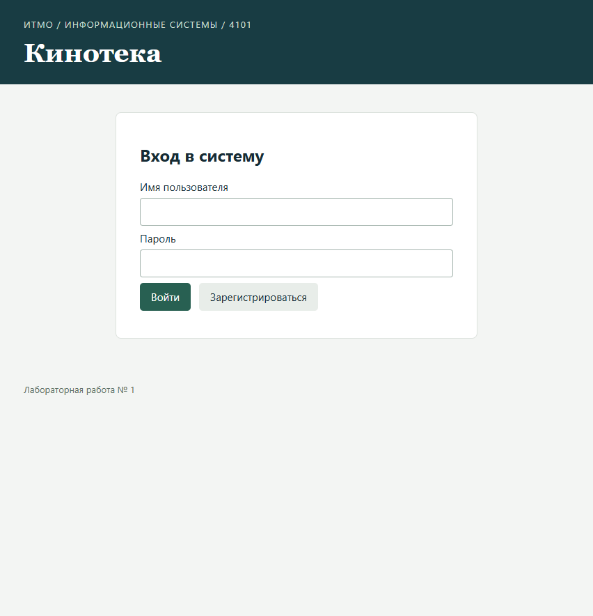
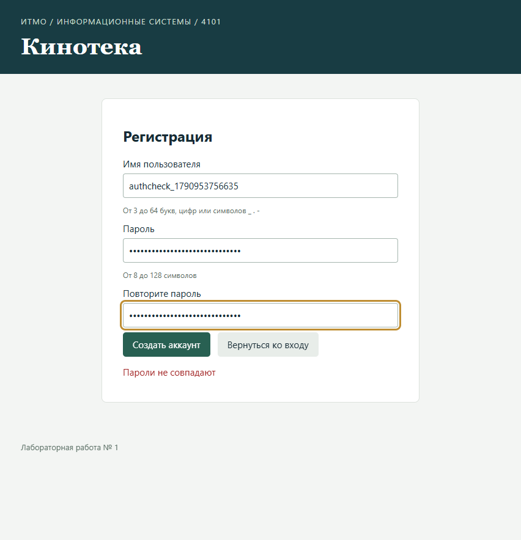
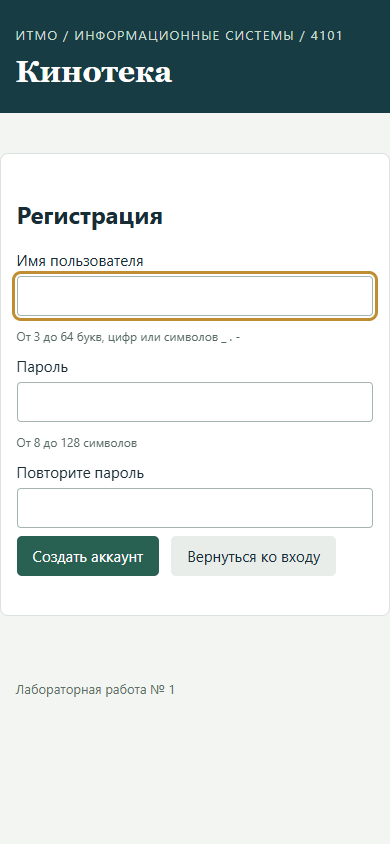

# 注册功能与登录页修改验收

日期：2026-10-02。部署：Helios `/home/studs/s407960/is-lab1-4101`，HTTP `127.0.0.1:40796/movie-lab/`。浏览器测试通过临时 SSH 转发端口 18084 访问同一部署，用户原有 18082 转发可继续使用。

## 完成的修改

- 登录页新增“Зарегистрироваться”，包含用户名、密码和密码确认；注册成功后进入集合。
- 删除“Все авторизованные пользователи работают с общей коллекцией.”。
- 页脚仅保留“Лабораторная работа № 1”。
- 新增专用表 `s407960.lab1_4101_app_user`。密码以 PBKDF2-HMAC-SHA256、600000 次迭代及独立随机盐保存；账号信息不通过电影 API 暴露。
- 保留 `student / student`，账号只初始化一次。注册账号在应用重启后仍可使用；登录会话需重新建立。

## 验证结果

| 验证 | 结果 | 原始记录 |
|---|---|---|
| 真实 PostgreSQL + EclipseLink 集成测试 | 38 通过，0 失败/错误/跳过 | [JUnit](target/surefire-reports/ru.itmo.movie.MovieServiceTest.txt)、[构建日志](.runtime/auth-build-test.log) |
| 原有电影浏览器/API 回归 | 16 通过 | [JSON](browser-results.json) |
| 注册与界面浏览器/API 检查 | 14 通过 | [JSON](auth-browser-results.json) |
| 实际停止并重启 Payara 后，新账号登录及读取受保护集合 | 2 通过 | [JSON](auth-restart-results.json) |
| UTF-8 与文本乱码检查 | 44 个文件通过 | `Lab1/tools/check_text_encoding.py` |

新增集成用例检查数据库持久化、同密码不同盐、重复用户名不覆盖密码、非法输入、错误登录、初始化账号不被重置，以及并发注册只创建一条账号记录。浏览器检查密码确认、自动登录、重复用户名提示、注销后登录、窄屏显示、后端校验和失败注册不产生登录身份。原有测试覆盖 CRUD、同步、版本冲突、CSRF、Long 精度及特殊操作。

迁移只创建账号表，未重新初始化电影表。部署前和回归清理后，电影数均为 0：[之前](.runtime/auth-movies-before.txt)、[之后](.runtime/auth-movies-after.txt)。测试使用的独立 `lab1_4101_test_*` 表已删除。浏览器创建的临时账号 `authcheck_1790953756635` 已在完成重启验证后按精确用户名删除；未删除其他账号。

## 页面截图

历史验收保留在上一级目录，以上记录对应本次新增功能。
