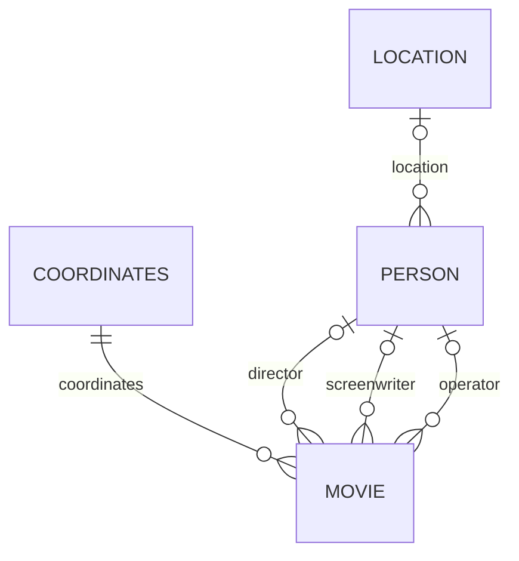

# 04 PostgreSQL：把对象变成可持久保存的关系

## 1. 从电影对象拆出四种数据

一部电影有名字、预算、票房等自己的属性，也引用坐标和人员。人员又可能引用地点。如果把导演所有信息复制到每部电影中，导演改名就要改很多行，容易出现不一致。

本实验把它们拆成 `movie`、`coordinates`、`person`、`location` 四张表。还有一张技术表 `app_state`，用于并发控制和变更通知。表中的一行对应一条记录，列对应属性。



“多部电影指向同一个导演”不等于“每部电影可以有任意多名导演”。当前字段 `director` 是单个 `Person`，所以电影到导演是可选的多对一关系。

## 2. 主键和外键实际保存什么

主键（первичный ключ）唯一标识一行。本实验所有业务表使用正数 bigint ID。外键（внешний ключ）存另一张表的标识，数据库检查该记录确实存在。

教学数据示意：

```text
person: id=10, name=Анна
movie:  id=20, name=Фильм A, director_id=10
movie:  id=21, name=Фильм B, director_id=10
```

Java 中访问 `movie.director.name`；数据库中保存的是 `director_id=10`，人员名字在 `person` 表。这就是关联复用的基础。

源码：[schema.sql](<C:/develop/NOTE_UTP/StudyNote/5 Information Systems/Lab/Lab1/movie-lab/database/schema.sql>)。

```sql
director_id bigint REFERENCES person(id) ON DELETE CASCADE
```

这段表示导演 ID 必须指向有效人员（或者为 NULL），删除被引用的人员时，引用它的电影会跟随删除。

## 3. 三种“没有值”要分清

`NULL` 表示没有值；空字符串 `''` 是一个有值但长度为 0 的字符串；`0` 是一个具体数字。

本实验的 `name` 要求非 NULL 且非空，所以 SQL 同时使用 `NOT NULL` 和 `CHECK(length(name)>0)`。`tagline` 只禁止 NULL，所以允许 `''`。不能把题目里的这两类规则混为一谈。

`CHECK(value>0)` 对 NULL 产生的结果并不是 false，因此若要同时拒绝 NULL，需额外写 `NOT NULL`。这个细节解释了为什么可空正数字段只写 CHECK，而必填正数字段还写 NOT NULL。[PostgreSQL 17 约束文档](https://www.postgresql.org/docs/17/ddl-constraints.html)

## 4. 各种约束各管什么

| 规则 | SQL 机制 | 本实验例子 |
|---|---|---|
| 必填 | NOT NULL | `coordinates_id`、`length` |
| 非空字符串 | CHECK | `length(name)>0` |
| 正数 | CHECK | `oscarscount>0` |
| 上界 | CHECK | 坐标 `x<=826` |
| 不重复 | UNIQUE | `passportid` |
| 被引用记录存在 | FOREIGN KEY | `director_id` |
| 自动编号 | IDENTITY | 各业务对象 ID |
| 枚举范围 | CHECK IN | 电影类型、MPAA、颜色 |

`UNIQUE` 是数据库最后的保证。只在 Java 中先查一次“护照是否存在”，在并发请求下仍可能让两个请求都以为不存在；数据库约束不能省略。

## 5. 谁生成 ID 和创建日期

项目节选：

```sql
id bigint GENERATED ALWAYS AS IDENTITY PRIMARY KEY CHECK(id>0)
creationdate date NOT NULL DEFAULT CURRENT_DATE
```

电影创建请求不接受用户自己填写 ID 或创建日期。INSERT 时数据库生成 ID，并在没有给创建日期赋值时应用默认日期。

ID 不保证连续。插入失败或回滚后出现编号空缺，不代表数据损坏。序列/identity 的目标是生成标识，不是保证行数计数。

本系统通过服务层和 ORM 禁止修改创建日期；数据库的 DEFAULT 本身不是“不允许任何 SQL 修改日期”的约束。具有直接 SQL 权限的人仍可能更新日期，这与应用接口的权限边界不同。

## 6. 级联删除的方向

```text
删除 Location → 删除引用该地点的 Person → 删除引用这些人员的 Movie
删除 Coordinates → 删除引用这组坐标的 Movie
删除 Movie → 不删除仍可独立存在的 Person / Coordinates
```

假设两部电影共用导演。如果删电影 A 时再删导演，电影 B 也会被外键级联删除。这显然不符合共享辅助对象的用途，因此当前设计选择从辅助对象向依赖它的对象删除。

“级联”（каскадное удаление）不是“只要有关系就全部删掉”。需要先解释谁依赖谁。Java 服务层还有显式删除逻辑，用来让 ORM 管理的对象和删除数量与操作一致，详见第 08 章。

## 7. 数据库、schema 和表有什么区别

PostgreSQL 服务可以包含多个数据库（database）。每个数据库内部又有 schema，schema 像表的命名空间。默认常见 schema 名为 `public`，它不是另一台数据库服务器。

应用本地数据库叫 `movie_lab`，测试数据库叫 `movie_lab_test`。测试还会在测试库内创建随机命名的 schema，这样测试清理只作用于专用范围。

JDBC URL 中 `currentSchema=...` 告诉连接优先使用哪个命名空间，特别适合学院共享数据库 `studs` 中的独立实验表。

## 8. 索引和约束不是一回事

`CREATE INDEX movie_name_idx ON movie(name)` 建立查找结构，有助于某些筛选和排序。普通索引不禁止相同名字，也不能证明所有查询都一定变快；实际是否使用，由 PostgreSQL 查询规划器根据数据和查询决定。

外键列上的索引也有助于查找依赖记录。数据量很小的时候，你不一定观察到速度区别。

## 检查题

1. 如果某个字段只写 `CHECK(x>0)`，NULL 必然被拒绝吗？
2. 两部电影共用一个人员，需要复制两条人员记录吗？
3. 为什么不能用 `SELECT MAX(id)+1` 替代 identity？

参考答案：不必然，还需 NOT NULL；不需要，两条外键可指向同一主键；并发插入可能计算出相同值，数据库生成机制更合适。
