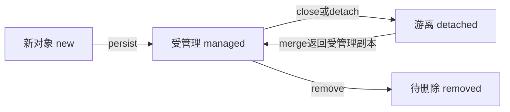

# 05 JPA 与 EclipseLink：为什么修改对象能写回数据库

## 1. 从 JDBC 的重复工作引出 ORM

如果只用 JDBC，你通常要手写 INSERT/SELECT，设置参数，再遍历 ResultSet，把每个列读回 Java 字段。四种对象、很多字段和关联，会产生大量机械代码。

ORM（объектно-реляционное отображение，对象关系映射）把 Java 类和数据库表对应起来。你仍需理解 SQL 和事务，只是框架承担一部分对象读写工作。

JPA 是 Jakarta Persistence 的常用简称，是持久化规范；EclipseLink 是当前项目选用的实现。Hibernate ORM 也是一种实现，但不是当前使用的提供者。[Jakarta Persistence 3.1](https://jakarta.ee/specifications/persistence/3.1/)

## 2. 读懂实体注解

项目节选：[Movie.java](<C:/develop/NOTE_UTP/StudyNote/5 Information Systems/Lab/Lab1/movie-lab/src/main/java/ru/itmo/movie/domain/Movie.java>)。

```java
@Entity
@Table(name = "movie")
public class Movie {
    @NotNull
    @ManyToOne(optional = false)
    @JoinColumn(name = "coordinates_id", nullable = false)
    public Coordinates coordinates;
}
```

| 这一行 | 作用 |
|---|---|
| `@Entity` | 让 JPA 将类视为可映射的实体 |
| `@Table` | 指定对应的数据库表名 |
| `@ManyToOne` | 多部电影可以引用同一组坐标 |
| `optional=false` | 对 ORM 表达该关联不可缺少 |
| `@JoinColumn` | 指定保存关联 ID 的数据库列 |
| `@NotNull` | 对 Bean Validation 表达对象字段不可为空 |

`@NotNull` 和 `@JoinColumn(nullable=false)` 属于不同机制。前者在校验对象时检查，后者属于映射元数据。当前数据库已有独立 SQL 脚本，所以真正的数据库约束要看 schema.sql，不能假定注解自动改了已存在的表。

`@Id` 标在字段上，实体采用字段访问。项目为了简洁使用 public 字段，JPA 不强制必须通过 getter/setter 持久化。

## 3. EntityManagerFactory 与 EntityManager

| 对象 | 可以理解为 | 生命周期 |
|---|---|---|
| EntityManagerFactory | 持久化单元的工厂和配置入口 | 本应用共享，最终关闭 |
| EntityManager | 一次数据库工作的对象管理器 | 每次 read/write 单独创建 |
| EntityTransaction | 当前管理器的本地事务控制器 | 写操作 begin/commit/rollback |

不要把 EntityManager 简单说成“一个 JDBC Connection”：它还管理实体状态、查询、变更跟踪等。它也不适合被多个请求线程随意共享。

持久化上下文（контекст персистентности）是 EntityManager 管理实体的范围。它知道哪些对象已经被加载、哪些发生了变化。

## 4. 四种实体状态



`merge` 是理解 JPA 常见 API 所需的概念，本实验保存流程没有调用它。当前更新逻辑先 `find()` 原实体，再直接改这个受管理对象。

教学示意：

```java
Movie movie = em.find(Movie.class, 7L);
movie.name = "Новое название";
```

在有效写事务中，ORM 会在适当时机同步受管理对象的变化，不要求你再执行 `save(movie)`。但从已关闭的 EntityManager 返回的普通对象，随后被修改不会自动再写数据库。

## 5. persist、flush、commit、refresh 各做什么

| 方法 | 当前保存流程中的作用 |
|---|---|
| `persist(entity)` | 新对象进入持久化管理，准备插入 |
| `flush()` | 把待同步的变更送到数据库；可能提前发现约束错误 |
| `refresh(entity)` | 重新读取数据库中的记录，取得生成日期等值 |
| `commit()` | 成功完成事务，使本次修改正式提交 |
| `rollback()` | 放弃本次事务中的修改 |

**flush 不等于 commit。** SQL 已经执行，也仍可能被后面的 rollback 撤销。数据库生成 ID 的具体时机可能受策略和实现影响，不要规定所有 INSERT 都必须等到最后一次 flush 才发生。

## 6. 本项目的事务边界

阅读 [Database.write()](<C:/develop/NOTE_UTP/StudyNote/5 Information Systems/Lab/Lab1/movie-lab/src/main/java/ru/itmo/movie/persistence/Database.java>)：

```text
创建 EntityManager
→ begin
→ 锁定 AppState(1)
→ work.apply(em) 执行业务
→ revision 加一
→ flush
→ commit
→ 返回结果并关闭 EntityManager
```

如果业务或提交前的同步抛出运行时异常，捕获分支在事务仍有效时 rollback，然后把异常继续向外抛。

这里使用 `RESOURCE_LOCAL` 和 `EntityTransaction`，不是 `@Transactional` 自动管理，也不是 EJB 的容器事务。只有一个数据库资源，因此先学清楚这个明确的边界即可。

## 7. 泛型与 lambda 为什么出现在 Database

项目签名：

```java
public <T> T write(Function<EntityManager, T> work)
```

`T` 表示本次业务返回什么类型都可以。`Function<EntityManager,T>` 表示传入一个“拿到 EntityManager 后产生 T”的函数。

`db.write(em -> { ... })` 把业务动作交给 Database 执行，Database 负责统一事务和清理。你不必在每一个业务方法里复制 begin/commit/rollback。这个结构体现了将“公共执行流程”与“具体业务动作”分离。

## 8. 日期与大整数两个转换器

[ZonedTimeConverter](<C:/develop/NOTE_UTP/StudyNote/5 Information Systems/Lab/Lab1/movie-lab/src/main/java/ru/itmo/movie/domain/ZonedTimeConverter.java>) 在 Java `ZonedDateTime` 与数据库文本之间转换，保留如 `[Europe/Moscow]` 的区域名称。它属于 **Java ↔ 数据库** 边界。

[LongJsonSerializer](<C:/develop/NOTE_UTP/StudyNote/5 Information Systems/Lab/Lab1/movie-lab/src/main/java/ru/itmo/movie/domain/LongJsonSerializer.java>) 把 Long 写成 JSON 字符串，以免 JavaScript Number 丢失整数精度。它属于 **Java ↔ 浏览器** 边界。

两者都叫“转换”，但处理的边界不同。不要说前者用于 HTTP 序列化，或后者用于 SQL 列转换。

## 9. 缓存与关联加载

`persistence.xml` 关闭 EclipseLink 的共享缓存，降低一个请求读到其他 EntityManager 已修改数据之前的旧缓存的风险。但当前 EntityManager 的持久化上下文仍然存在；“关闭共享缓存”不等于“关闭所有缓存”。

当前 `@ManyToOne` 没有显式设置 fetch，按默认 EAGER 获取相关对象。这有利于关闭 EntityManager 后序列化这些关系，也可能带来额外 SQL 和数据加载。不要因此声称所有关系都只用一条 JOIN 查询完成。

## 检查题

1. 为什么更新没有 `em.merge()` 也可能写回数据库？
2. flush 后出错还能回滚吗？
3. CDI 管理的服务与 JPA 管理的电影有什么不同？

参考答案：修改的是 find 得到的受管理实体；只要事务尚未成功提交，就仍可回滚事务变更；前者由组件容器管理生命周期和注入，后者由持久化上下文跟踪数据库状态。
