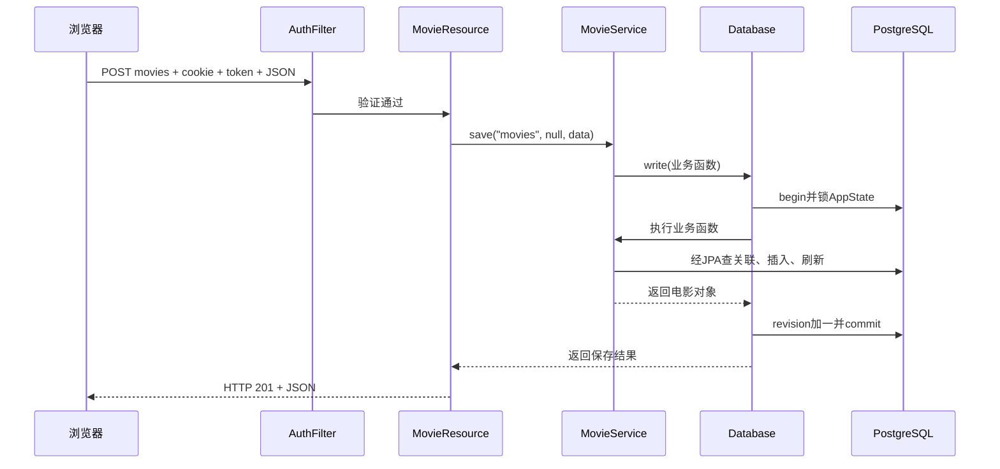

# 07 追踪一次“创建电影”：从按钮到数据库再返回

## 1. 先确定我们的输入

假设已经创建坐标 ID=1，准备保存一部电影。以下是**教学请求体**，需要有效登录会话及 CSRF 请求头，不是复制后即可匿名发送的请求：

```json
{
  "name": "Учебный фильм",
  "coordinates": "1",
  "oscarsCount": "3",
  "budget": "1000000",
  "mpaaRating": "PG_13",
  "length": "120",
  "usaBoxOffice": "500",
  "tagline": "Начало истории",
  "genre": "COMEDY"
}
```

选填字段可省略。创建请求不能提供 `id`、`version`、`creationDate`，这些由系统管理。

## 2. 浏览器先做的事

[app.js](<C:/develop/NOTE_UTP/StudyNote/5 Information Systems/Lab/Lab1/movie-lab/src/main/webapp/app.js>) 的表单提交监听器调用 `e.preventDefault()`，阻止浏览器按传统表单方式跳转。它收集每个输入框的字符串值，调用 `api('movies','POST',data)`。

`fetch()` 把 JavaScript 对象先经 `JSON.stringify()` 变成文本，附上 JSON Content-Type、CSRF token。按钮临时禁用，避免用户连续点击造成明显重复提交。

禁用按钮只是改善交互，不是数据库级别的幂等保证。

## 3. 请求在服务器上的完整路线



这里 S 与 D 不是网络服务之间的通信，而是同一 JVM 中普通方法调用；只有浏览器到服务器、Java 到数据库跨越通信边界。

## 4. save 的参数分别表示什么

源码：[MovieService.save()](<C:/develop/NOTE_UTP/StudyNote/5 Information Systems/Lab/Lab1/movie-lab/src/main/java/ru/itmo/movie/service/MovieService.java>)。

| 参数 | 创建时 | 修改时 |
|---|---|---|
| `kind` | `movies` | `movies` |
| `id` | null，表示新对象 | 已有对象 ID |
| `input` | 字段值 | 欲修改字段及旧 version |

该方法同时处理电影、人员、坐标、地点。`TYPES` 是资源名称到 Java 类的固定映射，不允许浏览器传任意类名让服务器实例化。

## 5. 为什么这里用反射

反射（рефлексия）允许运行时通过类元信息读取构造器和字段：

```java
t.getDeclaredConstructor().newInstance();
Field field = t.getField(key);
Class<?> ft = field.getType();
field.set(entity, v);
```

逐步理解：先创建对应类型的对象；根据传来的字段名找 public 字段；获取它的目标类型；把转换后的值写进去。

例如 `key="budget"`，目标类型是 `long`，于是 `Long.valueOf(s)` 检查字符串是否能表示合法 long。若值是坐标或人员引用，则不是直接填字符串，而是按 ID 用 EntityManager 查询已经存在的对象。

统一反射减少四种对象的重复表单保存代码，但失去了很多编译期保障。新增 public 字段也可能意外扩大可写范围。生产系统常使用明确 DTO 和逐字段映射；这里应理解它是当前实现的取舍，不是所有 JPA 项目的标准写法。

## 6. 校验不是只做一次

| 顺序 | 检查 | 示例 |
|---|---|---|
| 1 | 资源和字段允许列表 | 拒绝未知 kind、未知字段 |
| 2 | 系统字段不可手工设置 | 拒绝创建时传 id |
| 3 | 类型和数值范围 | 超过 Long.MAX_VALUE 无法转成 long |
| 4 | 引用是否存在 | 坐标 ID 不存在返回 404 |
| 5 | Bean Validation | 空名字、奖项为 0 |
| 6 | 友好的业务唯一性检查 | 护照重复返回具体提示 |
| 7 | 数据库约束 | FK、CHECK、UNIQUE 等最终保证 |

`@Positive` 对可空包装类型通常允许 null，所以必填包装字段还需要 `@NotNull`。基本类型本来不能保存 null，但新建对象中默认的 0 仍可能被 `@Positive` 拒绝。

当前 Validation 错误会收集为一组字段说明，排序后合并返回，而不是让用户每次只发现一个字段错了。

## 7. 创建日期为什么似乎设置了两次

Java 在校验前给新电影一个临时日期，实体还有 `@PrePersist` 设置日期；但映射中的 `insertable=false, updatable=false` 不让这个字段作为普通 INSERT/UPDATE 值写入。

数据库使用 `DEFAULT CURRENT_DATE` 产生最终日期。`flush()` 后 `refresh()` 重新读数据库，让返回对象反映数据库实际结果。

因此不能说“最终日期完全由用户电脑时钟决定”，也不能忽略 Java 临时赋值是为了满足对象级非空校验。

## 8. 修改相比创建多做什么

修改先根据 ID 找到已有受管理实体；然后比较请求带来的 version 与数据库实体 version。不同就拒绝，避免覆盖别人已经保存的结果。

验证通过后修改对象字段，不需要再次 `persist()`。`flush()` 让 ORM 同步变化，`@Version` 参与乐观锁处理，`refresh()` 得到最新记录。当前 version 初始值由提供者处理，不要把“新对象 version 一定为 0”写死到客户端。

如果用户只提交部分字段，代码只改那些字段；若显式提交 null，就按清空该字段处理，并接受对应约束检查。

## 9. 为什么错误时不会保存一半

字段转换和赋值在 Database.write 的事务里面。就算前几个字段已经改了，后面发现不合法，异常会触发事务回滚并关闭 EntityManager。那份被修改的内存对象不会作为成功结果返回客户端。

但是“事务回滚”不表示 Java 局部变量被自动恢复成旧值。保护的是数据库事务结果；对象内存状态和数据库状态必须分开理解。

## 检查题

1. 创建电影为什么要先创建或选好坐标？
2. `field.set(entity,v)` 完成后数据就永久保存了吗？
3. 为什么人员唯一性查询要区分创建和修改？

参考答案：coordinates 是必填关联，服务端要求被引用对象已存在；没有，还要通过后续校验和事务提交；修改时应排除对象自己的 ID，创建时没有可排除 ID，历史版本也曾因传入空 ID 的 SQL 参数类型而失败。
