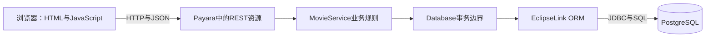

# 从零理解电影管理实验：学习入口

适合对象：有 Java 基础，尚未系统学习后端框架。正文用中文，重要概念附俄语术语，兼顾读懂代码、独立实现和实验答辩。

本文档依据 **2026-09-22 工作区中的实际代码** 编写。示例会明确标注“项目节选”或“教学示意”；省略部分不代表可以直接替换原文件。过去运行留下的测试记录与本次文档检查分开说明。

## 最先建立的认识

实验不是给 `Movie` 写几个方法，而是让不同浏览器安全地修改同一份数据库数据。浏览器负责交互，Java 服务端决定能否修改、如何修改，PostgreSQL 保存最终结果。

CDI 负责组装这些服务端对象；Bean Validation 负责对象约束；JUnit 和 Playwright 从不同位置检查系统。

## 学习顺序

| 章节 | 学完应该能回答什么 | 阅读重点 |
|---|---|---|
| [01 从需求到 Web 系统](<C:/develop/NOTE_UTP/StudyNote/5 Information Systems/Lab/Lab1/learning/01-system-and-http.md>) | 为什么不能只有一个 Java 集合？请求是什么？ | HTTP、JSON、前后端、分层 |
| [02 Maven、WAR 与 Payara](<C:/develop/NOTE_UTP/StudyNote/5 Information Systems/Lab/Lab1/learning/02-build-and-runtime.md>) | 谁编译、谁启动、谁提供框架能力？ | 依赖、作用域、容器、配置 |
| [03 CDI 与管理 Bean](<C:/develop/NOTE_UTP/StudyNote/5 Information Systems/Lab/Lab1/learning/03-cdi.md>) | 没有 `new MovieService()`，对象从哪里来？ | IoC、DI、作用域、生命周期 |
| [04 PostgreSQL 与关系模型](<C:/develop/NOTE_UTP/StudyNote/5 Information Systems/Lab/Lab1/learning/04-database.md>) | Java 引用怎样变成表之间的关系？ | 主键、外键、约束、级联 |
| [05 JPA 与 EclipseLink](<C:/develop/NOTE_UTP/StudyNote/5 Information Systems/Lab/Lab1/learning/05-jpa.md>) | 为什么改对象字段能更新数据库？ | 实体状态、EntityManager、事务 |
| [06 REST、JSON 与登录](<C:/develop/NOTE_UTP/StudyNote/5 Information Systems/Lab/Lab1/learning/06-api-and-auth.md>) | URL 怎样找到 Java 方法？登录状态怎样保存？ | 路由、参数、会话、CSRF |
| [07 完整追踪一次创建](<C:/develop/NOTE_UTP/StudyNote/5 Information Systems/Lab/Lab1/learning/07-create-and-update.md>) | 点击保存后每一层做了什么？ | 反射、校验、关联、生成字段 |
| [08 查询、分页与删除](<C:/develop/NOTE_UTP/StudyNote/5 Information Systems/Lab/Lab1/learning/08-query-and-delete.md>) | 为什么过滤不会误匹配、删除不会误删共享对象？ | JPQL、参数、LEFT JOIN、依赖方向 |
| [09 五项特殊操作](<C:/develop/NOTE_UTP/StudyNote/5 Information Systems/Lab/Lab1/learning/09-special-operations.md>) | 怎样计算、处理边界并保证整组成功？ | 分配算法、前缀、溢出、回滚 |
| [10 并发与自动同步](<C:/develop/NOTE_UTP/StudyNote/5 Information Systems/Lab/Lab1/learning/10-concurrency.md>) | 两个人同时保存，会发生什么？ | 悲观锁、乐观锁、revision、轮询 |
| [11 浏览器端实现](<C:/develop/NOTE_UTP/StudyNote/5 Information Systems/Lab/Lab1/learning/11-frontend.md>) | 没有 Vue/React，页面如何工作？ | DOM、事件、fetch、动态表单 |
| [12 测试、启动与 Docker](<C:/develop/NOTE_UTP/StudyNote/5 Information Systems/Lab/Lab1/learning/12-testing-and-running.md>) | 怎样证明它能工作并复现结果？ | JUnit、Playwright、脚本、部署 |
| [13 从空项目重建](<C:/develop/NOTE_UTP/StudyNote/5 Information Systems/Lab/Lab1/learning/13-rebuild-workshop.md>) | 自己从零写时，先写哪个文件？ | 分阶段实现和验收 |
| [14 答辩与框架比较](<C:/develop/NOTE_UTP/StudyNote/5 Information Systems/Lab/Lab1/learning/14-defense.md>) | 如何用俄语说明技术选择？ | 原题九类问题、实现边界 |
| [15 术语与注解速查](<C:/develop/NOTE_UTP/StudyNote/5 Information Systems/Lab/Lab1/learning/15-reference.md>) | 忘记一个词或注解时查哪里？ | 中俄术语、源码索引、参考资料 |

第一遍按 01→07 建立整体理解，第二遍读 08→12 理解难点，第三遍按 13 自己重建，再用 14 自测。不要一开始就逐行啃最长的 `MovieService.save()`。

## 每章如何学习

1. 先理解它解决的问题，再读对应源码；不要把注解当作需要死记的咒语。
2. 运行前先预测结果，运行后解释差异。
3. 每章末尾有检查题和参考答案。遮住答案，用自己的话解释一次。
4. 练习中的修改在自己的副本中做，别把故意制造的错误保留在提交版本中。

本讲解中允许放代码；此前“报告不放源代码”的要求仍适用于俄语 LaTeX 报告，两者用途不同。

## 项目与证据

- [实验题目](<C:/develop/NOTE_UTP/StudyNote/5 Information Systems/Lab/Lab1/Lab1.md>)
- [应用运行说明](<C:/develop/NOTE_UTP/StudyNote/5 Information Systems/Lab/Lab1/movie-lab/README.md>)
- [历史验收记录](<C:/develop/NOTE_UTP/StudyNote/5 Information Systems/Lab/Lab1/verification/ACCEPTANCE.md>)
- [JUnit 历史摘要](<C:/develop/NOTE_UTP/StudyNote/5 Information Systems/Lab/Lab1/verification/junit-summary.txt>)
- [浏览器历史结果](<C:/develop/NOTE_UTP/StudyNote/5 Information Systems/Lab/Lab1/verification/browser-results.json>)

历史记录证明 2026-09-20 的受测版本通过 32 项数据库集成测试和 16 项浏览器/API 检查。本轮编写教程没有重新启动数据库、部署应用或重跑这些测试，不能把历史记录说成本轮新运行的结果。
