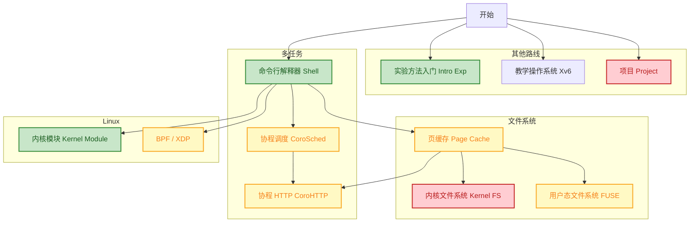

# 操作系统课程

> 中文全译：[仓库根 README 原文](https://github.com/secs-dev/os-course/blob/dee17bc418979ecbae3b45db74cdc1494bdc9bb1/README.md)。

欢迎学习操作系统！本仓库是课程入口，包含实验任务、环境配置、实验提交流程等文档。

参加实验答辩，即视为已经接受课程[行为规范](https://github.com/secs-dev/os-course/blob/dee17bc418979ecbae3b45db74cdc1494bdc9bb1/CODE_OF_CONDUCT.md)。

## 实验

课程有不同难度和方向的任务，难度影响可获得的分数。任务之间有推荐完成顺序，请阅读[实验提交流程](doc/process.md)。

部分任务在独立的教学操作系统 [Xv6 仓库](https://github.com/secs-dev/xv6-riscv) 中完成。

## 路线图

图例：

- 颜色表示分数和难度。灰色为基础、0 分；难度从低到高是灰、绿、黄、红。
- 箭头表示阶段间依赖；允许按其他顺序完成，但课程推荐箭头所示顺序。
- 原图矩形上的链接可进入对应任务。

若阅读器不支持 Mermaid，可按以下文字路线理解：

- 从开始进入 Intro Exp、Xv6、Project 或 Shell。
- Shell → Page Cache、Kernel Module、CoroSched、BPF/XDP。
- Page Cache → Kernel FS、FUSE、CoroHTTP。
- CoroSched → CoroHTTP。

> 译者注：本节翻译原图并补充文字版本。原文没有给出各项具体分数，也没有把 `vt25hell` 放入当前路线图。
