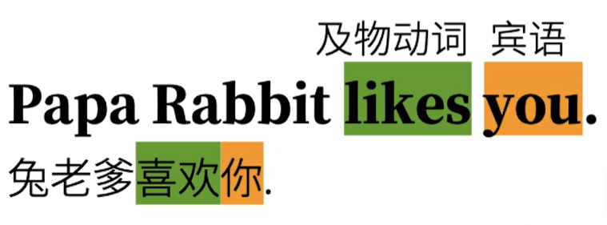
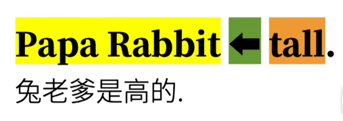

# [MainPage](../readme.md)/English  

# 综述  

# 动词Verbs  

## 动词分类  

### 谓语动词  

- **不及物动词**
  可以独立完成的动作  
  **句型**：主语 + ==不及物动词==

  

- **单及物动词**
  有1个动作的承受者  
  **句型**：主语 + ==单及物动词== + ***宾语***  

  

- **双及物动词**
  有两个动作承受者  
  **句型**：主语 + ==双及物动词== + 间接***宾语*** + 直接***宾语***  

  

- **复杂及物动词**
  只有1个动作承受者（但需补充）
  **句型**：主语 + ==复杂及物动词== + ***宾语*** +（宾语）<u>**补语**</u>  

  

- **系动词**
  非“动作”  
  **句型**：主语 + ==系动词== + （主语）<u>**补语**</u>/表语  
  将后者信息赋予给前者，相当于“划等号”  
  此类赋予主语某种性质状态的“划等号”的动词被称为： **连系动词 Linking Verbs** 即 **系动词**  

  
  

# 句子成分  

## 主语 Subject

## 谓语动词 Predicate Verb  

## 宾语 Object  

## 宾语补语 Object Complement   

## 主语补语 Subject Complement  

## 定语 Attributive  

## 状语 Adverbial  

## 同位语 Appositive  

