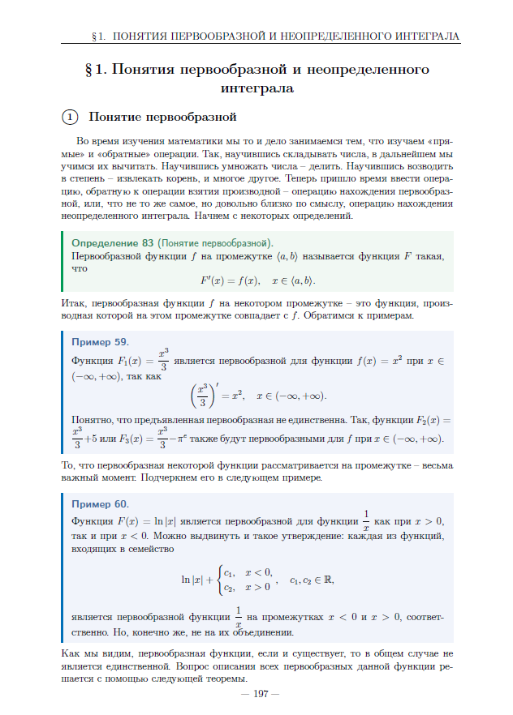
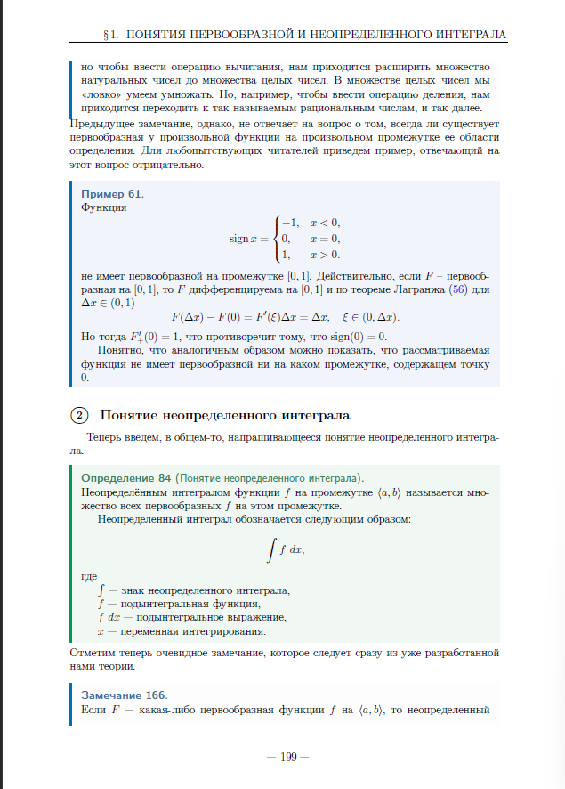
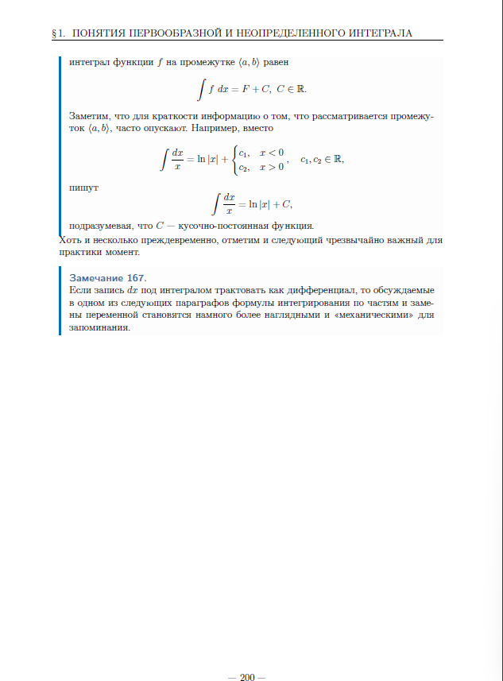

# Неопределенный интеграл  

## § 1. Понятия первообразной и неопределенного интеграла  
## §1. 原函数和不定积分的概念  

  

  

  

  

### 1 原函数的概念

在学习数学的过程中，我们经常研究“直接”和“逆”运算。例如，学会了加法之后，我们接着学习减法。学会了乘法之后，我们学习除法。学会了求幂之后，我们学习开方，等等。现在，是时候引入与求导运算相反的运算了——求原函数的运算，或者，虽然不是完全相同，但在意义上非常接近的运算，即求不定积分的运算。我们从一些定义开始。  

**定义 83（原函数的概念）**  
函数 \( f \) 在区间 \(\langle a, b \rangle\) 上的原函数是指函数 \( F \)，使得  

\[F'(x) = f(x), \quad x \in \langle a, b \rangle.\]  

因此，函数 \( f \) 在某个区间上的原函数是指在该区间上其导数等于 \( f \) 的函数。我们来看一些例子。

**示例 59.**

函数 \( F_1(x) = \frac{x^3}{3} \) 是函数 \( f(x) = x^2 \) 在 \( x \in (-\infty, +\infty) \) 上的原函数，因为

\[\left( \frac{x^3}{3} \right)' = x^2, \quad x \in (-\infty, +\infty).\]

显然，所展示的原函数并不是唯一的。例如，函数 \( F_2(x) = \frac{x^3}{3} + 5 \) 或 \( F_3(x) = \frac{x^3}{3} - r^2 \) 也是 \( f \) 在 \( x \in (-\infty, +\infty) \) 上的原函数。

原函数在某个区间上被考虑是非常重要的。我们在下一个例子中强调这一点。  

**示例 60.**

函数 \( F(x) = \ln|x| \) 是函数 \(\frac{1}{x}\) 在 \( x > 0 \) 和 \( x < 0 \) 时的原函数。我们可以提出以下断言：属于以下家族的每个函数

\[\ln|x| + 
\begin{cases} 
c_1, & x < 0, \\
c_2, & x > 0
\end{cases}, \quad c_1, c_2 \in \mathbb{R},\]

分别在区间 \( x < 0 \) 和 \( x > 0 \) 上是函数 \(\frac{1}{x}\) 的原函数。但显然，它们并不是在它们的并集上的原函数。

正如我们所看到的，如果一个函数的原函数存在，通常情况下它并不是唯一的。描述给定函数的所有原函数的问题可以通过以下定理来解决。  

# Интеграл Римана  

## § 1. Понятие интеграла Римана  
## § 1. 黎曼积分的概念  

在这一节中，我们将介绍黎曼定积分的概念，我们认为这是通过解决一个具体的应用问题——计算某函数图像下面积的问题——自然而然地得出的。  

**①Наводящие соображения**  

考虑计算函数 \( y = x^2 \) 在区间 \([0, 1]\) 下面积的问题。我们将使用我们对面积的“直观”理解，因为在学校或之前的学习中，并没有引入严格的定义。

我们将采取以下步骤。将区间 \([0, 1]\) 分成 \(n\) 个相等的部分，分割点为：

\[0 = \frac{0}{n}, \quad \frac{1}{n}, \quad \frac{2}{n}, \quad \ldots, \quad \frac{n-1}{n}, \quad \frac{n}{n} = 1\]

然后，我们将用我们能够计算的面积——矩形的面积——来近似函数图像在每个分割区间上的面积。虽然这个方法看似可行，但不可避免地会出现一个问题：如何选择这些矩形的高度？  

这似乎非常合乎逻辑：分割的每个区间的长度越小，函数在该区间上的变化就越小。因此，如果我们让 \( n \to \infty \)，从而将区间分割成无限多个长度任意小的子区间，那么选择每个区间上函数的值作为近似矩形的高度将变得无关紧要。这意味着我们可以选择对我们来说最方便的函数值。  

我们选择每个分割区间右端点处的函数值作为矩形的高度，即在这些点处取值：  

\[x_i = \frac{i}{n}, \quad i \in \{1, 2, \ldots, n\}.\]  

对应的函数值为：  

\[y(x_i) = \frac{i^2}{n^2}, \quad i \in \{1, 2, \ldots, n\}.\]  

因此，在分割区间  

\[\left[ \frac{i - 1}{n}, \frac{i}{n} \right], \quad i \in \{1, 2, \ldots, n\}\]  

上的面积，可用矩形面积近似表示为：  

\[\frac{y(x_i)}{n} = \frac{i^2}{n^3}, \quad i \in \{1, 2, \ldots, n\}.\]  

最终，函数图像下的总面积近似为阶梯图形的面积之和：  

\[\tilde{S}_n = \sum_{i=1}^n \frac{y(x_i)}{n} = \sum_{i=1}^n \frac{i^2}{n^3} = \frac{1}{n^3} \sum_{i=1}^n i^2 = \frac{n(n+1)(2n+1)}{6n^3}.\]  

当 \( n \) 趋向于无穷大时，我们的近似方法给出的值等于  

\[\lim_{n \to \infty} \widetilde{S}_n = \lim_{n \to \infty} \frac{n(n+1)(2n+1)}{6n^3} = \frac{1}{3}.\]  

**注 176.**  
我们需要注意以下几点：  
1. 首先，在上述建模过程中，我们使用了所谓的“均匀”分割（即将区间 \([0, 1]\) 分割成长度相等的子区间）。如果采用其他方式分割区间，结果是否会改变？  
2. 其次，在每个分割区间上，我们选择了特定的点，并将函数在这些点的值作为近似矩形的高度。如果按照其他规则选择点，结果会如何？同样，结果是否仍然相同？  

目前，我们无法简洁地回答这些问题，但直觉告诉我们，结果应该是相同的。如果不是这样，那么问题可能出在函数本身。“如果不是这样”是什么意思，以及“问题出在函数本身”是什么意思，正是本章理论将要阐述的内容。  

**②黎曼积分的定义**  

现在让我们严格地、逐步地引入黎曼积分的概念。我们将遵循与上述具体问题建模时完全相同的思路和顺序，只不过现在我们将以更抽象和更普遍的方式进行。那么，让我们从第一步开始——分割的概念。  

**定义 89（分割的概念）。**  
如果在区间 \([a, b]\) 上引入一组点 \(x_i\)，\(i \in \{0, 1, \ldots, n\}\)，使得  

\[a = x_0 < x_1 < x_2 < \ldots < x_n = b,\]  

则称在该区间上引入了分割（或细分）\(\tau\)。  

因此，分割是一组将我们的区间划分为更小区间的点，这些小区间两两之间没有共同的内部点。  

**注 177.**  
我们再次注意到，在本节开头构建示例时使用的“均匀”分割，仅仅是刚刚引入的分割概念的一个非常特殊的情况。  

我们注意到这个注释，后续将会用到它。  

**注 178.**  
通常，对于分割的区间及其长度，引入以下符号表示：  

\[
\Delta x_i = x_i - x_{i-1}, \quad \Delta_i = [x_{i-1}, \, x_i], \quad i \in \{1, 2, ..., n\}.
\]  

**Δ_i = [x_{i−1}, x_i] 的含义：**  
在黎曼积分的上下文中，符号 **Δ_i** 表示分割后的第 \(i\) 个子区间，具体定义为闭区间 \([x_{i-1}, x_i]\)，即从分割点 \(x_{i-1}\) 到 \(x_i\) 的区间段。例如：  
- 若将区间 \([0, 1]\) 分割为 \(n\) 个等分，则第 \(i\) 个子区间为：  
  \[
  \Delta_i = \left[ \frac{i-1}{n}, \frac{i}{n} \right].
  \]  

**Δ_i 与 Δx_i 的区别：**  
- **Δ_i** 表示区间本身（几何上的区间段）。  
- **Δx_i** 表示该区间的长度，即 \(\Delta x_i = x_i - x_{i-1}\)（数值上的长度）。  

从我们提供的例子以及常识来看，分割得到的区间长度越小，我们的“近似”似乎就越精确。为此，我们引入一个控制分割“大小”的量——分割的细度或秩。  

**定义 90（分割细度（秩）的概念）。**  
量  

\[
\lambda(\tau) = \max_{i \in \{1,2, \ldots, n\}} \Delta x_i
\]  

称为分割（细分）的细度（秩、直径）。  

因此，分割的秩在数值上等于分割后得到的最大区间的长度。现在，我们为分割“装备”一下，或者说，选择一些点，在这些点上计算矩形的高度，这些矩形的面积（当 \( f \geq 0 \) 时）近似于所研究函数图像下的“面积”。  

**定义 91（带标记分割的概念）。**  
若在区间 \([a, b]\) 上已定义分割 \(\tau\)，并选取一组点 \(\xi = \{\xi_1, \xi_2, ..., \xi_n\}\) 满足 \(\xi_i \in \Delta_i\)（\(i \in \{1, 2, ..., n\}\)），则称该区间上定义了一个**带标记的分割** \((\tau, \xi)\)。  

（注：术语 "оснащенное разбиение" 在数学分析中常译为 "带标记的分割" 或 "配备分割"，表示在分割基础上额外选取了每个子区间内的代表点，用于构造黎曼和。）  

通过引入**带标记的分割**的概念，并类比之前的示例，我们现在可以定义“近似面积”——即用阶梯图形的面积来逼近函数 \( f \geq 0 \) 图像下的面积，这种面积也被称为**积分和**。  

**定义 92（积分和的概念）。**  
设区间 \([a, b]\) 上给定函数 \(f\) 并引入了带标记的分割 \((\tau, \xi)\)。量  

\[
\sigma_{\tau}(f, \xi) = \sum_{i=1}^{n} f(\xi_i) \Delta x_i
\]  

称为函数 \(f\) 在区间 \([a, b]\) 上对应于分割 \((\tau, \xi)\) 的积分和。  

现在，我们准备给出黎曼积分的定义。  

**定义 93（黎曼积分的概念）。**  
设函数 \( f \) 定义在区间 \([a, b]\) 上。若存在一个数 \( I \)，满足以下条件：  

对于任意给定的 \(\varepsilon > 0\)，存在一个 \(\delta > 0\)，使得对于所有满足 \(\lambda(\tau) < \delta\) 的带标记分割 \((\tau, \xi)\)，均有  
\[
|\sigma_{\tau}(f, \xi) - I| < \varepsilon,
\]  
则称 \( I \) 为函数 \( f \) 在区间 \([a, b]\) 上的**黎曼积分**，记为：  
\[
I = \int_{a}^{b} f(x) \, dx.
\]  

**关键解读**   
1. **极限的严格性**：定义通过 \(\varepsilon\)-\(\delta\) 语言严格描述了积分和收敛到唯一值 \( I \) 的过程。  
2. **分割细度的控制**：\(\lambda(\tau)\)（分割的最大子区间长度）趋近于零时，所有可能的积分和必须一致趋近于 \( I \)。  
3. **积分符号的意义**：\(\int_{a}^{b} f(x) \, dx\) 不仅是符号表达，更代表函数在区间上的面积（当 \( f \geq 0 \) 时）或广义的累积量。  

此定义奠定了黎曼积分的理论基础，强调通过无限细分区间，使得近似和与真实积分值的误差任意小。  

我们注意到，在积分符号中，符号 \( dx \) 可以理解为微分，或在某种意义上视为“极限中的微分”。这一说明仅是为了解释引入该符号的动机，以及其在变量替换、分部积分、牛顿-莱布尼茨公式等操作中的实际便利性。关于这些内容，我们稍后将详细讨论。现在，请关注以下重要说明。  

**注179** 
黎曼积分常被称为积分和的极限。因此，更简单但需附带一些条件，可以将最后的定义改写为以下形式：  

\[I = \lim_{\lambda(\tau) \to 0} \sigma_\tau(f, \xi).\]  

对于上述注释需要以足够的谨慎来对待。在阐述它之后，人们希望立即将研究函数极限时仔细探讨过的所有性质转移到这一新概念上。然而，事情并非如此简单。  

**注180**  
一般而言，积分和的极限概念并非函数极限的特殊情况，因为积分和是分划及其配置（而非其细度）的函数。然而，这种类型的极限可以（且我们将在下一节中）归约为序列的极限。后续我们常会简写为 λ(τ) → 0，具体细节留待读者自行补充。  

此外，我们再补充几个便于后续使用的定义。  

**定义94（可积函数的概念）**  

若函数 \( f \) 在区间 \([a, b]\) 上存在黎曼积分，则称该函数在此区间上**黎曼可积**（或简称为**可积**）。  

区间 \([a, b]\) 上全体黎曼可积函数的集合记为：\( R[a, b] \)。  

下面举几个例子。  

**示例68**  
我们证明常数函数 \( f = C \) 在任意区间 \([a, b]\) 上都是可积的，且满足：  

\[
\int_{a}^{b} C \, dx = C(b - a).
\]  

事实上，对区间 \([a, b]\) 引入任意分划 \((\tau, \xi)\)，对应的积分和为：  

\[
\sigma_{\tau}(f, \xi) = \sum_{i=1}^{n} C \Delta x_i = C \sum_{i=1}^{n} \Delta x_i = C(b - a),
\]  

由此直接得出所需结果。  

需要注意的是，并非所有定义在区间 \([a, b]\) 上的函数都是可积的。  

**示例69**  
**证明Dirichlet函数的不可积性**  

我们证明Dirichlet函数  

\[
d(x) = 
\begin{cases} 
1, & x \in \mathbb{Q} \\
0, & x \in \mathbb{I}
\end{cases}
\]  

在任意区间上均不可积。为简化讨论，以区间 \([0, 1]\) 为例，设 \(\tau\) 为该区间的一个分划。  

**步骤1：选择有理数标记点**  
在每个子区间 \(\Delta_i\) 中选择标记点 \(\xi_i \in \mathbb{Q}\)，则对应的积分和为：  

\[
\sigma_\tau(d, \xi) = \sum_{i=1}^n d(\xi_i)\Delta x_i = \sum_{i=1}^n 1 \cdot \Delta x_i = 1.
\]  

**步骤2：选择无理数标记点**  
在每个子区间 \(\Delta_i\) 中选择标记点 \(\xi_i \in \mathbb{I}\)，则对应的积分和为：  

\[
\sigma_\tau(d, \xi) = \sum_{i=1}^n d(\xi_i)\Delta x_i = \sum_{i=1}^n 0 \cdot \Delta x_i = 0.
\]  

**结论：极限依赖标记点的选择**  
当分划的细度 \(\lambda(\tau) \to 0\) 时，积分和的极限可能为1或0，具体取决于标记点 \(\xi\) 的选取。这与黎曼积分的定义（极限必须唯一且与标记无关）矛盾，因此 \(d(x)\) 不可积。  

**推广到任意区间 \([a, b]\)**  
对于一般区间 \([a, b]\)，证明方法完全类似。为便于后续讨论，我们将扩展黎曼积分的定义，使其不限于 \(a < b\) 的情形。  

**定义95.**  
根据定义，规定  

\[
\int_{a}^{a} f \, dx = 0, \quad \int_{b}^{a} f \, dx = -\int_{a}^{b} f \, dx, \quad a < b.
\]  

引入的这一定义总体上可以很自然地通过几何直观进行解释。请读者自行思考其几何意义。  

**③通过序列定义积分**  

现在，我们陈述并证明一个定理，该定理将积分和的极限与积分和序列的极限联系起来。定理的证明方式类似于柯西与海涅极限定义等价性定理（定理17）的证明，但鉴于该定理在后续内容中的重要性，我们将在此重新详细阐述其证明。  

**定理85**（通过序列定义积分）.  
设函数 \( f \) 定义在区间 \([a, b]\) 上。则 \( I \) 是函数 \( f \) 在区间 \([a, b]\) 上的黎曼积分，当且仅当对于任意满足分划细度 \(\lambda(r^n) \xrightarrow[n \to \infty]{} 0\) 的标记分划序列 \((r^n, \xi^n)\)，均有  

\[
\sigma_{r^n}(f, \xi^n) \xrightarrow[n \to \infty]{} I.
\]  

**证明**  
**必要性证明**：假设 \( I \) 是根据原始定义的函数 \( f \) 在区间 \([a, b]\) 上的黎曼积分，且给定任意 \(\varepsilon > 0\)。根据黎曼积分的定义，存在 \(\delta > 0\)，使得对任意满足分划细度 \(\lambda(\tau) < \delta\) 的标记分划 \((\tau, \xi)\)，均有：  

\[
|\sigma_{\tau}(f, \xi) - I| < \varepsilon.
\]  

现设 \((\tau^n, \xi^n)\) 是区间 \([a, b]\) 上的一列标记分划，且满足分划细度 \(\lambda(\tau^n) \xrightarrow[n \to \infty]{} 0\)。由于 \(\lambda(\tau^n) \to 0\)，存在自然数 \(n_0\)，使得对任意 \(n > n_0\)，有 \(\lambda(\tau^n) < \delta\)。  

因此，当 \(n > n_0\) 时，对任意对应的积分和 \(\sigma_{\tau^n}(f, \xi^n)\)，均满足：  

\[
|\sigma_{\tau^n}(f, \xi^n) - I| < \varepsilon.
\]  

由此可知，积分和序列 \(\sigma_{\tau^n}(f, \xi^n)\) 收敛于 \(I\)，必要性得证。  

**证明充分性**  
采用反证法：假设定理的条件成立，但 \( I \) 并非按原始定义的黎曼积分。这意味着存在某个 \(\varepsilon_0 > 0\)，使得对任意 \(\delta > 0\)，均存在标记分划 \((\tau^s, \xi^s)\) 满足 \(\lambda(\tau^s) < \delta\)，但积分和与 \(I\) 的偏差不小于 \(\varepsilon_0\)，即：  

\[
|\sigma_{\tau^s}(f, \xi^s) - I| \geq \varepsilon_0.
\]  

**构造矛盾序列**  
取 \(\delta_n = \frac{1}{n}\)，根据上述条件，对每个 \(n\)，存在标记分划 \((\tau^n, \xi^n)\) 满足：  

1. \(\lambda(\tau^n) < \delta_n = \frac{1}{n}\)，  
2. \(|\sigma_{\tau^n}(f, \xi^n) - I| \geq \varepsilon_0\).  

**导出矛盾**  
由于 \(\delta_n \xrightarrow[n \to \infty]{} 0\)，故分划细度 \(\lambda(\tau^n) \xrightarrow[n \to \infty]{} 0\)。这表明序列 \((\tau^n, \xi^n)\) 满足定理中分划细度趋于零的条件。然而，根据构造，对应的积分和始终满足：  

\[
|\sigma_{\tau^n}(f, \xi^n) - I| \geq \varepsilon_0 > 0,
\]  

这与定理条件中积分和序列必须收敛于 \(I\) 的结论矛盾。  

**结论**  
反证假设不成立，因此若满足定理条件，\( I \) 必为黎曼积分。  

**意义**  
此定理将积分概念归约为序列极限问题，从而允许直接应用序列极限的相关性质（如极限唯一性、算术运算定理等）来研究积分。例如，可据此证明积分的唯一性、线性性以及积分对区间可加性等关键性质。  

