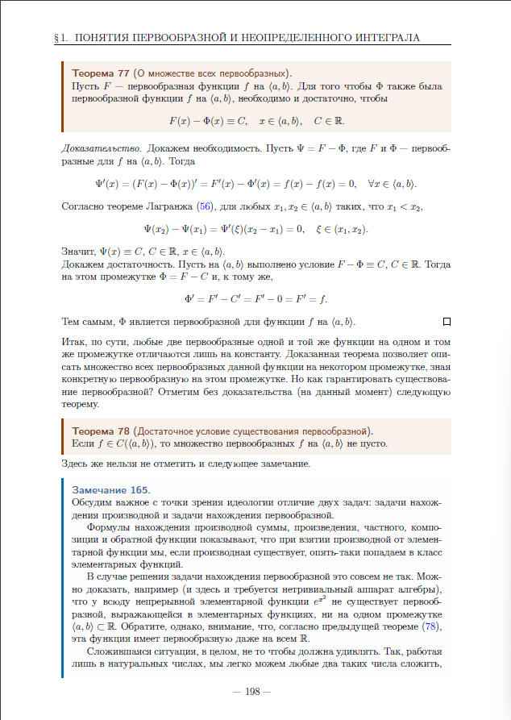

# Неопределенный интеграл  

## § 1. Понятия первообразной и неопределенного интеграла  
## §1. 原函数和不定积分的概念  

  

  

  

  

### ①原函数的概念

在学习数学的过程中，我们经常研究“直接”和“逆”运算。例如，学会了加法之后，我们接着学习减法。学会了乘法之后，我们学习除法。学会了求幂之后，我们学习开方，等等。现在，是时候引入与求导运算相反的运算了——求原函数的运算，或者，虽然不是完全相同，但在意义上非常接近的运算，即求不定积分的运算。我们从一些定义开始。  

**定义 83（原函数的概念）**  
函数 \( f \) 在区间 \(\langle a, b \rangle\) 上的原函数是指函数 \( F \)，使得  

\[F'(x) = f(x), \quad x \in \langle a, b \rangle.\]  

因此，函数 \( f \) 在某个区间上的原函数是指在该区间上其导数等于 \( f \) 的函数。我们来看一些例子。

**示例 59.**

函数 \( F_1(x) = \frac{x^3}{3} \) 是函数 \( f(x) = x^2 \) 在 \( x \in (-\infty, +\infty) \) 上的原函数，因为

\[\left( \frac{x^3}{3} \right)' = x^2, \quad x \in (-\infty, +\infty).\]

显然，所展示的原函数并不是唯一的。例如，函数 \( F_2(x) = \frac{x^3}{3} + 5 \) 或 \( F_3(x) = \frac{x^3}{3} - r^2 \) 也是 \( f \) 在 \( x \in (-\infty, +\infty) \) 上的原函数。

原函数在某个区间上被考虑是非常重要的。我们在下一个例子中强调这一点。  

**示例 60.**

函数 \( F(x) = \ln|x| \) 是函数 \(\frac{1}{x}\) 在 \( x > 0 \) 和 \( x < 0 \) 时的原函数。我们可以提出以下断言：属于以下家族的每个函数

\[\ln|x| + 
\begin{cases} 
c_1, & x < 0, \\
c_2, & x > 0
\end{cases}, \quad c_1, c_2 \in \mathbb{R},\]

分别在区间 \( x < 0 \) 和 \( x > 0 \) 上是函数 \(\frac{1}{x}\) 的原函数。但显然，它们并不是在它们的并集上的原函数。

正如我们所看到的，如果一个函数的原函数存在，通常情况下它并不是唯一的。描述给定函数的所有原函数的问题可以通过以下定理来解决。  

**定理77（关于所有原函数的集合）.**  
设 \( F \) 是函数 \( f \) 在区间 \(\langle a, b \rangle\) 上的一个原函数。若函数 \(\Phi\) 也是 \( f \) 在 \(\langle a, b \rangle\) 上的原函数，则其必要且充分条件是：  

\[F(x) - \Phi(x) \equiv C, \quad x \in \langle a, b \rangle, \quad C \in \mathbb{R}.\]  

**证明** 
我们来证明必要性。设\(\Psi = F - \Phi\)，其中\(F\)和\(\Phi\)是函数\(f\)在区间\(\langle a, b \rangle\)上的原函数。则  

\[
\Psi'(x) = (F(x) - \Phi(x))' = F'(x) - \Phi'(x) = f(x) - f(x) = 0, \quad \forall x \in \langle a, b \rangle.
\]  

根据拉格朗日中值定理（定理56），对于任意满足\(x_1 < x_2\)的\(x_1, x_2 \in \langle a, b \rangle\)，存在\(\xi \in (x_1, x_2)\)，使得  

\[
\Psi(x_2) - \Psi(x_1) = \Psi'(\xi)(x_2 - x_1) = 0.
\]  

因此，\(\Psi(x) \equiv C\)，其中\(C \in \mathbb{R}\)，且\(x \in \langle a, b \rangle\)。  

接下来证明充分性。假设在区间\(\langle a, b \rangle\)上满足条件\(F - \Phi \equiv C\)，其中\(C \in \mathbb{R}\)。则在该区间上，\(\Phi = F - C\)，且  

\[
\Phi'(x) = F'(x) - C' = F'(x) - 0 = F'(x) = f(x).
\]  

由此可见，\(\Phi\)是函数\(f\)在区间\(\langle a, b \rangle\)上的一个原函数。  

因此，实质上，同一函数在同一区间上的任何两个原函数仅相差一个常数。已证明的定理使我们能够通过已知某一具体原函数来描述该函数在该区间上的所有原函数集合。但如何保证原函数的存在性呢？我们（暂时）不加证明地陈述以下定理。  

**定理78（原函数存在的充分条件）**   
若 \( f \in C((a, b)) \)，则 \( f \) 在区间 \((a, b)\) 上的原函数集合非空。    

此外，必须指出以下说明。  

**注释165**  
我们从方法论的角度讨论求导与求原函数这两类问题的重要区别。  

关于求和、积、商、复合函数及反函数导数的公式表明，当对初等函数求导时（若导数存在），结果仍属于初等函数类。  

然而，在求原函数的问题中，情况完全不同。例如可以证明（此处需要非平凡的代数工具），对于处处连续的初等函数 \( e^{x^2} \)，在任何区间 \(\langle a, b \rangle \subseteq \mathbb{R}\) 上，都不存在能用初等函数表达的原函数。但需注意，根据前述定理（定理78），该函数甚至在全体实数范围 \(\mathbb{R}\) 上也存在原函数。  

总体而言，这种情形并不应令人惊讶。例如，若仅局限于自然数范围内，我们可以轻松地对任意两个自然数进行加法运算，  

但为了引入减法运算，我们不得不将自然数集扩展为整数集。在整数集中，我们“巧妙”地定义了乘法运算。然而，若要引入除法运算，则需进一步过渡到所谓的有理数集，以此类推。不过，上述讨论并未回答“任意函数在其定义域的任意区间上是否一定存在原函数”这一问题。对于好奇的读者，我们将举一个反例来否定这一命题。  

**示例61**  
考虑函数  

\[
\text{sign } x = 
\begin{cases} 
-1, & x < 0, \\ 
0, & x = 0, \\ 
1, & x > 0.
\end{cases}
\]  

该函数在区间 \([0, 1]\) 上不存在原函数。具体证明如下：  
假设存在原函数 \(F\) 在 \([0, 1]\) 上满足 \(F'(x) = \text{sign } x\)。根据拉格朗日中值定理（定理56），对于 \(\Delta x \in (0, 1)\)，存在 \(\xi \in (0, \Delta x)\)，使得  

\[
F(\Delta x) - F(0) = F'(\xi) \Delta x = \text{sign}(\xi) \Delta x = \Delta x.
\]  

当 \(\Delta x \to 0^+\) 时，左边导数的定义为：  

\[
F'_+(0) = \lim_{\Delta x \to 0^+} \frac{F(\Delta x) - F(0)}{\Delta x} = \lim_{\Delta x \to 0^+} \frac{\Delta x}{\Delta x} = 1.
\]  

然而，根据原函数的定义，\(F'(0)\) 应等于 \(\text{sign}(0) = 0\)。这导致矛盾：\(F'_+(0)\) 既需为 \(1\)（由拉格朗日定理推导），又需为 \(0\)（由原函数定义）。因此，原函数 \(F\) 不存在于 \([0, 1]\) 上。  

类似地，可以证明：**任何包含 \(0\) 的区间上，\(\text{sign } x\) 均不存在原函数**。原因在于，\(0\) 处的导数矛盾始终无法调和——原函数在该点的导数需满足两种互斥条件（\(1\) 和 \(0\)），从而排除了原函数的存在性。  

**结论**：若函数在某点处导数存在矛盾（如不连续或跳跃），则其原函数在包含该点的区间上可能不存在。此例揭示了原函数存在性对函数连续性的依赖。  

### ②不定积分的概念

现在我们将引入一个自然延伸的概念——不定积分。

**定义 84**（不定积分的概念）  
函数 \( f \) 在区间 \(\langle a, b \rangle\) 上的**不定积分**，是指该区间上 \( f \) 的所有原函数的集合。  

不定积分的符号表示如下：  

\[\int f \, dx,\]  

其中：  
- \(\int\) 为不定积分符号，  
- \( f \) 为被积函数，  
- \( f \, dx \) 为被积表达式，  
- \( x \) 为积分变量。  

根据已建立的理论框架，我们可以直接得出以下显而易见的结论。  

**注释166**  
若 \( F \) 是函数 \( f \) 在区间 \(\langle a, b \rangle\) 上的任意一个原函数，则 \( f \) 在该区间上的**不定积分**为：  

\[
\int f \, dx = F + C, \quad C \in \mathbb{R}.
\]  

为简洁起见，通常省略关于区间 \(\langle a, b \rangle\) 的具体说明。例如，对于积分  

\[
\int \frac{dx}{x} = \ln |x| + 
\begin{cases} 
c_1, & x < 0, \\ 
c_2, & x > 0,
\end{cases} \quad c_1, c_2 \in \mathbb{R},
\]  

通常简写为：  

\[
\int \frac{dx}{x} = \ln |x| + C,
\]  

此处隐含 \( C \) 是一个**分段常数函数**（即在 \( x < 0 \) 和 \( x > 0 \) 的区间上分别为不同的常数）。  

尽管稍显超前，我们仍需强调一个对实际应用极为重要的观点。  

**注释 167.**  
若将积分符号中的 \( dx \) 解释为微分，则后续章节中讨论的分部积分公式和变量替换公式会变得更加直观，且其记忆方式也更接近“机械式”操作。  

## § 3. 不定积分的性质  
在本节中，我们将讨论不定积分的基本性质。所有这些性质本质上是纯代数的，并且源于导数的相应性质。  

### ①积分与导数的关系  

既然我们已经说明求原函数与求导数在某种意义上是互为逆运算，那么我们将约定连接不定积分与导数的操作关系。我们约定以下关系式在相应不定积分定义的集合上成立：  

\[
\left( \int f \, dx \right)' = f, \quad d \left( \int f \, dx \right) = f \, dx.
\]  

**注释 170.**  
需要特别注意的是，在上述每个（左侧的）关系式中，相应的操作都是作用于集合  

\[I = \int f \, dx.\]  

实质上，这些关系式本身正是对这种操作的定义，因为此前我们从未对集合进行过求导或微分运算。这种定义的合理性在于：集合 \( I \) 中的任意元素在对应操作的作用下，都会唯一地映射到另一个确定的元素。

当然，这些关系式需要进一步解释说明。  

我们进一步约定如下。
若 \( F'(x) = f(x) \) 在 \( x \in \langle a, b \rangle \) 时成立，则通过将 \( dx \) 形式化地解释为微分，我们可认为：  

\[
\int dF = F + C.
\]

**注释171**  
这一关系的动机是明确的：如果 \( dx \) 是微分，则根据假设 \( dF = f(x)dx \)，那么根据不定积分的定义，  

\[
\int f(x) \, dx = F(x) + C.
\]  

在学习了不定积分中的变量替换公式后，这一约定的合理性将变得清晰。  

### ②不定积分的线性性  
由于导数本身具有线性性质，因此这一性质同样适用于不定积分。  

**定理80**（不定积分的线性性）。  
设函数 \(f\) 和 \(g\) 在区间 \(\langle a, b \rangle\) 上存在原函数。则：  

1. 在区间 \(\langle a, b \rangle\) 上存在函数 \(f + g\) 的原函数，且  
   \[
   \int (f + g) \, dx = \int f \, dx + \int g \, dx.
   \]

2. 在区间 \(\langle a, b \rangle\) 上存在函数 \(\alpha f\)（\(\alpha \in \mathbb{R}\)）的原函数，且当 \(\alpha \neq 0\) 时，  
   \[
   \int \alpha f \, dx = \alpha \int f \, dx.
   \]

3. 在区间 \(\langle a, b \rangle\) 上存在函数 \(\alpha f + \beta g\)（\(\alpha, \beta \in \mathbb{R}\)）的原函数，且当  
   \[
   \alpha^2 + \beta^2 \neq 0
   \]  
   时，  
   \[
   \int (\alpha f + \beta g) \, dx = \alpha \int f \, dx + \beta \int g \, dx.
   \]

最后一个性质常被称为不定积分的**线性性质**（尽管这一称呼不完全严谨）。在转向证明上述定理之前，最好先理解定理中所述内容。  

**注释 172.**  
我们需要明确如何理解以下等式：  

\[
\int (f + g) \, dx = \int f \, dx + \int g \, dx.
\]  

具体而言，右边的集合相加意味着什么？我们将其理解为对应集合中所有元素之和的集合，即：  

\[
\int f \, dx + \int g \, dx = \{F + C_1 + G + C_2 \mid C_1, C_2 \in \mathbb{R}\},
\]  

其中 \( F \) 是 \( f \) 的原函数，\( G \) 是 \( g \) 的原函数。当然，我们假设在某个区间 \(\langle a, b \rangle\) 上定义了相应的不定积分（即原函数）。  

类似地，在相同假设下，等式  

\[
\int \alpha f \, dx = \alpha \int f \, dx
\]  

的右边应理解为：集合中的每个元素乘以标量 \(\alpha\)，即：  

\[
\alpha \int f \, dx = \{\alpha F + \alpha C_1 \mid C_1 \in \mathbb{R}\}.
\]  

这里的关键在于，**线性性质允许我们将积分运算分解为对函数分量和标量的独立操作**，并通过原函数的线性组合体现这一特性。

**定理80的证明**  

**证明：**  
1. **证明第一部分**  
   根据导数和的性质，\( F + G \) 是 \( f + g \) 的原函数。因此，只需验证以下集合相等性：  

   \[
   \{F + G + C \mid C \in \mathbb{R}\} = \{F + C_1 \mid C_1 \in \mathbb{R}\} + \{G + C_2 \mid C_2 \in \mathbb{R}\}.
   \]  

   - **包含性（左⊂右）：**  
     若 \( H \in \{F + G + C \mid C \in \mathbb{R}\} \)，则  
     \[
     H = F + G + C = (F + 0) + (G + C),
     \]  
     因此 \( H \in \{F + C_1 \mid C_1 \in \mathbb{R}\} + \{G + C_2 \mid C_2 \in \mathbb{R}\} \)（取 \( C_1 = 0, C_2 = C \)）。  

   - **包含性（右⊂左）：**  
     若 \( H \in \{F + C_1 \mid C_1 \in \mathbb{R}\} + \{G + C_2 \mid C_2 \in \mathbb{R}\} \)，即  
     \[
     H = F + C_1 + G + C_2 = F + G + (C_1 + C_2),
     \]  
     则 \( H \in \{F + G + C \mid C \in \mathbb{R}\} \)（取 \( C = C_1 + C_2 \)）。  
     综上，集合相等性得证。  

2. **证明第二部分**  
   根据导数的标量乘法性质，\( \alpha F \) 是 \( \alpha f \) 的原函数。需证明当 \( \alpha \neq 0 \) 时：  
   \[
   \{\alpha F + C \mid C \in \mathbb{R}\} = \{\alpha F + \alpha C_1 \mid C_1 \in \mathbb{R}\}.
   \]  

   - **包含性（左⊂右）：**  
     若 \( H \in \{\alpha F + C \mid C \in \mathbb{R}\} \)，则  
     \[
     H = \alpha F + C = \alpha F + \alpha \cdot \frac{C}{\alpha},
     \]  
     因此 \( H \in \{\alpha F + \alpha C_1 \mid C_1 \in \mathbb{R}\} \)（取 \( C_1 = \frac{C}{\alpha} \)）。  

   - **包含性（右⊂左）：**  
     类似可证（留作练习）。  

3. **证明第三部分**  
   第三点的结论直接由第一点和第二点的结果组合得出。□  

**应用示例与推论**  
在进一步举例说明该定理的应用前，我们提出一个实践中重要的推论。  

**推论23**  
设函数 \(f\) 和 \(g\) 在区间 \(\langle a, b \rangle\) 上存在原函数，且 \(F\) 是 \(f\) 在该区间上的原函数。则：  

\[
\int f \, dx + \int g \, dx = F + \int g \, dx.
\]  

该推论本质上表明：**在计算不定积分时，任意常数只需在计算最后一个积分时添加**。现在我们可以举一些例子来说明这一点，例如以下示例。  

**示例62**  
计算积分  

\[\int \frac{x^2 + \sqrt[3]{x^2} + 5}{x} \, dx.\]  

根据线性性质，  

\[\int \frac{x^2 + \sqrt[3]{x^2} + 5}{x} \, dx = \int x \, dx + \int x^{-1/3} \, dx + 5 \int \frac{dx}{x} =\]  

\[= \frac{x^2}{2} + \frac{3}{2}x^{2/3} + 5 \ln |x| + C.\]  

---

**示例63**  
计算积分  

\[\int \frac{dx}{\sin^2 x \cos^2 x}.\]  

由于 \( 1 = \sin^2 x + \cos^2 x \)，则  

\[\int \frac{dx}{\sin^2 x \cos^2 x} = \int \frac{\sin^2 x + \cos^2 x}{\sin^2 x \cos^2 x} \, dx = \int \frac{dx}{\cos^2 x} + \int \frac{dx}{\sin^2 x} =\]  

\[= \tan x - \cot x + C.\]  

### ③变量替换公式（换元积分法）  
本节我们将学习计算不定积分时使用的一种重要方法——**变量替换公式**。本质上，这是复合函数导数公式的反向应用。接下来直接陈述相应的定理。

**定理 81**（变量替换公式）  
设函数 \( f \) 在区间 \(\langle a, b \rangle\) 上存在原函数，函数 \(\varphi: \langle \alpha, \beta \rangle \to \langle a, b \rangle\) 在 \(\langle \alpha, \beta \rangle\) 上可微，则  

\[
\int f \, dx = \int f(\varphi) \varphi' \, dt.
\]

**证明**  
设 \( F \) 是 \( f \) 在 \(\langle a, b \rangle\) 上的原函数。根据复合函数求导定理（定理 50），\( F(\varphi) \) 是函数 \( f(\varphi) \varphi' \) 在 \(\langle \alpha, \beta \rangle\) 上的原函数。因此可得：  

\[
\int f \, dx = F + C = F(\varphi) + C = \int f(\varphi) \varphi' \, dt.
\]

**说明**  
此公式表明，通过变量替换 \( x = \varphi(t) \) 和微分关系 \( dx = \varphi'(t) dt \)，原积分可转换为关于新变量 \( t \) 的积分。这一方法简化了复杂积分的计算过程，是换元积分法的核心工具。  

**注释173**  
现在再次需要指出，不定积分中的 \( dx \) 可以方便地解释为微分。如果接受这一点，那么变量替换公式就变得非常“机械化”：若 \( x = \varphi(t) \)，则 \( f(x) = f(\varphi(t)) \)，且 \( dx = d\varphi(t) = \varphi'(t) \, dt \)。  

下面直接举几个例子。  

**示例64**  
计算积分  
\[
\int xe^{x^2} \, dx.
\]  

**解法**：  
设 \(x^2 = t\)，则 \(d(x^2) = dt\)，即 \(2x dx = dt\)，因此  
\[
\int xe^{x^2} \, dx = \frac{1}{2} \int e^t \, dt = \frac{1}{2} e^t + C = \frac{1}{2} e^{x^2} + C.
\]  
此积分也可通过其他方式求解。  

**示例65**  
计算积分  
\[
\int xe^{x^2} \, dx.
\]  

**解法**：  
将 \(dx\) 视为微分，原积分可改写为  
\[
\int xe^{x^2} \, dx = \int e^{x^2} \, d\left(\frac{x^2}{2}\right) = \frac{1}{2} \int e^{x^2} \, dx^2 = \frac{1}{2} e^{x^2} + C.
\]  
此方法通常称为**凑微分法**。  
 
上述过程本质上是应用了变量替换公式，但通过调整表达形式使步骤更简洁。这一技巧在积分计算中尤为实用。

### ④ 分部积分公式  
此前我们已学习积分的一些性质，这些性质源于导数的和与复合函数的导数法则。现在我们将讨论一种公式，其在某种意义上源自**乘积的导数公式**（即乘积法则）。我们以普遍接受的形式来表述它，使用符号 \( u \) 和 \( v \) 表示函数（而非 \( f \) 和 \( g \)）。  

**定理82**（分部积分公式）。  
设 \( u \) 和 \( v \) 在区间 \(\langle a, b \rangle\) 上可微，并且在区间 \(\langle a, b \rangle\) 上存在 \( vu' \) 的原函数。则  

\[
\int uv' \, dx = uv - \int vu' \, dx
\]  

或  

\[
\int u \, dv = uv - \int v \, du.
\]  

**定理82**（分部积分公式）。  
设 \( u \) 和 \( v \) 在区间 \(\langle a, b \rangle\) 上可微，并且在区间 \(\langle a, b \rangle\) 上存在 \( vu' \) 的原函数。则  

\[
\int uv' \, dx = uv - \int vu' \, dx
\]  

或  

\[
\int u \, dv = uv - \int v \, du.
\]  

**证明**：根据乘积的导数公式，  

\[
(uv)' = u'v + uv',
\]  

由此可得  

\[
uv' = (uv)' - u'v.
\]  

对等式两边积分并利用推论（23），可推导出分部积分公式：  

\[
\int uv' \, dx = uv - \int vu' \, dx.
\]  

分部积分公式常用于积分所谓的**超越函数**（即不同性质的函数，如多项式与指数函数、三角函数等）的乘积。只有通过示例才能更好地说明（或展示）这一点。  

**示例66**  
计算积分  

\[
\int x \sin x \, dx.
\]  

设 \( u = x \)，则 \( du = dx \)，\( dv = \sin x \, dx \)，且 \( v = - \cos x \)。因此，  

\[
\int x \sin x \, dx = 
\begin{vmatrix}
u = x \\
du = dx \\
dv = \sin x \, dx \\
v = - \cos x
\end{vmatrix} = -x \cos x + \int \cos x \, dx = -x \cos x + \sin x + C.
\]  

再举一例。  

**示例67**  
计算积分  

\[
\int e^x \sin x \, dx.
\]  

**第一次分部积分**：  
\[
\int e^x \sin x \, dx = 
\begin{vmatrix}
u & = e^x \\
du & = e^x \, dx \\
dv & = \sin x \, dx \\
v & = -\cos x
\end{vmatrix} 
= -e^x \cos x + \int e^x \cos x \, dx.
\]  

**第二次分部积分**：  
\[
\int e^x \cos x \, dx = 
\begin{vmatrix}
u & = e^x \\
du & = e^x \, dx \\
dv & = \cos x \, dx \\
v & = \sin x
\end{vmatrix} 
= e^x \sin x - \int e^x \sin x \, dx.
\]  

**联立方程**：  
\[
\int e^x \sin x \, dx = -e^x \cos x + e^x \sin x - \int e^x \sin x \, dx,
\]  
解得：  
\[
\int e^x \sin x \, dx = \frac{-e^x \cos x + e^x \sin x}{2} + C.
\]  

上述我们讨论的这类积分通常被称为自引用的。当然，我们仅涉及了部分积分类型（或者说部分积分技巧）。在实践中仍有无穷无尽的不同技巧需要进一步掌握。以下是我们需要特别指出的说明。

**注释174**  
在分析上述示例后，有必要回答以下问题：  

1. **为何在两个例子中求 \( v \) 时，任意常数均取 \( C = 0 \)**？是否总是可以这样做？  
2. **最后一个示例中的任意常数 \( C \) 从何而来**？因为在求解积分方程时，并未显式引入常数。  

若成功回答了这些问题，请尝试解释以下“证明 \( 0 = 1 \)”的“悖论”（设 \( x > 0 \)）：  

\[
\int \frac{dx}{x \ln x} = 
\begin{vmatrix}
u & -1 / \ln x \\
du & -1 / (x \ln^2 x) dx \\
dv & -1 / x dx \\
v & -\ln x
\end{vmatrix}
= 1 + \int \frac{dx}{x \ln x}.
\]  

通过“消去积分”，得出 \( 0 = 1 \)。  

## §4. 有理分式的积分  
本章我们将学习积分一个重要函数类——**有理分式**。  

### ① 多项式理论的一些知识  
在实践中，积分所谓的**有理分式**往往是必要的。主要原因在于，许多积分变量替换会将原函数转换为有理分式。如果我们能够以"闭合形式"（即用初等函数表达）找到有理分式的原函数，那么许多其他函数的原函数也可以用初等函数表示。  

和往常一样，我们首先约定符号.  

**定义85**（多项式的概念）  
称次数为 \( n \geq 1 \) 的**多项式**（多项式 \( P_n(x) \)）为以下形式的函数：  

\[
P_n(x) = a_0 + a_1x + a_2x^2 + \dots + a_nx^n, \quad a_i \in \mathbb{R}, \quad a_n \neq 0, \quad i \in \{1, 2, \ldots, n\}.
\]  

零次多项式定义为任意非零常数。恒等于零的多项式次数用符号 \( -\infty \) 表示。  

接下来引入**有理函数**（即**有理分式**）的定义。  

**定义86**（有理分式的概念）  
**有理分式**是形如  

\[
\frac{P_n(x)}{Q_m(x)}
\]  

的函数，其中 \( P_n(x) \) 和 \( Q_m(x) \) 分别为次数 \( n \) 和 \( m \) 的多项式。  

类比有理数理论中的定义，引入以下概念。  

**定义87**（真分式的概念）  
有理分式  

\[
\frac{P_n(x)}{Q_m(x)}
\]  

称为**真分式**，若 \( n < m \)；否则称为**假分式**。  

当然，如果分式是假分式，可以通过分离整式部分，将其转化为真分式。例如，以下引理成立（我们不加证明，建议读者参考代数课程或自行用长除法证明）.  

**引理 66**（关于多项式带余除法）  
设  
\[
\frac{P_n(x)}{Q_m(x)}
\]  

为假分式。则存在唯一的分解形式：  
\[
\frac{P_n(x)}{Q_m(x)} = R_{n-m}(x) + \frac{T_k(x)}{Q_m(x)},
\]  
其中：  
- \( R_{n-m}(x) \) 是次数为 \( n - m \) 的多项式，  
- \( T_k(x) \) 是次数为 \( k \) 的多项式，且 \( k < m \)。  

在多项式理论中，可证明以下定理。  

**定理83**（关于实数域上多项式的分解）。  
设 \(P_n(x)\) 是最高次项系数为1的n次多项式。则存在如下分解：  

\[
P_n(x) = (x - a_1)^{k_1} \cdot (x - a_2)^{k_2} \cdot \ldots \cdot (x - a_p)^{k_p} 
\]  
\[
\cdot (x^2 + p_1 x + q_1)^{l_1} \cdot (x^2 + p_2 x + q_2)^{l_2} \cdot \ldots \cdot (x^2 + p_m x + q_m)^{l_m},
\]  

其中对于 \(i \in \{1, 2, ..., p\}, \, j \in \{1, 2, ..., m\}\)，满足：  

\[
a_i \in \mathbb{R}, \quad k_i \in \mathbb{N}, \quad l_j \in \mathbb{N}, \quad p_j^2 - 4q_j < 0, \quad k_1 + k_2 + \ldots + k_p + 2(l_1 + \ldots + l_m) = n.
\]  

显然，\(a_1, ..., a_p\) 是多项式 \(P_n(x)\) 的实根，其重数分别为 \(k_1, ..., k_p\)；而二次三项式 \(x^2 + p_j x + q_j \, (j \in \{1, 2, ..., m\})\) 没有实数根。最后这一点需单独强调。  

**注释 175**  
条件 \( p_j^2 - 4q_j < 0 \, (j \in \{1, 2, \ldots, m\}) \) 表明二次三项式 \( x^2 + p_j x + q_j \) **没有实根**。  

需要特别指出的是，在这种情况下，每个二次三项式均有一对**共轭复根**，形式为 \( \alpha_j \pm i\beta_j \)。  

至此，我们已准备好应用上述理论工具来解决本节最初提出的问题。  

### ②分式分解为最简分式  
本节我们将讨论将任意有理分式分解为所谓的最简分式之和的方法。首先从定义这些最简分式开始。  

**定义88**（最简分式的概念）。  
最简分式（第一类和第二类分式）是指形如  

\[
\frac{A}{(x - a)^k}, \quad \frac{Ax + B}{(x^2 + px + q)^k},
\]  

的分式，其中 \( k \in \mathbb{N} \) 且 \( p^2 - 4q < 0 \)。  

事实上，任何真有理分式都可以分解为最简分式之和。在介绍这一定理之前，我们先给出两个引理。  

**引理 67（关于第一类分数）** 
设  

\[P_n(x) = \frac{Q_m(x)}{Q(n)} \]  

为真有理分数，且  

\[Q_m(x) = (x - a)^k \cdot \tilde{Q}(x), \quad \text{其中} \quad \tilde{Q}(a) \neq 0, \quad \tilde{Q} - \text{多项式。}\]

存在实数 \( A \in \mathbb{R} \) 和多项式 \( \tilde{P}(x) \)，使得  

\[\frac{P_n(x)}{Q_m(x)} = \frac{A}{(x - a)^k} + \frac{\tilde{P}(x)}{(x - a)^{k-1} \cdot \tilde{Q}(x)},\]  

且该表示是唯一的。  

**证明**。我们证明所提出的分解的存在性。为此，考虑差值

\[
\frac{P_n(x)}{Q_m(x)} - \frac{A}{(x - a)^k} = \frac{P_n(x) - A \cdot \tilde{Q}(x)}{(x - a)^k \cdot \tilde{Q}(x)}
\]

并选择数 \( A \)，使得 \( a \) 是分子的根，即满足等式

\[
P_n(a) - A \cdot \tilde{Q}(a) = 0.
\]

显然，

\[
A = \frac{P_n(a)}{\tilde{Q}(a)},
\]

且由于条件 \(\tilde{Q}(a) \neq 0\)，除法是可行的。对于找到的 \( A \)，分子是一个具有根 \( a \) 的多项式，因此根据定理 83，它可以表示为

\[
P_n(x) - A \cdot \tilde{Q}(x) = (x - a) \cdot \tilde{P}(x),
\]

于是

\[
\frac{P_n(x) - A \cdot \tilde{Q}(x)}{(x - a)^k \cdot \tilde{Q}(x)} = \frac{(x - a) \cdot \tilde{P}(x)}{(x - a)^k \cdot \tilde{Q}(x)} = \frac{\tilde{P}(x)}{(x - a)^{k-1} \cdot \tilde{Q}(x)}.
\]

这样，分解的存在性得证。

我们证明这种分解的唯一性。假设存在两种分解

\[
\frac{P_n(x)}{Q_m(x)} = \frac{A_1}{(x - a)^k} + \frac{\tilde{P}_1(x)}{(x - a)^{k-1} \cdot \tilde{Q}(x)} = \frac{A_2}{(x - a)^k} + \frac{\tilde{P}_2(x)}{(x - a)^{k-1} \cdot \tilde{Q}(x)}.
\]

将两边乘以 \((x - a)^k \cdot \tilde{Q}(x)\)，得到

\[
A_1 \cdot \tilde{Q}(x) + \tilde{P}_1(x) \cdot (x - a) = A_2 \cdot \tilde{Q}(x) + \tilde{P}_2(x) \cdot (x - a),
\]

对于所有 \( x \in \mathbb{R} \) 成立。令 \( x = a \)，则等式变为

\[
A_1 \cdot \tilde{Q}(a) = A_2 \cdot \tilde{Q}(a),
\]

由于 \(\tilde{Q}(a) \neq 0\)，所以 \( A_1 = A_2 \)。但这样，多项式 \(\tilde{P} = P_n(x) - A \cdot \tilde{Q}(x)\) 的系数也是唯一确定的（引理 66）。矛盾。

总的来说，可能不难表述第二个引理。  

**引理 68（关于第二类分数）**  
设  

\[
\frac{P_n(x)}{Q_m(x)}
\]

为真有理分数，且  

\[
Q_m(x) = (x^2 + px + q)^k \cdot \tilde{Q}(x), \quad \text{其中} \quad \tilde{Q}(\alpha \pm i\beta) \neq 0, \quad \tilde{Q} - \text{多项式},
\]

\( p^2 - 4q < 0 \)，且 \(\alpha \pm i\beta\) 是二次三项式 \( x^2 + px + q \) 的共轭复根。存在实数 \( A, B \in \mathbb{R} \) 和多项式 \(\tilde{P}(x)\)，使得  

\[
\frac{P_n(x)}{Q_m(x)} = \frac{Ax + B}{(x^2 + px + q)^k} + \frac{\tilde{P}(x)}{(x^2 + px + q)^{k-1} \cdot \tilde{Q}(x)},
\]

且该表示是唯一的。  

**定理 84（关于分数分解为最简形式）。**  
设

\[
\frac{P_n(x)}{Q_m(x)}
\]

为有理分数，且

\[
Q_m(x) = (x - a_1)^{k_1} \cdot \ldots \cdot (x - a_p)^{k_p} \cdot (x^2 + p_1 x + q_1)^{l_1} \cdot \ldots \cdot (x^2 + p_m x + q_m)^{l_m},
\]

其中对于 \(i \in \{1, 2, ..., p\}\)，\(j \in \{1, 2, ..., m\}\)，

\[
a_i \in \mathbb{R}, \quad k_i \in \mathbb{N}, \quad l_j \in \mathbb{N}, \quad p_j^2 - 4q_j < 0.
\]

则存在唯一的分解形式

\[
\frac{P_n(x)}{Q_m(x)} = R_{n-m}(x) + \sum_{i=1}^p \sum_{j=1}^{k_i} \frac{A_{ij}}{(x-a_i)^{k_i-j+1}} + \sum_{i=1}^m \sum_{j=1}^{l_i} \frac{B_{ij}x + C_{ij}}{(x^2 + p_i x + q_i)^{l_i-j+1}},
\]

其中右边分数的分子中的所有系数都是实数。  

**证明**。假设 \(n > m\)，根据带余除法定理（引理 66），可以将其表示为

\[
\frac{P_n(x)}{Q_m(x)} = R_{n-m}(x) + \frac{T_k(x)}{Q_m(x)}, \quad k < m.
\]

因此，只需考虑原始有理分数为真分数且不可约的情况。

根据第一类分数引理（引理 67），所考虑的分数可以表示为

\[
\frac{P_n(x)}{Q_m(x)} = \frac{A_{11}}{(x - a_1)^{k_1}} + \frac{\tilde{P}^{(11)}(x)}{(x - a_1)^{k_1 - 1} \cdot \tilde{Q}^{(1)}(x)},
\]

其中

\[
\tilde{Q}^{(1)}(x) = (x - a_2)^{k_2} \cdot \ldots \cdot (x - a_p)^{k_p} \cdot (x^2 + p_1 x + q_1)^{l_1} \cdot \ldots \cdot (x^2 + p_m x + q_m)^{l_m}.
\]

进一步，根据同一引理，可以找到数 \(A_{12}\) 和多项式 \(\tilde{P}^{(12)}(x)\)，使得

\[
\frac{\tilde{P}^{(11)}(x)}{(x - a_1)^{k_1 - 1} \cdot \tilde{Q}^{(1)}(x)} = \frac{A_{12}}{(x - a_1)^{k_1 - 1}} + \frac{\tilde{P}^{(12)}(x)}{(x - a_1)^{k_1 - 2} \cdot \tilde{Q}^{(1)}(x)}.
\]

继续类似的推理，我们得到

\[
\frac{P_n(x)}{Q_m(x)} = \frac{A_{11}}{(x - a_1)^{k_1}} + \frac{A_{12}}{(x - a_1)^{k_1 - 1}} + \ldots + \frac{A_{1k_1}}{(x - a_1)} + \frac{\tilde{P}^{(1k_1)}(x)}{\tilde{Q}^{(1)}(x)}.
\]

类似地，对于所有实数根 \(a_i\) 的重数 \(k_i\)，\(i \in \{1, 2, ..., p\}\)，我们得到

\[
\frac{P_n(x)}{Q_m(x)} = \sum_{i=1}^p \sum_{j=1}^{k_i} \frac{A_{ij}}{(x - a_i)^{k_i - j + 1}} + \frac{\tilde{P}^{(pk_p)}(x)}{\tilde{Q}^{(p)}(x)},
\]

其中

\[
\tilde{Q}^{(p)}(x) = (x^2 + p_1 x + q_1)^{l_1} \cdot \ldots \cdot (x^2 + p_m x + q_m)^{l_m}
\]

且分数

\[
\frac{\tilde{P}^{(pk_p)}(x)}{\tilde{Q}^{(p)}(x)}
\]

为真分数。

接下来，利用第二类分数引理（引理 68），我们得到

\[
\frac{\tilde{P}^{(pk_p)}(x)}{\tilde{Q}^{(p)}(x)} = \frac{B_{11}x + C_{11}}{(x^2 + p_1 x + q_1)^{l_1}} + \frac{\tilde{P}^{(11)}(x)}{(x^2 + p_1 x + q_1)^{l_1 - 1} \cdot \tilde{Q}^{(1)}(x)},
\]

其中

\[
\tilde{Q}^{(1)}(x) = (x^2 + p_2 x + q_2)^{l_2} \cdot \ldots \cdot (x^2 + p_m x + q_m)^{l_m}.
\]

继续类似的推理，仅使用第二类分数引理，最终得到分解

\[
\frac{\tilde{P}^{(pk_p)}(x)}{\tilde{Q}^{(p)}(x)} = \sum_{i=1}^m \sum_{j=1}^{l_i} \frac{B_{ij}x + C_{ij}}{(x^2 + p_i x + q_i)^{l_i - j + 1}}.
\]

综上所述，定理得证。  

### ③最简分数的积分

在本节中，我们将展示计算最简有理分数积分的一般方法。由于在实践中，最终公式通常更容易每次重新推导，因此我们不会以封闭定理的形式表述结果，而是更倾向于讲述其中涉及的思想和思路。  

**第一类分数的积分**

首先考虑计算积分

\[
\int \frac{A}{(x - a)^k} \, dx, \quad k \geq 1.
\]

当 \( k = 1 \) 时，我们有

\[
\int \frac{A}{x - a} \, dx = A \int \frac{d(x - a)}{x - a} = A \ln |x - a| + C.
\]

当 \( k > 1 \) 时，我们有

\[
\int \frac{A}{(x - a)^k} \, dx = A \int \frac{d(x - a)}{(x - a)^k} = A \int (x - a)^{-k} \, d(x - a) = \frac{A}{(1 - k)(x - a)^{k-1}} + C.
\]  

**第二类分数的积分**

考虑计算积分

\[
\int \frac{Ax + B}{(x^2 + px + q)^k} \, dx, \quad p^2 - 4q < 0.
\]

首先在分母中完成平方，得到：

\[
x^2 + px + q = \left(x + \frac{p}{2}\right)^2 + \frac{4q - p^2}{4}.
\]

由于

\[
\frac{4q - p^2}{4} > 0,
\]

可以将其表示为 \( a^2 \)。此外，设 \( t = x + \frac{p}{2} \)，则 \( dt = dx \)，并且

\[
\frac{Ax + B}{(x^2 + px + q)^k} = \frac{A\left(t - \frac{p}{2}\right) + B}{(t^2 + a^2)^k} \, dt = \int \frac{At + \left(B - \frac{Ap}{2}\right)}{(t^2 + a^2)^k} \, dt.
\]

计算第一个积分：

\[
\int \frac{t \, dt}{(t^2 + a^2)^k} = \frac{A}{2} \int \frac{d(t^2 + a^2)}{(t^2 + a^2)^k} = \frac{A}{2} \ln(t^2 + a^2) + C, \quad k = 1,
\]

或者

\[
\frac{A}{2(1 - k)(t^2 + a^2)^{k-1}} + C, \quad k > 1.
\]

现在考虑第二个积分（忽略常数因子），记作 \( I_k \)：

\[
I_k = \int \frac{dt}{(t^2 + a^2)^k}.
\]

显然，

\[
I_1 = \int \frac{dt}{t^2 + a^2} = \frac{1}{a} \arctan \frac{t}{a} + C.
\]

如果 \( k > 1 \)，则

\[
I_k = \int \frac{dt}{(t^2 + a^2)^k} = \frac{1}{a^2} \int \frac{a^2}{(t^2 + a^2)^k} \, dt = \frac{1}{a^2} \int \frac{t^2 + a^2 - t^2}{(t^2 + a^2)^k} \, dt = \frac{1}{a^2} I_{k-1} - \frac{1}{a^2} \int \frac{t^2}{(t^2 + a^2)^k} \, dt.
\]

最后一个积分可以通过分部积分法计算：

\[
\int \frac{t^2}{(t^2 + a^2)^k} \, dt = \frac{1}{2(1 - k)(t^2 + a^2)^{k-1}} + \frac{t}{2(1 - k)(t^2 + a^2)^{k-1}}.
\]

因此，

\[
I_k = \frac{1}{a^2} \left(I_{k-1} \left(1 + \frac{1}{2(1 - k)}\right) - \frac{t}{2(1 - k)(t^2 + a^2)^{k-1}}\right).
\]

这样，得到了一个递推公式，将 \( I_k \) 表示为 \( I_{k-1} \) 的函数。由于 \( I_1 \) 已知，积分计算方案已完全阐述。  

**有理函数积分在初等函数中的表达式**

综上所述，根据前面几节的内容，我们得出以下重要推论。

**推论 24**。  
有理分数的积分可以用初等函数表示。  

# Интеграл Римана  

## § 1. Понятие интеграла Римана  
## § 1. 黎曼积分的概念  

在这一节中，我们将介绍黎曼定积分的概念，我们认为这是通过解决一个具体的应用问题——计算某函数图像下面积的问题——自然而然地得出的。  

**①Наводящие соображения**  

考虑计算函数 \( y = x^2 \) 在区间 \([0, 1]\) 下面积的问题。我们将使用我们对面积的“直观”理解，因为在学校或之前的学习中，并没有引入严格的定义。

我们将采取以下步骤。将区间 \([0, 1]\) 分成 \(n\) 个相等的部分，分割点为：

\[0 = \frac{0}{n}, \quad \frac{1}{n}, \quad \frac{2}{n}, \quad \ldots, \quad \frac{n-1}{n}, \quad \frac{n}{n} = 1\]

然后，我们将用我们能够计算的面积——矩形的面积——来近似函数图像在每个分割区间上的面积。虽然这个方法看似可行，但不可避免地会出现一个问题：如何选择这些矩形的高度？  

这似乎非常合乎逻辑：分割的每个区间的长度越小，函数在该区间上的变化就越小。因此，如果我们让 \( n \to \infty \)，从而将区间分割成无限多个长度任意小的子区间，那么选择每个区间上函数的值作为近似矩形的高度将变得无关紧要。这意味着我们可以选择对我们来说最方便的函数值。  

我们选择每个分割区间右端点处的函数值作为矩形的高度，即在这些点处取值：  

\[x_i = \frac{i}{n}, \quad i \in \{1, 2, \ldots, n\}.\]  

对应的函数值为：  

\[y(x_i) = \frac{i^2}{n^2}, \quad i \in \{1, 2, \ldots, n\}.\]  

因此，在分割区间  

\[\left[ \frac{i - 1}{n}, \frac{i}{n} \right], \quad i \in \{1, 2, \ldots, n\}\]  

上的面积，可用矩形面积近似表示为：  

\[\frac{y(x_i)}{n} = \frac{i^2}{n^3}, \quad i \in \{1, 2, \ldots, n\}.\]  

最终，函数图像下的总面积近似为阶梯图形的面积之和：  

\[\tilde{S}_n = \sum_{i=1}^n \frac{y(x_i)}{n} = \sum_{i=1}^n \frac{i^2}{n^3} = \frac{1}{n^3} \sum_{i=1}^n i^2 = \frac{n(n+1)(2n+1)}{6n^3}.\]  

当 \( n \) 趋向于无穷大时，我们的近似方法给出的值等于  

\[\lim_{n \to \infty} \widetilde{S}_n = \lim_{n \to \infty} \frac{n(n+1)(2n+1)}{6n^3} = \frac{1}{3}.\]  

**注 176.**  
我们需要注意以下几点：  
1. 首先，在上述建模过程中，我们使用了所谓的“均匀”分割（即将区间 \([0, 1]\) 分割成长度相等的子区间）。如果采用其他方式分割区间，结果是否会改变？  
2. 其次，在每个分割区间上，我们选择了特定的点，并将函数在这些点的值作为近似矩形的高度。如果按照其他规则选择点，结果会如何？同样，结果是否仍然相同？  

目前，我们无法简洁地回答这些问题，但直觉告诉我们，结果应该是相同的。如果不是这样，那么问题可能出在函数本身。“如果不是这样”是什么意思，以及“问题出在函数本身”是什么意思，正是本章理论将要阐述的内容。  

**②黎曼积分的定义**  

现在让我们严格地、逐步地引入黎曼积分的概念。我们将遵循与上述具体问题建模时完全相同的思路和顺序，只不过现在我们将以更抽象和更普遍的方式进行。那么，让我们从第一步开始——分割的概念。  

**定义 89（分割的概念）。**  
如果在区间 \([a, b]\) 上引入一组点 \(x_i\)，\(i \in \{0, 1, \ldots, n\}\)，使得  

\[a = x_0 < x_1 < x_2 < \ldots < x_n = b,\]  

则称在该区间上引入了分割（或细分）\(\tau\)。  

因此，分割是一组将我们的区间划分为更小区间的点，这些小区间两两之间没有共同的内部点。  

**注 177.**  
我们再次注意到，在本节开头构建示例时使用的“均匀”分割，仅仅是刚刚引入的分割概念的一个非常特殊的情况。  

我们注意到这个注释，后续将会用到它。  

**注 178.**  
通常，对于分割的区间及其长度，引入以下符号表示：  

\[
\Delta x_i = x_i - x_{i-1}, \quad \Delta_i = [x_{i-1}, \, x_i], \quad i \in \{1, 2, ..., n\}.
\]  

**Δ_i = [x_{i−1}, x_i] 的含义：**  
在黎曼积分的上下文中，符号 **Δ_i** 表示分割后的第 \(i\) 个子区间，具体定义为闭区间 \([x_{i-1}, x_i]\)，即从分割点 \(x_{i-1}\) 到 \(x_i\) 的区间段。例如：  
- 若将区间 \([0, 1]\) 分割为 \(n\) 个等分，则第 \(i\) 个子区间为：  
  \[
  \Delta_i = \left[ \frac{i-1}{n}, \frac{i}{n} \right].
  \]  

**Δ_i 与 Δx_i 的区别：**  
- **Δ_i** 表示区间本身（几何上的区间段）。  
- **Δx_i** 表示该区间的长度，即 \(\Delta x_i = x_i - x_{i-1}\)（数值上的长度）。  

从我们提供的例子以及常识来看，分割得到的区间长度越小，我们的“近似”似乎就越精确。为此，我们引入一个控制分割“大小”的量——分割的细度或秩。  

**定义 90（分割细度（秩）的概念）。**  
量  

\[
\lambda(\tau) = \max_{i \in \{1,2, \ldots, n\}} \Delta x_i
\]  

称为分割（细分）的细度（秩、直径）。  

因此，分割的秩在数值上等于分割后得到的最大区间的长度。现在，我们为分割“装备”一下，或者说，选择一些点，在这些点上计算矩形的高度，这些矩形的面积（当 \( f \geq 0 \) 时）近似于所研究函数图像下的“面积”。  

**定义 91（带标记分割的概念）。**  
若在区间 \([a, b]\) 上已定义分割 \(\tau\)，并选取一组点 \(\xi = \{\xi_1, \xi_2, ..., \xi_n\}\) 满足 \(\xi_i \in \Delta_i\)（\(i \in \{1, 2, ..., n\}\)），则称该区间上定义了一个**带标记的分割** \((\tau, \xi)\)。  

（注：术语 "оснащенное разбиение" 在数学分析中常译为 "带标记的分割" 或 "配备分割"，表示在分割基础上额外选取了每个子区间内的代表点，用于构造黎曼和。）  

通过引入**带标记的分割**的概念，并类比之前的示例，我们现在可以定义“近似面积”——即用阶梯图形的面积来逼近函数 \( f \geq 0 \) 图像下的面积，这种面积也被称为**积分和**。  

**定义 92（积分和的概念）。**  
设区间 \([a, b]\) 上给定函数 \(f\) 并引入了带标记的分割 \((\tau, \xi)\)。量  

\[
\sigma_{\tau}(f, \xi) = \sum_{i=1}^{n} f(\xi_i) \Delta x_i
\]  

称为函数 \(f\) 在区间 \([a, b]\) 上对应于分割 \((\tau, \xi)\) 的积分和。  

现在，我们准备给出黎曼积分的定义。  

**定义 93（黎曼积分的概念）。**  
设函数 \( f \) 定义在区间 \([a, b]\) 上。若存在一个数 \( I \)，满足以下条件：  

对于任意给定的 \(\varepsilon > 0\)，存在一个 \(\delta > 0\)，使得对于所有满足 \(\lambda(\tau) < \delta\) 的带标记分割 \((\tau, \xi)\)，均有  
\[
|\sigma_{\tau}(f, \xi) - I| < \varepsilon,
\]  
则称 \( I \) 为函数 \( f \) 在区间 \([a, b]\) 上的**黎曼积分**，记为：  
\[
I = \int_{a}^{b} f(x) \, dx.
\]  

**关键解读**   
1. **极限的严格性**：定义通过 \(\varepsilon\)-\(\delta\) 语言严格描述了积分和收敛到唯一值 \( I \) 的过程。  
2. **分割细度的控制**：\(\lambda(\tau)\)（分割的最大子区间长度）趋近于零时，所有可能的积分和必须一致趋近于 \( I \)。  
3. **积分符号的意义**：\(\int_{a}^{b} f(x) \, dx\) 不仅是符号表达，更代表函数在区间上的面积（当 \( f \geq 0 \) 时）或广义的累积量。  

此定义奠定了黎曼积分的理论基础，强调通过无限细分区间，使得近似和与真实积分值的误差任意小。  

我们注意到，在积分符号中，符号 \( dx \) 可以理解为微分，或在某种意义上视为“极限中的微分”。这一说明仅是为了解释引入该符号的动机，以及其在变量替换、分部积分、牛顿-莱布尼茨公式等操作中的实际便利性。关于这些内容，我们稍后将详细讨论。现在，请关注以下重要说明。  

**注179** 
黎曼积分常被称为积分和的极限。因此，更简单但需附带一些条件，可以将最后的定义改写为以下形式：  

\[I = \lim_{\lambda(\tau) \to 0} \sigma_\tau(f, \xi).\]  

对于上述注释需要以足够的谨慎来对待。在阐述它之后，人们希望立即将研究函数极限时仔细探讨过的所有性质转移到这一新概念上。然而，事情并非如此简单。  

**注180**  
一般而言，积分和的极限概念并非函数极限的特殊情况，因为积分和是分划及其配置（而非其细度）的函数。然而，这种类型的极限可以（且我们将在下一节中）归约为序列的极限。后续我们常会简写为 λ(τ) → 0，具体细节留待读者自行补充。  

此外，我们再补充几个便于后续使用的定义。  

**定义94（可积函数的概念）**  

若函数 \( f \) 在区间 \([a, b]\) 上存在黎曼积分，则称该函数在此区间上**黎曼可积**（或简称为**可积**）。  

区间 \([a, b]\) 上全体黎曼可积函数的集合记为：\( R[a, b] \)。  

下面举几个例子。  

**示例68**  
我们证明常数函数 \( f = C \) 在任意区间 \([a, b]\) 上都是可积的，且满足：  

\[
\int_{a}^{b} C \, dx = C(b - a).
\]  

事实上，对区间 \([a, b]\) 引入任意分划 \((\tau, \xi)\)，对应的积分和为：  

\[
\sigma_{\tau}(f, \xi) = \sum_{i=1}^{n} C \Delta x_i = C \sum_{i=1}^{n} \Delta x_i = C(b - a),
\]  

由此直接得出所需结果。  

需要注意的是，并非所有定义在区间 \([a, b]\) 上的函数都是可积的。  

**示例69**  
**证明Dirichlet函数的不可积性**  

我们证明Dirichlet函数  

\[
d(x) = 
\begin{cases} 
1, & x \in \mathbb{Q} \\
0, & x \in \mathbb{I}
\end{cases}
\]  

在任意区间上均不可积。为简化讨论，以区间 \([0, 1]\) 为例，设 \(\tau\) 为该区间的一个分划。  

**步骤1：选择有理数标记点**  
在每个子区间 \(\Delta_i\) 中选择标记点 \(\xi_i \in \mathbb{Q}\)，则对应的积分和为：  

\[
\sigma_\tau(d, \xi) = \sum_{i=1}^n d(\xi_i)\Delta x_i = \sum_{i=1}^n 1 \cdot \Delta x_i = 1.
\]  

**步骤2：选择无理数标记点**  
在每个子区间 \(\Delta_i\) 中选择标记点 \(\xi_i \in \mathbb{I}\)，则对应的积分和为：  

\[
\sigma_\tau(d, \xi) = \sum_{i=1}^n d(\xi_i)\Delta x_i = \sum_{i=1}^n 0 \cdot \Delta x_i = 0.
\]  

**结论：极限依赖标记点的选择**  
当分划的细度 \(\lambda(\tau) \to 0\) 时，积分和的极限可能为1或0，具体取决于标记点 \(\xi\) 的选取。这与黎曼积分的定义（极限必须唯一且与标记无关）矛盾，因此 \(d(x)\) 不可积。  

**推广到任意区间 \([a, b]\)**  
对于一般区间 \([a, b]\)，证明方法完全类似。为便于后续讨论，我们将扩展黎曼积分的定义，使其不限于 \(a < b\) 的情形。  

**定义95.**  
根据定义，规定  

\[
\int_{a}^{a} f \, dx = 0, \quad \int_{b}^{a} f \, dx = -\int_{a}^{b} f \, dx, \quad a < b.
\]  

引入的这一定义总体上可以很自然地通过几何直观进行解释。请读者自行思考其几何意义。  

**③通过序列定义积分**  

现在，我们陈述并证明一个定理，该定理将积分和的极限与积分和序列的极限联系起来。定理的证明方式类似于柯西与海涅极限定义等价性定理（定理17）的证明，但鉴于该定理在后续内容中的重要性，我们将在此重新详细阐述其证明。  

**定理85**（通过序列定义积分）.  
设函数 \( f \) 定义在区间 \([a, b]\) 上。则 \( I \) 是函数 \( f \) 在区间 \([a, b]\) 上的黎曼积分，当且仅当对于任意满足分划细度 \(\lambda(r^n) \xrightarrow[n \to \infty]{} 0\) 的标记分划序列 \((r^n, \xi^n)\)，均有  

\[
\sigma_{r^n}(f, \xi^n) \xrightarrow[n \to \infty]{} I.
\]  

**证明**  
**必要性证明**：假设 \( I \) 是根据原始定义的函数 \( f \) 在区间 \([a, b]\) 上的黎曼积分，且给定任意 \(\varepsilon > 0\)。根据黎曼积分的定义，存在 \(\delta > 0\)，使得对任意满足分划细度 \(\lambda(\tau) < \delta\) 的标记分划 \((\tau, \xi)\)，均有：  

\[
|\sigma_{\tau}(f, \xi) - I| < \varepsilon.
\]  

现设 \((\tau^n, \xi^n)\) 是区间 \([a, b]\) 上的一列标记分划，且满足分划细度 \(\lambda(\tau^n) \xrightarrow[n \to \infty]{} 0\)。由于 \(\lambda(\tau^n) \to 0\)，存在自然数 \(n_0\)，使得对任意 \(n > n_0\)，有 \(\lambda(\tau^n) < \delta\)。  

因此，当 \(n > n_0\) 时，对任意对应的积分和 \(\sigma_{\tau^n}(f, \xi^n)\)，均满足：  

\[
|\sigma_{\tau^n}(f, \xi^n) - I| < \varepsilon.
\]  

由此可知，积分和序列 \(\sigma_{\tau^n}(f, \xi^n)\) 收敛于 \(I\)，必要性得证。  

**证明充分性**  
采用反证法：假设定理的条件成立，但 \( I \) 并非按原始定义的黎曼积分。这意味着存在某个 \(\varepsilon_0 > 0\)，使得对任意 \(\delta > 0\)，均存在标记分划 \((\tau^s, \xi^s)\) 满足 \(\lambda(\tau^s) < \delta\)，但积分和与 \(I\) 的偏差不小于 \(\varepsilon_0\)，即：  

\[
|\sigma_{\tau^s}(f, \xi^s) - I| \geq \varepsilon_0.
\]  

**构造矛盾序列**  
取 \(\delta_n = \frac{1}{n}\)，根据上述条件，对每个 \(n\)，存在标记分划 \((\tau^n, \xi^n)\) 满足：  

1. \(\lambda(\tau^n) < \delta_n = \frac{1}{n}\)，  
2. \(|\sigma_{\tau^n}(f, \xi^n) - I| \geq \varepsilon_0\).  

**导出矛盾**  
由于 \(\delta_n \xrightarrow[n \to \infty]{} 0\)，故分划细度 \(\lambda(\tau^n) \xrightarrow[n \to \infty]{} 0\)。这表明序列 \((\tau^n, \xi^n)\) 满足定理中分划细度趋于零的条件。然而，根据构造，对应的积分和始终满足：  

\[
|\sigma_{\tau^n}(f, \xi^n) - I| \geq \varepsilon_0 > 0,
\]  

这与定理条件中积分和序列必须收敛于 \(I\) 的结论矛盾。  

**结论**  
反证假设不成立，因此若满足定理条件，\( I \) 必为黎曼积分。  

**意义**  
此定理将积分概念归约为序列极限问题，从而允许直接应用序列极限的相关性质（如极限唯一性、算术运算定理等）来研究积分。例如，可据此证明积分的唯一性、线性性以及积分对区间可加性等关键性质。  

