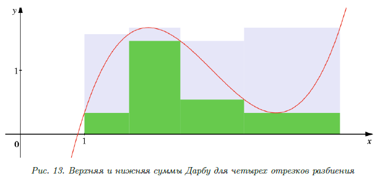
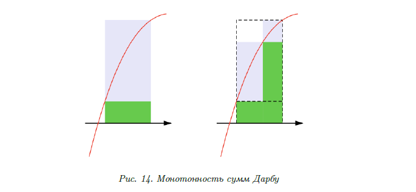

# Неопределенный интеграл

## § 1. Понятия первообразной и неопределенного интеграла

## §1. 原函数和不定积分的概念

### ①原函数的概念

在学习数学的过程中，我们经常研究“直接”和“逆”运算。例如，学会了加法之后，我们接着学习减法。学会了乘法之后，我们学习除法。学会了求幂之后，我们学习开方，等等。现在，是时候引入与求导运算相反的运算了——求原函数的运算，或者，虽然不是完全相同，但在意义上非常接近的运算，即求不定积分的运算。我们从一些定义开始。

#### 定义 83（原函数的概念）

函数 \( f \) 在区间 \(\langle a, b \rangle\) 上的原函数是指函数 \( F \)，使得

\[F'(x) = f(x), \quad x \in \langle a, b \rangle.\]

因此，函数 \( f \) 在某个区间上的原函数是指在该区间上其导数等于 \( f \) 的函数。我们来看一些例子。

**示例 59.**

函数 \( F_1(x) = \frac{x^3}{3} \) 是函数 \( f(x) = x^2 \) 在 \( x \in (-\infty, +\infty) \) 上的原函数，因为

\[\left( \frac{x^3}{3} \right)' = x^2, \quad x \in (-\infty, +\infty).\]

显然，所展示的原函数并不是唯一的。例如，函数 \( F_2(x) = \frac{x^3}{3} + 5 \) 或 \( F_3(x) = \frac{x^3}{3} - r^2 \) 也是 \( f \) 在 \( x \in (-\infty, +\infty) \) 上的原函数。

原函数在某个区间上被考虑是非常重要的。我们在下一个例子中强调这一点。

**示例 60.**

函数 \( F(x) = \ln|x| \) 是函数 \(\frac{1}{x}\) 在 \( x > 0 \) 和 \( x < 0 \) 时的原函数。我们可以提出以下断言：属于以下家族的每个函数

\[\ln|x| +
\begin{cases}
c_1, & x < 0, \\
c_2, & x > 0
\end{cases}, \quad c_1, c_2 \in \mathbb{R},\]

分别在区间 \( x < 0 \) 和 \( x > 0 \) 上是函数 \(\frac{1}{x}\) 的原函数。但显然，它们并不是在它们的并集上的原函数。

正如我们所看到的，如果一个函数的原函数存在，通常情况下它并不是唯一的。描述给定函数的所有原函数的问题可以通过以下定理来解决。

#### 定理77（关于所有原函数的集合）.

设 \( F \) 是函数 \( f \) 在区间 \(\langle a, b \rangle\) 上的一个原函数。若函数 \(\Phi\) 也是 \( f \) 在 \(\langle a, b \rangle\) 上的原函数，则其必要且充分条件是：

\[F(x) - \Phi(x) \equiv C, \quad x \in \langle a, b \rangle, \quad C \in \mathbb{R}.\]

**证明**
我们来证明必要性。设\(\Psi = F - \Phi\)，其中\(F\)和\(\Phi\)是函数\(f\)在区间\(\langle a, b \rangle\)上的原函数。则

\[
\Psi'(x) = (F(x) - \Phi(x))' = F'(x) - \Phi'(x) = f(x) - f(x) = 0, \quad \forall x \in \langle a, b \rangle.
\]

根据拉格朗日中值定理（定理56），对于任意满足\(x_1 < x_2\)的\(x_1, x_2 \in \langle a, b \rangle\)，存在\(\xi \in (x_1, x_2)\)，使得

\[
\Psi(x_2) - \Psi(x_1) = \Psi'(\xi)(x_2 - x_1) = 0.
\]

因此，\(\Psi(x) \equiv C\)，其中\(C \in \mathbb{R}\)，且\(x \in \langle a, b \rangle\)。

接下来证明充分性。假设在区间\(\langle a, b \rangle\)上满足条件\(F - \Phi \equiv C\)，其中\(C \in \mathbb{R}\)。则在该区间上，\(\Phi = F - C\)，且

\[
\Phi'(x) = F'(x) - C' = F'(x) - 0 = F'(x) = f(x).
\]

由此可见，\(\Phi\)是函数\(f\)在区间\(\langle a, b \rangle\)上的一个原函数。

因此，实质上，同一函数在同一区间上的任何两个原函数仅相差一个常数。已证明的定理使我们能够通过已知某一具体原函数来描述该函数在该区间上的所有原函数集合。但如何保证原函数的存在性呢？我们（暂时）不加证明地陈述以下定理。

#### 定理78（原函数存在的充分条件）

若 \( f \in C((a, b)) \)，则 \( f \) 在区间 \((a, b)\) 上的原函数集合非空。

此外，必须指出以下说明。

**注释165**
我们从方法论的角度讨论求导与求原函数这两类问题的重要区别。

关于求和、积、商、复合函数及反函数导数的公式表明，当对初等函数求导时（若导数存在），结果仍属于初等函数类。

然而，在求原函数的问题中，情况完全不同。例如可以证明（此处需要非平凡的代数工具），对于处处连续的初等函数 \( e^{x^2} \)，在任何区间 \(\langle a, b \rangle \subseteq \mathbb{R}\) 上，都不存在能用初等函数表达的原函数。但需注意，根据前述定理（定理78），该函数甚至在全体实数范围 \(\mathbb{R}\) 上也存在原函数。

总体而言，这种情形并不应令人惊讶。例如，若仅局限于自然数范围内，我们可以轻松地对任意两个自然数进行加法运算，

但为了引入减法运算，我们不得不将自然数集扩展为整数集。在整数集中，我们“巧妙”地定义了乘法运算。然而，若要引入除法运算，则需进一步过渡到所谓的有理数集，以此类推。不过，上述讨论并未回答“任意函数在其定义域的任意区间上是否一定存在原函数”这一问题。对于好奇的读者，我们将举一个反例来否定这一命题。

**示例61**
考虑函数

\[
\text{sign } x =
\begin{cases}
-1, & x < 0, \\
0, & x = 0, \\
1, & x > 0.
\end{cases}
\]

该函数在区间 \([0, 1]\) 上不存在原函数。具体证明如下：
假设存在原函数 \(F\) 在 \([0, 1]\) 上满足 \(F'(x) = \text{sign } x\)。根据拉格朗日中值定理（定理56），对于 \(\Delta x \in (0, 1)\)，存在 \(\xi \in (0, \Delta x)\)，使得

\[
F(\Delta x) - F(0) = F'(\xi) \Delta x = \text{sign}(\xi) \Delta x = \Delta x.
\]

当 \(\Delta x \to 0^+\) 时，左边导数的定义为：

\[
F'_+(0) = \lim_{\Delta x \to 0^+} \frac{F(\Delta x) - F(0)}{\Delta x} = \lim_{\Delta x \to 0^+} \frac{\Delta x}{\Delta x} = 1.
\]

然而，根据原函数的定义，\(F'(0)\) 应等于 \(\text{sign}(0) = 0\)。这导致矛盾：\(F'_+(0)\) 既需为 \(1\)（由拉格朗日定理推导），又需为 \(0\)（由原函数定义）。因此，原函数 \(F\) 不存在于 \([0, 1]\) 上。

类似地，可以证明：**任何包含 \(0\) 的区间上，\(\text{sign } x\) 均不存在原函数**。原因在于，\(0\) 处的导数矛盾始终无法调和——原函数在该点的导数需满足两种互斥条件（\(1\) 和 \(0\)），从而排除了原函数的存在性。

**结论**：若函数在某点处导数存在矛盾（如不连续或跳跃），则其原函数在包含该点的区间上可能不存在。此例揭示了原函数存在性对函数连续性的依赖。

### ②不定积分的概念

现在我们将引入一个自然延伸的概念——不定积分。

#### 定义 84（不定积分的概念）

函数 \( f \) 在区间 \(\langle a, b \rangle\) 上的**不定积分**，是指该区间上 \( f \) 的所有原函数的集合。

不定积分的符号表示如下：

\[\int f \, dx,\]

其中：

- \(\int\) 为不定积分符号，
- \( f \) 为被积函数，
- \( f \, dx \) 为被积表达式，
- \( x \) 为积分变量。

根据已建立的理论框架，我们可以直接得出以下显而易见的结论。

**注释166**
若 \( F \) 是函数 \( f \) 在区间 \(\langle a, b \rangle\) 上的任意一个原函数，则 \( f \) 在该区间上的**不定积分**为：

\[
\int f \, dx = F + C, \quad C \in \mathbb{R}.
\]

为简洁起见，通常省略关于区间 \(\langle a, b \rangle\) 的具体说明。例如，对于积分

\[
\int \frac{dx}{x} = \ln |x| +
\begin{cases}
c_1, & x < 0, \\
c_2, & x > 0,
\end{cases} \quad c_1, c_2 \in \mathbb{R},
\]

通常简写为：

\[
\int \frac{dx}{x} = \ln |x| + C,
\]

此处隐含 \( C \) 是一个**分段常数函数**（即在 \( x < 0 \) 和 \( x > 0 \) 的区间上分别为不同的常数）。

尽管稍显超前，我们仍需强调一个对实际应用极为重要的观点。

**注释 167.**
若将积分符号中的 \( dx \) 解释为微分，则后续章节中讨论的分部积分公式和变量替换公式会变得更加直观，且其记忆方式也更接近“机械式”操作。

## § 3. 不定积分的性质

在本节中，我们将讨论不定积分的基本性质。所有这些性质本质上是纯代数的，并且源于导数的相应性质。

### ①积分与导数的关系

既然我们已经说明求原函数与求导数在某种意义上是互为逆运算，那么我们将约定连接不定积分与导数的操作关系。我们约定以下关系式在相应不定积分定义的集合上成立：

\[
\left( \int f \, dx \right)' = f, \quad d \left( \int f \, dx \right) = f \, dx.
\]

**注释 170.**
需要特别注意的是，在上述每个（左侧的）关系式中，相应的操作都是作用于集合

\[I = \int f \, dx.\]

实质上，这些关系式本身正是对这种操作的定义，因为此前我们从未对集合进行过求导或微分运算。这种定义的合理性在于：集合 \( I \) 中的任意元素在对应操作的作用下，都会唯一地映射到另一个确定的元素。

当然，这些关系式需要进一步解释说明。

我们进一步约定如下。
若 \( F'(x) = f(x) \) 在 \( x \in \langle a, b \rangle \) 时成立，则通过将 \( dx \) 形式化地解释为微分，我们可认为：

\[
\int dF = F + C.
\]

**注释171**
这一关系的动机是明确的：如果 \( dx \) 是微分，则根据假设 \( dF = f(x)dx \)，那么根据不定积分的定义，

\[
\int f(x) \, dx = F(x) + C.
\]

在学习了不定积分中的变量替换公式后，这一约定的合理性将变得清晰。

### ②不定积分的线性性

由于导数本身具有线性性质，因此这一性质同样适用于不定积分。

#### 定理80（不定积分的线性性）。

设函数 \(f\) 和 \(g\) 在区间 \(\langle a, b \rangle\) 上存在原函数。则：

1. 在区间 \(\langle a, b \rangle\) 上存在函数 \(f + g\) 的原函数，且\[
   \int (f + g) \, dx = \int f \, dx + \int g \, dx.
   \]
2. 在区间 \(\langle a, b \rangle\) 上存在函数 \(\alpha f\)（\(\alpha \in \mathbb{R}\)）的原函数，且当 \(\alpha \neq 0\) 时，\[
   \int \alpha f \, dx = \alpha \int f \, dx.
   \]
3. 在区间 \(\langle a, b \rangle\) 上存在函数 \(\alpha f + \beta g\)（\(\alpha, \beta \in \mathbb{R}\)）的原函数，且当
   \[
   \alpha^2 + \beta^2 \neq 0
   \]
   时，
   \[
   \int (\alpha f + \beta g) \, dx = \alpha \int f \, dx + \beta \int g \, dx.
   \]

最后一个性质常被称为不定积分的**线性性质**（尽管这一称呼不完全严谨）。在转向证明上述定理之前，最好先理解定理中所述内容。

**注释 172.**
我们需要明确如何理解以下等式：

\[
\int (f + g) \, dx = \int f \, dx + \int g \, dx.
\]

具体而言，右边的集合相加意味着什么？我们将其理解为对应集合中所有元素之和的集合，即：

\[
\int f \, dx + \int g \, dx = \{F + C_1 + G + C_2 \mid C_1, C_2 \in \mathbb{R}\},
\]

其中 \( F \) 是 \( f \) 的原函数，\( G \) 是 \( g \) 的原函数。当然，我们假设在某个区间 \(\langle a, b \rangle\) 上定义了相应的不定积分（即原函数）。

类似地，在相同假设下，等式

\[
\int \alpha f \, dx = \alpha \int f \, dx
\]

的右边应理解为：集合中的每个元素乘以标量 \(\alpha\)，即：

\[
\alpha \int f \, dx = \{\alpha F + \alpha C_1 \mid C_1 \in \mathbb{R}\}.
\]

这里的关键在于，**线性性质允许我们将积分运算分解为对函数分量和标量的独立操作**，并通过原函数的线性组合体现这一特性。

**定理80的证明**

**证明：**

1. **证明第一部分**根据导数和的性质，\( F + G \) 是 \( f + g \) 的原函数。因此，只需验证以下集合相等性：

   \[
   \{F + G + C \mid C \in \mathbb{R}\} = \{F + C_1 \mid C_1 \in \mathbb{R}\} + \{G + C_2 \mid C_2 \in \mathbb{R}\}.
   \]

   - **包含性（左⊂右）：**若 \( H \in \{F + G + C \mid C \in \mathbb{R}\} \)，则\[
     H = F + G + C = (F + 0) + (G + C),
     \]因此 \( H \in \{F + C_1 \mid C_1 \in \mathbb{R}\} + \{G + C_2 \mid C_2 \in \mathbb{R}\} \)（取 \( C_1 = 0, C_2 = C \)）。
   - **包含性（右⊂左）：**
     若 \( H \in \{F + C_1 \mid C_1 \in \mathbb{R}\} + \{G + C_2 \mid C_2 \in \mathbb{R}\} \)，即
     \[
     H = F + C_1 + G + C_2 = F + G + (C_1 + C_2),
     \]
     则 \( H \in \{F + G + C \mid C \in \mathbb{R}\} \)（取 \( C = C_1 + C_2 \)）。
     综上，集合相等性得证。
2. **证明第二部分**根据导数的标量乘法性质，\( \alpha F \) 是 \( \alpha f \) 的原函数。需证明当 \( \alpha \neq 0 \) 时：\[
   \{\alpha F + C \mid C \in \mathbb{R}\} = \{\alpha F + \alpha C_1 \mid C_1 \in \mathbb{R}\}.
   \]

   - **包含性（左⊂右）：**若 \( H \in \{\alpha F + C \mid C \in \mathbb{R}\} \)，则\[
     H = \alpha F + C = \alpha F + \alpha \cdot \frac{C}{\alpha},
     \]因此 \( H \in \{\alpha F + \alpha C_1 \mid C_1 \in \mathbb{R}\} \)（取 \( C_1 = \frac{C}{\alpha} \)）。
   - **包含性（右⊂左）：**
     类似可证（留作练习）。
3. **证明第三部分**
   第三点的结论直接由第一点和第二点的结果组合得出。□

**应用示例与推论**
在进一步举例说明该定理的应用前，我们提出一个实践中重要的推论。

#### 推论23

设函数 \(f\) 和 \(g\) 在区间 \(\langle a, b \rangle\) 上存在原函数，且 \(F\) 是 \(f\) 在该区间上的原函数。则：

\[
\int f \, dx + \int g \, dx = F + \int g \, dx.
\]

该推论本质上表明：**在计算不定积分时，任意常数只需在计算最后一个积分时添加**。现在我们可以举一些例子来说明这一点，例如以下示例。

**示例62**
计算积分

\[\int \frac{x^2 + \sqrt[3]{x^2} + 5}{x} \, dx.\]

根据线性性质，

\[\int \frac{x^2 + \sqrt[3]{x^2} + 5}{x} \, dx = \int x \, dx + \int x^{-1/3} \, dx + 5 \int \frac{dx}{x} =\]

\[= \frac{x^2}{2} + \frac{3}{2}x^{2/3} + 5 \ln |x| + C.\]

---

**示例63**
计算积分

\[\int \frac{dx}{\sin^2 x \cos^2 x}.\]

由于 \( 1 = \sin^2 x + \cos^2 x \)，则

\[\int \frac{dx}{\sin^2 x \cos^2 x} = \int \frac{\sin^2 x + \cos^2 x}{\sin^2 x \cos^2 x} \, dx = \int \frac{dx}{\cos^2 x} + \int \frac{dx}{\sin^2 x} =\]

\[= \tan x - \cot x + C.\]

### ③变量替换公式（换元积分法）

本节我们将学习计算不定积分时使用的一种重要方法——**变量替换公式**。本质上，这是复合函数导数公式的反向应用。接下来直接陈述相应的定理。

#### 定理 81（变量替换公式）

设函数 \( f \) 在区间 \(\langle a, b \rangle\) 上存在原函数，函数 \(\varphi: \langle \alpha, \beta \rangle \to \langle a, b \rangle\) 在 \(\langle \alpha, \beta \rangle\) 上可微，则

\[
\int f \, dx = \int f(\varphi) \varphi' \, dt.
\]

**证明**
设 \( F \) 是 \( f \) 在 \(\langle a, b \rangle\) 上的原函数。根据复合函数求导定理（定理 50），\( F(\varphi) \) 是函数 \( f(\varphi) \varphi' \) 在 \(\langle \alpha, \beta \rangle\) 上的原函数。因此可得：

\[
\int f \, dx = F + C = F(\varphi) + C = \int f(\varphi) \varphi' \, dt.
\]

**说明**
此公式表明，通过变量替换 \( x = \varphi(t) \) 和微分关系 \( dx = \varphi'(t) dt \)，原积分可转换为关于新变量 \( t \) 的积分。这一方法简化了复杂积分的计算过程，是换元积分法的核心工具。

**注释173**
现在再次需要指出，不定积分中的 \( dx \) 可以方便地解释为微分。如果接受这一点，那么变量替换公式就变得非常“机械化”：若 \( x = \varphi(t) \)，则 \( f(x) = f(\varphi(t)) \)，且 \( dx = d\varphi(t) = \varphi'(t) \, dt \)。

下面直接举几个例子。

**示例64**
计算积分
\[
\int xe^{x^2} \, dx.
\]

**解法**：
设 \(x^2 = t\)，则 \(d(x^2) = dt\)，即 \(2x dx = dt\)，因此
\[
\int xe^{x^2} \, dx = \frac{1}{2} \int e^t \, dt = \frac{1}{2} e^t + C = \frac{1}{2} e^{x^2} + C.
\]
此积分也可通过其他方式求解。

**示例65**
计算积分
\[
\int xe^{x^2} \, dx.
\]

**解法**：
将 \(dx\) 视为微分，原积分可改写为
\[
\int xe^{x^2} \, dx = \int e^{x^2} \, d\left(\frac{x^2}{2}\right) = \frac{1}{2} \int e^{x^2} \, dx^2 = \frac{1}{2} e^{x^2} + C.
\]
此方法通常称为**凑微分法**。

上述过程本质上是应用了变量替换公式，但通过调整表达形式使步骤更简洁。这一技巧在积分计算中尤为实用。

### ④ 分部积分公式

此前我们已学习积分的一些性质，这些性质源于导数的和与复合函数的导数法则。现在我们将讨论一种公式，其在某种意义上源自**乘积的导数公式**（即乘积法则）。我们以普遍接受的形式来表述它，使用符号 \( u \) 和 \( v \) 表示函数（而非 \( f \) 和 \( g \)）。

#### 定理82（分部积分公式）。

设 \( u \) 和 \( v \) 在区间 \(\langle a, b \rangle\) 上可微，并且在区间 \(\langle a, b \rangle\) 上存在 \( vu' \) 的原函数。则

\[
\int uv' \, dx = uv - \int vu' \, dx
\]

或

\[
\int u \, dv = uv - \int v \, du.
\]

#### 定理82（分部积分公式）。

设 \( u \) 和 \( v \) 在区间 \(\langle a, b \rangle\) 上可微，并且在区间 \(\langle a, b \rangle\) 上存在 \( vu' \) 的原函数。则

\[
\int uv' \, dx = uv - \int vu' \, dx
\]

或

\[
\int u \, dv = uv - \int v \, du.
\]

**证明**：根据乘积的导数公式，

\[
(uv)' = u'v + uv',
\]

由此可得

\[
uv' = (uv)' - u'v.
\]

对等式两边积分并利用推论（23），可推导出分部积分公式：

\[
\int uv' \, dx = uv - \int vu' \, dx.
\]

分部积分公式常用于积分所谓的**超越函数**（即不同性质的函数，如多项式与指数函数、三角函数等）的乘积。只有通过示例才能更好地说明（或展示）这一点。

**示例66**
计算积分

\[
\int x \sin x \, dx.
\]

设 \( u = x \)，则 \( du = dx \)，\( dv = \sin x \, dx \)，且 \( v = - \cos x \)。因此，

\[
\int x \sin x \, dx =
\begin{vmatrix}
u = x \\
du = dx \\
dv = \sin x \, dx \\
v = - \cos x
\end{vmatrix} = -x \cos x + \int \cos x \, dx = -x \cos x + \sin x + C.
\]

再举一例。

**示例67**
计算积分

\[
\int e^x \sin x \, dx.
\]

**第一次分部积分**：
\[
\int e^x \sin x \, dx =
\begin{vmatrix}
u & = e^x \\
du & = e^x \, dx \\
dv & = \sin x \, dx \\
v & = -\cos x
\end{vmatrix}
= -e^x \cos x + \int e^x \cos x \, dx.
\]

**第二次分部积分**：
\[
\int e^x \cos x \, dx =
\begin{vmatrix}
u & = e^x \\
du & = e^x \, dx \\
dv & = \cos x \, dx \\
v & = \sin x
\end{vmatrix}
= e^x \sin x - \int e^x \sin x \, dx.
\]

**联立方程**：
\[
\int e^x \sin x \, dx = -e^x \cos x + e^x \sin x - \int e^x \sin x \, dx,
\]
解得：
\[
\int e^x \sin x \, dx = \frac{-e^x \cos x + e^x \sin x}{2} + C.
\]

上述我们讨论的这类积分通常被称为自引用的。当然，我们仅涉及了部分积分类型（或者说部分积分技巧）。在实践中仍有无穷无尽的不同技巧需要进一步掌握。以下是我们需要特别指出的说明。

**注释174**在分析上述示例后，有必要回答以下问题：

1. **为何在两个例子中求 \( v \) 时，任意常数均取 \( C = 0 \)**？是否总是可以这样做？
2. **最后一个示例中的任意常数 \( C \) 从何而来**？因为在求解积分方程时，并未显式引入常数。

若成功回答了这些问题，请尝试解释以下“证明 \( 0 = 1 \)”的“悖论”（设 \( x > 0 \)）：

\[
\int \frac{dx}{x \ln x} =
\begin{vmatrix}
u & -1 / \ln x \\
du & -1 / (x \ln^2 x) dx \\
dv & -1 / x dx \\
v & -\ln x
\end{vmatrix}
= 1 + \int \frac{dx}{x \ln x}.
\]

通过“消去积分”，得出 \( 0 = 1 \)。

## §4. 有理分式的积分

本章我们将学习积分一个重要函数类——**有理分式**。

### ① 多项式理论的一些知识

在实践中，积分所谓的**有理分式**往往是必要的。主要原因在于，许多积分变量替换会将原函数转换为有理分式。如果我们能够以"闭合形式"（即用初等函数表达）找到有理分式的原函数，那么许多其他函数的原函数也可以用初等函数表示。

和往常一样，我们首先约定符号.

#### 定义85（多项式的概念）

称次数为 \( n \geq 1 \) 的**多项式**（多项式 \( P_n(x) \)）为以下形式的函数：

\[
P_n(x) = a_0 + a_1x + a_2x^2 + \dots + a_nx^n, \quad a_i \in \mathbb{R}, \quad a_n \neq 0, \quad i \in \{1, 2, \ldots, n\}.
\]

零次多项式定义为任意非零常数。恒等于零的多项式次数用符号 \( -\infty \) 表示。

接下来引入**有理函数**（即**有理分式**）的定义。

#### 定义86（有理分式的概念）

**有理分式**是形如

\[
\frac{P_n(x)}{Q_m(x)}
\]

的函数，其中 \( P_n(x) \) 和 \( Q_m(x) \) 分别为次数 \( n \) 和 \( m \) 的多项式。

类比有理数理论中的定义，引入以下概念。

#### 定义87（真分式的概念）

有理分式

\[
\frac{P_n(x)}{Q_m(x)}
\]

称为**真分式**，若 \( n < m \)；否则称为**假分式**。

当然，如果分式是假分式，可以通过分离整式部分，将其转化为真分式。例如，以下引理成立（我们不加证明，建议读者参考代数课程或自行用长除法证明）.

#### 引理 66（关于多项式带余除法）

设
\[
\frac{P_n(x)}{Q_m(x)}
\]

为假分式。则存在唯一的分解形式：\[
\frac{P_n(x)}{Q_m(x)} = R_{n-m}(x) + \frac{T_k(x)}{Q_m(x)},
\]其中：

- \( R_{n-m}(x) \) 是次数为 \( n - m \) 的多项式，
- \( T_k(x) \) 是次数为 \( k \) 的多项式，且 \( k < m \)。

在多项式理论中，可证明以下定理。

#### 定理83（关于实数域上多项式的分解）。

设 \(P_n(x)\) 是最高次项系数为1的n次多项式。则存在如下分解：

\[
P_n(x) = (x - a_1)^{k_1} \cdot (x - a_2)^{k_2} \cdot \ldots \cdot (x - a_p)^{k_p}
\]
\[
\cdot (x^2 + p_1 x + q_1)^{l_1} \cdot (x^2 + p_2 x + q_2)^{l_2} \cdot \ldots \cdot (x^2 + p_m x + q_m)^{l_m},
\]

其中对于 \(i \in \{1, 2, ..., p\}, \, j \in \{1, 2, ..., m\}\)，满足：

\[
a_i \in \mathbb{R}, \quad k_i \in \mathbb{N}, \quad l_j \in \mathbb{N}, \quad p_j^2 - 4q_j < 0, \quad k_1 + k_2 + \ldots + k_p + 2(l_1 + \ldots + l_m) = n.
\]

显然，\(a_1, ..., a_p\) 是多项式 \(P_n(x)\) 的实根，其重数分别为 \(k_1, ..., k_p\)；而二次三项式 \(x^2 + p_j x + q_j \, (j \in \{1, 2, ..., m\})\) 没有实数根。最后这一点需单独强调。

**注释 175**
条件 \( p_j^2 - 4q_j < 0 \, (j \in \{1, 2, \ldots, m\}) \) 表明二次三项式 \( x^2 + p_j x + q_j \) **没有实根**。

需要特别指出的是，在这种情况下，每个二次三项式均有一对**共轭复根**，形式为 \( \alpha_j \pm i\beta_j \)。

至此，我们已准备好应用上述理论工具来解决本节最初提出的问题。

### ②分式分解为最简分式

本节我们将讨论将任意有理分式分解为所谓的最简分式之和的方法。首先从定义这些最简分式开始。

#### 定义88（最简分式的概念）。

最简分式（第一类和第二类分式）是指形如

\[
\frac{A}{(x - a)^k}, \quad \frac{Ax + B}{(x^2 + px + q)^k},
\]

的分式，其中 \( k \in \mathbb{N} \) 且 \( p^2 - 4q < 0 \)。

事实上，任何真有理分式都可以分解为最简分式之和。在介绍这一定理之前，我们先给出两个引理。

#### 引理 67（关于第一类分数）

设

\[P_n(x) = \frac{Q_m(x)}{Q(n)} \]

为真有理分数，且

\[Q_m(x) = (x - a)^k \cdot \tilde{Q}(x), \quad \text{其中} \quad \tilde{Q}(a) \neq 0, \quad \tilde{Q} - \text{多项式。}\]

存在实数 \( A \in \mathbb{R} \) 和多项式 \( \tilde{P}(x) \)，使得

\[\frac{P_n(x)}{Q_m(x)} = \frac{A}{(x - a)^k} + \frac{\tilde{P}(x)}{(x - a)^{k-1} \cdot \tilde{Q}(x)},\]

且该表示是唯一的。

**证明**。我们证明所提出的分解的存在性。为此，考虑差值

\[
\frac{P_n(x)}{Q_m(x)} - \frac{A}{(x - a)^k} = \frac{P_n(x) - A \cdot \tilde{Q}(x)}{(x - a)^k \cdot \tilde{Q}(x)}
\]

并选择数 \( A \)，使得 \( a \) 是分子的根，即满足等式

\[
P_n(a) - A \cdot \tilde{Q}(a) = 0.
\]

显然，

\[
A = \frac{P_n(a)}{\tilde{Q}(a)},
\]

且由于条件 \(\tilde{Q}(a) \neq 0\)，除法是可行的。对于找到的 \( A \)，分子是一个具有根 \( a \) 的多项式，因此根据定理 83，它可以表示为

\[
P_n(x) - A \cdot \tilde{Q}(x) = (x - a) \cdot \tilde{P}(x),
\]

于是

\[
\frac{P_n(x) - A \cdot \tilde{Q}(x)}{(x - a)^k \cdot \tilde{Q}(x)} = \frac{(x - a) \cdot \tilde{P}(x)}{(x - a)^k \cdot \tilde{Q}(x)} = \frac{\tilde{P}(x)}{(x - a)^{k-1} \cdot \tilde{Q}(x)}.
\]

这样，分解的存在性得证。

我们证明这种分解的唯一性。假设存在两种分解

\[
\frac{P_n(x)}{Q_m(x)} = \frac{A_1}{(x - a)^k} + \frac{\tilde{P}_1(x)}{(x - a)^{k-1} \cdot \tilde{Q}(x)} = \frac{A_2}{(x - a)^k} + \frac{\tilde{P}_2(x)}{(x - a)^{k-1} \cdot \tilde{Q}(x)}.
\]

将两边乘以 \((x - a)^k \cdot \tilde{Q}(x)\)，得到

\[
A_1 \cdot \tilde{Q}(x) + \tilde{P}_1(x) \cdot (x - a) = A_2 \cdot \tilde{Q}(x) + \tilde{P}_2(x) \cdot (x - a),
\]

对于所有 \( x \in \mathbb{R} \) 成立。令 \( x = a \)，则等式变为

\[
A_1 \cdot \tilde{Q}(a) = A_2 \cdot \tilde{Q}(a),
\]

由于 \(\tilde{Q}(a) \neq 0\)，所以 \( A_1 = A_2 \)。但这样，多项式 \(\tilde{P} = P_n(x) - A \cdot \tilde{Q}(x)\) 的系数也是唯一确定的（引理 66）。矛盾。

总的来说，可能不难表述第二个引理。

#### 引理 68（关于第二类分数）

设

\[
\frac{P_n(x)}{Q_m(x)}
\]

为真有理分数，且

\[
Q_m(x) = (x^2 + px + q)^k \cdot \tilde{Q}(x), \quad \text{其中} \quad \tilde{Q}(\alpha \pm i\beta) \neq 0, \quad \tilde{Q} - \text{多项式},
\]

\( p^2 - 4q < 0 \)，且 \(\alpha \pm i\beta\) 是二次三项式 \( x^2 + px + q \) 的共轭复根。存在实数 \( A, B \in \mathbb{R} \) 和多项式 \(\tilde{P}(x)\)，使得

\[
\frac{P_n(x)}{Q_m(x)} = \frac{Ax + B}{(x^2 + px + q)^k} + \frac{\tilde{P}(x)}{(x^2 + px + q)^{k-1} \cdot \tilde{Q}(x)},
\]

且该表示是唯一的。

#### 定理 84（关于分数分解为最简形式）。

设

\[
\frac{P_n(x)}{Q_m(x)}
\]

为有理分数，且

\[
Q_m(x) = (x - a_1)^{k_1} \cdot \ldots \cdot (x - a_p)^{k_p} \cdot (x^2 + p_1 x + q_1)^{l_1} \cdot \ldots \cdot (x^2 + p_m x + q_m)^{l_m},
\]

其中对于 \(i \in \{1, 2, ..., p\}\)，\(j \in \{1, 2, ..., m\}\)，

\[
a_i \in \mathbb{R}, \quad k_i \in \mathbb{N}, \quad l_j \in \mathbb{N}, \quad p_j^2 - 4q_j < 0.
\]

则存在唯一的分解形式

\[
\frac{P_n(x)}{Q_m(x)} = R_{n-m}(x) + \sum_{i=1}^p \sum_{j=1}^{k_i} \frac{A_{ij}}{(x-a_i)^{k_i-j+1}} + \sum_{i=1}^m \sum_{j=1}^{l_i} \frac{B_{ij}x + C_{ij}}{(x^2 + p_i x + q_i)^{l_i-j+1}},
\]

其中右边分数的分子中的所有系数都是实数。

**证明**。假设 \(n > m\)，根据带余除法定理（引理 66），可以将其表示为

\[
\frac{P_n(x)}{Q_m(x)} = R_{n-m}(x) + \frac{T_k(x)}{Q_m(x)}, \quad k < m.
\]

因此，只需考虑原始有理分数为真分数且不可约的情况。

根据第一类分数引理（引理 67），所考虑的分数可以表示为

\[
\frac{P_n(x)}{Q_m(x)} = \frac{A_{11}}{(x - a_1)^{k_1}} + \frac{\tilde{P}^{(11)}(x)}{(x - a_1)^{k_1 - 1} \cdot \tilde{Q}^{(1)}(x)},
\]

其中

\[
\tilde{Q}^{(1)}(x) = (x - a_2)^{k_2} \cdot \ldots \cdot (x - a_p)^{k_p} \cdot (x^2 + p_1 x + q_1)^{l_1} \cdot \ldots \cdot (x^2 + p_m x + q_m)^{l_m}.
\]

进一步，根据同一引理，可以找到数 \(A_{12}\) 和多项式 \(\tilde{P}^{(12)}(x)\)，使得

\[
\frac{\tilde{P}^{(11)}(x)}{(x - a_1)^{k_1 - 1} \cdot \tilde{Q}^{(1)}(x)} = \frac{A_{12}}{(x - a_1)^{k_1 - 1}} + \frac{\tilde{P}^{(12)}(x)}{(x - a_1)^{k_1 - 2} \cdot \tilde{Q}^{(1)}(x)}.
\]

继续类似的推理，我们得到

\[
\frac{P_n(x)}{Q_m(x)} = \frac{A_{11}}{(x - a_1)^{k_1}} + \frac{A_{12}}{(x - a_1)^{k_1 - 1}} + \ldots + \frac{A_{1k_1}}{(x - a_1)} + \frac{\tilde{P}^{(1k_1)}(x)}{\tilde{Q}^{(1)}(x)}.
\]

类似地，对于所有实数根 \(a_i\) 的重数 \(k_i\)，\(i \in \{1, 2, ..., p\}\)，我们得到

\[
\frac{P_n(x)}{Q_m(x)} = \sum_{i=1}^p \sum_{j=1}^{k_i} \frac{A_{ij}}{(x - a_i)^{k_i - j + 1}} + \frac{\tilde{P}^{(pk_p)}(x)}{\tilde{Q}^{(p)}(x)},
\]

其中

\[
\tilde{Q}^{(p)}(x) = (x^2 + p_1 x + q_1)^{l_1} \cdot \ldots \cdot (x^2 + p_m x + q_m)^{l_m}
\]

且分数

\[
\frac{\tilde{P}^{(pk_p)}(x)}{\tilde{Q}^{(p)}(x)}
\]

为真分数。

接下来，利用第二类分数引理（引理 68），我们得到

\[
\frac{\tilde{P}^{(pk_p)}(x)}{\tilde{Q}^{(p)}(x)} = \frac{B_{11}x + C_{11}}{(x^2 + p_1 x + q_1)^{l_1}} + \frac{\tilde{P}^{(11)}(x)}{(x^2 + p_1 x + q_1)^{l_1 - 1} \cdot \tilde{Q}^{(1)}(x)},
\]

其中

\[
\tilde{Q}^{(1)}(x) = (x^2 + p_2 x + q_2)^{l_2} \cdot \ldots \cdot (x^2 + p_m x + q_m)^{l_m}.
\]

继续类似的推理，仅使用第二类分数引理，最终得到分解

\[
\frac{\tilde{P}^{(pk_p)}(x)}{\tilde{Q}^{(p)}(x)} = \sum_{i=1}^m \sum_{j=1}^{l_i} \frac{B_{ij}x + C_{ij}}{(x^2 + p_i x + q_i)^{l_i - j + 1}}.
\]

综上所述，定理得证。

### ③最简分数的积分

在本节中，我们将展示计算最简有理分数积分的一般方法。由于在实践中，最终公式通常更容易每次重新推导，因此我们不会以封闭定理的形式表述结果，而是更倾向于讲述其中涉及的思想和思路。

#### 第一类分数的积分

首先考虑计算积分

\[
\int \frac{A}{(x - a)^k} \, dx, \quad k \geq 1.
\]

当 \( k = 1 \) 时，我们有

\[
\int \frac{A}{x - a} \, dx = A \int \frac{d(x - a)}{x - a} = A \ln |x - a| + C.
\]

当 \( k > 1 \) 时，我们有

\[
\int \frac{A}{(x - a)^k} \, dx = A \int \frac{d(x - a)}{(x - a)^k} = A \int (x - a)^{-k} \, d(x - a) = \frac{A}{(1 - k)(x - a)^{k-1}} + C.
\]

#### 第二类分数的积分

考虑计算积分

\[
\int \frac{Ax + B}{(x^2 + px + q)^k} \, dx, \quad p^2 - 4q < 0.
\]

首先在分母中完成平方，得到：

\[
x^2 + px + q = \left(x + \frac{p}{2}\right)^2 + \frac{4q - p^2}{4}.
\]

由于

\[
\frac{4q - p^2}{4} > 0,
\]

可以将其表示为 \( a^2 \)。此外，设 \( t = x + \frac{p}{2} \)，则 \( dt = dx \)，并且

\[
\frac{Ax + B}{(x^2 + px + q)^k} = \frac{A\left(t - \frac{p}{2}\right) + B}{(t^2 + a^2)^k} \, dt = \int \frac{At + \left(B - \frac{Ap}{2}\right)}{(t^2 + a^2)^k} \, dt.
\]

计算第一个积分：

\[
\int \frac{At \, dt}{(t^2 + a^2)^k} = \frac{A}{2} \int \frac{d(t^2 + a^2)}{(t^2 + a^2)^k} = \frac{A}{2} \ln(t^2 + a^2) + C, \quad k = 1,
\]

或者

\[
\frac{A}{2(1 - k)(t^2 + a^2)^{k-1}} + C, \quad k > 1.
\]

现在考虑第二个积分（忽略常数因子），记作 \( I_k \)：

\[
I_k = \int \frac{dt}{(t^2 + a^2)^k}.
\]

显然，

\[
I_1 = \int \frac{dt}{t^2 + a^2} = \frac{1}{a} \arctan \frac{t}{a} + C.
\]

如果 \( k > 1 \)，则

\[
I_k = \int \frac{dt}{(t^2 + a^2)^k} = \frac{1}{a^2} \int \frac{a^2}{(t^2 + a^2)^k} \, dt = \frac{1}{a^2} \int \frac{t^2 + a^2 - t^2}{(t^2 + a^2)^k} \, dt = \frac{1}{a^2} I_{k-1} - \frac{1}{a^2} \int \frac{t^2}{(t^2 + a^2)^k} \, dt.
\]

最后一个积分可以通过分部积分法计算：

\[
\int \frac{t^2}{(t^2 + a^2)^k} \, dt = \frac{1}{2(1 - k)(t^2 + a^2)^{k-1}} + \frac{t}{2(1 - k)(t^2 + a^2)^{k-1}}.
\]

因此，

\[
I_k = \frac{1}{a^2} \left(I_{k-1} \left(1 + \frac{1}{2(1 - k)}\right) - \frac{t}{2(1 - k)(t^2 + a^2)^{k-1}}\right).
\]

这样，得到了一个递推公式，将 \( I_k \) 表示为 \( I_{k-1} \) 的函数。由于 \( I_1 \) 已知，积分计算方案已完全阐述。

**有理函数积分在初等函数中的表达式**

综上所述，根据前面几节的内容，我们得出以下重要推论。

#### 推论 24

有理分数的积分可以用初等函数表示。

# Интеграл Римана

## § 1. Понятие интеграла Римана

## § 1. 黎曼积分的概念

在这一节中，我们将介绍黎曼定积分的概念，我们认为这是通过解决一个具体的应用问题——计算某函数图像下面积的问题——自然而然地得出的。

### ①Наводящие соображения

考虑计算函数 \( y = x^2 \) 在区间 \([0, 1]\) 下面积的问题。我们将使用我们对面积的“直观”理解，因为在学校或之前的学习中，并没有引入严格的定义。

我们将采取以下步骤。将区间 \([0, 1]\) 分成 \(n\) 个相等的部分，分割点为：

\[0 = \frac{0}{n}, \quad \frac{1}{n}, \quad \frac{2}{n}, \quad \ldots, \quad \frac{n-1}{n}, \quad \frac{n}{n} = 1\]

然后，我们将用我们能够计算的面积——矩形的面积——来近似函数图像在每个分割区间上的面积。虽然这个方法看似可行，但不可避免地会出现一个问题：如何选择这些矩形的高度？

这似乎非常合乎逻辑：分割的每个区间的长度越小，函数在该区间上的变化就越小。因此，如果我们让 \( n \to \infty \)，从而将区间分割成无限多个长度任意小的子区间，那么选择每个区间上函数的值作为近似矩形的高度将变得无关紧要。这意味着我们可以选择对我们来说最方便的函数值。

我们选择每个分割区间右端点处的函数值作为矩形的高度，即在这些点处取值：

\[x_i = \frac{i}{n}, \quad i \in \{1, 2, \ldots, n\}.\]

对应的函数值为：

\[y(x_i) = \frac{i^2}{n^2}, \quad i \in \{1, 2, \ldots, n\}.\]

因此，在分割区间

\[\left[ \frac{i - 1}{n}, \frac{i}{n} \right], \quad i \in \{1, 2, \ldots, n\}\]

上的面积，可用矩形面积近似表示为：

\[\frac{y(x_i)}{n} = \frac{i^2}{n^3}, \quad i \in \{1, 2, \ldots, n\}.\]

最终，函数图像下的总面积近似为阶梯图形的面积之和：

\[\tilde{S}_n = \sum_{i=1}^n \frac{y(x_i)}{n} = \sum_{i=1}^n \frac{i^2}{n^3} = \frac{1}{n^3} \sum_{i=1}^n i^2 = \frac{n(n+1)(2n+1)}{6n^3}.\]

当 \( n \) 趋向于无穷大时，我们的近似方法给出的值等于

\[\lim_{n \to \infty} \widetilde{S}_n = \lim_{n \to \infty} \frac{n(n+1)(2n+1)}{6n^3} = \frac{1}{3}.\]

**注 176.**我们需要注意以下几点：

1. 首先，在上述建模过程中，我们使用了所谓的“均匀”分割（即将区间 \([0, 1]\) 分割成长度相等的子区间）。如果采用其他方式分割区间，结果是否会改变？
2. 其次，在每个分割区间上，我们选择了特定的点，并将函数在这些点的值作为近似矩形的高度。如果按照其他规则选择点，结果会如何？同样，结果是否仍然相同？

目前，我们无法简洁地回答这些问题，但直觉告诉我们，结果应该是相同的。如果不是这样，那么问题可能出在函数本身。“如果不是这样”是什么意思，以及“问题出在函数本身”是什么意思，正是本章理论将要阐述的内容。

### ②黎曼积分的定义

现在让我们严格地、逐步地引入黎曼积分的概念。我们将遵循与上述具体问题建模时完全相同的思路和顺序，只不过现在我们将以更抽象和更普遍的方式进行。那么，让我们从第一步开始——分割的概念。

#### 定义 89（分割的概念）

如果在区间 \([a, b]\) 上引入一组点 \(x_i\)，\(i \in \{0, 1, \ldots, n\}\)，使得

\[a = x_0 < x_1 < x_2 < \ldots < x_n = b,\]

则称在该区间上引入了分割（或细分）\(\tau\)。

因此，分割是一组将我们的区间划分为更小区间的点，这些小区间两两之间没有共同的内部点。

**注 177.**
我们再次注意到，在本节开头构建示例时使用的“均匀”分割，仅仅是刚刚引入的分割概念的一个非常特殊的情况。

我们注意到这个注释，后续将会用到它。

**注 178.**
通常，对于分割的区间及其长度，引入以下符号表示：

\[
\Delta x_i = x_i - x_{i-1}, \quad \Delta_i = [x_{i-1}, \, x_i], \quad i \in \{1, 2, ..., n\}.
\]

**Δ_i = [x_{i−1}, x_i] 的含义：**在黎曼积分的上下文中，符号 **Δ_i** 表示分割后的第 \(i\) 个子区间，具体定义为闭区间 \([x_{i-1}, x_i]\)，即从分割点 \(x_{i-1}\) 到 \(x_i\) 的区间段。例如：

- 若将区间 \([0, 1]\) 分割为 \(n\) 个等分，则第 \(i\) 个子区间为：
  \[
  \Delta_i = \left[ \frac{i-1}{n}, \frac{i}{n} \right].
  \]

**Δ_i 与 Δx_i 的区别：**

- **Δ_i** 表示区间本身（几何上的区间段）。
- **Δx_i** 表示该区间的长度，即 \(\Delta x_i = x_i - x_{i-1}\)（数值上的长度）。

从我们提供的例子以及常识来看，分割得到的区间长度越小，我们的“近似”似乎就越精确。为此，我们引入一个控制分割“大小”的量——分割的细度或秩。

#### 定义 90（分割细度（秩）的概念）

量

\[
\lambda(\tau) = \max_{i \in \{1,2, \ldots, n\}} \Delta x_i
\]

称为分割（细分）的细度（秩、直径）。

因此，分割的秩在数值上等于分割后得到的最大区间的长度。现在，我们为分割“装备”一下，或者说，选择一些点，在这些点上计算矩形的高度，这些矩形的面积（当 \( f \geq 0 \) 时）近似于所研究函数图像下的“面积”。

#### 定义 91（带标记分割的概念）

若在区间 \([a, b]\) 上已定义分割 \(\tau\)，并选取一组点 \(\xi = \{\xi_1, \xi_2, ..., \xi_n\}\) 满足 \(\xi_i \in \Delta_i\)（\(i \in \{1, 2, ..., n\}\)），则称该区间上定义了一个**带标记的分割** \((\tau, \xi)\)。

（注：术语 "оснащенное разбиение" 在数学分析中常译为 "带标记的分割" 或 "配备分割"，表示在分割基础上额外选取了每个子区间内的代表点，用于构造黎曼和。）

通过引入**带标记的分割**的概念，并类比之前的示例，我们现在可以定义“近似面积”——即用阶梯图形的面积来逼近函数 \( f \geq 0 \) 图像下的面积，这种面积也被称为**积分和**。

#### 定义 92（积分和的概念）

设区间 \([a, b]\) 上给定函数 \(f\) 并引入了带标记的分割 \((\tau, \xi)\)。量

\[
\sigma_{\tau}(f, \xi) = \sum_{i=1}^{n} f(\xi_i) \Delta x_i
\]

称为函数 \(f\) 在区间 \([a, b]\) 上对应于分割 \((\tau, \xi)\) 的积分和。

现在，我们准备给出黎曼积分的定义。

#### 定义 93（黎曼积分的概念）

设函数 \( f \) 定义在区间 \([a, b]\) 上。若存在一个数 \( I \)，满足以下条件：

对于任意给定的 \(\varepsilon > 0\)，存在一个 \(\delta > 0\)，使得对于所有满足 \(\lambda(\tau) < \delta\) 的带标记分割 \((\tau, \xi)\)，均有
\[
|\sigma_{\tau}(f, \xi) - I| < \varepsilon,
\]
则称 \( I \) 为函数 \( f \) 在区间 \([a, b]\) 上的**黎曼积分**，记为：
\[
I = \int_{a}^{b} f(x) \, dx.
\]

**关键解读**

1. **极限的严格性**：定义通过 \(\varepsilon\)-\(\delta\) 语言严格描述了积分和收敛到唯一值 \( I \) 的过程。
2. **分割细度的控制**：\(\lambda(\tau)\)（分割的最大子区间长度）趋近于零时，所有可能的积分和必须一致趋近于 \( I \)。
3. **积分符号的意义**：\(\int_{a}^{b} f(x) \, dx\) 不仅是符号表达，更代表函数在区间上的面积（当 \( f \geq 0 \) 时）或广义的累积量。

此定义奠定了黎曼积分的理论基础，强调通过无限细分区间，使得近似和与真实积分值的误差任意小。

我们注意到，在积分符号中，符号 \( dx \) 可以理解为微分，或在某种意义上视为“极限中的微分”。这一说明仅是为了解释引入该符号的动机，以及其在变量替换、分部积分、牛顿-莱布尼茨公式等操作中的实际便利性。关于这些内容，我们稍后将详细讨论。现在，请关注以下重要说明。

**注179**
黎曼积分常被称为积分和的极限。因此，更简单但需附带一些条件，可以将最后的定义改写为以下形式：

\[I = \lim_{\lambda(\tau) \to 0} \sigma_\tau(f, \xi).\]

对于上述注释需要以足够的谨慎来对待。在阐述它之后，人们希望立即将研究函数极限时仔细探讨过的所有性质转移到这一新概念上。然而，事情并非如此简单。

**注180**
一般而言，积分和的极限概念并非函数极限的特殊情况，因为积分和是分划及其配置（而非其细度）的函数。然而，这种类型的极限可以（且我们将在下一节中）归约为序列的极限。后续我们常会简写为 λ(τ) → 0，具体细节留待读者自行补充。

此外，我们再补充几个便于后续使用的定义。

#### 定义94（可积函数的概念）

若函数 \( f \) 在区间 \([a, b]\) 上存在黎曼积分，则称该函数在此区间上**黎曼可积**（或简称为**可积**）。

区间 \([a, b]\) 上全体黎曼可积函数的集合记为：\( R[a, b] \)。

下面举几个例子。

**示例68**
我们证明常数函数 \( f = C \) 在任意区间 \([a, b]\) 上都是可积的，且满足：

\[
\int_{a}^{b} C \, dx = C(b - a).
\]

事实上，对区间 \([a, b]\) 引入任意分划 \((\tau, \xi)\)，对应的积分和为：

\[
\sigma_{\tau}(f, \xi) = \sum_{i=1}^{n} C \Delta x_i = C \sum_{i=1}^{n} \Delta x_i = C(b - a),
\]

由此直接得出所需结果。

需要注意的是，并非所有定义在区间 \([a, b]\) 上的函数都是可积的。

**示例69**
**证明Dirichlet函数的不可积性**

我们证明Dirichlet函数

\[
d(x) =
\begin{cases}
1, & x \in \mathbb{Q} \\
0, & x \in \mathbb{I}
\end{cases}
\]

在任意区间上均不可积。为简化讨论，以区间 \([0, 1]\) 为例，设 \(\tau\) 为该区间的一个分划。

**步骤1：选择有理数标记点**
在每个子区间 \(\Delta_i\) 中选择标记点 \(\xi_i \in \mathbb{Q}\)，则对应的积分和为：

\[
\sigma_\tau(d, \xi) = \sum_{i=1}^n d(\xi_i)\Delta x_i = \sum_{i=1}^n 1 \cdot \Delta x_i = 1.
\]

**步骤2：选择无理数标记点**
在每个子区间 \(\Delta_i\) 中选择标记点 \(\xi_i \in \mathbb{I}\)，则对应的积分和为：

\[
\sigma_\tau(d, \xi) = \sum_{i=1}^n d(\xi_i)\Delta x_i = \sum_{i=1}^n 0 \cdot \Delta x_i = 0.
\]

**结论：极限依赖标记点的选择**
当分划的细度 \(\lambda(\tau) \to 0\) 时，积分和的极限可能为1或0，具体取决于标记点 \(\xi\) 的选取。这与黎曼积分的定义（极限必须唯一且与标记无关）矛盾，因此 \(d(x)\) 不可积。

**推广到任意区间 \([a, b]\)**
对于一般区间 \([a, b]\)，证明方法完全类似。为便于后续讨论，我们将扩展黎曼积分的定义，使其不限于 \(a < b\) 的情形。

#### 定义95

根据定义，规定

\[
\int_{a}^{a} f \, dx = 0, \quad \int_{b}^{a} f \, dx = -\int_{a}^{b} f \, dx, \quad a < b.
\]

引入的这一定义总体上可以很自然地通过几何直观进行解释。请读者自行思考其几何意义。

### ③通过序列定义积分

现在，我们陈述并证明一个定理，该定理将积分和的极限与积分和序列的极限联系起来。定理的证明方式类似于柯西与海涅极限定义等价性定理（定理17）的证明，但鉴于该定理在后续内容中的重要性，我们将在此重新详细阐述其证明。

#### 定理85（通过序列定义积分）

设函数 \( f \) 定义在区间 \([a, b]\) 上。则 \( I \) 是函数 \( f \) 在区间 \([a, b]\) 上的黎曼积分，当且仅当对于任意满足分划细度 \(\lambda(r^n) \xrightarrow[n \to \infty]{} 0\) 的标记分划序列 \((r^n, \xi^n)\)，均有

\[
\sigma_{r^n}(f, \xi^n) \xrightarrow[n \to \infty]{} I.
\]

**证明**
**必要性证明**：假设 \( I \) 是根据原始定义的函数 \( f \) 在区间 \([a, b]\) 上的黎曼积分，且给定任意 \(\varepsilon > 0\)。根据黎曼积分的定义，存在 \(\delta > 0\)，使得对任意满足分划细度 \(\lambda(\tau) < \delta\) 的标记分划 \((\tau, \xi)\)，均有：

\[
|\sigma_{\tau}(f, \xi) - I| < \varepsilon.
\]

现设 \((\tau^n, \xi^n)\) 是区间 \([a, b]\) 上的一列标记分划，且满足分划细度 \(\lambda(\tau^n) \xrightarrow[n \to \infty]{} 0\)。由于 \(\lambda(\tau^n) \to 0\)，存在自然数 \(n_0\)，使得对任意 \(n > n_0\)，有 \(\lambda(\tau^n) < \delta\)。

因此，当 \(n > n_0\) 时，对任意对应的积分和 \(\sigma_{\tau^n}(f, \xi^n)\)，均满足：

\[
|\sigma_{\tau^n}(f, \xi^n) - I| < \varepsilon.
\]

由此可知，积分和序列 \(\sigma_{\tau^n}(f, \xi^n)\) 收敛于 \(I\)，必要性得证。

**证明充分性**
采用反证法：假设定理的条件成立，但 \( I \) 并非按原始定义的黎曼积分。这意味着存在某个 \(\varepsilon_0 > 0\)，使得对任意 \(\delta > 0\)，均存在标记分划 \((\tau^s, \xi^s)\) 满足 \(\lambda(\tau^s) < \delta\)，但积分和与 \(I\) 的偏差不小于 \(\varepsilon_0\)，即：

\[
|\sigma_{\tau^s}(f, \xi^s) - I| \geq \varepsilon_0.
\]

**构造矛盾序列**取 \(\delta_n = \frac{1}{n}\)，根据上述条件，对每个 \(n\)，存在标记分划 \((\tau^n, \xi^n)\) 满足：

1. \(\lambda(\tau^n) < \delta_n = \frac{1}{n}\)，
2. \(|\sigma_{\tau^n}(f, \xi^n) - I| \geq \varepsilon_0\).

**导出矛盾**
由于 \(\delta_n \xrightarrow[n \to \infty]{} 0\)，故分划细度 \(\lambda(\tau^n) \xrightarrow[n \to \infty]{} 0\)。这表明序列 \((\tau^n, \xi^n)\) 满足定理中分划细度趋于零的条件。然而，根据构造，对应的积分和始终满足：

\[
|\sigma_{\tau^n}(f, \xi^n) - I| \geq \varepsilon_0 > 0,
\]

这与定理条件中积分和序列必须收敛于 \(I\) 的结论矛盾。

**结论**
反证假设不成立，因此若满足定理条件，\( I \) 必为黎曼积分。

**意义**
此定理将积分概念归约为序列极限问题，从而允许直接应用序列极限的相关性质（如极限唯一性、算术运算定理等）来研究积分。例如，可据此证明积分的唯一性、线性性以及积分对区间可加性等关键性质。

## § 2. 达布和及其性质

为了研究黎曼积分的存在性问题，考察两种"极端积分和"是很有用的。实际上，这些和并不总是积分和。

### 1 达布和的概念

我们从基本定义开始。

#### 定义 96（达布和的概念）

设函数 \( f \) 定义在区间 \([a, b]\) 上，\( \tau \) 是该区间的一个分割。量

\[S_\tau(f) = \sum_{i=1}^n M_i \Delta x_i, \quad M_i = \sup_{x \in \Delta} f(x), \quad i \in \{1, 2, ..., n\},\]

\[s_\tau(f) = \sum_{i=1}^n m_i \Delta x_i, \quad m_i = \inf_{x \in \Delta} f(x), \quad i \in \{1, 2, ..., n\},\]

分别称为函数 \( f \) 关于分割 \( \tau \) 的**上达布和**和**下达布和**。

对于固定分割下的达布和，其几何意义值得注意：上达布和对应函数 \( f \) 图像外接最小阶梯形的“面积”，而下达布和对应函数 \( f \) 图像内接最大阶梯形的“面积”。此处“面积”加引号并非偶然：若函数在分割区间上取负值，则该区间外接矩形的高度为负值，其“面积”需带负号。类似结论对内接矩形同样成立。

**注记 181**

由上、下达布和的定义可直接得到不等式
\[s_\tau(f) \leq \sigma_\tau(f, \xi) \leq S_\tau(f),\]

该不等式对区间 \([a, b]\) 的任何带标记分割 \((\tau, \xi)\) 都成立。

显然，若 \(f\) 在区间上无上界（无下界），则 \(S_\tau(f) = +\infty\)（对应地 \(s_\tau(f) = -\infty\)）。而任意上（下）达布和的有限性，等价于函数在该区间上有上界（有下界）。

#### 引理 69（达布和的有限性与函数有界性的关系）

函数 \( f \) 在区间 \([a, b]\) 上有上界（下界）的充要条件是：任意上（下）达布和为有限值。

**证明**
**必要性**：设 \( f \) 在 \([a, b]\) 上有上界，即存在常数 \( M \) 使得
\[ f(x) \leq M, \quad \forall x \in [a, b]. \]

对任意分割 \( \tau \) 和每个子区间 \( \Delta_i \)，由 \( M_i = \sup_{x \in \Delta_i} f(x) \leq M \)，可得
\[ S_\tau(f) = \sum_{i=1}^n M_i \Delta x_i \leq \sum_{i=1}^n M \Delta x_i = M(b - a) < +\infty. \]

对于 \( f \) 有下界的情况，证明完全类似。

**充分性**：设存在分割 \( \tau \) 使得 \( S_\tau(f) \) 有限。由于
\[ M_i = \sup_{x \in \Delta_i} f(x) < +\infty, \quad \forall i \in \{1, 2, \ldots, n\}, \]
取 \( M = \max_{1 \leq i \leq n} M_i \)，则对任意 \( x \in [a, b] \) 有
\[ f(x) \leq \sup_{x \in [a, b]} f(x) \leq M < +\infty. \]
因此 \( f \) 在 \([a, b]\) 上有上界。

对于下达布和 \( s_\tau(f) \) 有限的情况，证明方法类似。

### 2 达布和的性质

本节将讨论达布和的重要（标准）性质。事实上，对于固定分割，上达布和是所有积分和中的"最大者"，而下达布和是"最小者"

#### 引理 70

（达布和与积分和的关系）
成立以下等式：

\[S_\tau(f) = \sup_{\xi} \sigma_\tau(f,\xi), \quad s_\tau(f) = \inf_{\xi} \sigma_\tau(f,\xi).\]

**证明**
首先证明第一个等式。考虑函数\( f \)在\( [a, b] \)上有上界的情形。取任意\(\varepsilon > 0\)，根据上确界定义，存在点\(\xi_i \in \Delta_i\)使得
\[
M_i - \frac{\varepsilon}{b-a} < f(\xi_i), \quad \forall i \in \{1, 2, \ldots, n\}.
\]

将每个不等式乘以\(\Delta x_i\)并求和，得到
\[
\sum_{i=1}^{n} \left( M_i - \frac{\varepsilon}{b-a} \right) \Delta x_i < \sigma_\tau(f, \xi)
\]
即
\[
S_\tau(f) - \varepsilon < \sigma_\tau(f, \xi).
\]
由于总有\( S_\tau(f) \geq \sigma_\tau(f, \xi) \)，故得证
\[
S_\tau(f) = \sup_{\xi} \sigma_\tau(f, \xi).
\]

当\( f \)在\( [a, b] \)上无上界时，\( S_\tau(f) = +\infty \)。此时必存在某个子区间\(\Delta_1\)使得\( f \)在\(\Delta_1\)上无界。取点列\(\xi_1^k \in \Delta_1\)满足\( f(\xi_1^k) \to +\infty \)，固定其他子区间上的点\(\xi_i \in \Delta_i (i \geq 2)\)，则
\[
\sup_{\xi} \sigma_\tau(f, \xi) \geq \lim_{k\to\infty} \left( f(\xi_1^k)\Delta x_1 + \sum_{i=2}^{n} f(\xi_i)\Delta x_i \right) = +\infty = S_\tau(f).
\]

（注：关于下确界等式的证明方法完全类似）

**注记 182.**
当函数 \( f \in C[a, b] \)（即在闭区间 \([a, b]\) 上连续）时，显然有：

\[
S_\tau(f) = \max_{\xi} \sigma_\tau(f, \xi), \quad s_\tau(f) = \min_{\xi} \sigma_\tau(f, \xi).
\]

以下性质将帮助我们建立达布和的**单调性**。首先从定义开始说明。

### 定义 97（分割加细的概念）

设区间 \([a, b]\) 上有两个分割 \(\tau_1\) 和 \(\tau_2\)。若满足 \(\tau_2 \subseteq \tau_1\)，则称 \(\tau_1\) 是 \(\tau_2\) 的**加细**。

换言之，\(\tau_1\) 作为 \(\tau_2\) 的加细，包含 \(\tau_2\) 的所有分割点，从而生成"更细"的子区间。

### 引理 71（达布和的单调性）

若 \(\tau_2 \subseteq \tau_1\)，则成立：
\[
S_{\tau_2}(f) \geq S_{\tau_1}(f), \quad s_{\tau_1}(f) \geq s_{\tau_2}(f).
\]

**证明**
首先证明第一个不等式。只需考虑\(\tau_1\)是通过在\(\tau_2\)的某个子区间\(\Delta_k = (x_{k-1}, x_k)\)内添加单一点\(\hat{x}\)而得到的情形。

此时有：
\[
S_{\tau_{2}}(f) = \sum_{i=1}^{n}M_{i}\Delta x_{i} = \sum_{\substack{i=1 \\ i\neq k}}^{n}M_{i} \Delta x_{i} + M_{k}\Delta x_{k}.
\]

设：
\[
M^{\prime}_{k} = \sup_{x\in[x_{k-1},\hat{x}]}f(x), \quad M^{\prime\prime}_{k} = \sup_{x\in[\hat{x},x_{k}]}f(x),
\]
则显然：
\[
M_{k} \geq M^{\prime}_{k}, \quad M_{k} \geq M^{\prime\prime}_{k}.
\]

因此可得：
\[
\begin{aligned}
M_{k}\Delta x_{k} &= M_{k}(\hat{x}-x_{k-1}) + M_{k}(x_{k}-\hat{x}) \\
&\geq M^{\prime}_{k}(\hat{x}-x_{k-1}) + M^{\prime\prime}_{k}(x_{k}-\hat{x}),
\end{aligned}
\]
从而：
\[
S_{\tau_{2}}(f) \geq \sum_{\substack{i=1 \\ i\neq k}}^{n}M_{i}\Delta x_{i} + M^{\prime}_{k}(\hat{x}-x_{k-1}) + M^{\prime\prime}_{k}(x_{k}-\hat{x}) = S_{\tau_{1}}(f).
\]

第二个不等式的证明完全类似。

该引理表明：当分割加细时，上达布和不会增大，而下达布和不会减小。现在我们来建立达布和之间的相互有界性。

### 引理 72（达布和的有界性）

设\(\tau_1\)和\(\tau_2\)是区间\([a, b]\)的任意两个分割，则成立：
\[
s_{\tau_1}(f) \leq S_{\tau_2}(f).
\]

**证明**
取分割\(\tau = \tau_1 \cup \tau_2\)，显然有\(\tau_1 \subset \tau\)和\(\tau_2 \subset \tau\)。根据达布和的单调性（引理71），可得：
\[
s_{\tau_1}(f) \leq s_{\tau}(f) \leq S_{\tau}(f) \leq S_{\tau_2}(f),
\]
由此得证。

该引理表明：任意下达布和不超过任意上达布和。

## § 3. 可积性的必要条件-可积性判别准则

本节将讨论函数可积性的若干判别准则。首先从可积性的必要条件开始，该条件从几何角度理解是相当直观的。

### 定理 86（可积性的必要条件）
若函数 \( f \in R[a, b] \)（即 \( f \) 在 \([a, b]\) 上黎曼可积），则 \( f \) 在 \([a, b]\) 上必有界。

**证明**  
假设\( f \)无界（例如无上界），根据引理69有：
\[
S_\tau(f) = +\infty.
\]

取\(\varepsilon = 1\)，根据黎曼可积的定义，存在\(\delta > 0\)使得对任意带标记分割\((\tau, \xi)\)，当\(\lambda(\tau) < \delta\)时：
\[
|\sigma_\tau(f, \xi) - I| < 1 \iff I - 1 < \sigma_\tau(f, \xi) < I + 1.
\]

特别地，对任意满足\(\lambda(\tau) < \delta\)的固定分割\(\tau\)，其积分和\(\sigma_\tau(f, \xi)\)关于\(\xi\)有界。但这与引理70的结论：
\[
\sup_{\xi} \sigma_\tau(f, \xi) = S_\tau(f) = +\infty
\]
相矛盾。

因此，若函数无界，则必然不是黎曼可积的。下面我们陈述并证明更重要的可积性判别准则。  

### 定理 87（达布判别准则）
函数 \( f \) 在 \([a, b]\) 上黎曼可积的充要条件是：
\[
\lim_{\lambda(\tau) \to 0} \left( S_\tau(f) - s_\tau(f) \right) = 0,
\]
等价地表述为：
\[
\forall \varepsilon > 0\ \exists \delta > 0 : \forall \tau : \lambda(\tau) < \delta \quad S_\tau(f) - s_\tau(f) < \varepsilon.
\]

**证明**  
**必要性**：设 \( f \in R[a, b] \)，对任意 \(\varepsilon > 0\) 存在 \(\delta > 0\) 使得当 \(\lambda(\tau) < \delta\) 时：
\[
|\sigma_\tau(f, \xi) - I| < \frac{\varepsilon}{3} \implies I - \frac{\varepsilon}{3} < \sigma_\tau(f, \xi) < I + \frac{\varepsilon}{3}.
\]
对 \(\xi\) 取上确界和下确界（引理70）得：
\[
I - \frac{\varepsilon}{3} \leq s_\tau(f), \quad S_\tau(f) \leq I + \frac{\varepsilon}{3}.
\]
联立不等式可得：
\[
S_\tau(f) - s_\tau(f) \leq \frac{2\varepsilon}{3} < \varepsilon.
\]

**充分性**：由极限条件知所有达布和有限。根据引理72：
\[
\sup_{\tau} s_\tau(f) = I_* < +\infty, \quad \inf_{\tau} S_\tau(f) = I^* < +\infty,
\]
且 \( I_* \leq I^* \)。对任意分割 \(\tau\) 有：
\[
0 \leq I^* - I_* \leq S_\tau(f) - s_\tau(f),
\]
由极限条件可得 \( I_* = I^* =: I \)。结合不等式：
\[
|\sigma_\tau(f, \xi) - I| \leq S_\tau(f) - s_\tau(f),
\]
根据达布判别准则即得：
\[
\int_{a}^{b} f(x) dx = I.
\]

**几何意义**：该准则表明可积性等价于当分割无限加细时，函数图像外接与内接阶梯形面积差趋于零。  

**注记 183**  
从几何角度看，达布判别准则表明：函数 \( f \) 可积的充要条件是，其图像下方的"面积"可以通过内接与外接阶梯形（即下达布和与上达布和对应的阶梯形）从内部和外部逼近，且两者的"面积"差可以任意小。在充分性证明中，我们看到的 \( I_* \) 和 \( I^* \) 通常称为**达布下积分**和**达布上积分**，它们分别表示当分割细度 \(\lambda(\tau) \to 0\) 时下和与上和的理论极限值。二者的相等性（及有限性）正是积分存在的条件，而它们的共同值即为积分值。

**注记 184**  
在证明过程中我们得到：对任意分割 \(\tau\) 恒有  
\[
s_\tau(f) \leq \int_a^b f(x) dx \leq S_\tau(f).
\]

### 推论 25  
若 \( f \in R[a, b] \)，则  
\[
\lim_{\lambda(\tau) \to 0} s_\tau(f) = \lim_{\lambda(\tau) \to 0} S_\tau(f) = \int_a^b f(x) dx.
\]

**证明**  
由前注记可得：  
\[
\begin{aligned}
0 \leq S_\tau(f) - \int_a^b f(x) dx &\leq S_\tau(f) - s_\tau(f), \\
0 \leq \int_a^b f(x) dx - s_\tau(f) &\leq S_\tau(f) - s_\tau(f).
\end{aligned}
\]  
应用达布准则（定理87）即得结论。□

（接下来将引入振荡量的概念，并重述上述结论的新形式）  

### 定义 98（振荡的概念）  
设函数 \( f : E \to \mathbb{R} \)，定义 \( f \) 在集合 \( E \) 上的**振荡量**为：  
\[
\omega(f, E) = \sup_{x,y \in E} \left( f(x) - f(y) \right).
\]  
显然，振荡量也可表示为：  
\[
\omega(f, E) = \sup_{x \in E} f(x) - \inf_{x \in  E} f(x).
\]

### 推论 26（振荡量形式的达布判别准则）  
函数 \( f \) 在 \([a, b]\) 上黎曼可积的充要条件为：  
\[
\lim_{\lambda(\tau) \to 0} \sum_{i=1}^n \omega(f, \Delta_i) \Delta x_i = 0,
\]  
等价表述为：  
\[
\forall \varepsilon > 0 \, \exists \delta > 0 : \forall \tau : \lambda(\tau) < \delta \quad \sum_{i=1}^n \omega(f, \Delta_i) \Delta x_i < \varepsilon.
\]  

## § 4. 可积函数类

本节将证明关于可积函数类的若干定理。第一个结果（在预期之中）表明：连续函数必然可积。但这一事实的证明过程本身并不平凡。

### 定理 88（连续函数的可积性）  
若函数在闭区间上连续，则其黎曼可积：  
\[
f \in C[a, b] \implies f \in R[a, b].
\]

**证明**  
任取 \(\varepsilon > 0\)。根据康托尔定理（定理47），闭区间上的连续函数必一致连续，故存在 \(\delta > 0\) 使得：  
\[
\forall x_1, x_2 \in [a, b] : |x_1 - x_2| < \delta \implies |f(x_1) - f(x_2)| < \frac{\varepsilon}{b - a}.
\]

取分割 \(\tau\) 满足细度 \(\lambda(\tau) < \delta\)，则在每个子区间 \(\Delta_i\) 上有：  
\[
\omega(f, \Delta_i) = \sup_{x, y \in \Delta_i} |f(x) - f(y)| < \frac{\varepsilon}{b - a},
\]  
因此：  
\[
\sum_{i=1}^n \omega(f, \Delta_i) \Delta x_i < \frac{\varepsilon}{b - a} \sum_{i=1}^n \Delta x_i = \varepsilon.
\]  
根据达布准则的推论26，即证 \( f \in R[a, b] \)。

**应用示例**  
此定理保证了在区间 \([0, 1]\) 上求函数 \( x^2 \) 图像下方面积的构造的合法性：由于 \( x^2 \in C[0, 1] \)，可任意选择带标记分割进行计算。在进一步扩展可积函数类之前，我们需要证明一个辅助定理。  

### 定理 89（函数在有限点取值变化不影响积分）  
若在可积函数的定义域上修改有限个点处的函数值，其可 积性保持不变且积分值不变。

**证明**  
设 \( f \in R[a, b] \)，而函数 \(\tilde{f}\) 仅在点 \( x_1, x_2, \ldots, x_n \) 处与 \( f \) 取值不同。根据可积 性的必要条件（定理86），存在常数 \( C \) 使得 \( |f| \leq C \)，因此：  
\[
|\tilde{f}| \leq C_1, \quad C_1 = \max(C, |\tilde{f}(x_1)|, \ldots, |\tilde{f}(x_n)|).
\]

观察 到 \( f \) 与 \(\tilde{f}\) 的积分和最多相差 \( 2n \) 项，且满足：  
\[
\left| \sigma_\tau(f, \xi) - \sigma_\tau(\tilde{f}, \xi) \right| \leq 2n(C + C_1)\lambda(\tau) \xrightarrow{\lambda(\tau) \to 0} 0,
\]  
这 表明两积分同时存在且相等。□

### 推论  
该定理允许我们定义在区间 \([a, b]\) 上至多有限个点处无定义的函数的积分。接下来我们将证明关于函数在集合及其子集上可积性关系的性质。  

### 定理 90（函数及其限制的可积性关系）  
以下命题成立：

1. 若 \( f \in R[a, b] \) 且 \( [\alpha, \beta] \subset [a, b] \)，则 \( f \in R[\alpha, \beta] \)；
2. 若 \( f \in R[a, c] \) 且 \( f \in R[c, b] \)（其中 \( a < c < b \)），则 \( f \in R[a, b] \)。

**证明**  
**第一部分**  
应用达布准则（定理87），对任意 \(\varepsilon > 0\)，存在 \(\delta\) 使得对 \([a, b]\) 的任意分割 \(\tau\)（满足 \(\lambda(\tau) < \delta\)）有：  
\[
S_\tau(f) - s_\tau(f) < \varepsilon.
\]  
任取 \([\alpha, \beta]\) 的分割 \(\tau'\)（满足 \(\lambda(\tau') < \delta\)），通过补充分割 \([a, \alpha]\) 和 \([\beta, b]\) 将其扩展为 \([a, b]\) 的分割 \(\tau\)，且保持 \(\lambda(\tau) < \delta\)。此时：  
\[
0 \leq S_{\tau'}(f) - s_{\tau'}(f) \leq S_\tau(f) - s_\tau(f) < \varepsilon,
\]  
由达布准则即证结论。

**第二部分**  
已知常函数可积。不妨设 \( f \) 非常值函数，故 \(\omega(f, [a, b]) > 0\)。对任意 \(\varepsilon > 0\)，由可积性条件存在 \(\delta_1, \delta_2\) 使得：  
- 对 \([a, c]\) 的任意分割 \(\tau_1\)（\(\lambda(\tau_1) < \delta_1\)），有 \( S_{\tau_1}(f) - s_{\tau_1}(f) < \frac{\varepsilon}{3} \)；  
- 对 \([c, b]\) 的任意分割 \(\tau_2\)（\(\lambda(\tau_2) < \delta_2\)），有 \( S_{\tau_2}(f) - s_{\tau_2}(f) < \frac{\varepsilon}{3} \)。  

取 \(\delta = \min\left(\delta_1, \delta_2, \frac{\varepsilon}{3\omega(f, [a, b])}\right)\)，设 \(\tau\) 为 \([a, b]\) 的分割且 \(\lambda(\tau) < \delta\)。若 \( c \in [x_{i-1}, x_i] \)，定义：  
\[
\tau' = \tau \cup \{c\}, \quad \tau_1 = \tau' \cap [a, c], \quad \tau_2 = \tau' \cap [c, b],
\]  
则：  
\[
S_\tau(f) - s_\tau(f) \leq S_{\tau_1}(  f) - s_{\tau_1}(  f)  +  S_{\tau_2}(  f)  -  s_{\tau_2}(  f)  +  \omega(f, [a,  b]  )  \delta  <  \varepsilon.
\]  
由达布准则知 \( f \in R[a, b] \)。□

**应用方向**  
此定理为证明分段连续函数类的可积性奠定了基础。  

### 定义 99（分段连续函数的概念）  
函数 \( f : [a, b] \to \mathbb{R} \) 称为**分段连续函数**，若其不连续点集为有限集或空集，且所有不连续点均为第一类间断点。

### 定理 91（分段连续函数的可积性）  
在闭区间上分段连续的函数在该区间上黎曼可积。

**证明**  
设 \( a_1 < \ldots < a_m \) 为 \( f \) 在开区间 \((a, b)\) 内的全部间断点。函数 \( f \) 在子区间 \([a, a_1], [a_1, a_2], \ldots, [a_m, b]\) 的内部点连续，且在各子区间端点存在有限单侧极限。根据定理89，\( f \) 在每个子区间上至多与连续函数相差两个点（端点）的取值，故在子区间上可 积。由 定 理 90 即 得 \( f \in R[a, b] \)。

**几何意义**  
该 结 论 表 明 包 含 有 限 个 跳 跃 间 断 点 的 分 段 光 滑 函 数 必 可 积。  

### 注记185
我们证明的定理给出了某些可积函数类，但**并非可积性的完整刻画**。例如，可积函数可能包含第二类间断点。要完整描述可积函数类需要引入勒贝格测度的概念，这已超出本课程范围。

值得注意的是，对定理91可作如下重要推广：  
若函数\(f\)在\([a,b]\)上有界且仅有有限个间断点，则\(f\in R[a,b]\)。此结论的证明从略，在形式理论构建中可直接使用。

## §5.可积函数的代数性质

本节将讨论可积函数的基本运算性质，主要结果如下定理所述：

### 定理92（可积函数的代数运算封闭性）
1. **线性组合封闭性**  
   任意两个可积函数的线性组合仍可积，即\(R[a,b]\)构成线性空间。  
   \[
   \forall f,g\in R[a,b],\ \alpha,\beta\in\mathbb{R}\implies \alpha f+\beta g\in R[a,b]
   \]

2. **乘积封闭性**  
   可积函数的乘积仍可积：  
   \[
   f,g\in R[a,b]\implies f\cdot g\in R[a,b]
   \]

3. **绝对值保持性**  
   可积函数的绝对值可积：  
   \[
   f\in R[a,b]\implies |f|\in R[a,b]
   \]

4. **倒数保持性**（在非零条件下）  
   若\(f\)可积且\(\inf_{[a,b]}|f|>0\)，则：  
   \[
   1/f\in R[a,b]
   \]  

**定理92证明**

**1. 线性组合可积性证明**  
对任意分割\(\tau\)满足\(\lambda(\tau)<\delta=\min(\delta_1,\delta_2)\)，有：
\[
\begin{aligned}
\sum_{i=1}^n \omega(\alpha f+\beta g,\Delta_i)\Delta x_i &\leq |\alpha|\sum_{i=1}^n \omega(f,\Delta_i)\Delta x_i + |\beta|\sum_{i=1}^n \omega(g,\Delta_i)\Delta x_i \\
&< \frac{|\alpha|\varepsilon}{2(|\alpha|+1)} + \frac{|\beta|\varepsilon}{2(|\beta|+1)} \\
&< \varepsilon
\end{aligned}
\]
根据达布准则推论26，得证\(\alpha f+\beta g\in R[a,b]\)。

**2. 乘积可积性证明**  
由必要条性(86)，存在\(C>0\)使：
\[
|f(x)|<C,\ |g(x)|<C,\ \forall x\in[a,b]
\]
且：
\[
|f(x)g(x)-f(y)g(y)| \leq C(\omega(f,E)+\omega(g,E))
\]
取上确界得：
\[
\omega(fg,E) \leq C(\omega(f,E)+\omega(g,E))
\]
后续证明与第1部分类似（练习）。

**3. 绝对值可积性证明**  
由不等式：
\[
\big||f(x)|-|f(y)|\big| \leq \omega(f,E)
\]
得：
\[
\omega(|f|,E) \leq \omega(f,E)
\]
后续证明与第1部分类似（练习）。

**4. 倒数可积性证明**  
当\(|f|>C\)时：
\[
\left|\frac{1}{f(x)}-\frac{1}{f(y)}\right| \leq \frac{\omega(f,E)}{C^2}
\]
取上确界得：
\[
\omega\left(\frac{1}{f},E\right) \leq \frac{\omega(f,E)}{C^2}
\]
后续证明与第1部分类似（练习）。  

## §6. 积分的性质

## 1. 线性性与可加性

### 定理93（黎曼积分的线性性）  
设\(f,g\in R[a,b]\)，则：
\[
\int_{a}^{b} (\alpha f + \beta g) \, dx = \alpha \int_{a}^{b} f \, dx + \beta \int_{a}^{b} g \, dx
\]

**证明**  
由定理92知\(\alpha f+\beta g\in R[a,b]\)。在等式：
\[
\sum_{i=1}^{n} (\alpha f(\xi_i) + \beta g(\xi_i)) \Delta x_i = \alpha \sum_{i=1}^{n} f(\xi_i) \Delta x_i + \beta \sum_{i=1}^{n} g(\xi_i) \Delta x_i
\]
中取极限\(\lambda(\tau)\to 0\)即得结论。

### 定理94（区间可加性）  
设\(f\in R[a,b], c\in [a,b]\)，则：
\[
\int_{a}^{b} f \, dx = \int_{a}^{c} f \, dx + \int_{c}^{b} f \, dx
\]

**证明**  
由定理90知\(f\)在\([a,c]\)和\([c,b]\)上可积。取包含点\(c\)的分割\(\tau\)，其自然诱导出子区间分割\(\tau_1,\tau_2\)，满足：
\[
\sum_{[a,b]} f(\xi_i)\Delta x_i = \sum_{[a,c]} f(\xi_i)\Delta x_i + \sum_{[c,b]} f(\xi_i)\Delta x_i
\]
当\(\lambda(\tau)\to 0\)时，\(\lambda(\tau_1),\lambda(\tau_2)\to 0\)同时成立，故得证。□

**推论27**  
若\(f\in R[\min(a,b,c),\max(a,b,c)]\)，则：
\[
\int_a^b f \, dx = \int_c^a f \, dx + \int_c^b f \, dx
\]  

## 2 与不等式相关的性质

### 定理95（积分的单调性）
设\(f,g\in R[a,b]\)且\(a\leq b\)，若对任意\(x\in[a,b]\)有\(f(x)\leq g(x)\)，则：
\[
\int_a^b f\,dx \leq \int_a^b g\,dx
\]

**证明**  
由积分和的不等式：
\[
\sum_{i=1}^n f(\xi_i)\Delta x_i \leq \sum_{i=1}^n g(\xi_i)\Delta x_i
\]
取极限\(\lambda(\tau)\to 0\)即得结论。

> **几何解释**：较大函数图像下方的面积不小于较小函数的面积。

### 推论28
设\(f\in R[a,b]\)，\(m=\inf_{[a,b]}f\)，\(M=\sup_{[a,b]}f\)，则：
\[
m(b-a) \leq \int_a^b f\,dx \leq M(b-a)
\]

**注**  
该结论不仅几何直观（从定理95直接可得），也与注记184中两点分割的情形一致。

### 定理96（积分绝对值的比较）
设\(f\in R[a,b]\)，则：
\[
\left|\int_a^b f\,dx\right| \leq \int_a^b |f|\,dx
\]

**证明**  
由定理92知\(|f|\)可积。根据不等式：
\[
\left|\sum_{i=1}^n f(\xi_i)\Delta x_i\right| \leq \sum_{i=1}^n |f(\xi_i)|\Delta x_i
\]
取极限\(\lambda(\tau)\to 0\)即证。□  

## 3 第一中值定理

### 定理97（积分第一中值定理）  
设 \( f,g \in R[a,b] \)，且 \( g \) 在 \([a,b]\) 上不变号。记 \( m = \inf\limits_{[a,b]} f \)，\( M = \sup\limits_{[a,b]} f \)，则存在 \( \mu \in [m,M] \) 使得：
\[
\int_a^b fg \, dx = \mu \int_a^b g \, dx
\]
若 \( f \in C[a,b] \)，则存在 \( \xi \in [a,b] \) 使得：
\[
\int_a^b fg \, dx = f(\xi) \int_a^b g \, dx
\]

**证明**  
当 \( g(x) \geq 0 \) 时，由不等式：
\[
mg(x) \leq f(x)g(x) \leq Mg(x)
\]
根据积分单调性（定理95）得：
\[
m \int_a^b g \, dx \leq \int_a^b fg \, dx \leq M \int_a^b g \, dx
\]

**情况1**：若 \( \int_a^b g \, dx = 0 \)，则 \( \int_a^b fg \, dx = 0 \)，此时任意 \( \mu \) 均满足等式。

**情况2**：若 \( \int_a^b g \, dx > 0 \)，取：
\[
\mu = \frac{\int_a^b fg \, dx}{\int_a^b g \, dx} \in [m,M]
\]
当 \( f \) 连续时，由波尔查诺-柯西第二定理（定理30）可知存在 \( \xi \in [a,b] \) 使 \( f(\xi) = \mu \)。□

**几何意义（注记186）**  
当 \( f \geq 0 \) 且 \( g \equiv 1 \) 时，对连续函数 \( f \) 有：
\[
\int_a^b f \, dx = f(\xi)(b-a)
\]
表示曲边梯形面积等于以 \( f(\xi) \) 为高的矩形面积。  

好的，让我们开始翻译这段内容。

---

## § 7. 积分与可变上界

在本节中，我们将讨论所谓的积分与可变上界，讨论其性质，并且将从所获得的性质中得出一个重要推论——连续函数存在原函数。

### 定义 100（积分与可变上界的定义）

设 \( f \in R[a, b] \) 且 \( x \in [a, b] \)。函数
\[
\Phi(x) = \int_{a}^{x} f \, dx
\]
称为积分与可变上界。

好的，让我们继续翻译这段内容。

### 备注 187

请注意，根据定理90，定义是正确的：函数 \(\Phi(x)\) 对于每个 \(x \in [a, b]\) 都是定义的。

当然，这个定义是透明的，并且从几何角度来看尤其明显，特别是当 \(f \geq 0\) 时：\(\Phi(x)\) 的值等于函数 \(f\) 在区间 \([a, x]\) 上的图形下方的面积。

引入某个函数后，不能不研究其最重要的分析性质：连续性和可微性。我们以定理的形式给出结果。

### 定理 98（关于积分与可变上界的连续性）

\[
\Phi \in C[a, b]
\]

好的，让我们继续翻译这段内容。

**证明**

设 \( x_0 \in [a, b] \)，\( x_0 + \Delta x \in [a, b] \)。由于 \( f \in R[a, b] \)，根据定理86，函数 \( f \) 在区间 \([a, b]\) 上是有界的，因此存在 \( C > 0 \)，使得
\[ |f(x)| \leq C, \quad x \in [a, b]. \]

然后，利用定理27的加法性质以及积分与函数模的积分比较定理（96），我们得到：
\[ |\Phi(x_0 + \Delta x) - \Phi(x_0)| = \left| \int_{x_0}^{x_0 + \Delta x} f \, dx \right| \leq \int_{x_0}^{x_0 + \Delta x} |f| \, dx \leq C \int_{x_0}^{x_0 + \Delta x} \, dx = C |\Delta x|. \]

这意味着当 \(\Delta x \to 0\) 时，\(\Phi(x_0 + \Delta x) \to \Phi(x_0)\)，这表明函数 \(\Phi(x)\) 在点 \(x_0\) 处是连续的。因为 \(x_0\) 是区间 \([a, b]\) 上的任意点，所以定理得证。
\(\square\)

关于积分与可变上界的可微性问题同样没有解决。如果它确实可微，则我们很容易就能识别出原函数——函数 \(\Phi(x)\)。

---

### 示例 70

考虑函数 \( f(x) = \operatorname{sign}(x) \) 和函数
\[
\Phi(x) = \int_{-1}^{x} \operatorname{sign}(t) \, dt, \quad x \in [-1, 1].
\]

我们研究 \(\Phi\) 在点 \(x = 0\) 处的可微性。设 \(\Delta x > 0\)，利用定理89，得到
\[
\Phi(\Delta x) - \Phi(0) = \int_{0}^{\Delta x} \operatorname{sign}(t) \, dt = \int_{0}^{\Delta x} 1 \, dt = \Delta x,
\]
因此
\[
\Phi'_{+}(0) = \lim_{\Delta x \to 0+} \frac{\Phi(\Delta x) - \Phi(0)}{\Delta x} = 1.
\]

类似地，当 \(\Delta x < 0\) 时，我们得到
\[
\Phi(\Delta x) - \Phi(0) = \int_{0}^{\Delta x} \operatorname{sign}(t) \, dt = -\int_{0}^{-\Delta x} 1 \, dt = -\Delta x,
\]
因此
\[
\Phi'_{-}(0) = \lim_{\Delta x \to 0-} \frac{\Phi(\Delta x) - \Phi(0)}{\Delta x} = -1.
\]

这意味着 \(\Phi\) 在点 \(0\) 处不可微。

尽管有上述例子，我们仍然可以对 \(\Phi\) 的可微性做出一些结论。

---

### 定理 99（关于积分与可变上界的可微性）

如果函数 \(f: [a, b] \to \mathbb{R}\) 在区间 \([a, b]\) 上连续，则 \(\Phi\) 在 \(f\) 的连续点处可微，且在这些点上有
\[
\Phi'(x_0) = f(x_0).
\]

---

### 证明

设 \( f \) 在点 \( x_0 \) 处连续，并且 \( x_0 + \Delta x \in [a, b] \)。考虑以下变换链：
\[
\left| \frac{\Phi(x_0 + \Delta x) - \Phi(x_0)}{\Delta x} - f(x_0) \right| = \left| \frac{\int_{x_0}^{x_0 + \Delta x} f(t) \, dt - f(x_0) \Delta x}{\Delta x} \right| = \left| \frac{\int_{x_0}^{x_0 + \Delta x} (f(t) - f(x_0)) \, dt}{\Delta x} \right|.
\]

设 \(\varepsilon > 0\)。根据函数 \( f \) 在点 \( x_0 \) 处的连续性，
\[
\exists \delta > 0 : \forall t \in [a, b], \quad |t - x_0| < \delta \implies |f(t) - f(x_0)| < \varepsilon.
\]

设 \( |\Delta x| < \delta \)，则
\[
\left| \frac{\int_{x_0}^{x_0 + \Delta x} (f(t) - f(x_0)) \, dt}{\Delta x} \right| \leq \frac{\int_{x_0}^{x_0 + \Delta x} |f(t) - f(x_0)| \, dt}{|\Delta x|} < \varepsilon \cdot \frac{|\Delta x|}{|\Delta x|} = \varepsilon,
\]
这意味着
\[
\lim_{\Delta x \to 0} \frac{\Phi(x_0 + \Delta x) - \Phi(x_0)}{\Delta x} = f(x_0).
\]

---

在积分理论中，上述定理的一个重要推论是仅从已证明的定理得出的。我们将其单独列出。

---

### 推论 29

在区间 \([a, b]\) 上的任何连续函数 \( f \) 在该区间上都有原函数，且其任意一个原函数的形式为
\[
F(x) = \int_{a}^{x} f \, dt + C = \Phi(x) + C, \quad C \in \mathbb{R}.
\]

#### 证明

由前一节的定理可知，\(\Phi\) 是 \( f \) 在 \([a, b]\) 上的一个原函数。接下来利用定理77关于所有原函数集合的性质。

---

这个推论解决了我们之前提到的问题，即不定积分的概念。现在我们可以自信地说，在区间 \([a, b]\) 上的任何连续函数 \( f \) 都存在原函数。

---

### § 8. 牛顿-莱布尼茨公式、变量替换和分部积分

在本节中，我们将讨论牛顿-莱布尼茨公式，该公式将黎曼积分表示为被积函数的原函数的值。这个公式通常被称为积分计算的基本定理（基本公式）。除此之外，我们还将学习如何将变量替换和分部积分的公式应用到黎曼积分的情况。

#### 1. 牛顿-莱布尼茨公式

首先，我们将得到一个“免费”的定理，但仅限于连续函数。

---

### 定理 100（牛顿-莱布尼茨公式对于连续函数）

设 \( f \in C[a, b] \)，且 \( F \) 是它的原函数。则有：
\[
\int_{a}^{b} f \, dx = F(b) - F(a).
\]

---

### 证明

根据推论29关于连续函数存在原函数的结论，任何连续函数的原函数具有形式
\[ F(x) = \int_{a}^{x} f \, dt + C. \]

首先设 \( x = a \)，得到
\[ F(a) = \int_{a}^{a} f \, dx + C \Rightarrow C = F(a) \Rightarrow F(x) = \int_{a}^{x} f \, dt + F(a). \]

接下来，设 \( x = b \)，得到所需的等式：
\[ F(b) = \int_{a}^{b} f(x) \, dx + F(a) \Rightarrow \int_{a}^{b} f(x) \, dx = F(b) - F(a). \]

---

### 备注 188

牛顿-莱布尼茨公式对于任何被积函数的原函数都是正确的，并且积分值不依赖于选择的原函数。实际上，如果选择了另一个原函数 \( F(x) + C \)，则有
\[ F(b) - F(a) = (F(b) + C) - (F(a) + C). \]

---

### 备注 189

经常引入以下表示法，称为双重替换：
\[ F \bigg|_{a}^{b} = F(b) - F(a). \]

使用这个关系式，牛顿-莱布尼茨公式通常可以写成如下形式：
\[ \int_{a}^{b} f \, dx = F \bigg|_{a}^{b}. \]

我们来看一个例子。

---

### 示例 71

计算积分
\[ \int_{0}^{1} x^2 \, dx. \]

现在，使用牛顿-莱布尼茨公式，再次得到
\[ \int_{0}^{1} x^2 \, dx = \left. \frac{x^3}{3} \right|_{0}^{1} = \frac{1}{3}. \]

---

### 定理 101（强化的牛顿-莱布尼茨公式）

设 \( f \in R[a, b] \)，且 \( F \) 是 \( f \) 在区间 \([a, b]\) 上的一个原函数。则有：
\[ \int_{a}^{b} f \, dx = F(b) - F(a). \]

---

### 证明

引入以下区间 \([a, b]\) 的划分：
\[ x_k = a + \frac{k(b - a)}{n}, \quad k \in \{0, 1, \ldots, n\}. \]

设 \( F \) 是 \( f \) 在区间 \([a, b]\) 上的一个原函数。则有
\[ F(b) - F(a) = F(x_n) - F(x_0) = \sum_{k=1}^{n} (F(x_k) - F(x_{k-1})). \]

根据拉格朗日中值定理（定理56），存在 \(\xi_k^n \in (x_{k-1}, x_k)\)，使得
\[ F(x_k) - F(x_{k-1}) = f(\xi_k^n)(x_k - x_{k-1}). \]

因此，
\[ F(b) - F(a) = \sum_{k=1}^{n} f(\xi_k^n) \Delta x_k, \]
我们得到函数 \( f \) 在区间 \([a, b]\) 上的积分和，带有划分 \((\tau^n, \xi^n)\)。

由于 \( f \in R[a, b] \)，并且当 \( n \to \infty \) 时，\(\lambda(\tau^n) \to 0\)，则有
\[ \lim_{n \to \infty} \sum_{k=1}^{n} f(\xi_k^n) \Delta x_k = \int_{a}^{b} f \, dx. \]

另一方面，
\[ F(b) - F(a) = \lim_{n \to \infty} \sum_{k=1}^{n} f(\xi_k^n) \Delta x_k, \]
这意味着
\[ \int_{a}^{b} f \, dx = F(b) - F(a). \]

---

### 备注 100

积分和原函数的存在是两个不同的概念。一般来说，它们之间没有直接的联系。我们已经看到，函数 \(\operatorname{sign} x\) 在任何包含 \(0\) 的区间上都没有原函数，但这个函数显然在实轴上的任何区间上都是可积的，因为它是一个有界的函数（最大值为 \(1\)），且只有一个点的间断类型为跳跃间断。

还可以举一个具有原函数但不可积的例子。这样的函数可以是以下定义的导数函数：
\[ F(x) = \begin{cases} 
x^2 \sin \frac{1}{x^2}, & x \neq 0 \\
0, & x = 0 
\end{cases} \]

感兴趣的读者可以验证，\(F'' \notin R[-1, 1]\)，因为它的非有限性。

---

### 2. 分部积分公式

现在我们来看分部积分公式。

#### 定理 102（分部积分公式）

设 \( u, v \) 在区间 \([a, b]\) 上可导，并且 \( u', v' \in R[a, b] \)。则有：
\[
\int_{a}^{b} u v' \, dx = u v \bigg|_{a}^{b} - \int_{a}^{b} v u' \, dx
\]

---

## §8. 牛顿-莱布尼茨公式、变量替换和分部积分

或者可以写成：
\[
\int_{a}^{b} u \, dv = u v \bigg|_{a}^{b} - \int_{a}^{b} v \, du.
\]

### 证明

根据可积函数的性质，\( uv' \in R[a, b] \) 和 \( u'v \in R[a, b] \)。此外，\( (uv)' = u'v + uv' \in R[a, b] \)，这意味着根据强化的牛顿-莱布尼茨公式（定理101），
\[
\int_{a}^{b} u'v \, dx + \int_{a}^{b} uv' \, dx = \int_{a}^{b} (u'v + uv') \, dx = \int_{a}^{b} (uv)' \, dx = uv \bigg|_{a}^{b},
\]
因此得出结论。

---

我们看到，分部积分公式从不定积分的情况自然地推广到了黎曼积分的情况。

---

## 3. 变量替换公式

类似地，我们引入变量替换公式的变体。

### 定理 103（变量替换公式）

设 \( f \in C[a, b] \)，\( x = \varphi(t) : [\alpha, \beta] \to [a, b] \)，\(\varphi\) 可导且 \(\varphi' \in R[\alpha, \beta] \)。则有：
\[
\int_{\varphi(\alpha)}^{\varphi(\beta)} f \, dx = \int_{\alpha}^{\beta} f(\varphi(t)) \varphi'(t) \, dt.
\]

### 证明

显然，右边函数的积分是定义的，因为 \( f \circ \varphi \in C[\alpha, \beta] \)，这意味着 \( f \circ \varphi \in R[\alpha, \beta] \)，并且根据可积函数的性质，\( f(\varphi(t)) \varphi'(t) \in R[\alpha, \beta] \)。此外，如果 \( F \) 是 \( f \) 在区间 \([a, b]\) 上的一个原函数，则 \( F(\varphi(t)) \) 是 \( f(\varphi(t)) \varphi'(t) \) 在区间 \([\alpha, \beta]\) 上的一个原函数。因此，根据强化的牛顿-莱布尼茨公式（定理101），
\[
\int_{\alpha}^{\beta} f(\varphi(t)) \varphi'(t) \, dt = F(\varphi(\beta)) - F(\varphi(\alpha)) = \int_{\varphi(\alpha)}^{\varphi(\beta)} f \, dx.
\]

---

很明显，应用该定理再次变得非常“机械”，几乎就像在不定积分中一样，只是现在需要记住重新计算积分的上下限。

---

### 示例 72

计算当 \( a > 0 \) 时的积分
\[
\int_{0}^{a} \sqrt{a^2 - x^2} \, dx.
\]

从几何考虑可以理解，该积分等于半径为 \( a \) 的圆的四分之一面积，即 \( \frac{\pi a^2}{4} \)。我们来验证这一点。

设变量替换 \( x = a \sin t \)，则有
\[
\int_{0}^{a} \sqrt{a^2 - x^2} \, dx = \int_{0}^{\pi/2} a^2 \cos^2 t \, dt = a^2 \int_{0}^{\pi/2} \left( \frac{1 + \cos 2t}{2} \right) \, dt = \frac{\pi}{4} a^2.
\]

---

# 黎曼积分的应用。广义积分理论简介  

---

## §1. 偶函数、奇函数和周期函数的积分

在本节中，我们将讨论一些对实践有用且对进一步理论有用的积分性质，尽管这些性质非常具体。首先，我们讨论偶函数在对称区间上的积分性质——它等于该区间一半的两倍积分。几何上，所有这些都应该显而易见：由于偶函数的性质，例如 \( f \)，在区间 \([-a, 0]\) 上的图形面积与在区间 \([0, a]\) 上的图形面积相等。

### 定理 104（关于偶函数在对称区间上的积分）

设 \( f \in R[0, a] \) 且 \( f \) 是偶函数。则有：
\[
\int_{-a}^{a} f \, dx = 2 \int_{0}^{a} f \, dx.
\]

### 证明

因为 \( f(-x) = f(x) \)，根据定理90，\( f \in R[-a, a] \)。利用积分的加法性（定理94），得到：
\[
\int_{-a}^{a} f \, dx = \int_{-a}^{0} f \, dx + \int_{0}^{a} f \, dx.
\]
在第一个积分中，可以做变量替换 \( t = -x \)，\( dt = -dx \)，因此
\[
\int_{-a}^{0} f(x) \, dx = -\int_{a}^{0} f(-t) \, dt = \int_{0}^{a} f(t) \, dt.
\]
这意味着，
\[
\int_{-a}^{a} f \, dx = \int_{0}^{a} f \, dt + \int_{0}^{a} f \, dx = 2 \int_{0}^{a} f \, dx.
\]

---

现在我们来讨论奇函数的积分。显然，所有情况应该相反：由于奇函数的性质，出现的负面积应该抵消对称的正面积，最终结果为零。

---

## §1. 偶函数、奇函数和周期函数的积分

### 定理 105（关于奇函数在对称区间上的积分）

设 \( f \in R[0, a] \) 且 \( f \) 是奇函数。则有：
\[
\int_{-a}^{a} f \, dx = 0.
\]

### 证明

该定理的证明类似于前一个定理的证明，留作练习。

---

## §1. 偶函数、奇函数和周期函数的积分

最后，我们来讨论周期函数的积分。直观上应该理解，由于重复性，周期函数在任何周期上的积分都是相同的。确实如此。

### 定理 106（关于周期函数在一个周期上的积分）

设 \( f \in R[0, T] \) 且 \( f \) 是周期为 \( T \) 的周期函数。则有：
\[
\int_{a}^{a+T} f \, dx = \int_{0}^{T} f \, dx, \quad \forall a \in \mathbb{R}.
\]

### 证明

该定理的证明类似于前一个定理的证明，留作练习。

---

## §2. 利用黎曼积分计算面积和体积的应用

在本节中，我们将尽可能详细地讨论面积和体积的概念。我们从面积的概念开始。

### 1. 面积的概念

一直以来，我们都在说非负函数的积分就是面积。那么什么是面积呢？是否曾经有严格定义这个概念？到目前为止，我们一直在凭直觉行事。在本节中，我们将对面积的概念进行稍微严格的定义，但仍然不会过于严格。

首先，我们“定义”向量在 \(\mathbb{R}^n\) 空间中的长度，或者说是从 \(\mathbb{R}^n\) 中任意点到坐标原点的距离。记 \(\mathbb{R}^n\) 是以下集合：
\[
\mathbb{R}^n = \underbrace{\mathbb{R} \times \mathbb{R} \times \ldots \times \mathbb{R}}_{n \text{ 次}}.
\]

### 定义 101（算术向量的长度）

设 \( x = (x_1, \ldots, x_n) \in \mathbb{R}^n \)。元素 \( x \) 有时被称为向量，有时被称为点。向量的长度（或从 \( x \) 到坐标原点的距离）定义为：
\[
|x| = \sqrt{x_1^2 + \ldots + x_n^2}.
\]
显然，这是多维空间中的毕达哥拉斯定理。现在引入保持距离不变的映射的概念。

### 定义 102（运动的概念）

映射 \( U : \mathbb{R}^n \to \mathbb{R}^n \) 称为运动，如果
\[
|x - y| = |U(x) - U(y)|.
\]

---

### 备注 191

无需详细解释，我们指出，在直线上，运动要么是沿直线的平行移动，要么是关于直线上某点的反射，或者是它们的组合。在平面上，运动要么是平行移动，要么是旋转，要么是关于直线的反射，或者是它们的组合，等等。

现在我们准备好对面积进行（非严格）定义了。

#### 定义 103（面积的概念）

集合函数（泛函）\( S : \mathfrak{U} \to \mathbb{R} \)，定义在某个集合上，称为面积，如果满足以下条件：

1. \( S(A) \geq 0 \)，对于所有 \( A \in \mathfrak{U} \)。
2. 如果 \( A, B \in \mathfrak{U} \)，且 \( A \cap B = \varnothing \)，则 \( A \cup B \in \mathfrak{U} \)，并且
   \[
   S(A \cup B) = S(A) + S(B).
   \]
3. 边长为 \( a, b \) 的矩形的面积等于 \( ab \)。
4. 如果 \( A \in \mathfrak{U} \)，\( U \) 是运动，则 \( U(A) \in \mathfrak{U} \)，并且
   \[
   S(U(A)) = S(A).
   \]

---

### 备注 192

因此，我们只解释引入的定义：

1. 首先，面积是我们预期的非负函数。
2. 其次，不相交集合的并集的面积等于这些集合面积的和。
3. 第三，满足了归一化条件——我们习惯的矩形面积 \( \epsilon \) 保持不变。
4. 第四，面积在运动中不变。

明确指出定义中存在的“漏洞”，我们目前不打算填补。

---

### 备注 193

请注意，我们没有定义“可度量”的图形集合。也就是说，某些图形具有面积，这里和以后都接受这一点。相反，为了立即获得某种清晰性，可以说所有对我们来说熟悉的图形：多边形、圆、它们的并集和交集，最终都是可度量的，这是可以证明的。为此需要建立一个理论，通常称为测度理论（例如，约尔丹测度）。测度理论的构建我们将推迟到讨论多重积分时。

---

## 2. 计算面积

现在我们来学习如何计算某些图形的面积。首先，我们形式化地定义学校里已知的曲边梯形的概念。

### 定义 104（函数的下图和曲边梯形）

设 \( f : [a, b] \to \mathbb{R} \)，\( f \geq 0 \)。集合
\[
G_f = \{(x, y) \in \mathbb{R}^2 : x \in [a, b], \ 0 \leq y \leq f(x)\}
\]
称为函数 \( f \) 的下图。

如果函数 \( f \) 在区间 \([a, b]\) 上连续，则下图称为曲边梯形。

---

## §2. 利用黎曼积分计算面积和体积的应用

### 定理 107（关于函数下图面积的计算）

设 \( f \in R[a, b] \)，且 \( G_f \) 是函数 \( f \) 的下图。如果下图有面积，则
\[
S(G_f) = \int_{a}^{b} f \, dx.
\]

### 证明

设 \(\tau\) 是区间 \([a, b]\) 的分割。几何上显然有
\[
s_\tau(f) \leq S(G_f) \leq S_\tau(f).
\]
由于 \( f \in R[a, b] \)，根据引理 25，
\[
S_\tau(f) \xrightarrow[\lambda(\tau) \to 0]{} \int_{a}^{b} f \, dx \quad \text{和} \quad s_\tau(f) \xrightarrow[\lambda(\tau) \to 0]{} \int_{a}^{b} f \, dx.
\]
因此，根据变量压缩定理，
\[
S(G_f) = \int_{a}^{b} f \, dx.
\]

该公式允许某种推广。

---

好的，让我们继续翻译这段内容。

---

### 定理 108（关于两个函数图形之间图形的面积）

设 \( f, g \in R[a, b] \)，\( f \leq g \)。则图形 \( S(G_{f,g}) \)，其中
\[
G_{f,g} = \{(x, y) \in \mathbb{R}^2 : x \in [a, b], \ f(x) \leq y \leq g(x)\},
\]
其面积由公式计算：
\[
S(G_{f,g}) = \int_{a}^{b} (g - f) \, dx.
\]

#### 证明

为了证明，只需将图形移到 \( x \) 轴上方，即在 \( f \) 和 \( g \) 上加上一个常数 \( c \)，使得 \( f + c \geq 0 \)。然后，利用面积在运动中不变的性质以及前一个定理，
\[
S(G_{f,g}) = S(G_{f+c,g+c}) = S(G_{g+c}) - S(G_{f+c}) =
\]
\[
= \int_{a}^{b} (g + c) \, dx - \int_{a}^{b} (f + c) \, dx = \int_{a}^{b} (g - f) \, dx.
\]

---

现在我们推导“函数图形下方”的面积公式，在极坐标系中。首先定义“图形下方”是什么意思。

---

### 定义 105（函数的下图和曲边扇形）

设 \( 0 < \beta - \alpha \leq 2\pi \)，\( f : [\alpha, \beta] \to \mathbb{R} \)，\( f \geq 0 \)。集合
\[
\widetilde{G_f} = \{(r \cos \varphi, r \sin \varphi) \in \mathbb{R}^2 : \varphi \in [\alpha, \beta], \ 0 \leq r \leq f(\varphi)\}
\]
称为函数 \( f \) 在极坐标系中的下图。如果函数 \( f \) 在区间 \([\alpha, \beta]\) 上连续，则下图称为曲边扇形。

---

现在我们来陈述关于函数下图面积的定理。

### 定理 109（关于函数下图面积的计算）

设 \( f \in R[\alpha, \beta] \)，且 \(\widetilde{G_f}\) 是函数 \( f \) 的下图。如果下图有面积，则
\[
S(\widetilde{G_f}) = \frac{1}{2} \int_{\alpha}^{\beta} f^2 \, d\varphi.
\]

#### 证明

设 \(\tau = \{\varphi_i\}_{i=0}^{n}\) 是区间 \([\alpha, \beta]\) 的分割，\(\Delta \varphi_i = \varphi_i - \varphi_{i-1}\)，
\[
m_i = \inf_{\varphi \in [\varphi_{i-1}, \varphi_i]} f(\varphi), \quad M_i = \sup_{\varphi \in [\varphi_{i-1}, \varphi_i]} f(\varphi).
\]
利用扇形面积公式 \( r^2 \varphi / 2 \)，构造和式
\[
s_\tau(f) = \frac{1}{2} \sum_{i=1}^{n} m_i^2 \Delta \varphi_i, \quad S_\tau(f) = \frac{1}{2} \sum_{i=1}^{n} M_i^2 \Delta \varphi_i.
\]
几何上显然有
\[
s_\tau(f) \leq S(\widetilde{G_f}) \leq S_\tau(f).
\]
此外，\( s_\tau(f) \) 和 \( S_\tau(f) \) 是达布函数 \( f^2(\varphi)/2 \) 的和。由于 \( f^2 \in R[\alpha, \beta] \)，根据引理 25，
\[
S_\tau(f) \xrightarrow[\lambda(\tau) \to 0]{} \frac{1}{2} \int_{\alpha}^{\beta} f^2 \, d\varphi \quad \text{和} \quad s_\tau(f) \xrightarrow[\lambda(\tau) \to 0]{} \frac{1}{2} \int_{\alpha}^{\beta} f^2 \, d\varphi.
\]
因此，根据变量压缩定理，
\[
S(\widetilde{G_f}) = \frac{1}{2} \int_{\alpha}^{\beta} f^2 \, d\varphi.
\]

---

## 3. 体积的概念

与面积的情况类似，我们将引入体积的概念。约定一下，术语“体”在后面始终指的是三维空间 \(\mathbb{R}^3\) 的子集。我们引入基本定义。

### 定义 106（体积的概念）

集合函数（泛函）\( V : \mathfrak{U} \to \mathbb{R} \)，定义在某个集合上，称为体积，如果满足以下条件：

1. \( V(A) \geq 0 \)，对于所有 \( A \in \mathfrak{U} \)。
2. 如果 \( A, B \in \mathfrak{U} \)，且 \( A \cap B = \varnothing \)，则 \( A \cup B \in \mathfrak{U} \)，并且
   \[
   V(A \cup B) = V(A) + V(B).
   \]
3. 边长为 \( a, b, c \) 的直角平行六面体的体积等于 \( abc \)。
4. 如果 \( A \in \mathfrak{U} \)，\( U \) 是运动，则 \( U(A) \in \mathfrak{U} \)，并且
   \[
   V(U(A)) = V(A).
   \]

---

## 4. 面积和体积的性质

在讨论面积时，我们没有正式地陈述和证明某些普遍的性质。在体积的情况下，我们无法避免这样做。让我们在下面的引理中陈述一些有用的几何上显然的面积和体积的性质。然而，我们将只讨论体积。

### 引理 73（体积的性质）

设 \( V : \mathfrak{U} \to \mathbb{R} \) 是体积。则有：

1. 体积是单调的，即如果 \( A, B \in \mathfrak{U} \)，\( A \subset B \)，则
   \[
   V(A) \leq V(B).
   \]

---

### 备注 196

显然，面积也有类似的性质，只是需要进行必要的修改。我们留给读者来陈述和证明这些性质。

---

## 5. 计算体积

现在我们考虑高维图形（对我们来说是三维图形）的一个显著特性——将体积问题简化为面积问题的能力。为此，我们引入以下定义。

### 定义 107（截面的概念）

设 \( T \) 是一个体，\( x \in \mathbb{R} \)。集合
\[
T(x) = \{(y, z) \in \mathbb{R}^2 : (x, y, z) \in T\}
\]
称为体 \( T \) 在坐标 \( x \) 上的截面。

显然，类似地可以定义体在其他坐标上的截面。在讨论体的体积之前，我们先陈述一些我们认为自然的要求，这些要求可以简化后续的推导。

---

### 备注 197

进一步假设体 \( T \) 满足以下条件：

1. 存在 \( [a, b] \)，使得 \( T(x) = \varnothing \)，当 \( x \notin [a, b] \)。
2. 对于所有 \( x \in [a, b] \)，图形 \( T(x) \) 是可度量的，并且具有面积 \( S(x) \)，其中 \( S \in C[a, b] \)。
3. 对于任意 \( \Delta \subset [a, b] \)，存在 \( \xi_\Delta^*, \xi_\Delta^{**} \in \Delta \)，使得 \( T(\xi_\Delta^*) \subset T(x) \subset T(\xi_\Delta^{**}) \) 对所有 \( x \in \Delta \)。

很难不评论这个备注。

---

### 备注 198

像往常一样，我们分别解释备注中的每个点：

1. 第一点说明体 \( T \) 在 \( x \) 方向上是有限的，或者换句话说，被平面 \( x = a \) 和 \( x = b \) 所限制。
2. 第二点确立了找到截面 \( S(x) \) 的面积的可能性，对于每个 \( x \)。
3. 第三点说明，在每个区间 \( \Delta \) 上存在“最大”和“最小”的截面。

现在理解一个重要的事实：如果体有体积，则它可以表示为截面面积的“总和”。因此，以下定理成立。

---

### 定理 110（通过截面面积计算体积）

设体 \( T \) 满足上述条件。在引入的符号下，如果体 \( T \) 有体积，则
\[
V(T) = \int_a^b S(x) \, dx.
\]

---

### 证明

设 \( T \) 有体积，且 \( \tau \) 是区间 \([a, b]\) 的分割。设
\[
m_k = \min_{\Delta_k} S(x), \quad M_k = \max_{\Delta_k} S(x),
\]
则
\[
S(T(\xi_k^*)) = m_k, \quad S(T(\xi_k^{**})) = M_k.
\]
设
\[
q_k = \Delta_k \times T(\xi_k^*), \quad Q_k = \Delta_k \times T(\xi_k^{**}),
\]
则
\[
q_k \subset T_k \subset Q_k, \quad T_k = \{(x, y, z) \in T : x \in \Delta_k\}.
\]
因此
\[
\bigcup_{k=1}^n q_k \subset T \subset \bigcup_{k=1}^n Q_k.
\]
根据引理 73 关于体积的性质，
\[
V\left(\bigcup_{k=1}^n q_k\right) = \sum_{k=1}^n V(q_k) = \sum_{k=1}^n m_k \Delta x_k = s_\tau,
\]
\[
V\left(\bigcup_{k=1}^n Q_k\right) = \sum_{k=1}^n V(Q_k) = \sum_{k=1}^n M_k \Delta x_k = S_\tau.
\]
根据体积的单调性，
\[
s_\tau \leq V(T) \leq S_\tau.
\]
由于 \( s_\tau \) 和 \( S_\tau \) 是函数 \( S \) 的达布和，且 \( S \) 是可积的（根据推论 25），
\[
V(T) = \int_a^b S(x) \, dx.
\]

---

现在我们推导旋转体体积的计算公式，首先定义旋转体。

---

### 定义 108（旋转体的概念）

设 \( f \in C[a, b] \)，且 \( f \geq 0 \)。集合
\[
T_f = \{(x, y, z) \in \mathbb{R}^3 : y^2 + z^2 \leq f^2(x)\}
\]
称为由函数 \( y = f(x) \) 的图形绕 \( Ox \) 轴旋转得到的旋转体。

因此，以下定理成立。

### 定理 111（关于旋转体体积的计算）

设 \( T \) 是由函数 \( y = f(x) \) 的图形绕 \( Ox \) 轴旋转得到的旋转体。则
\[
V(T_f) = \pi \int_a^b f^2(x) \, dx.
\]

#### 证明

显然，\( S(x) = \pi f^2(x) \)，满足前一个定理的所有条件，因此
\[
V(T_f) = \pi \int_a^b f^2(x) \, dx.
\]

---

## §3. 利用黎曼积分计算长度的应用

在本节中，我们将讨论利用黎曼积分计算长度的应用。

### 1. 路径的概念，路径的光滑性

路径和曲线的概念通常是直观理解的。只需回忆（或想象）一个物质点的运动轨迹，例如抛体运动的轨迹，以及许多其他情况。本节将讨论对分析和应用非常重要的对象——路径和曲线。我们从关键概念——路径的概念开始。

### 定义 109（路径的概念）

设 \( \gamma : [a, b] \to \mathbb{R}^n \)，所有坐标函数在区间 \([a, b]\) 上连续，则称 \(\gamma\) 为路径。

---

### 备注 199

特别指出的是，\(\gamma\) 是所谓的标量参数向量函数：该函数输入一个数，输出 \(n\) 个数。这种类型的映射在物理学中经常遇到。例如，映射
\[
\gamma(t) = \begin{cases} 
x = x(t) \\
y = y(t)
\end{cases}, \quad t \in [t_0, t_1].
\]
可以解释为物质点在平面 \(\mathbb{R}^2\) 上的位置随时间 \(t \in [t_0, t_1]\) 的变化。还可以引出其他类比。

根据定义，路径 \(\gamma : [a, b] \to \mathbb{R}^n\) 由 \(n\) 个连续函数 \(x_i(t) : [a, b] \to \mathbb{R}\)，\(i \in \{1, \ldots, n\}\) 给定，因此可以写成向量形式
\[
\gamma(t) = (x_1(t), x_2(t), \ldots, x_n(t)), \quad t \in [a, b].
\]

---

### 定义 110（路径的起点和终点，闭合路径）

设 \(\gamma : [a, b] \to \mathbb{R}^n\)。点 \(\gamma(a)\) 称为路径的起点，点 \(\gamma(b)\) 称为路径的终点。如果 \(\gamma(a) = \gamma(b)\)，则称路径 \(\gamma\) 为闭合路径。

---

### 示例 73

路径 \(\gamma(t) = t\)，\(t \in [0, 1]\) 是一个非闭合路径，\(\gamma(0) = 0\) — 路径的起点，\(\gamma(1) = 1\) — 路径的终点。实际上，这个路径的图像是一条线段 \([0, 1]\)。

路径 \(\gamma(t) = \cos t\)，\(t \in [0, \pi/2]\) 也是一个非闭合路径，\(\gamma(0) = 1\) — 路径的起点，\(\gamma(\pi/2) = 0\) — 路径的终点。这个路径的图像也是线段 \([0, 1]\)。

---

## §3. 利用黎曼积分计算长度的应用

有趣的是，在这种情况下路径是“从右向左”遍历的。

路径 \(\gamma(t) = \sin t\)，\(t \in [0, \pi]\) 是一个闭合路径，\(\gamma(0) = 0\) — 路径的起点，\(\gamma(\pi) = 0\) — 路径的终点，除了点 1 之外，每个点都被两次遍历（首先是从左到右，然后是从右到左）。这个路径的图像仍然是线段 \([0, 1]\)。

我们经常讨论路径的图像，即映射 \(\gamma\) 的“几何轨迹”。因此，合理地考虑为这个概念引入一个专门的术语。确实，术语和定义是存在的。

### 定义 111（路径载体的概念）

设 \(\gamma : [a, b] \to \mathbb{R}^n\)。集合 \(\gamma([a, b])\) 称为路径 \(\gamma\) 的载体。

因此，路径 \(\gamma : [a, b] \to \mathbb{R}^n\) 的载体是线段 \([a, b]\) 在映射 \(\gamma\) 下的像。

---

### 备注 200

不同的路径可以具有相同的载体。原则上，我们在上面给出的所有例子中都看到了这一点。下面给出一个“非一维”的例子。

上半圆
\[ x^2 + y^2 = 1, \quad y \geq 0, \]
作为路径的载体
\[ \gamma_1(t) = (t, \sqrt{1 - t^2}), \quad t \in [-1, 1], \]
以及路径
\[ \gamma_2(t) = (\cos t, \sin t), \quad t \in [0, \pi]. \]

现在引入光滑路径的概念。

### 定义 112（光滑路径的概念）

设 \(\gamma : [a, b] \to \mathbb{R}^n\)，其中
\[ \gamma(t) = (x_1(t), \ldots, x_n(t)), \quad t \in [a, b]. \]
说 \(\gamma\) 是 \(m\) 阶光滑路径，如果 \(x_i \in C^m[a, b]\)，\(i \in \{1, \ldots, n\}\)。如果 \(m = 1\)，则称 \(\gamma\) 为光滑路径。

---

### 示例 74

几乎所有的路径都是无穷次可微的。路径
\[ \gamma(t) = (t, \sqrt{1 - t^2}), \quad t \in [-1, 1], \]
显然不是光滑路径。

经常发现，路径可以被分割成有限个光滑路径。当然，这有其定义。

---

### 定义 113（分段光滑路径的概念）

设 \(\gamma : [a, b] \to \mathbb{R}^n\)。如果区间 \([a, b]\) 可以被点
\[ a = t_0 < t_1 < \ldots < t_k = b \]
分割成若干个子区间 \([t_{i-1}, t_i]\)，\(i \in \{1, \ldots, n\}\)，使得路径 \(\gamma\) 在每个子区间 \([t_{i-1}, t_i]\) 上是光滑的，则称路径 \(\gamma\) 为分段光滑路径。

---

### 示例 75

路径 \(\gamma(t) = (t, |t|)\)，\(t \in [-1, 1]\)，是一个分段光滑路径。它在点 \(t = 0\) 处被分割成两个光滑路径（甚至是无穷次可微的）。

---

## 2. 曲线的概念，曲线的光滑性

您可能已经注意到，路径（相同的遍历方向、相同的点顺序、相同的载体）可以有不同的定义。显然，这不是偶然的观察。

### 定义 114（等价路径的概念）

设 \(\gamma : [a, b] \to \mathbb{R}^n\) 和 \(\widetilde{\gamma} : [\alpha, \beta] \to \mathbb{R}^n\)。如果存在严格递增的双射 \(u : [a, b] \to [\alpha, \beta]\)，使得
\[
\gamma = \widetilde{\gamma}(u).
\]
那么，\(\gamma\) 和 \(\widetilde{\gamma}\) 称为等价路径。换句话说，通过参数的严格递增变换，一个路径可以转换为另一个路径。在直观水平上理解等价路径：等价路径的载体相同，并且以相同的顺序遍历这些载体。

---

### 示例 76

路径 \(\gamma(t) = \sin t\)，\(t \in [0, \pi/2]\) 和 \(\widetilde{\gamma}(t) = t\)，\(t \in [0, 1]\) 是等价的。实际上，作为函数 \(u\) 可以取
\[
u(t) = \sin t : [0, \pi/2] \to [0, 1].
\]

路径 \(\gamma(t) = (t, \sqrt{1 - t^2})\)，\(t \in [-1, 1]\) 和 \(\widetilde{\gamma}(t) = (-\cos t, \sin t)\)，\(t \in [0, \pi]\) 也是等价的。作为函数 \(u\) 可以取
\[
u(t) = \pi - \arccos t : [-1, 1] \to [0, \pi].
\]

显然，在引入上述定义后，等价路径的概念变得清晰了。这是事实。等价关系是自反的、对称的和传递的。

---

### 引理 74

引入的路径等价关系是路径集合上的等价关系。

---

### 证明

我们验证等价关系的三个性质。

1. **对称性**。设路径 \(\gamma : [a, b] \to \mathbb{R}^n\) 等价于路径 \(\widetilde{\gamma} : [\alpha, \beta] \to \mathbb{R}^n\)。则存在严格递增的双射 \(u : [a, b] \to [\alpha, \beta]\)，使得
\[
\gamma = \widetilde{\gamma}(u).
\]
根据反函数的性质，\(u^{-1} : [\alpha, \beta] \to [a, b]\) 也是严格递增的双射，因此
\[
\gamma(u^{-1}) = \widetilde{\gamma}(u(u^{-1})) = \widetilde{\gamma},
\]
这意味着路径 \(\widetilde{\gamma}\) 等价于路径 \(\gamma\)。

2. **自反性**。每个路径当然等价于自身。作为函数 \(u\) 可以取恒等映射。

3. **传递性**。设路径 \(\gamma : [a, b] \to \mathbb{R}^n\) 等价于路径 \(\widetilde{\gamma} : [\alpha, \beta] \to \mathbb{R}^n\)。则存在严格递增的双射 \(u : [a, b] \to [\alpha, \beta]\)，使得
\[
\gamma = \widetilde{\gamma}(u).
\]
此外，设路径 \(\widetilde{\gamma} : [\alpha, \beta] \to \mathbb{R}^n\) 等价于路径 \(\widehat{\gamma} : [\varphi, \psi] \to \mathbb{R}^n\)。则存在严格递增的双射 \(w : [\alpha, \beta] \to [\varphi, \psi]\)，使得
\[
\widetilde{\gamma} = \widehat{\gamma}(w).
\]
那么 \(w(u) : [a, b] \to [\varphi, \psi]\) 也是严格递增的双射，且有
\[
\gamma = \widetilde{\gamma}(u) = \widehat{\gamma}(w(u)).
\]

---

现在合理地引入以下定义。

---

### 定义 115（曲线的概念）

等价路径的类称为曲线，每个类的代表称为曲线的参数化。曲线通常表示为 \(\{\gamma\}\)，其中 \(\gamma\) 是该曲线的某种参数化。

现在引入曲线光滑性的概念。

### 定义 116

如果存在光滑（\(m\)-光滑，\(m \in \mathbb{N} \cup \{+\infty\}\)，分段光滑）参数化，则称曲线 \(\{\gamma\}\) 为光滑曲线（\(m\)-光滑曲线，分段光滑曲线）。

---

### 备注 201

请注意，在上述定义中要求存在某种光滑性参数化，但并不排除存在非光滑参数化。例如，具有非光滑参数化的曲线
\[ \gamma(t) = (t, \sqrt{1 - t^2}), \quad t \in [-1, 1], \]
可以被给定为光滑（甚至是无穷次可微的）参数化
\[ \gamma(t) = (\cos t, -\sin t), \quad t \in [\pi, 2\pi]. \]

根据上述定义，曲线 \(\{\gamma\}\) 是无穷次可微的光滑曲线。

---

### 备注 202

特别指出的是，曲线光滑性的概念通常有几种定义。例如，经常要求存在参数化，使得坐标函数 \(x_i, i \in \{1, \ldots, n\}\) 不仅连续可微，而且满足条件
\[ x_1'(t)^2 + \ldots + x_n'(t)^2 \neq 0, \quad t \in [a, b]. \]
最后这个条件保证了在每一点都存在所谓的切向量。我们目前不会深入讨论这些区别，但可以说所有上述的合理定义对于任何“合理的”曲线光滑性定义都是适用的。

---

## 3. 曲线长度和路径长度的概念。长度的计算

在本节中，我们将给出曲线（路径）长度的定义。该定义应满足几个自然的要求：

1. 首先，路径长度应该是加法的，即如果路径被某点分割，则长度应等于各部分的长度之和。
2. 其次，连接两点 \(A\) 和 \(B\) 的路径长度不应小于线段 \(AB\) 的长度。实际上，这是三角不等式。

为了更详细地说明上述内容，出于简单性和几何直观的考虑，我们将路径视为 \(\mathbb{R}^2\) 中的映射。路径 \(\gamma\) 可以表示为
\[ \gamma(t) = (x(t), y(t)) : [a, b] \to \mathbb{R}^2. \]
路径 \(\tau\) 是区间 \([a, b]\) 的分割，记为 \(t_0, t_1, \ldots, t_m\)。

### 定义 117（内接折线的概念）

连接点 \(\gamma(t_k)\) 和 \(\gamma(t_{k-1})\) 的线段集合称为路径 \(\gamma\) 的内接折线，对应于分割 \(\tau\)。这条折线记为 \(s_\tau\)。

---

### 备注 203

上述内容的动机显然是合理的：曲线长度可以通过内接折线的长度来合理逼近，原因有几点：

1. 首先，我们能够计算折线的长度。
2. 其次，旧的线段和折线长度的概念与新的概念一致。
3. 第三，从我们的主观角度来看，这种建模方法更加合乎逻辑。

现在我们来计算内接折线的长度。

### 引理 75（关于内接折线的长度）

路径 \(\gamma\) 上的内接折线 \(s_\tau\) 的长度为
\[ |s_\tau| = \sum_{i=1}^n \sqrt{(x(t_i) - x(t_{i-1}))^2 + (y(t_i) - y(t_{i-1}))^2}. \]

**证明**。连接点 \(\gamma(t_k)\) 和 \(\gamma(t_{k-1})\) 的线段长度由勾股定理计算得出，显然为
\[ \sqrt{(x(t_k) - x(t_{k-1}))^2 + (y(t_k) - y(t_{k-1}))^2}. \]
因此，内接折线 \(s_\tau\) 的长度为
\[ |s_\tau| = \sum_{i=1}^n \sqrt{(x(t_i) - x(t_{i-1}))^2 + (y(t_i) - y(t_{i-1}))^2}. \]-

---

### 定义 118（路径长度的概念）

路径 \(\gamma\) 的长度定义为
\[ l_\gamma = \sup_{\tau} |s_\tau|. \]

因此，我们理解路径的长度是所有内接折线长度中的“最大值”。

### 定义 119（可展路径的概念）

如果 \(l_\gamma < +\infty\)，则称路径 \(\gamma\) 是可展的。

现在我们来关注引入的定义的正确性问题。似乎等价路径的长度应该是相等的。如果我们使用上述定义，这是正确的吗？

### 引理 76（关于等价路径的长度）

等价路径的长度相等。

---

### 证明

设路径 \(\gamma : [a, b] \to \mathbb{R}^n\) 等价于路径 \(\widetilde{\gamma} : [\alpha, \beta] \to \mathbb{R}^n\)，\(u : [a, b] \to [\alpha, \beta]\) 是严格递增的双射。设 \(\tau = \{t_i\}_{k=0}^n\) 是区间 \([a, b]\) 的分割，则 \(\widetilde{\tau} = u(t_k)\) 是区间 \([\alpha, \beta]\) 的分割。因此，
\[ s_\tau = \sum_{k=1}^n |\widetilde{\gamma}(\widetilde{t}_k) - \widetilde{\gamma}(\widetilde{t}_{k-1})| = \sum_{k=1}^n |\gamma(t_k) - \gamma(t_{k-1})| = s_\gamma \leq l_\gamma, \]
并且同样地，\(l_{\widetilde{\gamma}} \leq l_\gamma\)。交换 \(\gamma\) 和 \(\widetilde{\gamma}\)，进行类似的推导，得到 \(l_\gamma \leq l_{\widetilde{\gamma}}\)，从而 \(l_\gamma = l_{\widetilde{\gamma}}\)。

---

### 定义 120（曲线长度的概念）

曲线的长度定义为其任意参数化的长度。

我们将证明长度是加法函数。

### 引理 77（关于长度的加法性）

设 \(\gamma : [a, b] \to \mathbb{R}^n\) 是一条路径，\(c \in (a, b)\)，\(\gamma^1\) 和 \(\gamma^2\) 分别是路径 \(\gamma\) 在区间 \([a, c]\) 和 \([c, b]\) 上的限制。路径 \(\gamma\) 可展当且仅当路径 \(\gamma^1\) 和 \(\gamma^2\) 可展，并且
\[ l_\gamma = l_{\gamma^1} + l_{\gamma^2}. \]

---

### 证明

我们首先证明必要性。设路径 \(\gamma\) 是可展的，并且 \(\tau\) 是区间 \([a, b]\) 的分割，包含点 \(c\)。显然，\(\tau = \tau_1 \cup \tau_2\)，其中 \(\tau_1\) 是区间 \([a, c]\) 的分割，\(\tau_2\) 是区间 \([c, b]\) 的分割。此时，折线 \(s_\tau\) 是折线 \(s_{\tau_1}\) 和 \(s_{\tau_2}\) 的并集，因此
\[ |s_{\tau_1}| + |s_{\tau_2}| = |s_\tau| \leq l_\gamma < +\infty. \]
由此立即得出，路径 \(\gamma^1\) 和 \(\gamma^2\) 也是可展的。通过在 \(\tau_1\) 上取上确界，然后在 \(\tau_2\) 上取上确界，得到
\[ l_{\gamma^1} + l_{\gamma^2} \leq l_\gamma. \]

现在证明充分性，并顺便证明相反的不等式。设 \(\tau\) 是区间 \([a, b]\) 的分割。如果它不包含点 \(c\)，则添加点 \(c\)，得到新的分割 \(\tau' = \tau_1 \cup \tau_2\)，其中 \(\tau_1\) 是区间 \([a, c]\) 的分割，\(\tau_2\) 是区间 \([c, b]\) 的分割。假设点 \(c\) 出现在第 \(i\) 个分割点之间，则折线长度只能增加，因为满足三角不等式，
\[ \sqrt{(x(t_i) - x(t_{i-1}))^2 + (y(t_i) - y(t_{i-1}))^2} \leq \sqrt{(x(c) - x(t_{i-1}))^2 + (y(c) - y(t_{i-1}))^2} + \sqrt{(x(t_i) - x(c))^2 + (y(t_i) - y(c))^2}. \]
因此，
\[ |s_\tau| \leq |s_{\tau'}| = |s_{\tau_1}| + |s_{\tau_2}| \leq l_{\gamma^1} + l_{\gamma^2} < +\infty, \]
并且同样地，曲线 \(\gamma\) 是可展的。通过在 \(\tau\) 的左半部分取上确界，得到
\[ l_\gamma \leq l_{\gamma^1} + l_{\gamma^2}. \]

结合这个不等式和在必要性部分得到的不等式，我们有
\[ l_\gamma = l_{\gamma^1} + l_{\gamma^2}, \]
定理完全得证。

请注意，到目前为止，我们还没有要求映射 \(\gamma\) 的连续性。现在给出路径可展性的一个重要充分条件。

---

### 定理 112（路径可展性的充分条件）

设 \(\gamma\) 是光滑路径，则它是可展的。

#### 证明

设 \(\tau\) 是区间 \([a, b]\) 的分割。内接折线 \(s_\tau\) 的长度为
\[ |s_\tau| = \sum_{i=1}^n \sqrt{(x(t_i) - x(t_{i-1}))^2 + (y(t_i) - y(t_{i-1}))^2}. \]

根据拉格朗日定理（定理 56），存在点 \(\xi_i, \eta_i \in [t_{i-1}, t_i], i \in \{1, 2, \ldots, n\}\)，使得
\[ x(t_i) - x(t_{i-1}) = x'(\xi_i) \Delta t_i, \quad y(t_i) - y(t_{i-1}) = y'(\eta_i) \Delta t_i, \quad \Delta t_i = t_i - t_{i-1}, \]
因此，
\[ |s_\tau| = \sum_{i=1}^n \sqrt{x'(\xi_i)^2 + y'(\eta_i)^2} \Delta t_i. \]

设
\[ M_x = \max_{t \in [a, b]} |x'(t)|, \quad M_y = \max_{t \in [a, b]} |y'(t)|, \]
\[ m_x = \min_{t \in [a, b]} |x'(t)|, \quad m_y = \min_{t \in [a, b]} |y'(t)|, \]
则
\[ \sum_{i=1}^n \sqrt{m_x^2 + m_y^2} \Delta t_i \leq |s_\tau| \leq \sum_{i=1}^n \sqrt{M_x^2 + M_y^2} \Delta t_i, \]
从而
\[ \sqrt{m_x^2 + m_y^2} (b - a) \leq |s_\tau| \leq \sqrt{M_x^2 + M_y^2} (b - a). \]

对 \(\tau\) 取上确界，得到
\[ \sqrt{m_x^2 + m_y^2} (b - a) \leq l_\gamma \leq \sqrt{M_x^2 + M_y^2} (b - a). \]

右边的不等式表明路径是可展的。

---

### 备注 204

设 \(\gamma : [a, b] \to \mathbb{R}^n\) 是可展曲线。根据长度的加法性定理，对于 \(t \in [a, b]\)，定义函数 \(l_\gamma(t)\)，等于路径 \(\gamma\) 从点 \(\gamma(a)\) 到点 \(\gamma(t)\) 的长度。

现在我们定义引入的函数的一个重要性质。

### 定理 113（关于路径段长度的光滑性）

设 \(\gamma : [a, b] \to \mathbb{R}^2\) 是光滑路径。则 \(l_\gamma \in C^1[a, b]\)，并且
\[ l_\gamma'(t) = \sqrt{x'(t)^2 + y'(t)^2}. \]

#### 证明

设 \(\Delta t > 0\)，且 \(t_0, t_0 + \Delta t \in [a, b]\)。根据前一个定理的证明中的最后一个不等式，保留相同的记号，在区间 \([t_0, t_0 + \Delta t]\) 上有
\[ \sqrt{m_x^2 + m_y^2} \Delta t \leq l_\gamma(t_0 + \Delta t) - l_\gamma(t_0) \leq \sqrt{M_x^2 + M_y^2} \Delta t. \]
对 \(\Delta t > 0\) 分割不等式，得到
\[ \sqrt{m_x^2 + m_y^2} \leq \frac{l_\gamma(t_0 + \Delta t) - l_\gamma(t_0)}{\Delta t} \leq \sqrt{M_x^2 + M_y^2}. \]
由于 \(M_x = \max_{t \in [t_0, t_0 + \Delta t]} |x'(t)|\)，且函数 \(x'(t)\) 是连续的，因此
\[ \lim_{\Delta t \to 0+0} M_x = x'(t_0). \]
类似地，
\[ \lim_{\Delta t \to 0+0} m_x = x'(t_0), \quad \lim_{\Delta t \to 0+0} M_y = y'(t_0), \quad \lim_{\Delta t \to 0+0} m_y = y'(t_0). \]
这意味着，
\[ \sqrt{x'(t_0)^2 + y'(t_0)^2} \leq \lim_{\Delta t \to 0+0} \frac{l_\gamma(t_0 + \Delta t) - l_\gamma(t_0)}{\Delta t} \leq \sqrt{x'(t_0)^2 + y'(t_0)^2}, \]
因此
\[ l_\gamma'(t_0) = \sqrt{x'(t_0)^2 + y'(t_0)^2}. \]
类似地考虑 \(\Delta t < 0\) 的情况。因此，由于 \(t_0\) 的任意性，
\[ l_\gamma'(t) = \sqrt{x'(t)^2 + y'(t)^2}. \]2

---

### 定理 114（关于路径长度的计算）

设 \(\gamma : [a, b] \to \mathbb{R}^2\) 是光滑路径，则
\[ L_\gamma = \int_a^b \sqrt{x'(t)^2 + y'(t)^2} \, dt. \]

#### 证明

由于 \(l'_\gamma \in C[a, b]\) 且 \(l_\gamma(a) = 0\)，根据牛顿-莱布尼茨公式（定理 100），
\[ l_\gamma(t) = l_\gamma(t) - l_\gamma(a) = \int_a^t l'_\gamma \, dt. \]
因此，\(L_\gamma = l_\gamma(b)\)，则
\[ L_\gamma = \int_a^b l'_\gamma \, dt = \int_a^b \sqrt{x'^2(t) + y'^2(t)} \, dt. \]

---

### 备注 205

最后两个定理经过明显的修改后也适用于分段光滑路径。

我们指出一些重要的公式，这些公式是上述定理的推论。

### 定理 115（关于光滑函数图形的长度）

设 \( f \in C^1[a, b] \) 且
\[ \Gamma_f = \{(x, y) : y = f(x), \ x \in [a, b]\} \]
是函数 \( f \) 的图形。则函数 \( f \) 的图形长度 \( l(\Gamma_f) \) 为
\[ l(\Gamma_f) = \int_a^b \sqrt{1 + (f')^2} \, dx. \]

#### 证明

实际上，图形 \( \Gamma_f \) 可以通过以下参数化给出：
\[ \gamma(t) = \begin{cases} 
x = t \\
y = f(t)
\end{cases}, \quad t \in [a, b]. \]
接下来只需引用已证明的定理即可。

---

现在我们来讨论如何计算在极坐标系中给定的函数图形的长度。

---

### 备注 205

最后两个定理经过明显的修改后也适用于分段光滑路径。

我们指出一些重要的公式，这些公式是上述定理的推论。

#### 定理 115（关于光滑函数图形的长度）

设 \( f \in C^1[a, b] \) 且
\[ \Gamma_f = \{(x, y) : y = f(x), \ x \in [a, b]\} \]
是函数 \( f \) 的图形。则函数 \( f \) 的图形长度 \( l(\Gamma_f) \) 为
\[ l(\Gamma_f) = \int_a^b \sqrt{1 + (f')^2} \, dx. \]

#### 证明

实际上，图形 \( \Gamma_f \) 可以通过以下参数化给出：
\[ \gamma(t) = \begin{cases} 
x = t \\
y = f(t)
\end{cases}, \quad t \in [a, b]. \]
接下来只需引用已证明的定理即可。

---

现在我们来讨论如何计算在极坐标系中给定的函数图形的长度。

---

## §4. 不适当积分及其性质

在前几节中，我们详细讨论了黎曼积分：从形式构造的角度和从不同应用的角度。然而，无论是数学本身的需求还是应用的需求，都要求扩展引入的概念在两个方向上：

1. 首先，希望放弃可积性的必要条件——在可能的情况下，学会确定非限制函数的积分，让积分值为 \(+\infty\)。
2. 其次，希望学会将黎曼积分从有限区间推广到无限区间。

解决这些问题后，我们将在此处进行讨论。

### 1. 不适当积分的概念

首先，我们引入一个基本定义，从这个定义出发，我们将构建新的对象。

### 定义 121（局部可积性的概念）

如果函数 \( f \) 在集合 \( E \) 上局部可积，则称 \( f \) 在 \( E \) 上局部可积，并记作 \( f \in R_{loc}(E) \)，如果对于任意的闭区间 \([a, b] \subset E\)，都有 \( f \in R[a, b] \)。

因此，局部可积函数在包含于 \( E \) 的任何区间上都是可积的。现在我们可以引入接下来要研究的主要对象。

### 定义 122（不适当积分的概念）

设 \( f \in R_{loc}[a, b] \)，\(-\infty < a < b \leq +\infty\)。则符号
\[ \int_a^b f \, dx \]
称为函数 \( f \) 在区间 \([a, b]\) 上的不适当积分。

请注意以下注释。

---

## §4. 不适当积分及其性质

在前几节中，我们详细讨论了黎曼积分：从形式构造的角度和从不同应用的角度。然而，无论是数学本身的需求还是应用的需求，都要求扩展引入的概念在两个方向上：

1. 首先，希望放弃可积性的必要条件——在可能的情况下，学会确定非限制函数的积分，让积分值为 \(+\infty\)。
2. 其次，希望学会将黎曼积分从有限区间推广到无限区间。

解决这些问题后，我们将在此处进行讨论。

### 1. 不适当积分的概念

首先，我们引入一个基本定义，从这个定义出发，我们将构建新的对象。

### 定义 121（局部可积性的概念）

如果函数 \( f \) 在集合 \( E \) 上局部可积，则称 \( f \) 在 \( E \) 上局部可积，并记作 \( f \in R_{loc}(E) \)，如果对于任意的闭区间 \([a, b] \subset E\)，都有 \( f \in R[a, b] \)。

因此，局部可积函数在包含于 \( E \) 的任何区间上都是可积的。现在我们可以引入接下来要研究的主要对象。

### 定义 122（不适当积分的概念）

设 \( f \in R_{loc}[a, b] \)，\(-\infty < a < b \leq +\infty\)。则符号
\[ \int_a^b f \, dx \]
称为函数 \( f \) 在区间 \([a, b]\) 上的不适当积分。

请注意以下注释。

---

### 备注 208

显然，上述所有定义和下面证明的定理，以对称的方式适用于 \( f \in R_{loc}(a, b] \)，\(-\infty \leq a < b < +\infty\) 的情况。我们将这些公式和证明留给读者作为练习。

我们给出两个经典的例子。

### 示例 77

研究不适当积分的收敛性
\[ \int_1^{+\infty} \frac{dx}{x^\alpha} \]

根据定义，
\[ \int_1^{+\infty} \frac{dx}{x^\alpha} = \lim_{\omega \to +\infty} \int_1^\omega \frac{dx}{x^\alpha} = \lim_{\omega \to +\infty} \left( \begin{cases} 
\ln x, & \alpha = 1 \\
\frac{1}{x^{\alpha-1}(1-\alpha)}, & \alpha \neq 1 
\end{cases} \right) \bigg|_1^\omega = \begin{cases} 
+\infty, & \alpha \leq 1 \\
\frac{1}{\alpha-1}, & \alpha > 1 
\end{cases}. \]

因此，考虑的积分在 \(\alpha > 1\) 时收敛，在 \(\alpha \leq 1\) 时发散。

### 示例 78

研究不适当积分的收敛性
\[ \int_0^1 \frac{dx}{x^\alpha} \]

根据定义，
\[ \int_0^1 \frac{dx}{x^\alpha} = \lim_{\omega \to 0+0} \int_\omega^1 \frac{dx}{x^\alpha} = \lim_{\omega \to 0+0} \left( \begin{cases} 
\ln x, & \alpha = 1 \\
\frac{1}{x^{\alpha-1}(1-\alpha)}, & \alpha \neq 1 
\end{cases} \right) \bigg|_\omega^1 = \begin{cases} 
+\infty, & \alpha \geq 1 \\
\frac{1}{1-\alpha}, & \alpha < 1 
\end{cases}. \]

因此，考虑的积分在 \(\alpha < 1\) 时收敛，在 \(\alpha \geq 1\) 时发散。

---

### 备注 209

因此，上述引理断言，在函数 \( f \) 在区间 \([a, b]\) 上可积的情况下，不适当积分和黎曼积分的概念是一致的。可以证明一个更强的结果：如果 \( f \in R_{loc}[a, b] \) 且在 \([a, b]\) 上有界，则 \( f \) 在 \([a, b]\) 上是可积的（或者可以说 \( f \) 可以在 \([a, b]\) 上进行积分）。因此，新的情况仅在函数 \( f \) 在 \([a, b]\) 上无界时出现。

对于无限区间的情况，类似的类比当然不存在。

---

## 2. 不适当积分的性质

不适当积分的性质在很大程度上与已经研究过的黎曼积分的性质相似。我们不会列举所有这些性质，而只关注理论阐述中需要的那些。实际上，你会发现，几乎所有适用于黎曼积分的定理，在适当的补充和相同的证明下，都可以推广到不适当积分。因此，读者可以通过思考来获得自己的乐趣，哪些定理可以这样推广，哪些不能，并且“完善”未明确说明的内容。因此，我们将“逐点”进行。

首先从线性性质开始。

### 定理 117（关于不适当积分的线性）

设 \( f \in R_{loc}[a, b] \)。如果积分
\[ \int_a^b f \, dx \quad \text{和} \quad \int_a^b g \, dx, \]
存在，则
\[ \int_a^b (\alpha f + \beta g) \, dx = \alpha \int_a^b f \, dx + \beta \int_a^b g \, dx. \]

### 证明

为了证明这一点，只需将极限 \(\omega \to b-0\) 应用于黎曼积分的等式（定理 93）：
\[ \int_a^\omega (\alpha f + \beta g) \, dx = \alpha \int_a^\omega f \, dx + \beta \int_a^\omega g \, dx. \]

---

### 证明

为了证明这一点，只需将极限 \(\omega \to b-0\) 应用于黎曼积分的等式（定理 94）：
\[ \int_a^\omega f \, dx = \int_a^c f \, dx + \int_c^\omega f \, dx. \]

---

### 定义 126（不适当积分的余项概念）

设 \( f \in R_{loc}[a, b] \)，\( c \in (a, b) \)。那么
\[ \int_c^b f \, dx \]
称为函数 \( f \) 在区间 \([a, b]\) 上的不适当积分的余项。

显然，在积分收敛的情况下，余项应该趋于零。事实证明，这是准则。

### 引理 79

设 \( f \in R_{loc}[a, b] \)，\( c \in (a, b) \)。那么函数 \( f \) 在区间 \([a, b]\) 上的不适当积分的收敛性等价于
\[ \lim_{c \to b-0} \int_c^b f \, dx = 0. \]

---

### 证明

为了证明这一点，只需将极限 \(\omega \to b-0\) 应用于黎曼积分的等式（定理 94）：
\[ \int_a^\omega f \, dx = \int_a^c f \, dx + \int_c^\omega f \, dx. \]

---

### 定义 126（不适当积分的余项概念）

设 \( f \in R_{loc}[a, b] \)，\( c \in (a, b) \)。那么
\[ \int_c^b f \, dx \]
称为函数 \( f \) 在区间 \([a, b]\) 上的不适当积分的余项。

显然，在积分收敛的情况下，余项应该趋于零。事实证明，这是准则。

### 引理 79

设 \( f \in R_{loc}[a, b] \)，\( c \in (a, b) \)。那么函数 \( f \) 在区间 \([a, b]\) 上的不适当积分的收敛性等价于
\[ \lim_{c \to b-0} \int_c^b f \, dx = 0. \]

---

### 引理 79

设 \( f \in R_{loc}[a, b] \)，\( c \in (a, b) \)。那么函数 \( f \) 在区间 \([a, b]\) 上的不适当积分的收敛性等价于
\[ \lim_{c \to b-0} \int_c^b f \, dx = 0. \]

#### 证明

首先证明必要性。设函数 \( f \) 在区间 \([a, b]\) 上的不适当积分收敛。根据区间上的加法性质（定理 94），
\[ \int_a^b f \, dx = \int_a^c f \, dx + \int_c^b f \, dx. \]
令 \( c \to b-0 \)，则
\[ \lim_{c \to b-0} \int_a^c f \, dx = \int_a^b f \, dx, \]
由此得出所要求的结果。

接下来证明充分性。设积分余项趋于零。这意味着，在某个 \( c \in (a, b) \)
\[ \int_c^b f \, dx \in \mathbb{R}. \]
因此，当 \( \omega > c \) 时，
\[ \int_a^\omega f \, dx = \int_a^c f \, dx + \int_c^\omega f \, dx \]
并且当 \( \omega \to b-0 \) 时，我们得到所要求的结果。

---

现在讨论不适当积分的单调性性质。

---

### 定理 119（关于不适当积分的单调性）

设 \( f, g \in R_{loc}[a, b] \)，且
\[ \int_a^b f \, dx \in \mathbb{R} \quad \text{和} \quad \int_a^b g \, dx \in \mathbb{R}. \]
如果在区间 \([a, b)\) 上 \( f \leq g \)，则
\[ \int_a^b f \, dx \leq \int_a^b g \, dx. \]

#### 证明

为了证明这一点，只需将极限 \(\omega \to b-0\) 应用于黎曼积分的不等式（定理 95）：
\[ \int_a^\omega f \, dx \leq \int_a^\omega g \, dx. \]

---

### §4. 不适当积分及其性质

现在讨论分部积分公式。

### 定理 120（分部积分公式）

设 \( u, v \) 在区间 \([a, b)\) 上可导，且 \( u', v' \in R_{loc}[a, b] \)。那么
\[ \int_a^b u v' \, dx = uv \bigg|_a^b - \int_a^b v u' \, dx, \quad uv \bigg|_a^b = \lim_{\omega \to b-0} u(\omega)v(\omega) - u(a)v(a), \]
或
\[ \int_a^b u \, dv = uv \bigg|_a^b - \int_a^b v \, du, \]
其中等式成立当且仅当存在（在 \(\mathbb{R}\) 中）至少两个极限中的三个。

---

### 证明

为了证明这一点，只需将极限 \(\omega \to b-0\) 应用于黎曼积分的等式（定理 102）：
\[ \int_a^\omega u v' \, dx = uv \bigg|_a^\omega - \int_a^\omega v u' \, dx. \]

---

### 变量替换公式

现在我们来讨论一个在实践中非常重要的变量替换公式。这个公式并不总是那么简单：通过变量替换从不适当积分中得到黎曼积分，反之亦然。让我们首先从定理本身开始，然后再看一些例子。

### 定理 121（变量替换公式）

设 \( f \in C[A, B] \)，\( x = \varphi(t) : [\alpha, \beta] \to [A, B] \)，\(\varphi\) 可导且 \(\varphi' \in R_{loc}[\alpha, \beta] \)。此外，假设存在 \(\varphi'(\beta-0) \in \mathbb{R} \)。那么
\[ \int_{\varphi(\alpha)}^{\varphi(\beta-0)} f \, dx = \int_\alpha^\beta f(\varphi) \varphi' \, dt, \]
其中如果存在一个积分（在 \(\mathbb{R}\) 中），则另一个积分也存在。

---

### 证明

定义
\[ \Phi(\gamma) = \int_\alpha^\gamma f(\varphi) \varphi' \, dt, \quad F(C) = \int_{\varphi(\alpha)}^C f \, dx. \]

根据黎曼积分中的变量替换公式（定理 103），\(\Phi(\gamma) = F(\varphi(\gamma))\)，\(\gamma \in (\alpha, \beta)\)。

1. 假设存在
\[ \int_{\varphi(\alpha)}^{\varphi(\beta-0)} f \, dx = I \in \mathbb{R}. \]
证明第二个积分也存在且等于 \(I\)。设 \(\gamma_n \in [\alpha, \beta]\)，且 \(\gamma_n \xrightarrow[n \to \infty]{} \beta\)。那么 \(\varphi(\gamma_n) \in [A, B]\) 且 \(\varphi(\gamma_n) \xrightarrow[n \to \infty]{} \varphi(\beta-0)\)。因此，
\[ \lim_{n \to \infty} \Phi(\gamma_n) = \lim_{n \to \infty} F(\varphi(\gamma_n)) = I. \]
由于序列 \(\gamma_n\) 的任意性，我们得到所要求的结果。

2. 假设现在存在
\[ \int_\alpha^\beta f(\varphi) \varphi' \, dt = I \in \mathbb{R}. \]
证明第二个积分也存在且等于 \(I\)。根据第一点已知的结果，如果 \(\varphi(\beta-0) \in [A, B]\)，则积分在适当的意义下存在，无需进一步证明。假设 \(\varphi(\beta-0) = B\)。设 \(C_n \in [A, B]\)，\(C_n \xrightarrow[n \to \infty]{} B\)。不失一般性，可以认为 \(C_n \in [\varphi(\alpha), B]\)。根据波尔查诺-柯西定理，存在点 \(\gamma_n \in [\alpha, \beta]\)，使得 \(\varphi(\gamma_n) = C_n\)。证明 \(\gamma_n \xrightarrow[n \to \infty]{} \beta\)。

如果某个子序列 \(\gamma_{n_k} \xrightarrow[k \to \infty]{} \tau \in [\alpha, \beta]\)，那么根据 \(\varphi\) 的连续性，\(\varphi(\gamma_{n_k}) \xrightarrow[k \to \infty]{} \varphi(\tau) < B\)，这是不正确的。因此，\(\gamma_n \xrightarrow[n \to \infty]{} \beta\) 且
\[ \lim_{n \to \infty} F(C_n) = \lim_{n \to \infty} \Phi(\gamma_n) = I. \]

---

### 示例 79

计算（适当）积分
\[ \int_0^\pi \frac{dx}{2 + \cos x}. \]

使用替换 \( t = \tan \frac{x}{2} \)。函数 \( \varphi(t) = 2 \arctan t \) 是这个函数，它将 \([0, +\infty)\) 映射到 \([0, \pi]\)。因此，
\[ dx = \frac{2 \, dt}{1 + t^2}, \quad \varphi(0) = 0, \quad \varphi(+\infty) = \pi. \]

---

### §4. 不适当积分及其性质

因此
\[ \int_0^\pi \frac{dx}{2 + \cos x} = \int_0^{+\infty} \frac{1}{2 + \frac{1 - t^2}{1 + t^2}} \cdot \frac{2 \, dt}{1 + t^2} = 2 \int_0^{+\infty} \frac{dt}{3 + t^2} = \frac{2}{\sqrt{3}} \arctan \frac{t}{\sqrt{3}} \bigg|_0^{+\infty} = \frac{\pi}{\sqrt{3}}. \]

如上例所示，在变量替换后，适当的积分（黎曼积分）被转换为不适当积分。原则上，在证明中的等式中所有变体都是可能的：两个不适当积分、两个适当积分、一个适当积分和一个不适当积分。

提供一个对后续有用的注释。发现，第二类不适当积分（由无界函数引起的）可以转换为第一类不适当积分（在无限区间上的积分）。这允许我们将一些示例仅作为无限区间上的积分来考虑。

---

### 示例 79

计算（适当）积分
\[ \int_0^\pi \frac{dx}{2 + \cos x}. \]

使用替换 \( t = \tan \frac{x}{2} \)。函数 \( \varphi(t) = 2 \arctan t \) 是这个函数，它将 \([0, +\infty)\) 映射到 \([0, \pi]\)。因此，
\[ dx = \frac{2 \, dt}{1 + t^2}, \quad \varphi(0) = 0, \quad \varphi(+\infty) = \pi. \]

---

### §4. 不适当积分及其性质

因此
\[ \int_0^\pi \frac{dx}{2 + \cos x} = \int_0^{+\infty} \frac{1}{2 + \frac{1 - t^2}{1 + t^2}} \cdot \frac{2 \, dt}{1 + t^2} = 2 \int_0^{+\infty} \frac{dt}{3 + t^2} = \frac{2}{\sqrt{3}} \arctan \frac{t}{\sqrt{3}} \bigg|_0^{+\infty} = \frac{\pi}{\sqrt{3}}. \]

如上例所示，在变量替换后，适当的积分（黎曼积分）被转换为不适当积分。原则上，在证明中的等式中所有变体都是可能的：两个不适当积分、两个适当积分、一个适当积分和一个不适当积分。

提供一个对后续有用的注释。发现，第二类不适当积分（由无界函数引起的）可以转换为第一类不适当积分（在无限区间上的积分）。这允许我们将一些示例仅作为无限区间上的积分来考虑。

---

## § 5. 比较判别法。柯西准则。绝对收敛与条件收敛

### (1) 比较判别法

在应用中，通常重要的不是不适当积分的具体值，而是其收敛性的结论。实践表明，这个问题往往相当复杂。在本节中，我们将考虑一种最简单的情况——当被积函数不改变符号时的情况。在这种情况下，问题（全局地）可以通过魏尔施特拉斯定理（定理22）简单地解决，而所有讨论都基于关于面积的讨论。

### 定理122（具有固定符号函数积分的收敛性准则）

设 \( f \in R_{loc}[a, b] \)，\( f \geq 0 \)。那么函数
\[ F(\omega) = \int_a^\omega f \, dx, \quad \omega \in [a, b], \]
是单调增加的，积分的收敛性
\[ \int_a^b f \, dx \]
等价于函数 \( F(\omega) \) 的有界性。

---

好的，以下是图片中内容的翻译：

---

### 定理123（比较判别法）

设 \( f, g \in R_{loc}[a, b] \) 且 \( 0 \leq f \leq g \) 当 \( x \in [a, b] \)。那么：

1. 如果积分 \(\int_a^b g \, dx\) 在 \([a, b]\) 上收敛，则积分 \(\int_a^b f \, dx\) 也在 \([a, b]\) 上收敛，即
   \[
   \int_a^b g \, dx < +\infty \implies \int_a^b f \, dx < +\infty.
   \]

2. 如果积分 \(\int_a^b f \, dx\) 在 \([a, b]\) 上发散，则积分 \(\int_a^b g \, dx\) 也在 \([a, b]\) 上发散，即
   \[
   \int_a^b f \, dx = +\infty \implies \int_a^b g \, dx = +\infty.
   \]

3. 如果当 \( x \to b-0 \) 时 \( f \sim g \)，则积分 \(\int_a^b f \, dx\) 和 \(\int_a^b g \, dx\) 同时收敛或同时发散。

---

### 证明

1. 根据上述定理，函数
\[ F(\omega) = \int_a^\omega f \, dx \]
不随 \(\omega\) 的增加而增加。利用黎曼积分的单调性以及魏尔施特拉斯定理（定理22），对于任意 \(\omega \in [a, b]\)，有以下不等式成立：
\[ F(\omega) = \int_a^\omega f \, dx \leq \int_a^\omega g \, dx \leq \sup_{\omega \in [a, b]} \int_a^\omega g \, dx = \int_a^b g \, dx < +\infty, \]
其中最后一个不等式根据条件成立。因此 \(F(\omega)\) 有界，根据上述定理，从 \([a, b]\) 上的积分 \(\int_a^b f \, dx\) 收敛。

2. 反之，假设积分
\[ \int_a^b g \, dx \]
收敛。那么，只要满足证明的第一点，积分也收敛
\[ \int_a^b f \, dx, \]
这与条件矛盾。

好的，以下是图片中内容的翻译：

3. 根据定义，当 \( x \to b-0 \) 时，函数 \( f \) 和 \( g \) 的等价意味着存在函数 \(\alpha(x)\)，使得
\[ f(x) = \alpha(x) g(x), \quad \text{当} \quad x \in U(b) \cap [a, b], \quad \text{并且} \quad \lim_{x \to b-0} \alpha(x) = 1. \]

因此存在 \(\Delta > a\)，当 \( x \in [\Delta, b) \) 时，满足不等式
\[ \frac{1}{2} g(x) \leq f(x) \leq \frac{3}{2} g(x). \]

此外，积分的收敛性
\[ \int_a^b f \, dx \quad \text{和} \quad \int_a^b g \, dx \]
等价于（引理82）积分的收敛性
\[ \int_\Delta^b f \, dx \quad \text{和} \quad \int_\Delta^b g \, dx. \]

好的，以下是图片中内容的翻译：

对于最后的讨论，利用上述不等式的第1点和第2点进行。

假设积分 \(\int_\Delta^b g \, dx\) 收敛，那么利用不等式的右半部分，可以得出积分 \(\int_\Delta^b f \, dx\) 也收敛。同样地，如果积分 \(\int_\Delta^b f \, dx\) 发散，则利用不等式的左半部分，可以得出积分 \(\int_\Delta^b g \, dx\) 也发散。关于不等式左半部分的类似讨论完成了证明。

注意和接下来值得注意的注释。

---

### 注释212

给出的定理具有明确的几何解释：

1. 第一点断言，如果较大（非负）函数图像下的面积是有限的，则较小（非负）函数图像下的面积也是有限的。

2. 第二点，相反地，从较小（非负）函数图像下的面积无限大可以得出较大（非负）函数图像下的面积也无限大。

3. 第三点说明了函数等价性稍微复杂一些：在某一个“特殊”点附近，一个（非负）函数图像下的面积可以从另一个（非负）函数图像下的面积乘以某个常数来“夹住”。这导致面积的同时有限或同时无限。实际上，如果分析定理的证明，那么用数学语言来说，这是显而易见的。

---

接下来是例子。

---

好的，以下是图片中内容的翻译：

---

### 示例80

研究积分的收敛性：
\[
\int_1^{+\infty} \frac{x}{\sqrt[7]{1 + x^7}} \, dx.
\]

显然，这个积分在上界处有特殊性——这是 \(+\infty\)。注意到被积函数是正的，并且当 \(x \to +\infty\) 时简化被积函数：
\[
\frac{x}{\sqrt[7]{1 + x^7}} = \frac{x}{x^{7/3} \sqrt[7]{1/x^7 + 1}} \sim \frac{x}{x^{7/3}} = \frac{1}{x^{4/3}}.
\]

由于积分
\[
\int_1^{+\infty} \frac{dx}{x^{4/3}}
\]
收敛，根据比较判别法定理（定理123）的第3点，原积分也收敛。

---

### 示例81

研究积分的收敛性：
\[
\int_0^{+\infty} \frac{\sin^2 x}{x^2} \, dx.
\]

乍一看，这个积分在点 \(0\) 和 \(+\infty\) 有两个特殊性。然而，事实并非如此。在零点附近函数是有界的，因此积分可以作为广义积分来考虑。这意味着我们需要确定积分在 \(+\infty\) 处的行为。将积分重写为：
\[
\int_0^{+\infty} \frac{\sin^2 x}{x^2} \, dx = \int_0^1 \frac{\sin^2 x}{x^2} \, dx + \int_1^{+\infty} \frac{\sin^2 x}{x^2} \, dx
\]
并研究第二个积分的收敛性。被积函数是非负的，可以使用比较判别法。因为
\[
0 \leq \frac{\sin^2 x}{x^2} \leq \frac{1}{x^2},
\]
而积分
\[
\int_1^{+\infty} \frac{1}{x^2} \, dx
\]
是收敛的，所以原积分也收敛。

---

好的，以下是图片中内容的翻译：

---

### 2. 柯西准则

由于广义积分的值是某个极限的值，因此通常所说的柯西准则也是正确的。

### 定理124（柯西收敛性准则）

设 \( f \in R_{loc}[a, b] \)。为了使积分
\[
\int_a^b f \, dx
\]
收敛，必要且充分的条件是：
\[
\forall \varepsilon > 0 \; \exists \Delta \in (a, b) : \forall \delta_1, \delta_2 \in (\Delta, b) \quad \left| \int_{\delta_1}^{\delta_2} f \, dx \right| < \varepsilon.
\]

---

好的，以下是图片中内容的翻译：

---

### 证明

设
\[ F(\omega) = \int_a^\omega f \, dx. \]

根据定义，积分的收敛性等价于函数 \( F(\omega) \) 当 \(\omega \to b-0\) 时极限的存在。根据柯西准则（定理23），这个极限存在当且仅当：
\[ \forall \varepsilon > 0 \; \exists \Delta \in (a, b) : \forall \delta_1, \delta_2 \in (\Delta, b) \quad |F(\delta_2) - F(\delta_1)| < \varepsilon. \]

上述不等式，由于积分的性质，可以重写为：
\[ |F(\delta_2) - F(\delta_1)| < \varepsilon \iff \left| \int_{\delta_1}^{\delta_2} f \, dx \right| < \varepsilon, \]
由此得出所需的结论。

---

在“直观层面”，柯西准则可以这样表述：积分收敛当且仅当对于任何预先给定的正数 \(\varepsilon\)，存在一个足够接近点 \(b\) 的区间，使得该区间内的积分值小于 \(\varepsilon\)。

柯西准则通常用于证明积分的收敛性，而不是发散性——这是显而易见的。在证明之前，我们先回顾一下柯西准则的否定形式。

---

### 注释213

设 \( f \in R_{loc}[a, b] \)。为了使积分
\[
\int_a^b f \, dx
\]
发散，必要且充分的条件是：
\[
\exists \varepsilon > 0 : \forall \Delta \; \exists \delta_1, \delta_2 \in (\Delta, b) : \left| \int_{\delta_1}^{\delta_2} f \, dx \right| \geq \varepsilon.
\]

---

接下来是例子。

---

### 注释213

设 \( f \in R_{loc}[a, b] \)。为了使积分
\[
\int_a^b f \, dx
\]
发散，必要且充分的条件是：
\[
\exists \varepsilon > 0 : \forall \Delta \; \exists \delta_1, \delta_2 \in (\Delta, b) : \left| \int_{\delta_1}^{\delta_2} f \, dx \right| \geq \varepsilon.
\]

---

接下来是例子。

---

### 示例82

证明积分发散：
\[
\int_1^{+\infty} \left| \frac{\sin x}{x} \right| \, dx.
\]

取 \(\delta_1^n = \pi n\) 和 \(\delta_2^n = 2\pi n\)。我们将证明积分在区间 \([\delta_1^n, \delta_2^n]\) 上不趋向于零。实际上，
\[
\int_{\delta_1^n}^{\delta_2^n} \left| \frac{\sin x}{x} \right| \, dx = \int_{\pi n}^{2\pi n} \left| \frac{\sin x}{x} \right| \, dx \geq \frac{1}{2\pi n} \int_{\pi n}^{2\pi n} |\sin x| \, dx = \frac{1}{2\pi} \int_0^\pi |\sin x| \, dx = \frac{1}{\pi}.
\]

因此，根据柯西准则，该积分发散。

---

### 注释214

在我们的例子中，作为柯西准则否定形式的 \(\varepsilon\) 可以取 \(1/\pi\)。因为 \(\delta_1^n \to +\infty\)，所以条件
\[
\forall \Delta \; \exists \delta_1, \delta_2 \in (\Delta, b)
\]
得到满足。

因此，对于选定的 \(\varepsilon = 1/\pi\)，我们“任意接近”到 \(+\infty\) 找到了一个积分的“尾巴”，其值大于 \(\varepsilon\)。这证明了积分的发散性。

---

### 示例82

证明积分发散：
\[
\int_1^{+\infty} \left| \frac{\sin x}{x} \right| \, dx.
\]

取 \(\delta_1^n = \pi n\) 和 \(\delta_2^n = 2\pi n\)。我们将证明积分在区间 \([\delta_1^n, \delta_2^n]\) 上不趋向于零。实际上，
\[
\int_{\delta_1^n}^{\delta_2^n} \left| \frac{\sin x}{x} \right| \, dx = \int_{\pi n}^{2\pi n} \left| \frac{\sin x}{x} \right| \, dx \geq \frac{1}{2\pi n} \int_{\pi n}^{2\pi n} |\sin x| \, dx = \frac{1}{2\pi} \int_0^\pi |\sin x| \, dx = \frac{1}{\pi}.
\]

因此，根据柯西准则，该积分发散。

---

### 注释214

在我们的例子中，作为柯西准则否定形式的 \(\varepsilon\) 可以取 \(1/\pi\)。因为 \(\delta_1^n \to +\infty\)，所以条件
\[
\forall \Delta \; \exists \delta_1, \delta_2 \in (\Delta, b)
\]
得到满足。

因此，对于选定的 \(\varepsilon = 1/\pi\)，我们“任意接近”到 \(+\infty\) 找到了一个积分的“尾巴”，其值大于 \(\varepsilon\)。这证明了积分的发散性。

---

好的，以下是图片中内容的翻译：

---

### 3. 绝对收敛与条件收敛

如果函数在某特殊点附近不保持符号，则区分出一种额外的收敛类型——绝对收敛。

### 定义127（绝对收敛的概念）

设 \( f \in R_{loc}[a, b] \)。称函数 \( f \) 在区间 \([a, b)\) 上的广义积分绝对收敛，如果积分
\[
\int_a^b |f| \, dx
\]
收敛。

因此，绝对收敛是指函数模的积分收敛。接下来自然要问，绝对收敛与普通收敛之间有何联系。以下定理给出了答案。

### 定理125（关于绝对收敛积分的收敛性）

设 \( f \in R_{loc}[a, b] \)。如果函数 \( f \) 在区间 \([a, b)\) 上的广义积分绝对收敛，则该积分收敛。

---

### 示例83

研究积分的收敛性：
\[
\int_1^\infty \frac{\sin x}{x} \, dx.
\]

我们已经看到，该积分没有绝对收敛。同时，通过分部积分，得到
\[
\int_1^\infty \frac{\sin x}{x} \, dx = -\left. \frac{\cos x}{x^2} \right|_1^\infty - \int_1^\infty \frac{\cos x}{x^2} \, dx.
\]

外积分替换给出有限值 \(\cos 1\)，而右边的积分绝对收敛，因为
\[
\left| \frac{\cos x}{x^2} \right| \leq \frac{1}{x^2} \quad \text{且} \quad \int_1^\infty \frac{dx}{x^2} \quad \text{收敛},
\]
因此原积分收敛。

---

### 定义128

设 \( f \in R_{loc}[a, b] \)。如果函数 \( f \) 在区间 \([a, b)\) 上的广义积分收敛，但不绝对收敛，则称该积分条件收敛。

---

因此，我们看到，在前一个例子中，积分是条件收敛的。

---

### 4. 多个特殊点的情况

到目前为止，我们只考虑了积分在区间左端或右端有特殊点的情况。当然，这远非普遍情况，更常见的是在实践中遇到多个特殊点的情况。然而，更一般的情况可以归结为已经讨论过的情况。

---

首先，我们将之前引入的定义推广到积分在两端都有特殊点的情况。

### 定义129（具有两端特殊点的广义积分的概念）

设 \(-\infty \leq a < b \leq +\infty\) 且 \( f \in R_{loc}(a, b) \)。那么符号
\[
\int_a^b f \, dx
\]
称为函数 \( f \) 在区间 \((a, b)\) 上的广义积分。

---

正如之前一样，我们引入广义积分值的概念。

---

### 定义130（具有两端特殊点的广义积分值的概念）

设 \(-\infty \leq a < b \leq +\infty\) 且 \( f \in R_{loc}(a, b) \)。那么量
\[
\lim_{\omega_1 \to a+0} \int_{\omega_1}^c f \, dx + \lim_{\omega_2 \to b-0} \int_c^{\omega_2} f \, dx,
\]
如果这两个极限在 \(\overline{\mathbb{R}}\) 中存在且不等于不同符号的无穷大，则称为函数 \( f \) 在区间 \((a, b)\) 上的广义积分的值。

---

因此，实际上我们定义了具有两端特殊点的广义积分的值为两个广义积分值的和，每个广义积分恰好有一个特殊点，即归结为已经讨论过的情况。积分的值仅当上述极限在 \(\overline{\mathbb{R}}\) 中存在时才被定义。

---

好的，以下是图片中内容的翻译：

---

### 注释215

尽管我们已经讨论了很多，但仍然需要单独指出，引入的定义不依赖于点 \( c \) 的选择。假设 \( c_1 < c_2 \)，且 \( a < \omega_1 < c_1 \)，\( c_2 < \omega_2 < b \)。那么，根据黎曼积分的性质，
\[
\lim_{\omega_1 \to a+0} \int_{\omega_1}^{c_1} f \, dx + \lim_{\omega_2 \to b-0} \int_{c_1}^{\omega_2} f \, dx = 
\]
\[
= \lim_{\omega_1 \to a+0} \left( \int_{\omega_1}^{c_2} f \, dx + \int_{c_2}^{c_1} f \, dx \right) + \lim_{\omega_2 \to b-0} \left( \int_{c_1}^{\omega_2} f \, dx + \int_{c_2}^{\omega_2} f \, dx \right) =
\]
\[
= \lim_{\omega_1 \to a+0} \int_{\omega_1}^{c_2} f \, dx + \lim_{\omega_2 \to b-0} \int_{c_2}^{\omega_2} f \, dx.
\]

细节留给读者。

---

因此，在做了上述注释之后，我们可以将具有两端特殊点的广义积分（或更准确地说，其值）定义为两个广义积分的和，如下所示：
\[
\int_a^b f \, dx = \int_a^c f \, dx + \int_c^b f \, dx,
\]
如果右边的表达式在 \(\overline{\mathbb{R}}\) 中有定义。特别是，所有先前研究过的性质可以自然地推广到新的对象上，进行适当的修改。

---

### 定义131

设 \(-\infty \leq a < b \leq +\infty\) 且 \( f \in R_{loc}(a, b) \)。如果
\[
\left( \lim_{\omega_1 \to a+0} \int_{\omega_1}^c f \, dx + \lim_{\omega_2 \to b-0} \int_c^{\omega_2} f \, dx \right) \in \mathbb{R}
\]
则称函数 \( f \) 在区间 \((a, b)\) 上的广义积分是收敛的；否则称为发散的。

不深入细节，我们指出，类似地可以定义具有有限多个特殊点的积分。所有结果，包括关于类型收敛性的结果，都可以推广。具体解释留给感兴趣的读者。

---

好的，以下是图片中内容的翻译：

---

### 5. 埃尔米特-泊松积分

在本节中，我们将给出一个例子，这个例子可能更吸引那些对概率论感兴趣的读者。我们将证明
\[
\sqrt{\pi} = \int_{-\infty}^{+\infty} e^{-x^2} \, dx.
\]
上述积分通常被称为埃尔米特-泊松积分。

### 注释216

正如我们之前指出的，由于该积分有两个特殊点，因此应将其理解为两个积分之和的形式：
\[
\int_{-\infty}^c e^{-x^2} \, dx + \int_c^\infty e^{-x^2} \, dx, \quad c \in \mathbb{R}.
\]

我们从一个技术引理开始。

### 引理80

\[
\int_0^{\pi/2} \sin^n x \, dx = 
\begin{cases} 
\frac{(n-1)!!}{n!!} \cdot \frac{\pi}{2}, & n = 2k \\
\frac{(n-1)!!}{n!!}, & n = 2k - 1 
\end{cases}, \quad n, k \in \mathbb{N} \cup \{0\}.
\]

---

### 证明

设
\[
I_n = \int_0^{\pi/2} \sin^n x \, dx.
\]

容易验证 \( I_0 = \frac{\pi}{2} \)，\( I_1 = 1 \)。设 \( n > 1 \)，则有
\[
I_n = \int_0^{\pi/2} \sin^n x \, dx = \int_0^{\pi/2} \sin^{n-1} x \cdot (-\cos x) \, d(-\cos x) = -\cos x \sin^{n-1} x \bigg|_0^{\pi/2} +
\]
\[
+ (n-1) \int_0^{\pi/2} \sin^{n-2} x \cos^2 x \, dx = (n-1)(I_{n-2} - I_n),
\]
其中最后一个等式成立是因为 \(\cos^2 x = 1 - \sin^2 x\)。因此，
\[
I_n = \frac{n-1}{n} I_{n-2},
\]
由此容易得到所需的结论。

---

在计算埃尔米特-泊松积分之前，我们先给出沃利斯公式——历史上第一个公式，它将（无理数）π表示为一系列有理数的形式。

---

### 引理81（沃利斯公式）

\[
\pi = \lim_{n \to \infty} \frac{1}{n} \left( \frac{(2n)!!}{(2n-1)!!} \right)^2.
\]

#### 证明

显然，当 \( x \in \left(0, \frac{\pi}{2}\right) \)，\( n \in \mathbb{N} \)，以下不等式链成立：
\[
\sin^{2n+1} x < \sin^{2n} x < \sin^{2n-1} x.
\]

设
\[
I_n = \int_0^{\pi/2} \sin^n x \, dx,
\]
则有 \( I_{2n+1} < I_{2n} < I_{2n-1} \)，根据前一个引理，
\[
\frac{(2n)!!}{(2n+1)!!} < \frac{\pi}{2} \cdot \frac{(2n-1)!!}{(2n)!!} < \frac{(2n-2)!!}{(2n-1)!!}
\]
或
\[
\frac{1}{2n+1} \left( \frac{(2n)!!}{(2n-1)!!} \right)^2 < \frac{\pi}{2} < \frac{1}{2n} \left( \frac{(2n)!!}{(2n-1)!!} \right)^2.
\]

设
\[
x_n = \frac{1}{n} \left( \frac{(2n)!!}{(2n-1)!!} \right)^2,
\]

则有
\[
\pi < x_n < \frac{2n+1}{2n} \pi,
\]
因此，根据压缩变量定理（定理10），得到所需的结论。

---

现在我们准备好证明本节的主要定理了。

---

### 定理126（埃尔米特-泊松积分）

\[
\int_{-\infty}^{+\infty} e^{-x^2} \, dx = \sqrt{\pi}.
\]

#### 证明

容易验证，当 \( x \in \mathbb{R} \) 时，不等式成立：
\[
e^x \geq 1 + x.
\]

因此，
\[
(1 - x^2) \leq e^{-x^2} = (e^x)^{-2} \leq \frac{1}{1 + x^2}.
\]

考虑左边的不等式在 \( x \in [-1, 1] \)，而右边的不等式在 \( x \in \mathbb{R} \)，则有
\[
(1 - x^2)^k \leq e^{-kx^2} \leq \frac{1}{(1 + x^2)^k},
\]
其中 \( k \in \mathbb{N} \)。

由于积分从非负函数和积分的单调性出发，
\[
\int_{-1}^{1} (1 - x^2)^k \, dx \leq \int_{-1}^{1} e^{-kx^2} \, dx \leq \int_{-\infty}^{+\infty} e^{-kx^2} \, dx \leq \int_{-\infty}^{+\infty} \frac{dx}{(1 + x^2)^k}.
\]

在第一个积分中进行替换 \( x = \sin t \)，在最后一个积分中进行替换 \( x = \tan t \)。根据变量替换公式，我们得到不等式：
\[
\int_{-\pi/2}^{\pi/2} \cos^{2k+1} t \, dt \leq \int_{-\infty}^{+\infty} e^{-kx^2} \, dx \leq \int_{-\pi/2}^{\pi/2} \cos^{2k-2} t \, dt,
\]
由于余弦函数的偶性，
\[
2 \int_0^{\pi/2} \cos^{2k+1} t \, dt \leq \int_{-\infty}^{+\infty} e^{-kx^2} \, dx \leq 2 \int_0^{\pi/2} \cos^{2k-2} t \, dt.
\]

正如之前所示，
\[
\int_0^{\pi/2} \sin^n x \, dx = \int_0^{\pi/2} \cos^n x \, dx = 
\begin{cases} 
\frac{(n-1)!!}{n!!} \cdot \frac{\pi}{2}, & n = 2k \\
\frac{(n-1)!!}{n!!}, & n = 2k - 1 
\end{cases}, \quad n, k \in \mathbb{N} \cup \{0\}.
\]

因此，我们得到不等式链：
\[
2 \frac{(2k)!!}{(2k+1)!!} \leq \int_{-\infty}^{+\infty} e^{-kx^2} \, dx \leq 2 \frac{(2k-3)!!}{(2k-2)!!} \cdot \frac{\pi}{2}.
\]

在积分中进行替换 \( t = \sqrt{k} x \)，我们得到不等式：
\[
2 \frac{(2k)!!}{(2k+1)!!} \leq \frac{1}{\sqrt{k}} \int_{-\infty}^{+\infty} e^{-t^2} \, dt \leq \pi \frac{(2k-3)!!}{(2k-2)!!}
\]
或
\[
2 \sqrt{k} \frac{(2k)!!}{(2k+1)!!} \leq \int_{-\infty}^{+\infty} e^{-t^2} \, dt \leq \pi \sqrt{k} \frac{(2k-3)!!}{(2k-2)!!}.
\]

根据沃利斯公式，
\[
\sqrt{\pi} = \lim_{k \to \infty} \frac{1}{\sqrt{k}} \frac{(2k)!!}{(2k-1)!!}.
\]

因此，
\[
2 \sqrt{k} \frac{(2k)!!}{(2k+1)!!} = \frac{2 \sqrt{k}}{(2k+1)} \frac{(2k)!!}{(2k-1)!!} \sim \frac{1}{\sqrt{k}} \frac{(2k)!!}{(2k-1)!!} \xrightarrow[k \to \infty]{} \sqrt{\pi}
\]
和
\[
\pi \sqrt{k} \frac{(2k-3)!!}{(2k-2)!!} = \pi \left( \frac{1}{\sqrt{k}} \frac{(2k)!!}{(2k-1)!!} \right)^{-1} \frac{2k}{2k-1} \xrightarrow[k \to \infty]{} \sqrt{\pi}.
\]

现在定理的结论可以从压缩变量定理（定理10）得出。

