
  

# [MainPage](../readme.md)/高等数学   

# 函数与极限  

## 映射与函数  

### 映射  

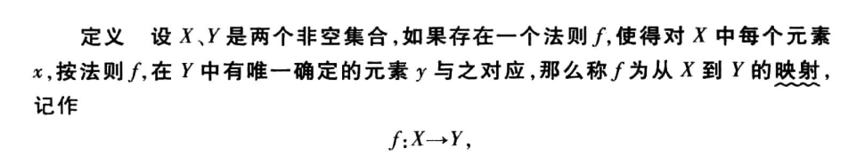  

**非空==集合==**  X,Y    
**法则** $ f $ ，对X中每个==元素==*x*，***唯一***的y与之对应  
**$f$映射**  $f$: X$\to$Y ， **X** 像  **Y** 原像   
**X**：定义域 $D_f$ Domain  
**值域**：$R_f$ Range  $R_f\subset Y$ 

**注意：映射与函数的区别**
> 映射是集合与集合之间的关系，函数是数集与数集之间的对应  

**注意**  
1. 三要素：X，$f$，$R_f$
2. $x\in X$,对应的y是唯一的\
   $R_f = Y$，$R_f \neq Y$
   
**满射**：$R_f = Y$  
**单射**：$\forall  x_1 \neq x_2$ ,$f(x_1) \neq f(x_2)$  
**一一映射**：单射，满射  
**逆映射**：设$f : R_f \to X$单射,每个$y \in R_f$, 有==唯一==的$x \in X$, $f(x) = y$    
 $g:R_f \to X$, $f^{-1}$, $D_{f1} = R_f$, $R_{f^{-1}} = X$  
**复合映射**：$g: X \to Y_1,f: Y_2 \to Z$  
 若$Y_1 \subset Y_2, x \in X, 则有f[g(x)] \in Z$  
 记作$f \circ g:X \to Z,(f \circ g)(x) = f[g(x)], R_g \subset D_f$  

**注意**  
> $f \circ g$ 的条件$R_g \subset D_f$，故$g和f$的复合映射是有顺序的，即 $f \circ g$与 $g \circ f$的意义并不相同  

### 函数  

  

**x** 自变量  
**y** 因变量  
**定义域** 记作$D_f，D_f = D$  
**值域** $R_f = f(D)$  
$f$代表规则，$f(x)$代表函数值  

### 函数的特性  

#### 有界性  

**上界**：$\exist k_1 ，f(x)\leq k_1$  
$f(x)= -\frac{1}{x} (x > 0),f(x) \leq 0，0是一个上界$  
上界可以有无穷多个，例如1也是其一个上界   
**下界**：$\exist k_2 ，f(x)\geq k_2$  
**有界**：$\exist 正数M，\lvert f(x) \rvert \leq M$  
$有界\Leftrightarrow 上界，下界$  
$若\forall 正数M ， \exist x_1 \in X , \lvert f(x_1) \rvert > M,则函数无界$  

#### 单调性  

**单调递增** $x_1 < x_2,f(x_1) < f(x_2)$  
**单调递减** $x_1 < x_2,f(x_1) > f(x_2)$  

#### 奇偶性  

**偶** $f(x) = f(-x)$  
**奇** $-f(x) = f(-x)$  

#### 周期性  

$f(x+l) = f(x)$  

**注意**  

> 并非每个周期函数都有最小正周期  

例：
> $D(x) = \begin{cases} 1,\quad x\in Q\\0, \quad x\in Q^C \end{cases}$  
> $\forall r \in Q,r+l仍为有理数,即f(r) = f(r+1) =1$
> $\forall r \in Q^C,r+l仍为无理数,即f(r) = f(r+1) =0$
> $故该函数的周期为任意实数r$

### 反函数，复合函数与初等函数    

#### 反函数  

$设f:D\to f(D)单射，则f^{-1}:f(D) \to D$  
$若f单射，则f^{-1}必存在；若f单调，则f^{-1}单调；若f增（减），则f^{-1}增（减）$  
$f与f^{-1}关于y=x对称$  

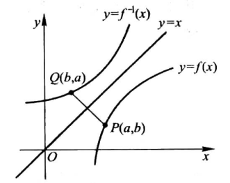  

#### 复合函数  

$y=f(t),t=g(x)$  
$y=f(g(x)),t为中间变量$
$先g后f的次序的复合函数，记作f\circ g$  

**运算**  
$f(x),g(x),D^f,D^g,D=D^f \cap D^g \neq \varnothing$  
$(f \pm g)(x)=f(x)\pm g(x) $  
$(f \cdot g)(x) = f(x)\cdot g(x)$  
$(\frac {f}{g}) = \frac{f(x)}{g(x)}$

#### 初等函数  

**幂函数**：$y=x^a$  
**指数函数**：$y=a^x$  
**对数函数**：$y = \log_{a}{x} $  
**三角函数**  
**反三角函数**  

> 由==常数==和==基本初等函数==经过==有限次==的***四则运算***和==有限次==的***函数复合步骤***所构成并可用一个式子表示的函数，成为初等函数

## 数列的极限  

### 数列极限的定义  

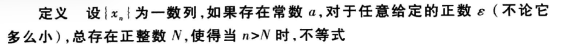  
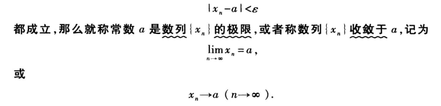  

$\forall  \varepsilon > 0,  \exist N,便当n>N时，\lvert x_n - a \rvert < \varepsilon $  

**$\varepsilon$**:任意小的距离  
**N**：某项  
**n**: 这项后的所有项  
**$\lvert x_n - a \rvert$**:都落在小区间的里面  
**a**：极限  

$对于两个数a和b，它们间的接近程度可用\lvert a - b \rvert 来表示，若\lvert a-b\rvert 越小，则代表a和b越接近.$  
$同样的，对于\lvert x_n - a \rvert ，当n\to \infty 时，若有\lvert x_n - a \rvert \to 0,则a就是数列{x_n}的极限.$  
$若不存在一个a使得n \to \infty 时,存在\lvert x_n - a \rvert \to 0(或者说使得其足够小)，则我们说数列\lbrace x_n \rbrace没有极限，或者称数列\lbrace x_n \rbrace是$==发散==$的(\lim_{n\rightarrow+\infty}x_n不存在),反之则是$==收敛==$的.$  

> 例：$2,\frac{1}{2},\frac{4}{3},\frac{3}{4},...,\frac{n+(-1)^{n-1}}{n},...的极限是1$  
>
> 分析：$\lvert x_n - 1 \rvert = \lvert \frac{n+(-1)^{n-1}}{n} \rvert = \lvert \frac{(-1)^{n-1}}{n} \rvert = \frac{1}{n} < \varepsilon , n > \frac{1}{\varepsilon}$  
>
> 解： $\forall \varepsilon >0,取N > [\frac{1}{\varepsilon}] + 1,n> N时 \lvert x_n - 1 \rvert = \lvert \frac{n+(-1)^{n-1}}{n} \rvert = \lvert \frac{(-1)^{n-1}}{n} \rvert = \frac{1}{n} < \varepsilon$
> $故数列的极限是1$

### 收敛数列的性质  

#### 极限的唯一性   

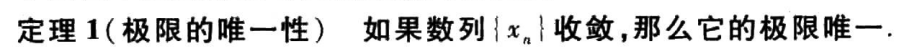  

> 证：
>
> 假设数列有两个极限a，b  
> $x_n \to a,x_n \to b,(a \neq b)a < b.$ $取\varepsilon = \frac{b-a}{2}(因为\varepsilon 是任意大于0的正数，故\lvert x_n - a \rvert < \varepsilon 中存在任何一个\varepsilon 使得不等式不成立，则题目不成立)$  
>  $\lim_{n\rightarrow +\infty}x_n=a,\exist N_1,n>N时 \lvert x_n - a \rvert < \frac{b - a}{2}  \Rightarrow -\frac {b-a}{2}<x_n-a<\frac{b-a}{2} \Rightarrow \frac{3a-b}{2}<x_n<\frac{a+b}{2}$  
> $\lim_{n\rightarrow +\infty}x_n=b,\exist N_2,n>N时 \lvert x_n - b \rvert < \frac{b - a}{2}  \Rightarrow -\frac {b-a}{2}<x_n-b<\frac{b-a}{2} \Rightarrow \frac{a+b}{2}<x_n<\frac{3b-a}{2}$  
> $由于上式中的x_n<\frac{a+b}{2}与下式中的\frac{a+b}{2}<x_n矛盾，故假设不成立$  
>$故收敛数列只有一个极限$  

####  收敛数列的有界性     

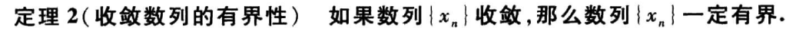  

> 证：
>
> $设\lim_{n\rightarrow \infty}x_n = a,对于\varepsilon = 1,\exist N,当n > N时，有$
> $\lvert x_n - a\rvert <1$
> $\lvert x_n \rvert = \lvert x_n -a + a\rvert \leq \lvert x_n -a \rvert + \lvert a \rvert < \lvert a \rvert +1$
> $故n > N时，\lvert x_n \rvert < \lvert a \rvert +1 有界$
> $M = _{max}\lbrace \lvert x_1\rvert ,\lvert x_2\rvert ,\lvert x_3 \rvert ,...,\lvert x_n\rvert ,\lvert a \rvert + 1\rbrace$  
> $\lvert x_n \rvert \leq M$ 
> $故\lvert x_n \rvert \leq M ,有界$ 

**注意**  
>此性质反过来不一定成立，例如数列$\lbrace (-1)^{n+1} \rbrace$虽有界但不收敛  

####  收敛数列的保号性  

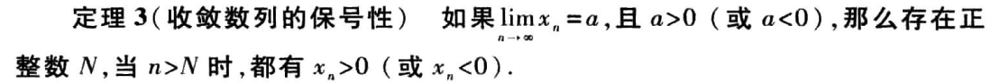  

> 证：
>
> $a > 0时，\varepsilon = \frac{a}{2} > 0,\exist N > 0,n > N时$
> $\lvert x_n -a \rvert < \frac{a}{2}$  
> $-\frac{a}{2} < x_n -a 
< \frac {a}{2}$   
>$0<\frac{a}{2}<x_n<\frac{3}{2}a$  
>$x_n > 0$

#### 收敛数列的保号性的推论  

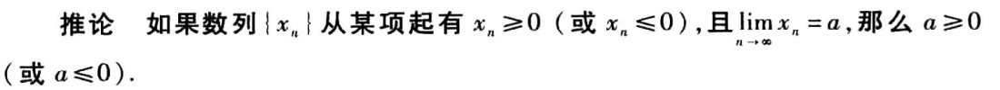  

#### 收敛数列与其子数列间的关系  

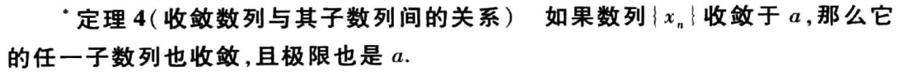  

> 证：
>
> $设数列\lbrace x_{n_k}\rbrace 是数列\lbrace x_n \rbrace 的任一子数列 $  
>$由于\lim_{n\rightarrow \infty}x_n=a,故\forall \varepsilon >0,\exist N,当n>N时，\lvert x_n-a \rvert<\varepsilon 成立$
$取K=N,则当k>K时，n_k>n_K=n_N\geq N $
>$故\lvert x_{n_k}-a\rvert < \varepsilon $
>$故\lim_{k\to \infty}x_{n_k}=a 成立$

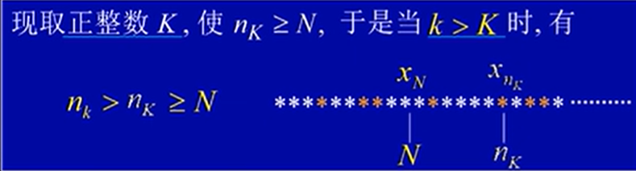  

**注意**  

>  由此性质可知，若数列有两个子数列收敛于不同的极限，则原数列一定发散  

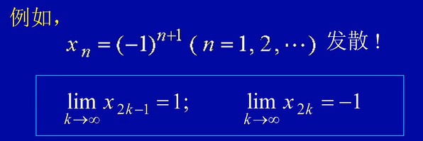  

## 函数的极限  

### 函数极限的定义  

#### 自变量趋于有限值时函数的极限 

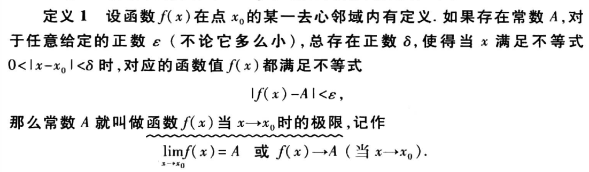  

$假定f(x)在x_0的$==去心领域==$内有定义（在x_0处可以没有定义）$  
$\exist A,\forall \varepsilon >0,\exist \delta>0,0<\lvert x-x_0\rvert<\delta 时$  
$\lvert f(x)-A\rvert <\varepsilon$
$\lim_{x\to x_0}f(x)=A(f(X)\to A(x\to x_0))$  

$0<\lvert x-x_0\rvert 是为了保证x\neq x_0$

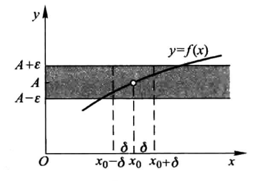  

##### 左极限  

$x仅从x_0的左侧趋近于x_0,记作：$  
$\lim_{x\to {x_0}^-}f(X)=A,或x\to {x_0}^-$  

##### 右极限  

$x仅从x_0的右侧趋近于x_0,记作：$  
$\lim_{x\to {x_0}^+}f(X)=A,或x\to {x_0}^+$  

> 左极限和右极限统称为==单侧极限==  

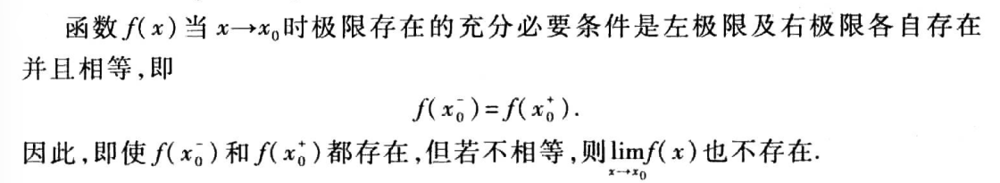  

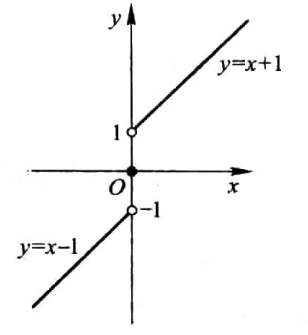  

#### 自变量趋于无穷大时函数的极限  

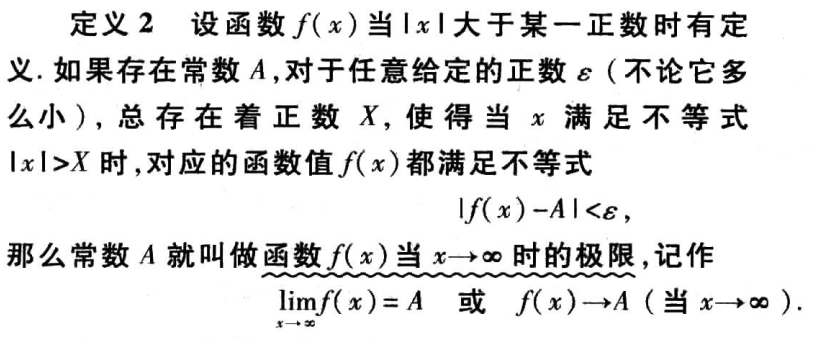  

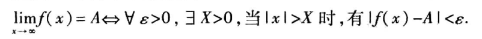  

### 函数极限的性质  

#### 函数极限的唯一性  

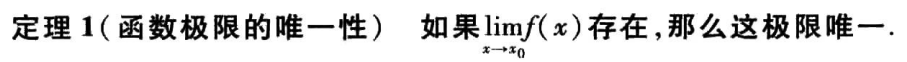 

#### 函数极限的局部有界性  

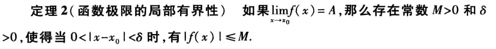  
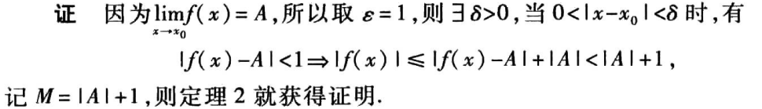  

#### 函数极限的局部保号性  

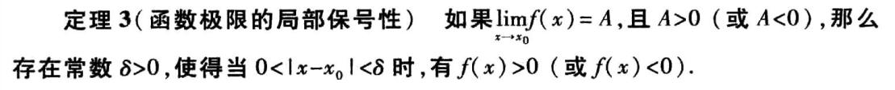 
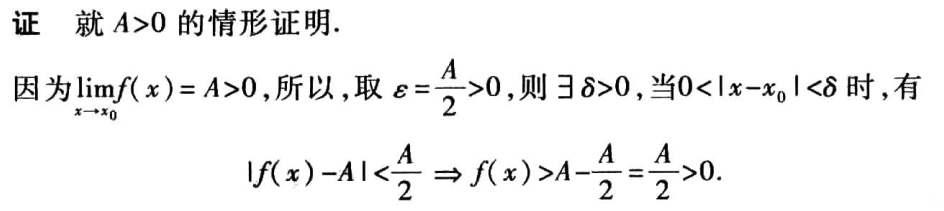  

#### 

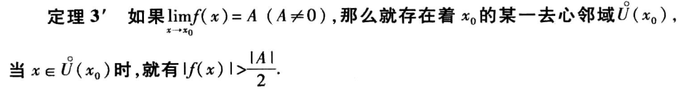  

#### 推论  

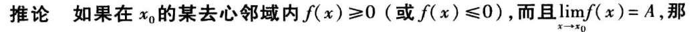  
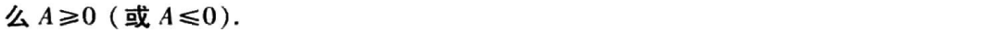  

#### 函数极限与数列极限的关系  

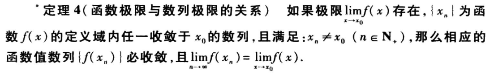  
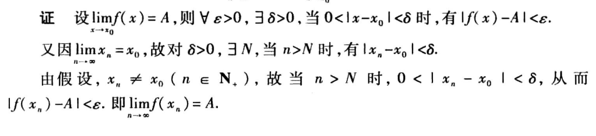  

