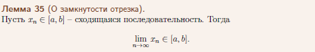
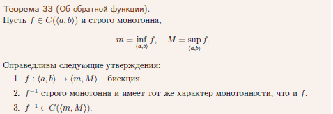

**1.Непрерывности функции и классификация разрывов**  
Определение непрерывной функции в точке (через ε-δ и неравенства, ε-δ-окрестности, окрестности) и на множестве. Лемма о связи непрерывности и предела. Лемма о характеристике непрерывности в терминах односторонних пределов. Определение точек разрыва и их классификация.  

  

  

  

  

  

  

  

  

  

**2.Локальные свойства непрерывных функций**  
Определение непрерывной функции в точке (через ε-δ и неравенства, ε-δ-окрестности, окрестности). Определение точек разрыва и их классификация. Теорема о пяти локальных свойствах непрерывной функции (локальные свойства, непрерывность суммы, произведения и отношения функций). Теорема о непрерывности композиции функций.  

  

  

  

  

  

   

  

  

**3.Теорема Вейерштрасса**  
Определение непрерывной функции в точке (через ε-δ и неравенства, ε-δ-окрестности, окрестности). Определение точек разрыва и их классификация. Лемма о замкнутости отрезка. Теорема Вейерштрасса.  

  

  

  

  

  

  

  

  

**4.Теоремы Больцано-Коши**  
Определение непрерывной функции в точке (через ε-δ и неравенства, ε-δ-окрестности, окрестности). Определение точек разрыва и их классификация. Первая и вторая теоремы Больцано-Коши.  

  

  

  

  

  

  

  

  

**5.Непрерывность и монотонность функции**  
Определение возрастания и убывания функции, монотонной функции. Определение непрерывной функции в точке (через ε-δ и неравенства, ε-δ-окрестности, окрестности). Критерий непрерывности монотонной функции. Теорема об обратной функции.  

  

  

  

  

  

  

  

  

  

  

**6.Равномерная непрерывность**  
Определение непрерывной функции на множестве (через ε-δ и неравенства, ε-δ-окрестности, окрестности). Определение равномерно непрерывной функции на множестве. Лемма о связи равномерной непрерывности и непрерывности функции. Теорема Кантора.  

  

  

  

  

  

**7.Производная и дифференциал**  
Определение производной функции, дифференцируемости функции, дифференциала. Теорема о связи производной и дифференцируемости. Лемма о непрерывности дифференцируемой функции. Определение касательной к графику функции. Лемма об уравнении касательной.==Геометрический смысл производной и дифференциала.== Определение вертикальной касательной.  

  

  

  

  

  

  

  

  

  

**8.Основные правила дифференцирования (производная суммы, произведения и частного)**  
Определения производной и дифференциала функции. Теорема о производной и дифференциале суммы, произведения, частного функций.  

  

  

  

  

**9.Основные правила дифференцирования (производная композиции функций и обратной функции)**  
Определения производной и дифференциала функции. Теорема о производной и дифференциале композиции функций. Теорема о производной и дифференциале обратной функции.  

  

  

  

  

  

  

**10.Французские теоремы (Ферма, Ролля)**  
Определение возрастания и убывания функции, монотонной функции, точек локального максимума, минимума и экстремума. Теорема Ферма, геометрический смысл. Теорема Ролля, геометрический смысл.  

  

  

  

  

  

  

**11.Французские теоремы (Лагранжа)**  
Определения производной и дифференциала функции. Теорема Лагранжа, геометрический смысл. Определение возрастания и убывания функции, монотонной функции. Критерий монотонности функции. Критерий постоянства функции.  

  

  

  

  

  

  

  

  

**12.Французские теоремы (Коши)**  
Определения производной и дифференциала функции. Теорема о пределе производной. Теорема Коши, геометрический смысл.  

  

  

  

  

  

*备注 139*
柯西定理的几何解释与拉格朗日定理的几何解释相同。  
假设 \( g'(t) \neq 0 \) 在区间 \((a, b)\) 上成立。那么，可以证明要么 \( g'(t) > 0 \) 在 \((a, b)\) 上成立，要么 \( g'(t) < 0 \) 在 \((a, b)\) 上成立。因此，系统  

\[
\begin{cases} 
x = g(t) \\ 
y = f(t) 
\end{cases}, \quad t \in [a, b]
\]  

参数化地定义了函数 \( y = f(g^{-1}(x)) \)。在表达式  

\[
\frac{f(b) - f(a)}{g(b) - g(a)} = \frac{f'(ξ)}{g'(ξ)}
\]  

中，左边是连接函数 \( y = f(g^{-1}(x)) \) 图形两端的弦的斜率，而右边是该函数图形在某个中间点 ξ 处的切线的斜率（参见定理 53）。

**13.Французские теоремы (Лопиталя)**  
Определения производной и дифференциала функции. Теорема Лопиталя.  

  

  

  

**14.Формула Тейлора**  
Определения производной и дифференциала функции. Определения производной и дифференциала высшего порядка. Определение многочлена Тейлора. Теорема о формуле Тейлора с остатком в форме Пеано. Теорема о единственности многочлена Тейлора.Теорема о характеристике остаточного члена в формуле Тейлора (без доказательства). Следствия об остаточных членах в формах Лагранжа и Коши.  

  

  

  

  

  

  

  

  

*定理 65*（关于余项特征的定理）。  
假设函数 \( f \) 及其前 \( n \) 阶导数在端点 \( x_0 \) 和 \( x \) 之间的区间上连续，并且在该区间的内点具有 \( (n+1) \) 阶导数。那么，对于任何在该区间上连续且在内点具有非零导数的函数 \( \varphi \)，存在一个介于 \( x_0 \) 和 \( x \) 之间的点 \( \xi \)，使得  

\[
r_n(x, x_0) = \frac{\varphi(x) - \varphi(x_0)}{\varphi'(\xi)n!} f^{(n+1)}(\xi)(x-\xi)^n.
\]

这个定理描述了泰勒公式中余项的特征。它表明，余项 \( r_n(x, x_0) \) 可以通过函数 \( \varphi \) 和 \( f \) 的导数在某个中间点 \( \xi \) 的值来表示。这个结果在分析泰勒展开的误差和近似精度时非常有用。  

  

  

**15.Исследование функции с помощью производных (монотонность и экстремумы)**  
Определение возрастания и убывания функции, монотонной функции, точек локального максимума, минимума и экстремума. Теорема о необходимом условии экстремума. Теорема о первом достаточном условии экстремума. Теорема о втором достаточном условии экстремума. Классификация точек экстремума.  

  

  

  

  

  

  

  

  

**16.Исследование функции с помощью производных (выпуклость и точки перегиба – 1)**  
Определение выпуклой функции. Критерий выпуклости в терминах наклона хорд. Определения производной и дифференциала функции. Критерий выпуклости дифференцируемой функции. Определение точки перегиба.  

  

关于弦斜率的凸性准则  

  

  

  

  

拐点的概念  

  

**17.Исследование функции с помощью производных (выпуклость и точки перегиба – 2)**  
Определение выпуклой функции. Критерий выпуклости дважды дифференцируемой функции. Теорема о характеристике выпуклости в терминах касательных. Определение точки перегиба.  

  

二阶可微函数的凸性准则  

  

  

拐点的概念  

  

**18.Исследование функции с помощью производных (асимптоты)**  
Определение асимптоты, виды асимптот. Теорема о формулах для коэффициентов наклонной асимптоты. Лемма о связи выпуклости и асимптоты.  

  

  

  

   

  