# [MainPage](../readme.md)/OPD

# Часть 1. Базовая ЭВМ

## 1.1 Назначение базовой ЭВМ

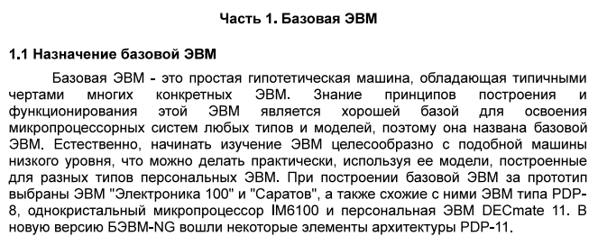

基础计算机是一种简单的假设机器，具有许多计算机的典型特征。了解计算机的构建和功能原理是掌握任何类型和型号的微处理器系统的良好基础，因此它被称为基础计算机。自然，从这种低级别的机器开始学习计算机是合适的，这可以通过使用为不同类型个人计算机构建的模型来实际进行。在构建基础计算机时，选择了“电子100”和“萨拉托夫”计算机作为原型，以及与它们相似的PDP-8型计算机、单芯片微处理器IM6100和个人计算机DECmate 11。新版本的BÉVM-NG中包含了PDP-11架构的一些元素。

## 1.2 Структура базовой ЭВМ

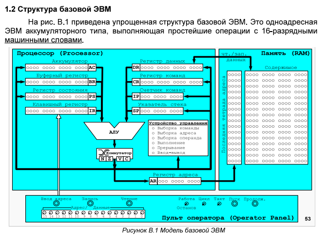

图8.1展示了基础计算机的简化结构。这是一种累加器型单地址计算机，能够对16位机器字执行最简单的操作。

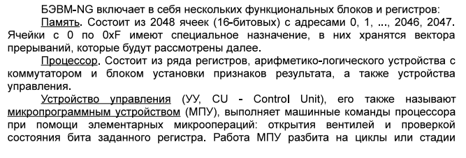


BÉVM-NG 包含多个功能块和寄存器：
**存储器**：由2048个（16位）单元组成，地址为0, 1, ..., 2046, 2047。地址从0到0xF的单元具有特殊用途，用于存储中断向量，这些内容将在后续讨论。
**处理器**：由一系列寄存器、算术逻辑单元（带交换器和结果标志设置单元）以及==控制单元==组成。
**控制单元（УУ, CU - Control Unit)**，也称为微程序单元（МПУ），通过基本微操作执行处理器的机器指令：打开门控并检查指定寄存器的位状态。МПУ的工作分为指令执行周期或阶段以及控制台操作周期。МПУ的详细内容将在后续讨论。

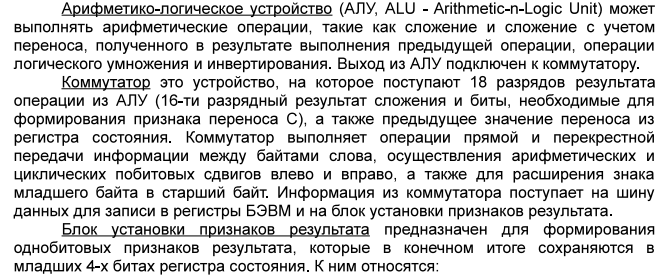

**算术逻辑单元（АЛУ, ALU - Arithmetic and Logic Unit）** 能够执行算术运算，例如加法、带进位的加法（考虑前一次操作产生的进位）、逻辑乘法和取反操作。ALU的输出连接到交换器。
**交换器** 是一种设备，接收来自ALU的18位运算结果（16位加法结果和形成进位标志C所需的位），以及来自状态寄存器的前一次进位值。交换器执行字节之间的直接和交叉信息传输操作，实现算术和循环的逐位左移和右移，以及将低字节的符号位扩展到高字节。交换器的信息通过数据总线传输，用于写入BÉVM的寄存器以及结果标志设置单元。
**结果标志设置单元** 用于生成单比特的结果标志，这些标志最终保存在状态寄存器的低4位中。这些标志包括：

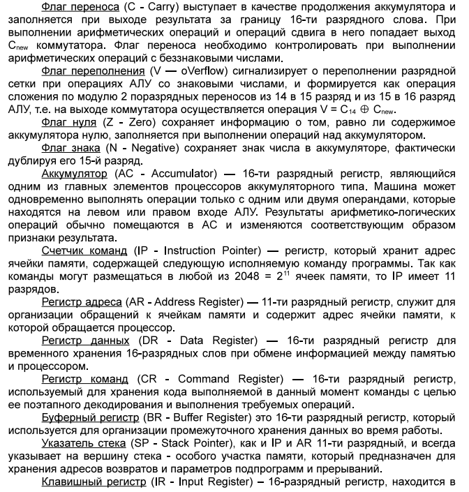

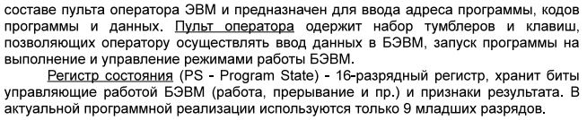

**进位标志（C - Carry）** 作为累加器的扩展，当结果超出16位字的范围时会被填充。在执行算术运算和移位操作时，交换器的输出Cnew会进入该标志。在执行无符号数的算术运算时，需要控制进位标志。
**溢出标志（V - Overflow）** 在ALU对有符号数进行操作时，指示位网格的溢出情况。它通过对ALU的第14位到第15位和第15位到第16位的进位进行模2加法运算生成，即在交换器的输出端执行操作 V = С14 XOR Сnew。
**零标志（Z - Zero）** 保存累加器内容是否为零的信息，在对累加器执行操作时填充。
**符号标志（N - Negative）** 保存累加器中数字的符号，实际上复制了其第15位。

**累加器（AC - Accumulator）** 是一个16位寄存器，是累加器型处理器的主要元素之一。机器只能同时对一个或两个操作数执行操作，这些操作数位于ALU的左侧或右侧输入。算术逻辑运算的结果通常放入AC，并相应地修改结果标志。

**指令指针（IP - Instruction Pointer）** 是一个寄存器，存储包含下一条要执行的程序指令的内存单元地址。由于指令可以位于2048 = 2^11个内存单元中的任何一个，因此IP有11位。

**地址寄存器（AR - Address Register）** 是一个11位寄存器，用于组织对内存单元的访问，并包含处理器访问的内存单元地址。

**数据寄存器（DR - Data Register）** 是一个16位寄存器，用于在内存和处理器之间交换信息时临时存储16位字。

**指令寄存器（CR - Command Register）** 是一个16位寄存器，用于存储当前正在执行的指令代码，以便逐步解码并执行所需操作。

**缓冲寄存器（BR - Buffer Register）** 是一个16位寄存器，用于在工作期间组织数据的中间存储。

**栈指针（SP - Stack Pointer）** 与IP和AR一样是11位寄存器，始终指向栈顶——内存中的一个特殊区域，用于存储子程序和中断的返回地址和参数。

**键盘寄存器（IR - Input Register）** 是一个16位寄存器，位于计算机操作员控制台中，用于输入程序地址、程序代码和数据。操作员控制台包含一组开关和按键，允许操作员向BÉVM输入数据、启动程序执行并控制BÉVM的工作模式。

**状态寄存器（PS - Program State）** 是一个16位寄存器，存储控制BÉVM工作的位（如运行、中断等）以及结果标志。在实际的软件实现中，仅使用低9位。

## 1.3 Система команд базовой ЭВМ

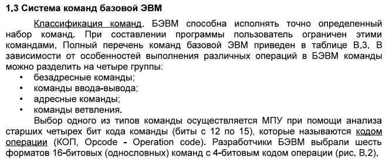

### 指令分类

BÉVM 能够执行一组明确规定的指令。用户在编写程序时受限于这些指令。基础计算机的完整指令集如表8.3所示。根据BÉVM中执行不同操作的特点，指令可以分为四组：

- **无地址指令**；
- **输入输出指令**；
- **地址指令**；
- **分支指令**。

### 指令格式

微程序单元（МПУ）通过分析指令代码的高4位（第12至15位，称为操作码 - КОП, Opcode）来选择指令类型。BÉVM的设计者选择了六种16位（单字）指令格式，其中包含4位操作码（见图8.2）。

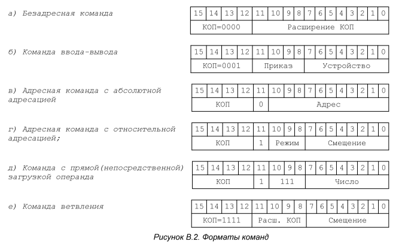

### 指令格式说明

a) **无地址指令**
b) **输入输出指令**
c) **绝对寻址的地址指令**
d) **相对寻址的地址指令**
e) **直接（立即）加载操作数的指令**
f) **分支指令**

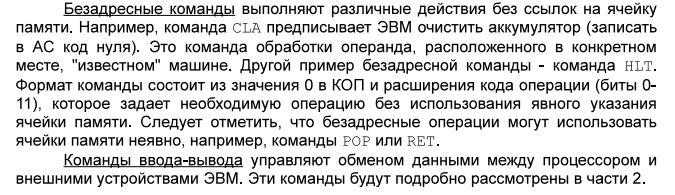

### 无地址指令

无地址指令执行各种操作时无需引用内存单元。例如，**CLA** 指令指示计算机清除累加器（将零代码写入AC）。这是一种处理位于机器“已知”特定位置的操作数的指令。另一个无地址指令的例子是 **HLT** 指令。该指令的格式由操作码（КОП）中的值0和操作码扩展（第0-11位）组成，这些扩展指定了所需的操作，而无需显式引用内存单元。需要注意的是，无地址操作可能会隐式使用内存单元，例如 **POP** 或 **RET** 指令。

### 输入输出指令

输入输出指令控制处理器与计算机外部设备之间的数据交换。这些指令将在第2部分中详细讨论。

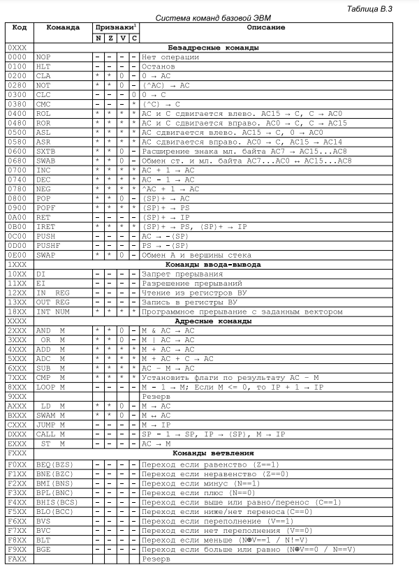


### 备注：

1. **结果标志列中的值** 表示执行操作后相应标志的变化情况：
   - **«-»**：指令不影响该标志；
   - **«0»**：标志被清零；
   - **«*»**：标志的值根据操作结果设置。

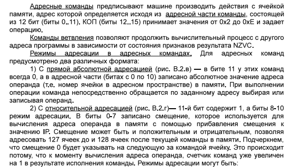

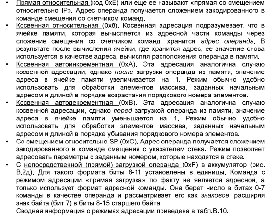

### 地址指令

地址指令指示计算机对内存单元执行操作，该内存单元的地址由指令的地址部分（由12位组成，第0-11位）确定。操作码（КОП，第12-15位）的取值范围为0x2到0xE，用于指定操作。

### 分支指令

分支指令允许根据结果标志（NZVC）的状态从程序的另一个地址继续执行计算过程。

### 地址指令的寻址模式

地址指令有两种不同的格式：

1. **直接绝对寻址**（图8.2.в）：

   - 这些指令的第11位始终为0，地址部分（第0-10位）存储操作数的绝对地址（即内存地址空间中的单元号）。
   - 执行操作时，指令直接访问指定地址以读取或写入操作数。
2. **相对寻址**（图8.2.г）：

   - 第11位为1，第8-10位表示寻址模式。
   - 第0-7位存储偏移量，该偏移量与指令指针（IP）的值相加，用于计算操作数在内存中的地址。
   - 偏移量可以是正数或负数，允许寻址当前指令之前127个单元和之后128个单元的内存。
   - 需要注意的是，偏移量为0时指向指令后的下一个单元。这是因为在计算操作数地址时，指令指针已因指令执行而增加了1。

### 寻址模式包括：

1. **直接相对寻址**（代码0xE）：

   - 也称为“相对于IP的直接寻址”。
   - 操作数地址通过将指令中编码的偏移量与指令指针（IP）相加得到。
2. **间接相对寻址**（代码0x8）：

   - 间接寻址意味着通过将偏移量与指令指针相加计算出的内存单元中存储的是操作数的地址。
   - 在计算存储地址的单元后，其值再次用作地址来计算操作数在内存中的位置。
3. **间接自增寻址**（代码0xA）：

   - 类似于间接寻址，但在从内存加载操作数后，内存单元中的地址值会增加1。
   - 此模式通常用于按升序处理数组元素，数组由起始地址和长度定义。
4. **间接自减寻址**（代码0xB）：

   - 类似于间接寻址，但在从内存加载操作数之前，内存单元中的地址值会减少1。
   - 此模式通常用于按降序处理数组元素，数组由起始地址和长度定义。
5. **相对于SP的偏移寻址**（代码0xC）：

   - 操作数地址通过将指令中编码的偏移量与栈指针（SP）相加得到。
   - 此模式允许寻址栈中具有指定编号的参数。
6. **直接加载操作数到累加器**（代码0xF，图В.2д）：

   - 对于这种格式，第8-11位设置为1。
   - 采用“直接加载”寻址模式的指令实际上并非地址指令，而仅使用地址指令的格式。
   - 它将指令第0-7位中的数字作为操作数，并将其视为有符号数，将字节的符号位（第7位）扩展到高字节的第8-15位。

有关寻址模式的详细信息请参见表В.1。

## 1.4 Представление данных в БЭВМ

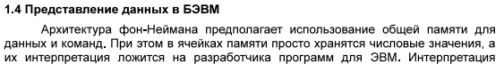

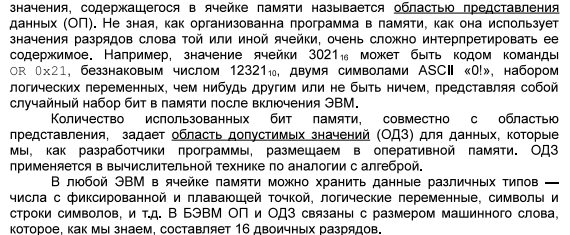

### 冯·诺依曼架构

冯·诺依曼架构假设使用共享内存来存储数据和指令。在这种情况下，内存单元中仅存储数值，而对其解释的责任则落在计算机程序开发者的肩上。对内存单元中值的解释称为**数据表示域（ОП）**。如果不了解程序在内存中的组织方式以及它如何使用某个内存单元的字位值，就很难解释其内容。例如，内存单元的值 **3021₁₆** 可能是指令 **OR 0x21** 的代码、无符号数 **12321₁₀**、两个ASCII字符 **«О!»**、一组逻辑变量、其他内容，或者在计算机启动后仅仅是内存中的随机比特序列。

### 数据表示域与有效值域

所使用的内存位数与数据表示域一起定义了**有效值域（ОДЗ）**，即我们作为程序开发者在内存中存储的数据允许的取值范围。ОДЗ 在计算技术中的应用类似于代数中的概念。

### 数据类型

在任何计算机中，内存单元都可以存储各种类型的数据，例如：

- 定点数和浮点数；
- 逻辑变量；
- 字符和字符串；
- 其他类型的数据。

在基础计算机（BÉVM）中，数据表示域和有效值域与机器字的大小相关，而机器字的大小为 **16位二进制**。

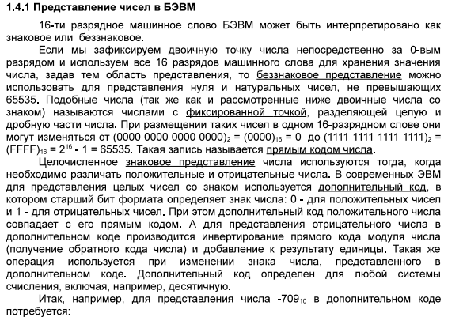

### 1.4.1 BÉVM 中的数字表示

BÉVM 的16位机器字可以解释为有符号数或无符号数。

#### 无符号数表示

如果我们将二进制小数点固定在最低位（第0位）之后，并使用所有16位机器字来存储数值，从而定义数据表示域，则无符号表示可用于表示零和不超过65535的自然数。这类数字（以及下文讨论的有符号二进制数）称为**定点数**，其小数点分隔整数部分和小数部分。当这些数字存储在一个16位字中时，其取值范围为：

- **(0000 0000 0000 0000)₂ = (0000)₁₆ = 0**
- **(1111 1111 1111 1111)₂ = (FFFF)₁₆ = 2¹⁶ - 1 = 65535**
  这种表示称为数字的**原码**。

#### 有符号数表示

当需要区分正数和负数时，使用有符号整数表示。在现代计算机中，有符号整数通常使用**补码**表示，其中最高位表示符号：

- **0** 表示正数；
- **1** 表示负数。

正数的补码与其原码相同。而对于负数，补码的计算方法如下：

1. 对数值的绝对值取反（得到反码）；
2. 在反码的基础上加1。

同样的操作也用于改变补码表示的数的符号。补码的定义适用于任何进制，包括十进制。

#### 示例：表示 -709₁₀ 的补码

1. 首先，将709转换为二进制：
   - 709₁₀ = (0000 0010 1100 0101)₂
2. 取反（得到反码）：
   - (1111 1101 0011 1010)₂
3. 加1（得到补码）：
   - (1111 1101 0011 1011)₂ = (FD3B)₁₆

因此，-709₁₀ 的补码表示为 **(FD3B)₁₆**。

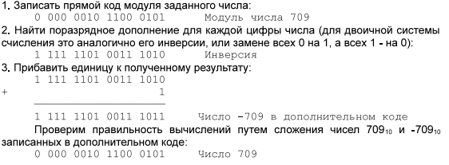

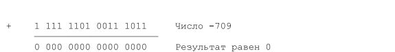

### 补码计算步骤

1. **写出给定数绝对值的原码**：

   - 709₁₀ = (0000 0010 1100 0101)₂
2. **对每一位取反（二进制中即取反码）**：

   - 原码：0000 0010 1100 0101
   - 反码：1111 1101 0011 1010
3. **将反码加1**：

   - 反码：1111 1101 0011 1010
   - 加1：1111 1101 0011 1011
   - 结果：(FD3B)₁₆

### 验证计算

通过将 **709₁₀** 和 **-709₁₀** 的补码相加来验证计算的正确性：

- 709₁₀ 的补码：0000 0010 1100 0101
- -709₁₀ 的补码：1111 1101 0011 1011

相加：

```
  0000 0010 1100 0101  
+ 1111 1101 0011 1011  
----------------------  
 10000 0000 0000 0000  
```

由于结果超出16位，最高位的1被丢弃，最终结果为 **0000 0000 0000 0000**，即 **0**，验证了计算的正确性。

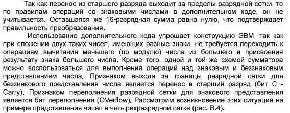

### 补码的优势

由于最高位的进位超出了位网格的范围，根据有符号数补码运算的规则，该进位被忽略。剩余的16位和为零，这验证了转换的正确性。

使用补码简化了计算机的设计，因为在处理两个符号不同的数相加时，无需执行从较大数（绝对值）中减去较小数的操作，也无需为结果分配较大数的符号。此外，同一加法器电路可以用于处理有符号数和无符号数的运算。

### 溢出检测

- **无符号数表示**：

  - 溢出标志是最高位的进位（C - Carry）。
- **有符号数表示**：

  - 溢出标志是溢出位（V - Overflow）。

让我们使用在四位数网格中表示数字的示例来考虑这些情况的发生（图 8.4）。

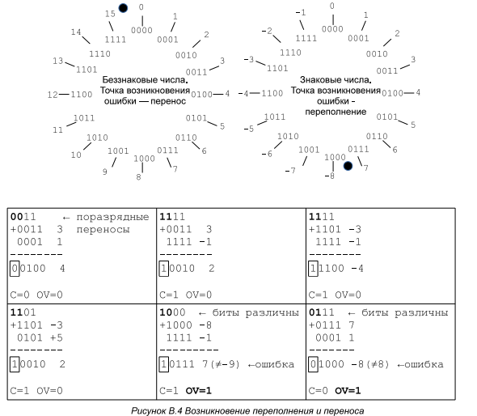

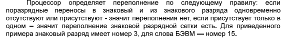

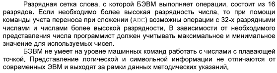

处理器根据以下规则判断溢出：如果符号位和从符号位的进位同时不存在或同时存在，则表示没有溢出；如果仅存在其中一个，则表示符号位网格溢出。对于上述示例，符号位是第3位，而对于BÉVM的字，符号位是第15位。

BÉVM执行操作的字位网格由16位组成。如果需要更高的数字位数，则可以通过带进位的加法指令（ADC）实现32位及更高位数的操作。根据所需的数字表示方式，程序员必须考虑所使用数字的最大值和最小值。

BÉVM在机器指令级别不支持浮点数的操作。逻辑和字符信息的表示方式与现代计算机相同，不在本方法指南的讨论范围内。

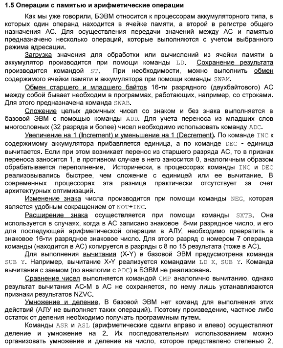


## 1.5 内存操作与算术操作

正如我们之前提到的，BÉVM属于累加器型处理器，其中一个操作数位于内存单元中，另一个位于通用寄存器AC中。为了实现AC与内存之间的值传输，设计了几种操作，这些操作会根据所选的寻址模式执行。

- **加载值**：使用 **LD** 指令将内存单元中的值加载到累加器中进行处理或计算。
- **保存结果**：使用 **ST** 指令保存结果。
- **交换内容**：如果需要，可以使用 **SWAM** 指令交换内存单元和累加器的内容。

在操作字符串等程序时，可能需要交换16位（双字节）AC的高字节和低字节。为此，设计了 **SWAB** 指令。

- **加法**：BÉVM使用 **ADD** 指令执行有符号和无符号整数的二进制加法。对于多字（32位及以上）数的低位字进位，需要使用 **ADC** 指令。
- **加1（Increment）和减1（Decrement）**：

  - **INC** 指令将累加器的内容加1。
  - **DEC** 指令将累加器的内容减1。
  - 如果AC的最高位产生进位，则进位标志设置为1，否则为0。溢出标志的处理方式类似。
  - 历史上，INC和DEC指令的实现比加1或减1更快。在现代处理器中，由于架构优化，这种差异几乎不存在。
- **改变符号**：使用 **NEG** 指令改变数字的符号，这是 **NOT + INC** 的便捷缩写。
- **符号扩展**：使用 **SXTB** 指令。当AC中存储了一个8位有符号数时，为了在ALU中进行后续算术操作，需要将其转换为16位有符号数。为此，将操作数的第7位（位于AC中）复制到结果的第8至15位（同样位于AC中）。
- **减法**：BÉVM使用 **SUB** 指令执行减法（X - Y）。例如，X - Y 可以通过 **LD X, SUB Y** 实现。BÉVM没有实现带借位的减法指令（类似于ADC）。
- **比较**：使用 **CMP** 指令执行比较操作，类似于减法，但减法结果 **AC - M** 不会保存到AC中，仅根据结果设置标志位NZVC。
- **乘法和除法**：BÉVM没有执行这些操作的指令（ALU不支持此类操作）。因此，乘积、商或余数需要通过软件方式实现。
- **算术移位**：

  - **ASR**（算术右移）和 **ASL**（算术左移）指令分别实现除以2和乘以2的操作。
  - 通过连续使用这些指令，可以实现乘以或除以2的幂次方的操作，例如2、4、8、16等。

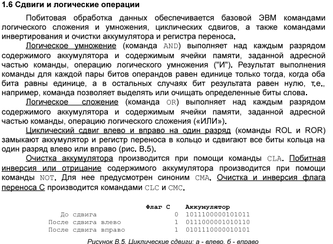

## 1.6 移位与逻辑操作

BÉVM通过逻辑加法和乘法指令、循环移位指令以及累加器和进位寄存器的取反和清除指令来实现逐位数据处理。

- **逻辑乘法（AND 指令）**：

  - 对累加器的每个位和指令地址部分指定的内存单元内容执行逻辑乘法（“与”）操作。
  - 仅当两个操作数的对应位都为1时，结果位才为1，否则为0。例如，该指令可用于提取或清除字的特定位。
- **逻辑加法（OR 指令）**：

  - 对累加器的每个位和指令地址部分指定的内存单元内容执行逻辑加法（“或”）操作。
- **循环左移和右移（ROL 和 ROR 指令）**：

  - 将累加器和进位寄存器连接成一个环，并将所有位向左或向右移动一位（见图В.5）。
- **清除累加器**：

  - 使用 **CLA** 指令清除累加器。
- **逐位取反（NOT 指令）**：

  - 使用 **NOT** 指令对累加器的内容进行逐位取反。该指令的别名是 **CMA**。
- **清除和取反进位标志（C 标志）**：

  - 使用 **CLC** 指令清除进位标志。
  - 使用 **CMC** 指令取反进位标志。

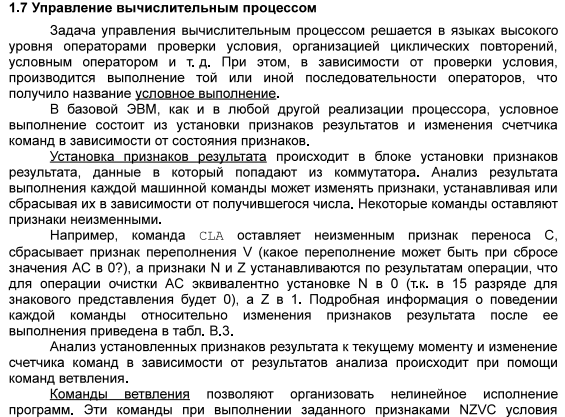

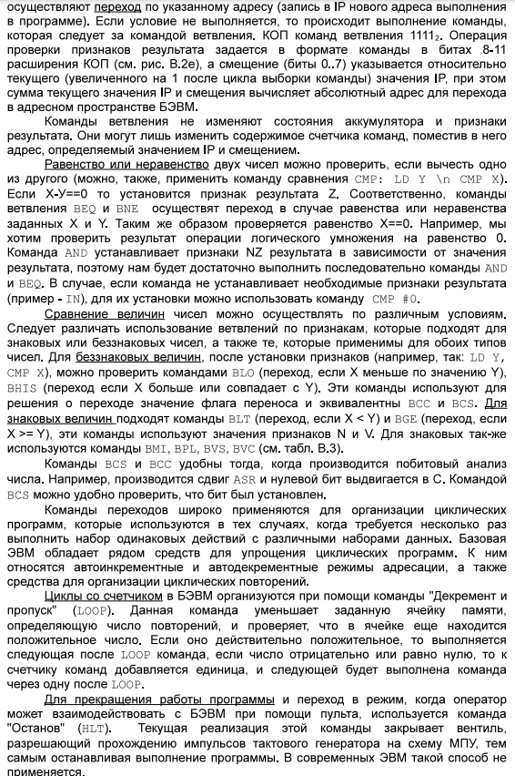

## 1.7 计算过程控制

在高级语言中，计算过程的控制通过条件检查语句、循环结构、条件语句等实现。根据条件的检查结果，执行不同的语句序列，这被称为条件执行。

在基础计算机（BÉVM）中，与任何其他处理器实现一样，条件执行包括设置结果标志并根据标志状态更改指令指针（IP）。

- **结果标志的设置**：

  - 结果标志在结果标志设置单元中设置，数据来自交换器。
  - 每条机器指令的执行结果可能会改变标志，根据结果设置或清除标志。某些指令不会改变标志。
  - 例如，**CLA** 指令不会改变进位标志（C），但会清除溢出标志（V）（因为将AC清零不会产生溢出），并根据操作结果设置符号标志（N）和零标志（Z）。对于清零操作，N设置为0（因为符号位为0），Z设置为1。
  - 每条指令对结果标志的影响详见表В.З。
- **分支指令**：

  - 分支指令根据当前设置的结果标志分析结果并更改指令指针（IP），从而实现非线性程序执行。
  - 如果满足条件，分支指令会跳转到指定地址（将新地址写入IP）；如果不满足条件，则继续执行分支指令后的下一条指令。
  - 分支指令的操作码为1111₂。条件检查由指令格式的第8-11位（扩展操作码）指定，偏移量（第0-7位）相对于当前IP值（指令取指周期后IP加1）计算，最终跳转地址为当前IP值与偏移量之和。
  - 分支指令不会改变累加器状态和结果标志，仅可能更改指令指针（IP）。
- **比较与分支**：

  - 通过减法或比较指令（如 **CMP**）检查两个数是否相等。如果 **X - Y == 0**，则设置零标志（Z）。分支指令 **BEQ** 和 **BNE** 分别在相等或不相等时跳转。
  - 类似地，可以检查 **X == 0**。例如，检查逻辑乘法结果是否为零时，**AND** 指令会根据结果设置N和Z标志，因此只需依次执行 **AND** 和 **BEQ** 指令。
  - 如果指令未设置所需标志（例如 **IN**），可以使用 **CMP #0** 来设置标志。
- **数值比较**：

  - 对于无符号数，可以使用 **BLO**（如果 **X < Y** 则跳转）和 **BHS**（如果 **X >= Y** 则跳转），这些指令使用进位标志（C）。
  - 对于有符号数，可以使用 **BLT**（如果 **X < Y** 则跳转）和 **BGE**（如果 **X >= Y** 则跳转），这些指令使用符号标志（N）和溢出标志（V）。
  - 其他有符号数分支指令包括 **BMI**、**BPL**、**BVS**、**BVC**（见表8.3）。
- **循环与计数**：

  - 分支指令广泛用于组织循环程序，适用于需要多次执行相同操作但使用不同数据集的场景。
  - BÉVM提供了简化循环程序的工具，例如自增和自减寻址模式，以及循环重复的组织方式。
  - 使用 **LOOP** 指令实现带计数器的循环。该指令减少指定内存单元中的计数值，并检查是否仍为正数。如果为正，则执行 **LOOP** 后的下一条指令；如果为负或零，则跳过下一条指令。
- **停止程序**：

  - 使用 **HLT** 指令停止程序并进入操作员可以通过控制台与BÉVM交互的模式。
  - 当前实现中，**HLT** 指令关闭允许时钟脉冲通过微程序单元（МПУ）的门控，从而停止程序执行。现代计算机不使用这种方式。

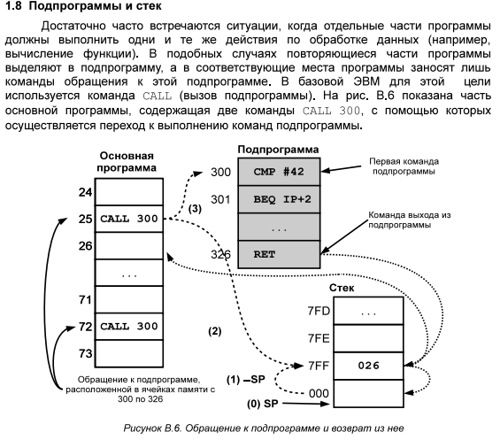

## 1.8 子程序与栈

在编程中，经常会遇到程序的不同部分需要执行相同的数据处理操作（例如计算函数）。在这种情况下，可以将重复的部分提取为子程序，并在程序中相应位置插入调用该子程序的指令。在基础计算机（BÉVM）中，使用 **CALL** 指令（调用子程序）来实现这一功能。

图В.6展示了主程序的一部分，其中包含两条 **CALL 300** 指令，用于跳转到子程序的指令执行。

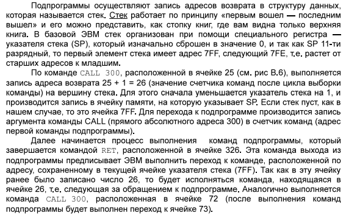

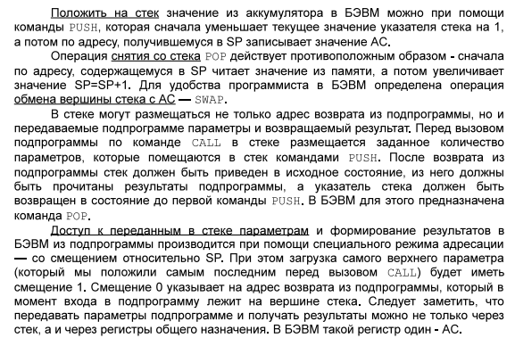

### 子程序与栈的工作原理

子程序通过将返回地址记录到一种称为**栈**的数据结构中来管理程序流程。栈遵循“后进先出”的原则，可以将其想象成一摞书，你只能看到最上面的一本书。在基础计算机（BÉVM）中，栈通过一个特殊的寄存器——**栈指针（SP）**来管理。SP初始值为0，由于SP是11位的，因此栈的第一个元素地址为 **7FF**，下一个为 **7FE**，即栈从高地址向低地址增长。

- **CALL 指令的执行**：

  - 假设位于地址 **25** 的 **CALL 300** 指令（见图В.6）被执行时，首先将返回地址 **25 + 1 = 26**（指令取指周期后的指令指针值）压入栈顶。
  - 为此，栈指针（SP）先减1，然后将返回地址写入SP指向的内存单元。如果栈为空（如本例），则写入地址 **7FF**。
  - 接着，将 **CALL** 指令的参数（绝对地址 **300**）写入指令指针（IP），从而跳转到子程序的第一条指令。
- **子程序的执行与返回**：

  - 子程序的指令从地址 **300** 开始执行，直到遇到位于地址 **326** 的 **RET** 指令。
  - **RET** 指令指示计算机跳转到栈顶保存的返回地址（即 **7FF** 中存储的地址 **26**）。
  - 因此，程序将继续执行地址 **26** 的指令，即 **CALL** 指令后的下一条指令。
- **第二次调用子程序**：

  - 类似地，当位于地址 **72** 的 **CALL 300** 指令被执行时，返回地址 **72 + 1 = 73** 被压入栈顶（地址 **7FE**）。
  - 子程序执行完毕后，**RET** 指令会将控制权返回到地址 **73** 的指令。

### 栈操作指令

- **PUSH** 指令：

  - 将累加器（AC）的值压入栈中。首先将栈指针（SP）减1，然后将AC的值写入SP指向的内存单元。
- **POP** 指令：

  - 从栈中弹出值到累加器（AC）。首先读取SP指向的内存单元的值，然后将栈指针（SP）加1。
- **SWAP** 指令：

  - 交换栈顶值与累加器（AC）的值，方便程序员操作。

### 栈中的参数与返回值

栈中不仅可以存储子程序的返回地址，还可以存储传递给子程序的参数和返回的结果。在调用子程序之前，可以通过 **PUSH** 指令将参数压入栈中。子程序返回后，栈应恢复到初始状态，并通过 **POP** 指令读取结果，同时将栈指针（SP）恢复到第一次 **PUSH** 之前的状态。

- **参数访问**：

  - 子程序通过相对于SP的偏移量访问栈中的参数。最顶部的参数（最后压入栈的）偏移量为1，偏移量0指向子程序的返回地址。
- **参数传递方式**：

  - 除了通过栈传递参数外，还可以通过通用寄存器传递参数。在BÉVM中，唯一的通用寄存器是累加器（AC）。

通过栈机制，BÉVM能够高效地管理子程序的调用、参数传递和返回值的处理，为复杂程序逻辑的实现提供了支持。

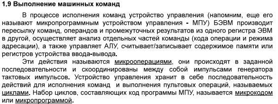

## 1.9 机器指令的执行

在执行指令的过程中，基础计算机（BÉVM）的控制单元（也称为微程序控制单元 - МПУ）负责将指令、操作数和中间结果从一个寄存器传输到另一个寄存器，分析指令的各个部分（操作码和寻址模式），并控制算术逻辑单元（ALU），读取/写入内存或输入输出设备寄存器的内容。

这些操作称为**微操作**，它们按照特定的顺序执行，并通过时钟脉冲发生器协调同步。控制单元存储了执行指令和控制台操作的步骤序列，这些步骤称为**周期**。构成微程序控制单元（МПУ）代码的周期集合称为**微代码**或**微程序**。

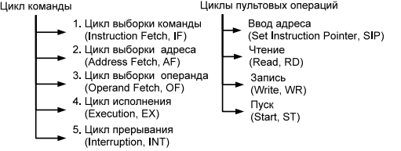

### 指令周期与控制台操作周期

1. **指令取指周期（Instruction Fetch, IF）**

   - **控制台操作**：输入地址（Set Instruction Pointer, SIP）
2. **地址取指周期（Address Fetch, AF）**

   - **控制台操作**：读取（Read, RD）
3. **操作数取指周期（Operand Fetch, OF）**

   - **控制台操作**：写入（Write, WR）
4. **执行周期（Execution, EX）**

   - **控制台操作**：启动（Start, ST）
5. **中断周期（Interruption, INT）**

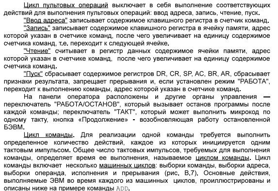

### 控制台操作周期

控制台操作周期包括执行控制台操作所需的相应操作：输入地址、写入、读取、启动。

- **输入地址**：将键盘寄存器的内容写入指令指针（IP）。
- **写入**：将键盘寄存器的内容写入指令指针（IP）指定的内存单元，然后将指令指针（IP）加1，即指向下一个内存单元。
- **读取**：将指令指针（IP）指定的内存单元内容读取到数据寄存器（DR），然后将指令指针（IP）加1。
- **启动**：清除数据寄存器（DR）、指令寄存器（CR）、栈指针（SP）、累加器（AC）、缓冲寄存器（BR）和地址寄存器（AR）的内容，清除结果标志，禁止中断。如果设置为“工作”模式，则跳转到指令指针（IP）指定的地址执行指令。

在操作员面板上还有其他控制装置：

- **“工作/停止”开关**：在每条指令执行后停止程序。
- **“单步”开关**：可以逐时钟周期执行微代码。
- **“继续”按钮**：恢复已停止的BÉVM的运行。

### 指令周期

执行一条指令需要完成一系列操作，每个操作由一个时钟脉冲触发。执行指令所需的总时钟脉冲数决定了指令的执行时间，称为指令周期。指令周期包括多个机器周期：指令取指、地址取指、操作数取指、执行和中断（见图8.7）。以下以 **ADD** 指令为例，说明每个机器周期中计算机执行的主要操作。

 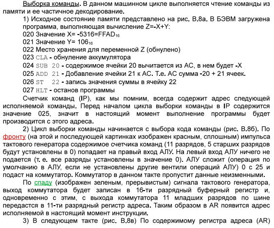

 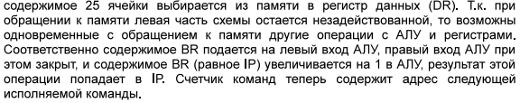

### 指令取指周期

在这个机器周期中，从内存中读取指令并进行部分解码。

1. **内存初始状态**（见图В.8а）：

   - BÉVM加载了一个计算 **Z = -X + Y** 的程序：

     - **020**：值 **X = -53₁₆ = FFAD₁₆**
     - **021**：值 **Y = 106₁₆**
     - **022**：存储变量 **Z** 的位置（初始化为0）
     - **023**：**CLA** - 清零累加器（AC）
     - **024**：**SUB 20** - 从AC中减去地址 **20** 的内容，AC中将存储 **-X**
     - **025**：**ADD 21** - 将地址 **21** 的内容加到AC中，即AC中存储 **-X + Y**
     - **026**：**ST 22** - 将结果写入地址 **22**
     - **027**：**HLT** - 停止程序
   - 指令指针（IP）始终包含下一条要执行的指令地址。在指令取指周期开始前，IP的值为 **025**，表示程序将从该地址开始执行。
2. **指令取指周期的开始**（见图В.8б）：

   - 在时钟脉冲的上升沿（图中红色实线表示），指令指针（IP）的11位内容（高5位设置为0）被送入算术逻辑单元（ALU）的右输入。ALU的左输入为空（所有位设置为0）。
   - ALU默认执行加法操作（如果未设置其他操作门控），将 **0** 与 **25** 相加，并将结果送入交换器。交换器在此周期中直接传递数据。
   - 在时钟脉冲的下降沿（图中绿色虚线表示），交换器的输出被写入16位缓冲寄存器（BR），同时交换器的低11位通过总线传输到11位地址寄存器（AR）。
   - 因此，AR中将存储当前执行的指令地址。
3. **下一个时钟周期**（见图В.8в）：

   - 根据地址寄存器（AR）的内容，从内存中读取地址 **25** 的内容到数据寄存器（DR）。
   - 由于访问内存时左侧电路未被使用，因此可以同时执行其他与ALU和寄存器相关的操作。
   - 缓冲寄存器（BR）的内容被送入ALU的左输入，ALU的右输入关闭。BR的内容（等于IP）在ALU中加1，结果被写入指令指针（IP）。
   - 指令指针（IP）现在包含下一条要执行的指令地址。

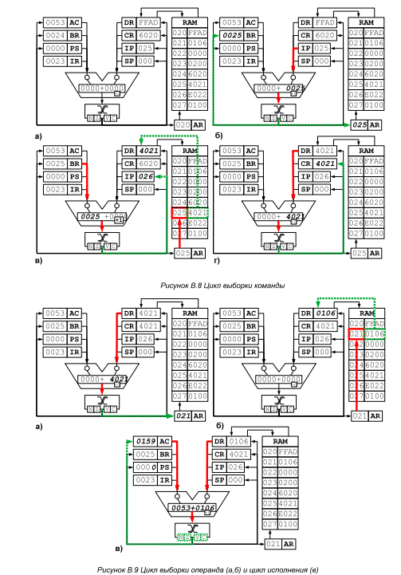

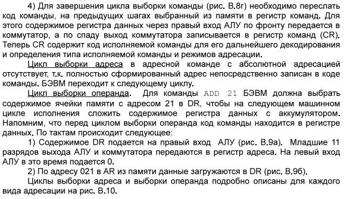

### 4) 完成指令取指周期（见图В.8г）

为了完成指令取指周期，需要将之前从内存中读取的指令代码传输到指令寄存器（CR）。为此，数据寄存器（DR）的内容通过ALU的右输入在时钟上升沿传输到交换器，然后在时钟下降沿将交换器的输出写入指令寄存器（CR）。现在，CR中包含要执行的指令代码，以便进一步解码并确定指令类型和寻址模式。

- **地址取指周期**：
  - 对于绝对寻址的地址指令，地址取指周期不存在，因为完整的地址直接编码在指令中。BÉVM直接进入下一个周期。

### 操作数取指周期

对于 **ADD 21** 指令，BÉVM需要从地址 **21** 的内存单元中读取内容到数据寄存器（DR），以便在执行周期中将数据寄存器的内容与累加器（AC）相加。

1. **步骤1**（见图В.9а）：

   - 数据寄存器（DR）的内容被送入ALU的右输入。
   - ALU和交换器的低11位输出被传输到地址寄存器（AR）。
   - ALU的左输入为0。
2. **步骤2**（见图В.9б）：

   - 根据地址寄存器（AR）中的地址 **021**，从内存中读取数据到数据寄存器（DR）。

### 地址取指与操作数取指周期的详细说明

每种寻址模式的地址取指和操作数取指周期详见图В.1 О。

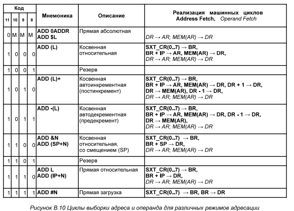

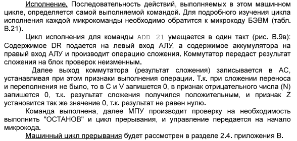

### 执行周期

在这个机器周期中，执行的操作序列由具体的指令决定。要详细了解每条微指令的执行周期，需要参考BÉVM的微代码（见表В.21）。

对于 **ADD 21** 指令，执行周期仅需一个时钟周期（见图В.9в）：

1. 数据寄存器（DR）的内容被送入ALU的左输入，累加器（AC）的内容被送入ALU的右输入，并执行加法操作。
2. 交换器将加法结果直接传递到检查模块。
3. 交换器的输出（加法结果）被写入累加器（AC），并设置操作结果标志。
   - 由于加法操作没有产生进位和溢出，因此进位标志（C）和溢出标志（V）被设置为0。
   - 由于加法结果为正数，负数标志（N）被设置为0。
   - 由于结果不为零，零标志（Z）也被设置为0。

指令执行完成后，微程序控制单元（МПУ）检查是否需要执行“停止”操作和中断周期，然后将控制权交回微代码的起始位置。

### 中断周期

中断周期将在附录В的第2.4节中详细讨论。  

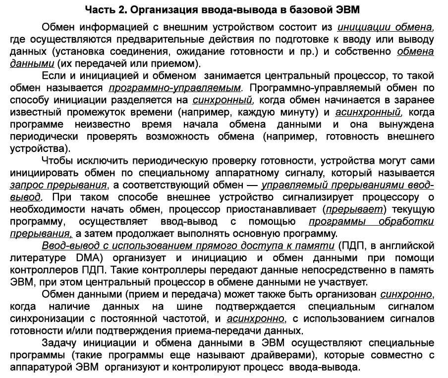  

#  第二部分. 基本计算机中的输入输出组织  

与外部设备的信息交换由**交换的初始化**组成，在此期间进行预备行动以准备输入或输出数据（建立连接、等待就绪等），以及实际的**数据交换**（其传输或接收）。

如果初始化和交换由中央处理器执行，则这种交换称为**程序控制**的。根据初始化方式，程序控制的交换分为**同步**的，*当交换在预先确定的时间间隔开始（例如，每分钟一次）* 和**异步**的，*当程序不知道数据交换开始的时间并且被迫定期检查交换的可能性（例如，外部设备的就绪状态）。*

为了排除定期检查就绪状态，设备可以自己通过特殊的硬件信号发起交换，该信号称为**中断请求**，而相应的交换称为**由中断控制的输入输出**。在这种方式下，外部设备向处理器发出需要开始交换的信号，处理器暂停（中断）当前程序，使用**中断处理程序**执行输入输出，然后继续执行主程序。

**使用直接内存访问**（DMA，在英文文献中称为DMA）的输入输出由DMA控制器组织和初始化，并在这些控制器的帮助下进行数据交换。这些控制器将数据直接传输到计算机内存，在此过程中中央处理器不参与数据交换。

数据交换（接收和传输）也可以是**同步**的，当总线上的数据存在由具有恒定频率的特殊同步信号确认时，以及**异步**的，使用就绪信号和/或接收-传输数据确认信号。

计算机中的数据初始化和交换任务由专门的程序执行（这些程序也称为驱动程序），它们与计算机硬件一起组织和控制输入输出过程。  

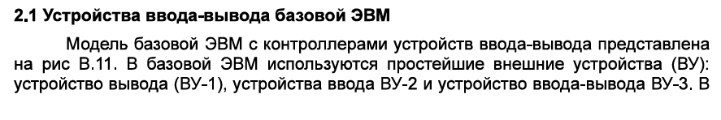  

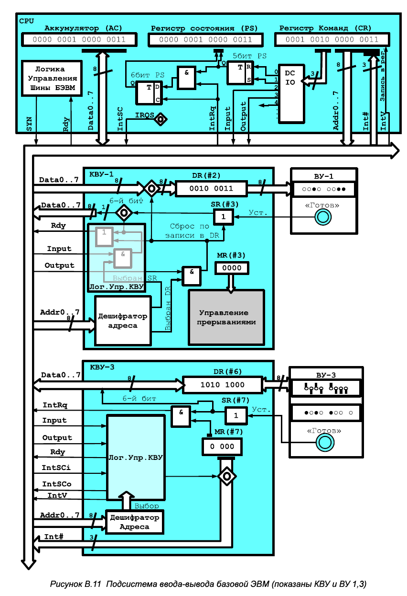  

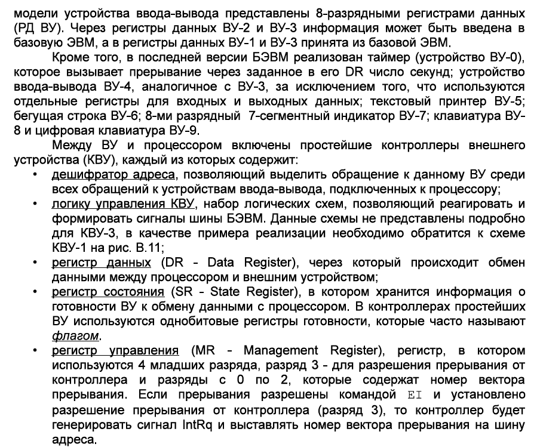  

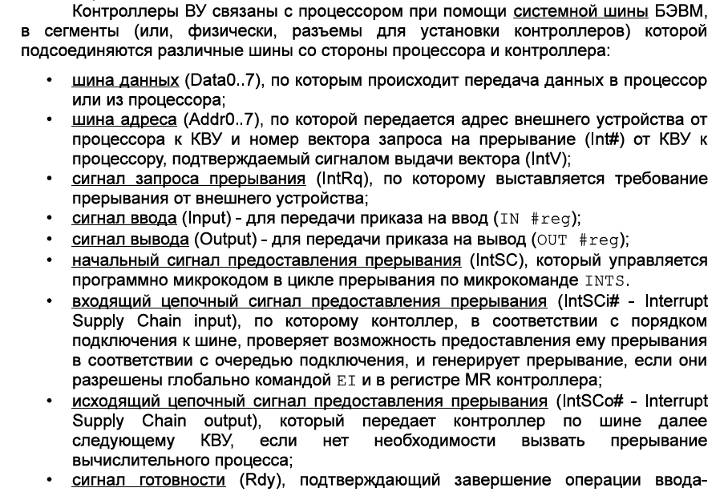  

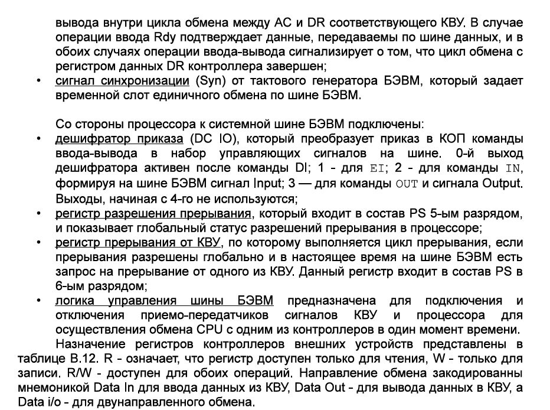  

## 2.1 基本计算机的输入输出设备

带有输入输出设备控制器的基本计算机模型如图B.11所示。在基本计算机中使用最简单的外部设备（BU）：输出设备（BU-1）、输入设备BU-2和输入输出设备BU-3。输入输出设备模型由8位数据寄存器（RD BU）表示。通过BU-2和BU-3的数据寄存器，信息可以输入到基本计算机中，而从基本计算机接收的信息则存储在BU-1和BU-3的数据寄存器中。

此外，在最新版本的基本计算机中实现了定时器（BU-0设备），它可以在其DR中设定的秒数后触发中断；输入输出设备BU-4，类似于BU-3，除了使用单独的寄存器用于输入和输出数据；文本打印机BU-5；滚动条BU-6；8位7段指示器BU-7；键盘BU-8和数字键盘BU-9。  

在外部设备（BU）和处理器之间包含最简单的外部设备控制器（КВУ），每个控制器包含以下内容：
- **地址解码器**，允许在所有输入输出设备中识别出对特定BU的访问，这些设备连接到处理器；
- **КВУ管理逻辑**，一套逻辑电路，用于响应和形成基本计算机总线信号。这些电路没有详细展示在КВУ-3中，作为实现示例，请参见图B.11中的КВУ-1电路；
- **数据寄存器（DR - Data Register）**，通过它进行处理器与外部设备之间的数据交换；
- **状态寄存器（SR - State Register）**，其中存储有关BU准备与处理器进行数据交换的信息。在最简单的BU控制器中使用单比特状态寄存器，通常称为标志。
- **管理寄存器（MR - Management Register）**，其中使用了4个最低位，第3位用于控制来自控制器的中断许可，以及从0到2的位，它们包含中断向量编号。如果中断被EI命令允许，并且设置了来自控制器的中断许可（第3位），那么控制器将生成IntRq信号，并将中断向量号放在地址总线上。  

外部设备控制器（КВУ）通过基本计算机的**系统总线**与处理器相连，该总线的段（或物理上，用于安装控制器的插槽）连接了来自处理器和控制器两侧的不同总线：
- **数据总线（Data0..7）**，用于在处理器和外部设备之间传输数据；
- **地址总线（Addr0..7）**，用于从处理器向КВУ传输外部设备地址和中断请求向量号（Int#）从КВУ到处理器，并由矢量输出信号（IntV）确认；
- **中断请求信号（IntRq）**，当外部设备提出中断请求时发出；
- **输入信号（Input）** - 用于传输输入指令（IN #reg）；
- **输出信号（Output）** - 用于传输输出指令（OUT #reg）；
- **初始中断供应信号（IntSC）**，它在中断周期中由微代码控制，通过微命令INTS进行管理；
- **进入链式中断供应信号（IntSCi# - Interrupt Supply Chain input）**，根据连接到总线的顺序，控制器检查是否可以按照连接顺序为其提供中断，并生成中断，如果它们被全局命令EI和控制器的MR寄存器允许；
- **出链式中断供应信号（IntSCo# - Interrupt Supply Chain output）**，如果不需要调用计算过程的中断，控制器将此信号沿总线传递给下一个КВУ；
- **准备就绪信号（Rdy）**，确认输入输出操作已完成。在交流周期内，准备就绪信号Rdy确认从AC到相应КВУ的数据寄存器DR之间的交换周期完成。在输入操作的情况下，Rdy确认数据总线上传输的数据，在这两种情况下，输入输出操作信号指示与控制器数据寄存器DR的交换周期已结束；
- **同步信号（Syn）** 来自基本计算机的时钟发生器，它定义了基本计算机总线上单次交换的时间槽。

从处理器一侧连接到基本计算机的系统总线的是：
- **指令解码器（DC IO）**，它将输入输出命令转换为总线上的控制信号集。解码器的第0个输出在DI命令后激活；1 - 对于EI命令；2 - 对于IN命令，在数据总线上形成Input信号；3 - 对于OUT命令和Output信号。从4开始的输出未使用；
- **中断许可寄存器**，它是PS的第5位，并显示处理器中的全局中断许可状态；
- **来自КВУ的中断寄存器**，如果中断被全局允许并且当前在基本计算机总线上有一个来自КВУ的中断请求，则执行中断周期。该寄存器是PS的第6位；
- **基本计算机总线管理逻辑**，用于连接和断开КВУ和处理器的信号接收器发送器，以实现CPU在同一时间与一个控制器的交换。  

外部设备控制器寄存器的功能如表B.12所示。R表示该寄存器仅可读，W表示仅可写，R/W表示既可读也可写。交换方向由助记符编码：Data In用于从КВУ输入数据，Data Out用于向КВУ输出数据，而Data i/o用于双向交换。  

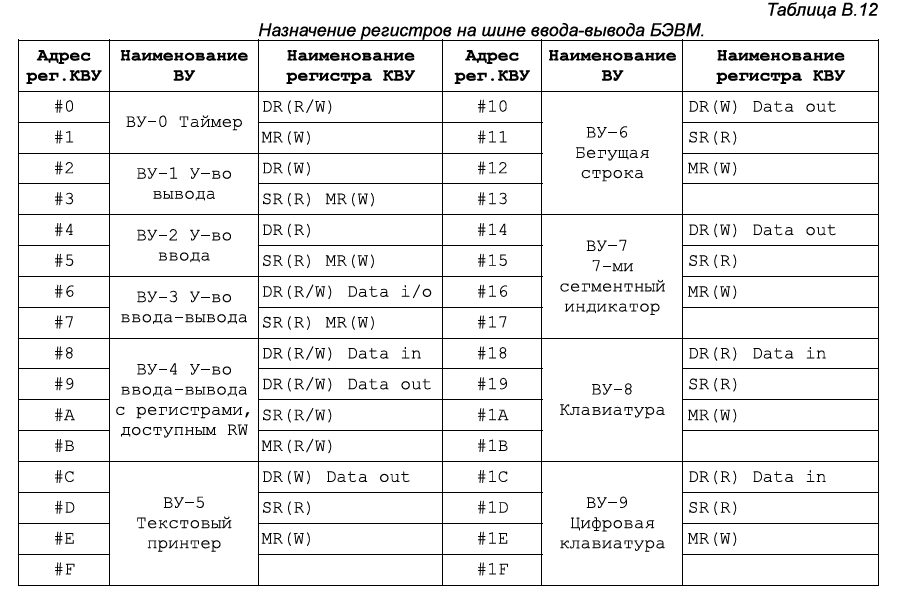  

  

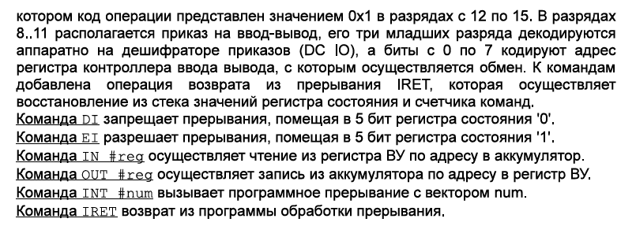  

## 2.2 输入输出命令

输入输出命令如图B.13所示。指出了命令的格式，其中操作代码在第12至15位表示为0x1。第8至11位包含输入输出指令，其三个最低位在指令解码器（DC IO）上硬件解码，而第0至7位编码与之进行交换的输入输出控制器寄存器地址。向命令中添加了中断返回操作IRET，该操作从堆栈恢复状态寄存器和命令计数器的值。

DI命令禁止中断，在状态寄存器的第5位放置'0'。
EI命令允许中断，在状态寄存器的第5位放置'1'。
IN #reg命令根据累加器中的地址从BU寄存器读取数据到累加器。
OUT #reg命令根据累加器中的地址将数据从累加器写入BU寄存器。
INT #num命令调用带有向量num的程序中断。
IRET命令从中断处理程序返回。  

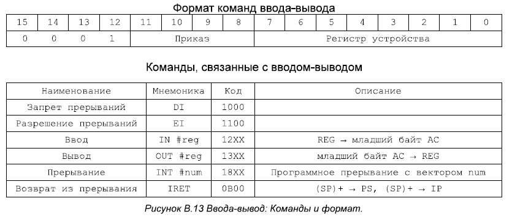  

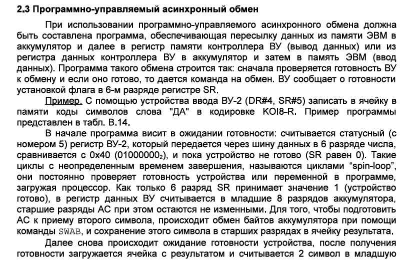  

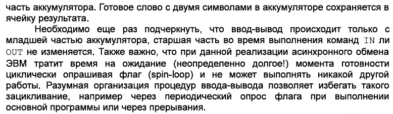  

## 2.3 程序控制的异步交换

在使用程序控制的异步交换时，需要编写一个程序，确保数据从计算机内存传输到累加器，然后再到BU控制器的内存寄存器（输出数据），或者从BU控制器的数据寄存器传输到累加器，再传输到计算机内存（输入数据）。这种交换的程序构建如下：首先检查BU是否准备好进行交换，如果准备好了，则发出交换命令。BU通过设置SR寄存器第6位的标志来通知其准备状态。

示例：使用输入设备BU-2（DR#4, SR#5）将“ДА”一词的符号代码写入内存单元，在KOI8-R编码中。程序示例如表B.14所示。

程序开始时处于等待就绪状态：读取状态寄存器（编号为5）BU-2，该寄存器通过数据总线在数字的第6位传递，与0x40（01000000₂）进行比较，只要设备未准备好（SR等于0）。这些具有不确定完成时间的循环称为“spin-loop”，它们不断检查设备或程序中的变量的就绪状态，从而占用处理器。一旦SR的第6位变为1（设备已准备好），则在累加器的最低8位中读取BU数据寄存器的内容，AC的较高位在此过程中保持不变。为了准备接收第二个符号，累加器的字节通过SWAB命令进行交换，并将该符号保存在结果单元的较高位中。

接下来再次等待设备就绪，收到就绪信号后，加载带有结果的单元并读取第二个符号到累加器的较低部分。累加器中包含两个符号的完整单词被保存在结果单元中。

还需要再次强调的是，输入输出仅发生在累加器的较低部分，执行IN或OUT命令时，较高部分保持不变。同样重要的是，在这种异步交换实现中，计算机花费时间等待（不确定多长时间！）设备就绪时刻的周期性轮询标志（spin-loop），并且无法执行任何其他工作。合理组织输入输出过程可以避免这样的空转，例如通过在主程序执行期间定期查询标志或通过中断。  

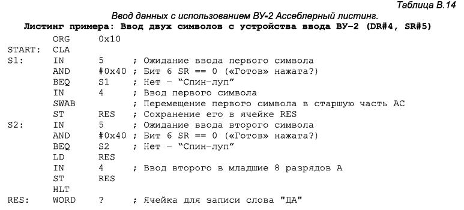  

