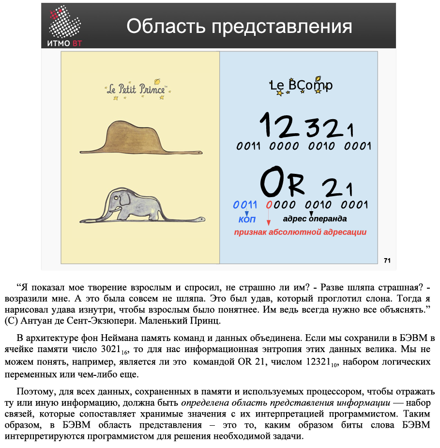  

“我向大人们展示我的作品，并问他们是否感到害怕。‘一顶帽子有什么可怕的？’他们反问我。但那根本不是一顶帽子，而是一条吞下了大象的蟒蛇。于是我又从内部画了蟒蛇，以便大人们能更清楚地理解。他们总是需要一切都被解释清楚。”（摘自安托万·德·圣-埃克苏佩里《小王子》）

在冯·诺伊曼架构中，指令和数据的存储是统一的。如果我们在计算机的某个内存单元中存储了数字302116，那么对我们来说，这些数据的信息熵是很大的。我们无法理解，例如，它是否是一个OR 21指令、数字1232110、一组逻辑变量，还是其他什么东西。

因此，对于所有存储在内存中并被处理器使用的数据，为了反映某种信息，必须定义一个信息表示域——一组将存储值与程序员解释关联起来的联系。因此，在计算机中，信息表示域是指程序员如何解释计算机字中的位，以解决所需任务的方式。  

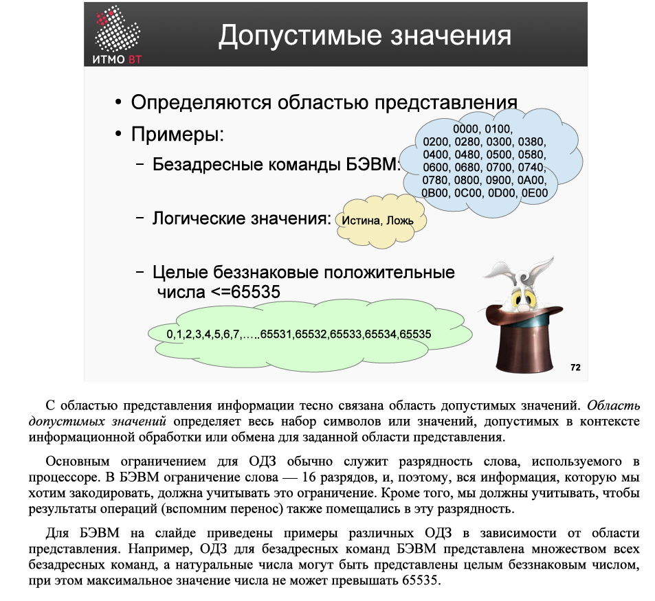  

信息表示域与**允许值域**密切相关。允许值域定义了在特定信息表示域的上下文下，信息处理或交换中所允许的整个符号或值的集合。  
通常，允许值域的主要限制是处理器中使用的字长。在计算机中，字长限制为16位，因此我们想要编码的所有信息都必须考虑这一限制。此外，我们还需要确保操作的结果（例如进位）也能适应这一字长。  

在计算机的示例中，根据不同的信息表示域，列举了多种允许值域。例如，计算机中无地址指令的允许值域由所有无地址指令的集合表示，而自然数可以用无符号整数表示，此时数值的最大值不能超过65535。  

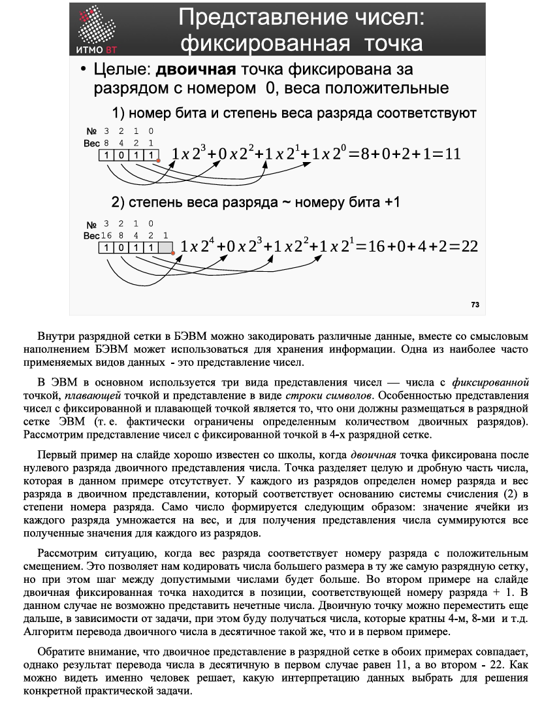  

在计算机的字长范围内，可以编码各种数据，结合其语义内容，计算机可用于存储信息。其中最常用的数据类型之一是**数字的表示**。  
在计算机中，主要使用三种数字表示方式：**定点数**、**浮点数**和**字符串形式**。定点数和浮点数表示的一个特点是，它们必须适应计算机的字长（即实际上受限于一定数量的二进制位）。我们以4位字长的定点数表示为例进行说明。  

幻灯片上的第一个示例是学校中常见的表示方式，即二进制小数点固定在二进制数的第0位之后。小数点将整数部分和小数部分分开，而在此示例中，小数部分不存在。每个位都有一个编号和权重，权重对应于基数（2）的位编号次方。数字的形成方式如下：每个位的值乘以其权重，然后将所有位的计算结果相加，得到数字的表示。  

接下来考虑一种情况，即位的权重对应于位编号加上一个正偏移量。这使我们能够在相同的字长范围内编码更大的数字，但允许的数字之间的步长会更大。在幻灯片上的第二个示例中，二进制小数点位于位编号加1的位置。在这种情况下，无法表示奇数。根据任务需求，二进制小数点可以进一步移动，从而得到4、8等倍数的数字。将二进制数转换为十进制数的算法与第一个示例相同。  

需要注意的是，在这两个示例中，二进制表示在字长范围内是相同的，但在第一个示例中转换为十进制的结果是11，而在第二个示例中则是22。由此可见，**具体选择哪种数据解释方式来解决实际任务，是由人来决定的**。  

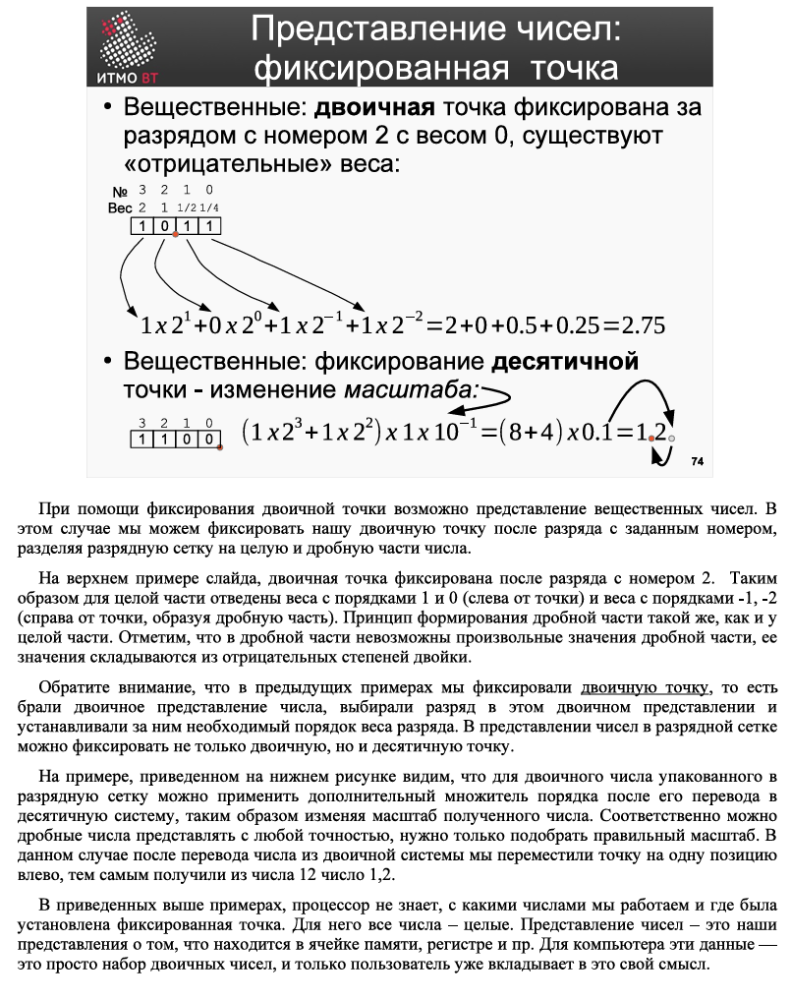  

通过固定二进制小数点的位置，可以实现**实数**的表示。在这种情况下，我们可以将二进制小数点固定在某个指定编号的位之后，从而将字长范围分为数字的整数部分和小数部分。  

在幻灯片的上部示例中，二进制小数点固定在第2位之后。因此，整数部分的权重为1和0（小数点左侧），而小数部分的权重为-1和-2（小数点右侧）。小数部分的形成原理与整数部分相同。需要注意的是，小数部分的值不能任意取值，它是由2的负幂次方组合而成的。  

在前面的示例中，我们固定了二进制小数点的位置，即选择二进制表示中的某一位，并在其后设置所需的权重顺序。然而，在字长范围内的数字表示中，不仅可以固定二进制小数点，还可以固定十进制小数点。  

在幻灯片的下部示例中，我们可以看到，对于打包在字长范围内的二进制数，可以在将其转换为十进制后应用一个额外的阶数因子，从而改变所得数字的缩放比例。因此，可以以任意精度表示小数，只需选择合适的缩放比例即可。在这个例子中，将二进制数转换为十进制数后，我们将小数点向左移动了一位，从而将数字12变为1.2。  

在上述示例中，处理器并不知道我们处理的是哪种数字，也不知道固定小数点的位置在哪里。对它来说，所有数字都是整数。数字的表示方式是我们对内存单元、寄存器等存储内容的理解。对计算机而言，这些数据只是一组二进制数，只有用户才会赋予它们特定的意义。  

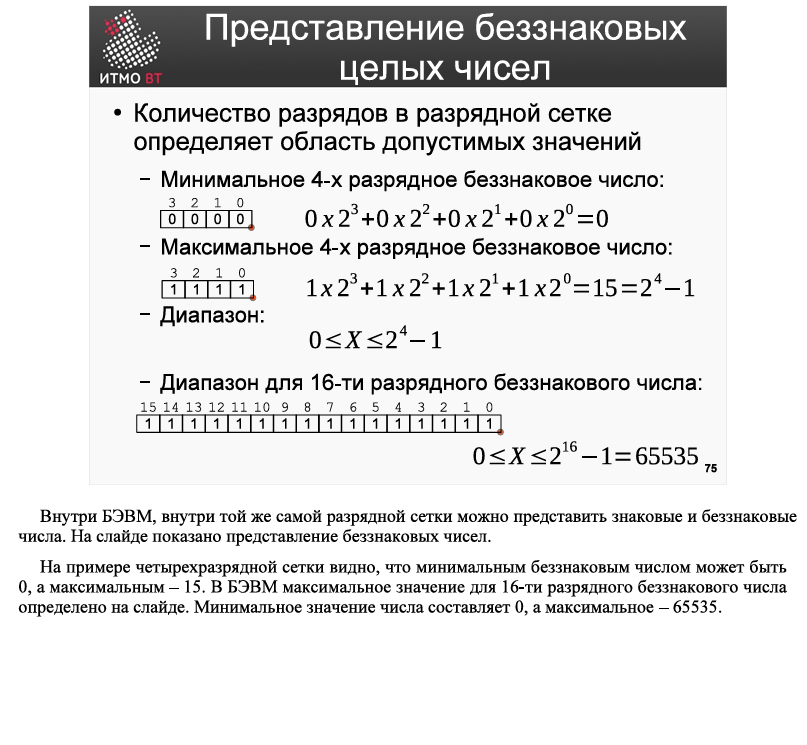  

在计算机内部，同样的字长范围内可以表示**有符号数**和**无符号数**。幻灯片上展示了无符号数的表示方式。  

以4位字长为例，可以看到最小的无符号数是0，而最大的无符号数是15。在计算机中，16位无符号数的最大值在幻灯片中已定义。最小值为0，最大值为65535。  

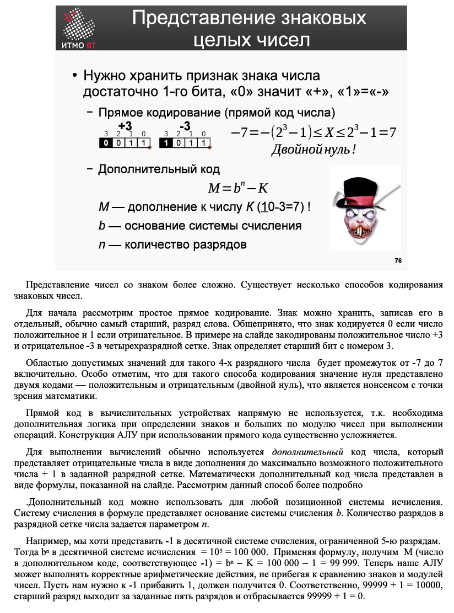  

**有符号数的表示**更为复杂。有几种编码有符号数的方法。  

首先，我们来看一种简单的**直接编码**方法。符号可以通过将其存储在一个单独的位（通常是最高位）来表示。通常，符号位为0表示正数，为1表示负数。在幻灯片的示例中，正数+3和负数-3在4位字长范围内进行了编码。符号由编号为3的最高位决定。  

对于这种4位编码方式，允许值域为-7到7（包括-7和7）。特别需要注意的是，这种编码方式下，零值有两个表示形式——正零和负零（双零），这在数学上是没有意义的。  

直接编码在计算设备中并不直接使用，因为在执行运算时需要额外的逻辑来判断符号和较大绝对值数字。使用直接编码会显著增加算术逻辑单元（ALU）的复杂性。  

在计算中，通常使用**补码**来表示负数。补码是最大正数加1的补数，用于表示负数。补码的数学公式如幻灯片所示。让我们更详细地了解这种方法。  

补码可以用于任何进位制。公式中的基数\( b \)表示进位制的基数，而\( n \)表示字长的位数。  

例如，我们希望在5位十进制系统中表示-1。此时，\( b^n = 10^5 = 100000 \)。根据公式，\( M \)（表示-1的补码）为：  
\[ M = b^n - K = 100000 - 1 = 99999 \]  

现在，我们的ALU可以执行正确的算术运算，而无需比较符号和绝对值。假设我们需要将-1加1，结果应为0。因此：  
\[ 99999 + 1 = 100000 \]  
由于最高位超出了5位范围，因此被丢弃，最终结果为：  
\[ 99999 + 1 = 0 \]  

通过这种方式，补码使得有符号数的运算更加高效和简单。  

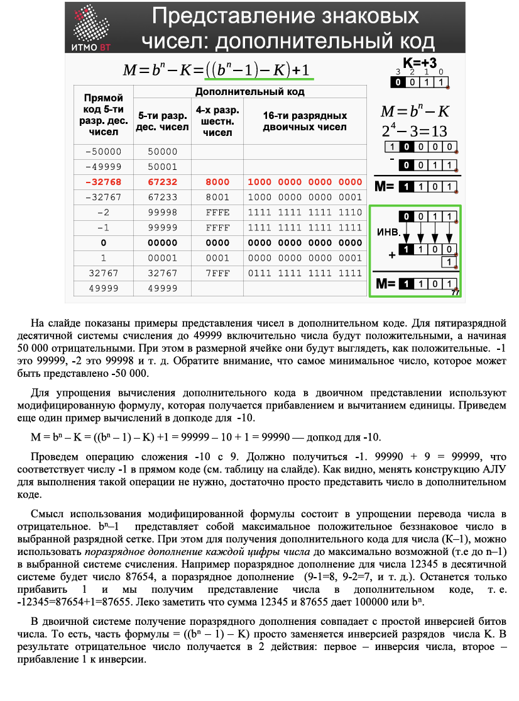  

在幻灯片中展示了**补码**表示数字的示例。对于5位十进制系统，数值在0到49999之间表示正数，而从50000开始表示负数。在存储单元中，这些负数看起来像是正数。例如，-1表示为99999，-2表示为99998，依此类推。需要注意的是，最小的可表示数字是-50000。  

为了简化补码的计算，在二进制表示中使用了一种修改后的公式，该公式通过加1和减1来实现。我们再举一个补码计算的例子：计算-10与9的和，结果应为-1。  
\[ 99990 + 9 = 99999 \]  
99999在补码中对应于-1（参见幻灯片中的表格）。可以看出，执行这种操作无需修改ALU的结构，只需将数字表示为补码即可。  

使用修改后公式的意义在于简化将数字转换为负数的过程。\( b^n - 1 \)表示所选字长范围内的最大无符号正数。为了获得数字\( K \)的补码，可以对数字的每一位进行补码操作（即每位补到最大可能值，例如在十进制中为9）。例如，数字12345的逐位补码为87654（即9-1=8，9-2=7，依此类推）。只需再加1，即可得到该数字的补码表示：  
\[ -12345 = 87654 + 1 = 87655 \]  
可以注意到，12345与87655的和为100000，即\( b^n \)。  

在二进制系统中，逐位补码操作等同于对数字的位进行简单的取反。也就是说，公式中的\( (b^n - 1) - K \)部分可以直接替换为对数字\( K \)的位取反。因此，得到负数的过程分为两步：  
1. 对数字进行位取反；  
2. 对取反结果加1。  

这种方法使得补码的计算更加高效和直观。  

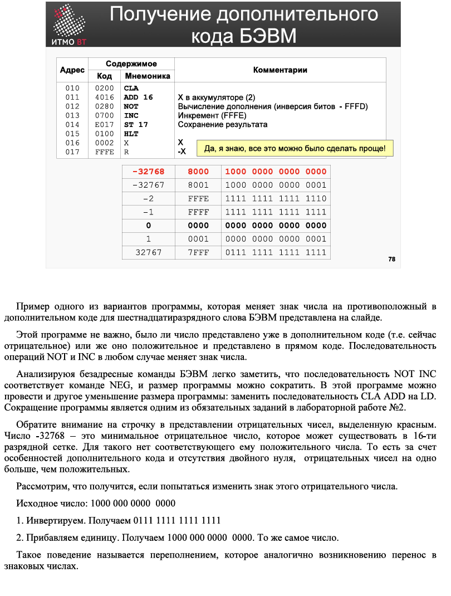  

在幻灯片中展示了一个示例程序，该程序用于在16位字长的计算机中将一个数的符号取反（即从正变负或从负变正），使用的是**补码**表示法。  

这个程序并不关心数字当前是以补码形式表示（即当前为负数）还是以原码形式表示（即当前为正数）。无论哪种情况，通过执行`NOT`（按位取反）和`INC`（加1）操作序列，都可以改变数字的符号。  

通过分析计算机的无地址指令，可以注意到`NOT`和`INC`操作序列实际上等同于`NEG`（取负）指令，因此可以简化程序。此外，还可以通过将`CLA`（清零）和`ADD`（加法）操作替换为`LD`（加载）操作来进一步缩短程序。**程序的优化是实验2中的一项必要任务**。  

需要注意的是，在负数表示中，用红色突出显示的数字`-32768`是16位字长范围内可以表示的最小负数。**它没有对应的正数**。这是由于补码的特性以及不存在双零表示，导致负数的数量比正数多一个。  

让我们尝试对这个负数取反，看看会发生什么：  
1. 原始数字：`1000 0000 0000 0000`  
2. 按位取反：`0111 1111 1111 1111`  
3. 加1：`1000 0000 0000 0000`  

结果仍然是原始数字。这种行为称为**溢出**，类似于有符号数运算中的进位现象。  

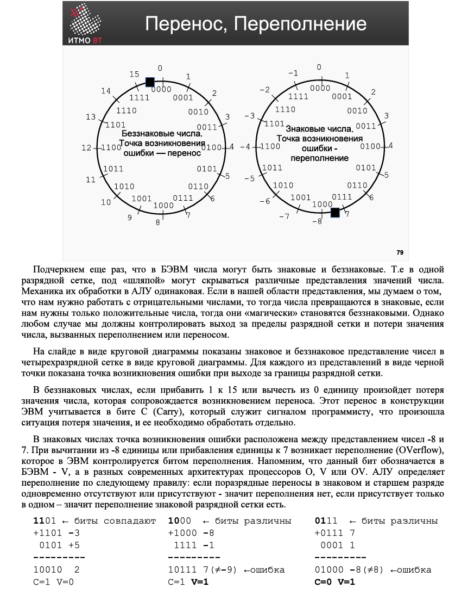  

再次强调，在计算机中，数字可以是有符号的或无符号的。也就是说，在同一个字长范围内，数字的表示形式可能隐藏在不同的“帽子”下。**算术逻辑单元（ALU）对它们的处理机制是相同的**。如果我们的表示域需要处理负数，那么数字就被视为有符号数；如果我们只需要正数，那么它们就“神奇地”变成了无符号数。然而，无论哪种情况，我们都必须控制字长范围的溢出以及由于溢出或进位导致的数值丢失问题。  

在幻灯片中，通过圆形图展示了4位字长范围内有符号数和无符号数的表示方式。对于每种表示形式，用黑点标出了超出字长范围时发生错误的位置。  

- **无符号数**：  
  如果对15加1或从0减1，会导致数值丢失，并伴随进位（Carry）的产生。在计算机的结构中，这个进位会被记录在**C位（Carry Flag）**中，作为程序员需要单独处理的信号，表明发生了数值丢失的情况。  

- **有符号数**：  
  错误发生点位于-8和7之间。如果从-8减1或对7加1，会发生**溢出（Overflow）**，这在计算机中由**溢出位（Overflow Flag）**控制。需要注意的是，在计算机中，溢出位通常标记为**V**，而在不同的现代处理器架构中，可能标记为**O**、**V**或**OV**。  
  ALU根据以下规则判断溢出：  
  - 如果符号位和最高位的进位**同时存在或同时不存在**，则没有溢出；  
  - 如果**只有一个存在**，则发生了符号位的溢出。  

通过这种方式，计算机能够有效地检测和处理数值运算中的溢出和进位问题，确保计算的正确性。  

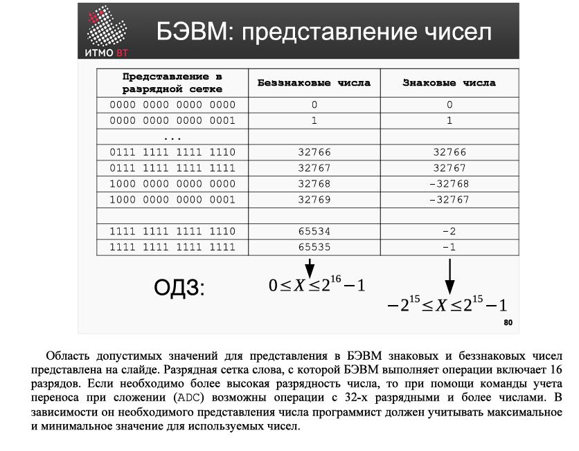  

在幻灯片中展示了计算机中有符号数和无符号数的**允许值域**。计算机执行操作的字长为16位。如果需要更高位数的数字，可以通过使用带进位的加法指令（**ADC**）来实现32位或更高位数的操作。  

根据所需的数字表示方式，程序员必须考虑所使用的数字的**最大值和最小值**：  

- **无符号数**：  
  - 最小值：0  
  - 最大值：\( 2^{16} - 1 = 65535 \)  

- **有符号数**：  
  - 最小值：\( -2^{15} = -32768 \)  
  - 最大值：\( 2^{15} - 1 = 32767 \)  

如果需要处理更大范围的数字，可以通过组合多个16位字来实现。例如，使用**ADC**指令可以将两个16位数组合成一个32位数，从而扩展允许值域。  

程序员在设计程序时，必须根据具体需求选择合适的表示方式，并确保数值运算不会超出允许值域，以避免溢出或数据丢失。  

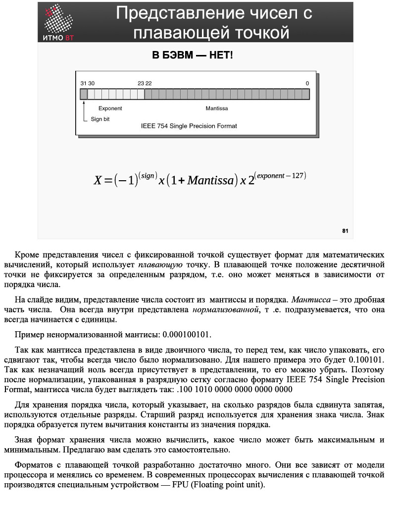  

除了**定点数**表示法外，还有一种用于数学计算的格式称为**浮点数**。在浮点数中，小数点的位置不固定于某一位，而是可以根据数的阶数动态调整。  

在幻灯片中可以看到，浮点数的表示由**尾数（Mantissa）**和**阶数（Exponent）**组成。尾数是数的小数部分，通常以**规范化形式**表示，即假设尾数总是以1开头。  

例如，一个非规范化的尾数可能是：  
\[ 0.000100101 \]  

由于尾数以二进制形式表示，因此在打包到字长范围内之前，需要将其移位，使其规范化。对于上述示例，规范化后的尾数为：  
\[ 0.100101 \]  

由于非有效位的零总是存在，因此可以省略。因此，在规范化后，按照**IEEE 754单精度浮点数格式**打包的尾数将如下所示：  
\[ .100\,1010\,0000\,0000\,0000\,0000 \]  

阶数用于指示小数点的移动位数，它存储在单独的位中。最高位用于存储数的符号。阶数的符号通过从阶数值中减去一个常数来确定。  

通过了解浮点数的存储格式，可以计算出数的最大值和最小值。建议您自行尝试计算这些值。  

浮点数格式有很多种，它们取决于处理器模型，并随着时间的推移而变化。在现代处理器中，浮点数计算由专门的硬件单元**FPU（Floating Point Unit，浮点运算单元）**执行。  

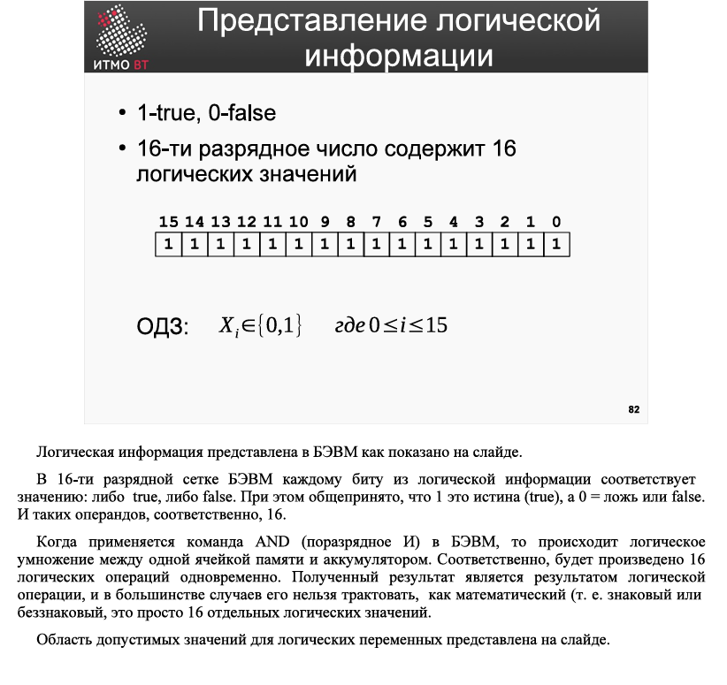  

在计算机中，**逻辑信息**的表示如幻灯片所示。在16位字长的计算机中，每个位对应一个逻辑值：**真（true）**或**假（false）**。通常，1表示真（true），0表示假（false）。因此，一个16位的字可以表示16个逻辑操作数。  

当在计算机中执行**AND（按位与）**指令时，会对内存单元和累加器中的值进行逻辑乘法操作。也就是说，会同时进行16次逻辑运算。运算结果是一个逻辑值，在大多数情况下，不能将其解释为数学值（即有符号数或无符号数），它只是16个独立的逻辑值。  

幻灯片中展示了逻辑变量的**允许值域**。对于每个位，允许的值为0或1，分别表示假和真。  

总结：  
- **逻辑信息**在计算机中以位的形式表示，每个位可以是0（假）或1（真）。  
- **AND指令**对两个16位值进行按位与操作，结果是16个独立的逻辑值。  
- 逻辑运算的结果通常不用于数学计算，而是用于逻辑判断和控制。