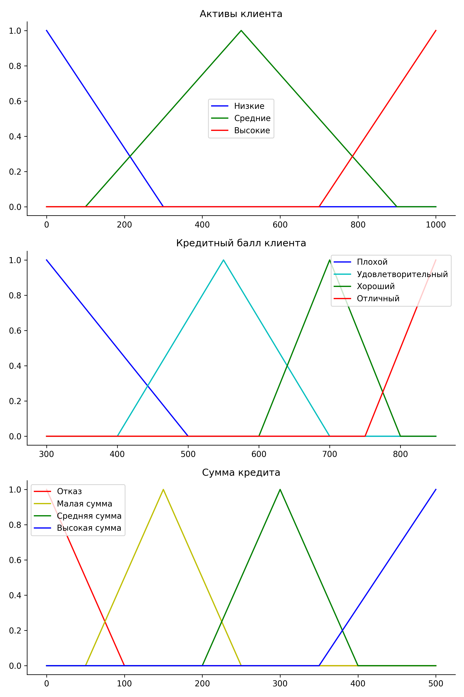
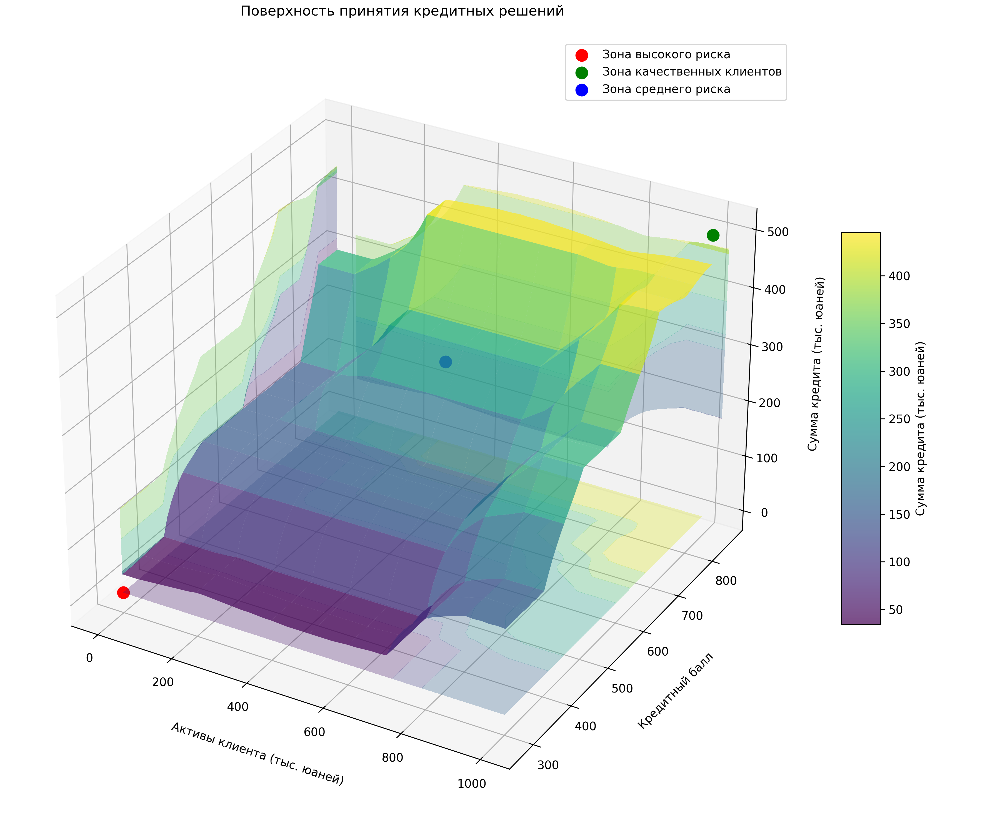
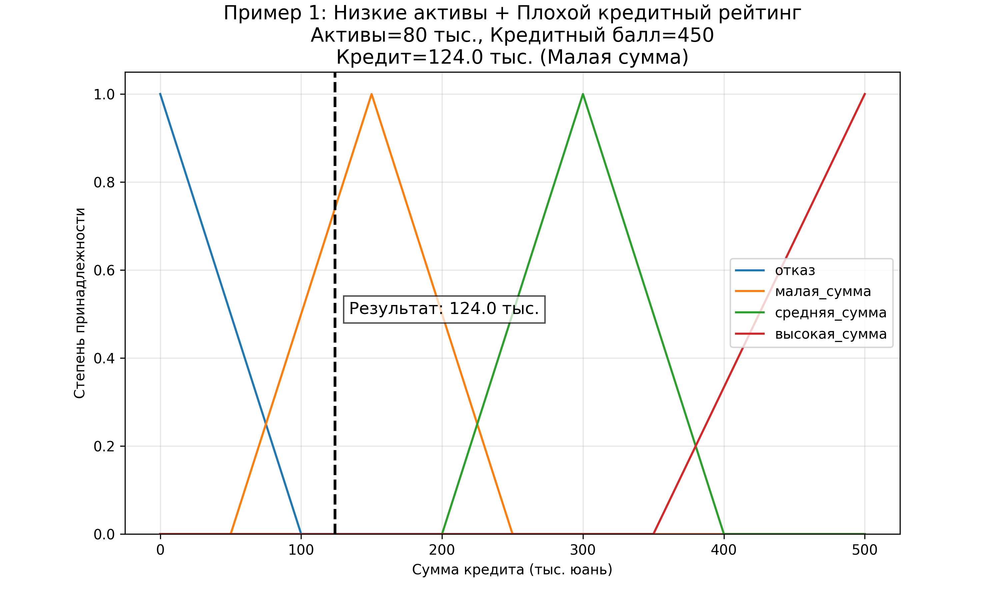
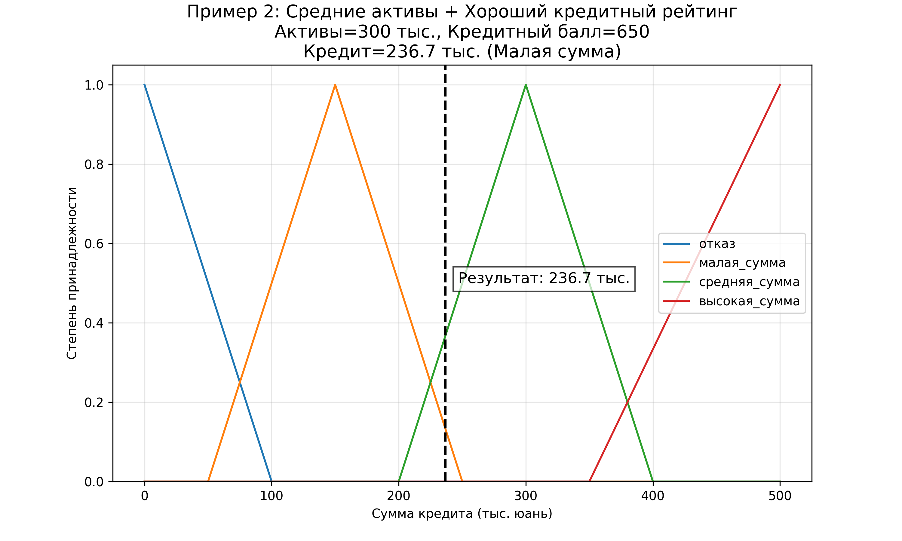
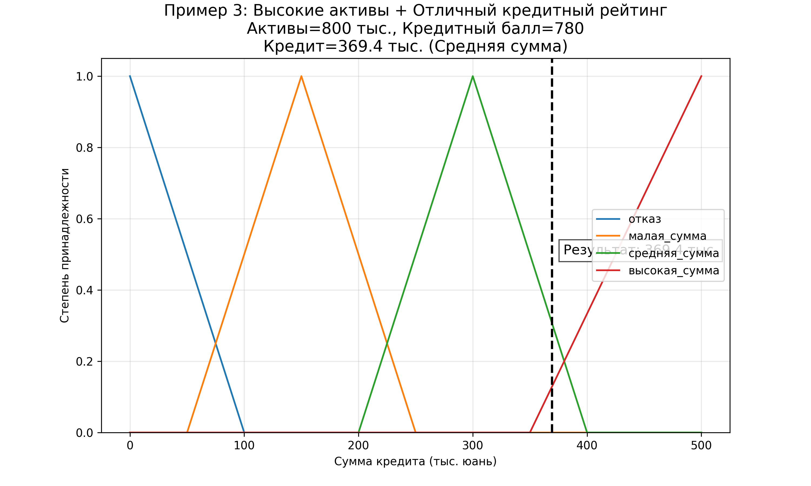
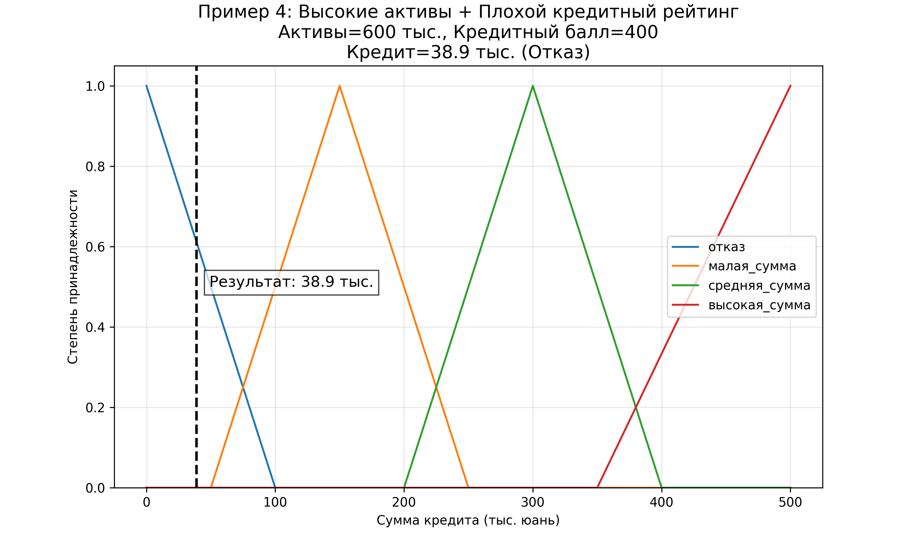
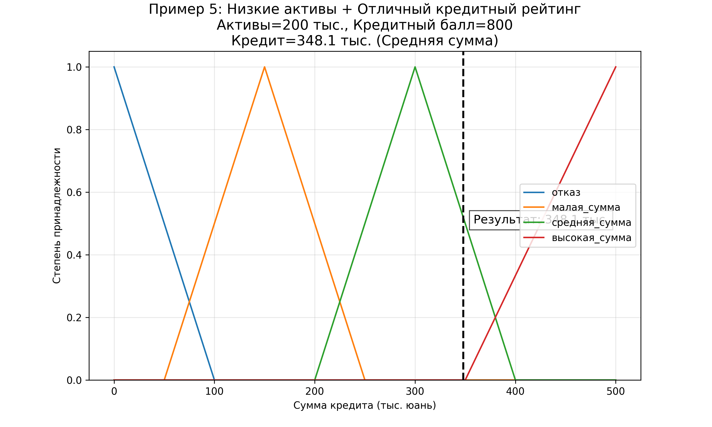
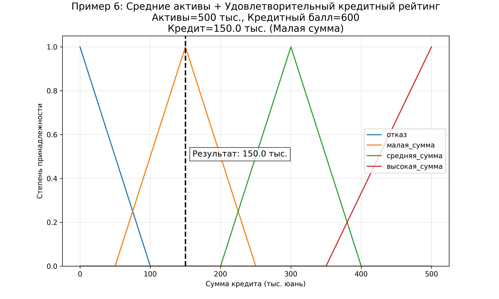
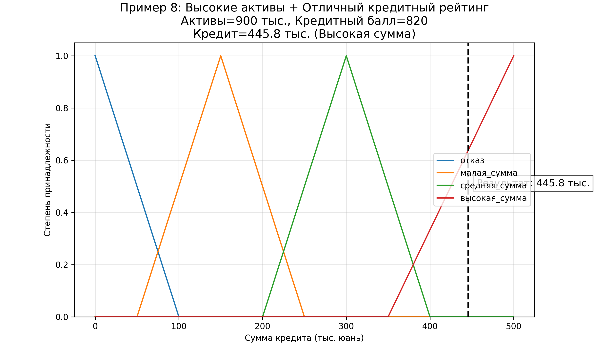

### Отчет по системе нечеткой логики для кредитных решений

**Чень Хаолинь P3116 407960**

Данный отчет представляет результаты разработки и тестирования системы принятия кредитных решений на основе нечеткой логики. Система анализирует два ключевых параметра клиента: **активы** (в тыс. юанях) и **кредитный балл** (по шкале FICO), чтобы определить подходящую сумму кредита.

### Переменные и функции принадлежности

Система использует три основные переменные:

1. **Активы клиента** (0-1000 тыс. юаней)

   - Низкие (0-300 тыс.)
   - Средние (100-900 тыс.)
   - Высокие (700-1000 тыс.)
2. **Кредитный балл** (300-850 баллов)

   - Плохой (300-500)
   - Удовлетворительный (400-700)
   - Хороший (600-800)
   - Отличный (750-850)
3. **Сумма кредита** (0-500 тыс. юаней)

   - Отказ (0-100 тыс.)
   - Малая сумма (50-250 тыс.)
   - Средняя сумма (200-400 тыс.)
   - Высокая сумма (350-500 тыс.)

Функции принадлежности для каждой переменной визуализированы на графике .

### Правила системы

Система содержит 19 правил, которые определяют взаимосвязь между активами, кредитным баллом и суммой кредита. Основные принципы правил:

- Высокие активы могут компенсировать низкий кредитный балл
- Отличный кредитный балл может компенсировать низкие активы
- Абсолютный отказ при сочетании низких активов и плохого кредитного рейтинга

## Результаты тестирования

### Сводка по тестовым случаям

Система была протестирована на 8 различных сценариях клиентов:

| Пример | Активы (тыс.) | Кредит. балл | Кредит (тыс.) | Категория        | Описание                                                                          |
| ------------ | ---------------------- | ---------------------- | ---------------------- | ------------------------- | ----------------------------------------------------------------------------------------- |
| 1            | 80                     | 450                    | 124.0                  | Малая сумма     | Низкие активы + Плохой кредитный рейтинг                |
| 2            | 300                    | 650                    | 236.7                  | Малая сумма     | Средние активы + Хороший кредитный рейтинг            |
| 3            | 800                    | 780                    | 369.4                  | Средняя сумма | Высокие активы + Отличный кредитный рейтинг          |
| 4            | 600                    | 400                    | 38.9                   | Отказ                | Высокие активы + Плохой кредитный рейтинг              |
| 5            | 200                    | 800                    | 348.1                  | Средняя сумма | Низкие активы + Отличный кредитный рейтинг            |
| 6            | 500                    | 600                    | 150.0                  | Малая сумма     | Средние активы + Удовлетворит. кредитный рейтинг |
| 7            | 100                    | 350                    | 36.1                   | Отказ                | Низкие активы + Очень плохой кредитный рейтинг     |
| 8            | 900                    | 820                    | 445.8                  | Высокая сумма | Высокие активы + Отличный кредитный рейтинг          |

### Анализ ключевых случаев

1. **Пример 1 (Низкие активы + Плохой кредитный рейтинг)** 
   Несмотря на негативные параметры, система предлагает малую сумму кредита (124 тыс.), демонстрируя гибкость нечеткой логики.
2. **Пример 4 (Высокие активы + Плохой кредитный рейтинг)** 
   Система отказывает в кредите, показывая приоритет кредитного балла при оценке риска.
3. **Пример 5 (Низкие активы + Отличный кредитный рейтинг)** 
   Отличный кредитный рейтинг компенсирует низкие активы, что приводит к предложению средней суммы кредита (348.1 тыс.).
4. **Пример 8 (Высокие активы + Отличный кредитный рейтинг)**
   Идеальный клиент получает максимальную сумму кредита (445.8 тыс.), близкую к верхнему пределу.

## Визуализация результатов

### Поверхность решений

График демонстрирует 3D-зависимость суммы кредита от активов и кредитного балла. На графике выделены три ключевые зоны:

1. **Зона высокого риска** (красная точка): Низкие активы + низкий кредитный балл → отказ или минимальный кредит
2. **Зона качественных клиентов** (зеленая точка): Высокие активы + высокий кредитный балл → максимальный кредит
3. **Зона среднего риска** (синяя точка): Средние значения параметров → кредиты средней величины

### Анализ отдельных случаев

Для каждого тестового случая созданы индивидуальные графики (`тестовый_случай_X.png`), которые показывают:

- Функции принадлежности для суммы кредита
- Вычисленное значение кредита (вертикальная линия)
- Категорию кредитного решения

       

## Заключение

Разработанная система нечеткой логики успешно обрабатывает нечеткие входные данные и выдает взвешенные решения, соответствующие уровню риска клиента. Результаты тестирования подтверждают эффективность системы в различных сценариях, от высокорискованных до премиальных клиентов.
