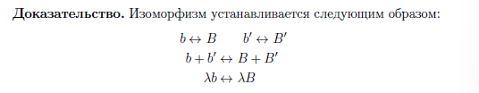

# Двухсеместровый курс
# Теоретический минимум. Раздел 1 (весна).
# Список вопросов.  

**1. Дайте определение линейной формы**    

  

**2. Что будет являться образом линейной комбинации относительно линейной формы?**  

  

**3. Приведите общий вид линейной формы, определяемый координатами вектора-аргумента в произвольном базисе.**  

**4. Что называется коэффициентами линейной формы?**  

  

**5. Как найти значение линейной формы, зная ее коэффициенты в некотором базисе, а также координаты вектора-аргумента в этом же базисе?**  

**6. Как определяется равенство линейных форм?**  

  

**7. Какая линейная форма называется нуль-формой?**  

  

**8. Как определяется сумма линейных форм?**  

  

**9. Какое пространство называется сопряженным пространством?**  

  

**10. Какие значения принимает fj (ei), если {ei} и {fj} — сопряженные базисы?**  

  

**11. Как может быть задан базис сопряженного пространства?**  

  

**12. Как преобразуются коэффициенты линейной формы при преобразованиях базиса?**  

**13. Как преобразуются базисные линейные формы при преобразованиях базиса?**  

**14. Какое пространство называют вторым сопряженным?**  

  

**15. Как может быть установлен изоморфизм между пространством V и вторым сопряженным к нему?**  

  

**16. Какой изоморфизм называют каноническим?**  

  

**17. Какое отображение называется билинейной формой?**  

  

**18. Как при помощи линейных форм может быть задана билинейная форма?**  

  

**19. Запишите координатное представление любой билинейной формы?**  

  

**20. Какая билинейная форма называется симметричной?**  

  

**21. Какая билинейная форма называется антисимметричной?**  

  

**22. Как может быть найдена симметричная компонента билинейной формы?**  

  

**23. Как может быть найдена антисимметричная компонента билинейной формы?**  

  

**24. Как восстановить билинейную форму, если известны ее симметрическая и антисимметричная компонента?**  

  

**25. Какая билинейная форма является симметричной и антисимметричной одновременно?**  

**26. Как могут быть найдены коэффициенты билинейной формы?**  

  

**27. Как устанавливается изоморфизм между пространством билинейных форм и пространством матриц?**  

  

28. Какое свойство определяет матрицу, соответствующую симметричной форме?  

  

**29. Какое свойство определяет матрицу, соответствующую антисимметричной форме?**  

  

**30. Запишите закон преобразования матрицы билинейной формы при преобразовании базиса?**

  

**31. Какое отображение называется квадратичной формой?**  

  

**32. Что такое однородный полином степени два и как он связан с квадратичной формой?**  

  

**33. Как выглядит квадратичная форма, построенная по антисимметричной билинейной форме?**  

  

**34. Как определяется матрица квадратичной формы?**  

  

**35. Дайте определение полилинейной формы.**  

  

**36. Что такое валентность полилинейной формы? Поясните обозначения.**  

  

**37. Какой валентностью обладает скалярное произведение векторов как полилинейная форма?**  

**38. Какой валентностью обладает смешанное произведение векторов как полилинейная форма?**  

**39. Как определяется сумма полилинейных форм?**  

**40. Как определяется произведение полилинейной формы на скаляр?**  

  

**41. Как определяется произведение полилинейных форм?**  

  

**42. Какой алгебраической структурой обладает множество полилинейных форм вместе с операцией сложения?**  

**43. Какой алгебраической структурой обладает множество полилинейных форм вместе с операциями сложения и умножения на скаляр?**  

**44. Обладает ли операция умножения полилинейных форм свойством коммутативности?Поясните ответ.**  

  

**45. Как может быть найден тензор полилинейной формы?**  

  

**46. В чем заключается смысл немого суммирования?**  

Наличие большого количества индексов в случае анализа линейных объектов нередко приводит к большому количеству суммирований как в теоретических выкладках, так и в практических приложениях тензоров. По этой причине вводится так называемое правило суммирования Эйнштейна, или соглашение о немом суммировании.  

**47. Для какой цели служит тензор полилинейной формы?**  

**48. Что является тензором билинейной формы?**  

**49. Что является тензором линейной формы?**  

**50. Как при помощи немого суммирования записать закон преобразования координат вектора?**  

**51. Как при помощи немого суммирования записать закон преобразования коэффициентов линейных форм?**  

**52. Запишите закон преобразования компонент тензора полилинейной формы при преобразованиях базиса?**  

（由于技术原因，联网搜索暂不可用）

### 俄语回答:  
37. **Скалярное произведение** как полилинейная форма имеет валентность **(0, 2)** (два ковариантных аргумента).  
38. **Смешанное произведение** в \( n \)-мерном пространстве имеет валентность **(0, n)** (n ковариантных аргументов).  
39. **Сумма полилинейных форм** определяется поточечно: \( (F + G)(v_1, \dots, v_k) = F(v_1, \dots, v_k) + G(v_1, \dots, v_k) \), если формы одной валентности.  
40. **Умножение на скаляр**: \( (\alpha F)(v_1, \dots, v_k) = \alpha \cdot F(v_1, \dots, v_k) \).  
41. **Произведение форм** — тензорное произведение: \( (F \otimes G)(v_1, \dots, v_{k+m}) = F(v_1, \dots, v_k) \cdot G(v_{k+1}, \dots, v_{k+m}) \).  
42. Множество полилинейных форм с операцией сложения образует **абелеву группу**.  
43. С операциями сложения и умножения на скаляр — **векторное пространство**.  
44. **Нет**, умножение не коммутативно. Например, \( F \otimes G \neq G \otimes F \), если \( F \) и \( G \) не симметричны.  
45. **Тензор полилинейной формы** определяется её значениями на базисных векторах: \( T_{i_1 \dots i_k} = F(e_{i_1}, \dots, e_{i_k}) \).  
46. **Немое суммирование** — автоматическое суммирование по повторяющимся индексам (например, \( a_i b^i = \sum_i a_i b^i \)).  
47. **Тензор** кодирует коэффициенты формы в выбранном базисе.  
48. **Тензор билинейной формы** — матрица коэффициентов \( B_{ij} \).  
49. **Тензор линейной формы** — вектор коэффициентов \( a_i \).  
50. Закон преобразования координат вектора: \( x'^i = C^i_j x^j \) (по повторяющемуся индексу \( j \)).  
51. Закон преобразования коэффициентов линейной формы: \( a'_i = (C^{-1})^j_i a_j \).  
52. Общий закон преобразования компонент тензора валентности \( (p, q) \):  
\[ T'^{i_1 \dots i_p}_{j_1 \dots j_q} = C^{i_1}_{k_1} \dots C^{i_p}_{k_p} (C^{-1})^{l_1}_{j_1} \dots (C^{-1})^{l_q}_{j_q} T^{k_1 \dots k_p}_{l_1 \dots l_q}. \]  

---

### 中文翻译 (Chinese Translation):  
37. **标量积**作为多重线性形式的价是 **(0, 2)**（两个协变参数）。  
38. **混合积**在 \( n \) 维空间中的价是 **(0, n)**（n 个协变参数）。  
39. **多重线性形式的和**按点定义：若形式同价，则 \( (F + G)(v_1, \dots, v_k) = F(v_1, \dots, v_k) + G(v_1, \dots, v_k) \)。  
40. **标量乘法**：\( (\alpha F)(v_1, \dots, v_k) = \alpha \cdot F(v_1, \dots, v_k) \)。  
41. **形式的乘积**为张量积：\( (F \otimes G)(v_1, \dots, v_{k+m}) = F(v_1, \dots, v_k) \cdot G(v_{k+1}, \dots, v_{k+m}) \)。  
42. 多重线性形式集合关于加法构成**阿贝尔群**。  
43. 关于加法和标量乘法构成**向量空间**。  
44. **否**，乘法不可交换。例如，若 \( F \) 和 \( G \) 不对称，则 \( F \otimes G \neq G \otimes F \)。  
45. **多重线性形式的张量**由其在基向量上的值确定：\( T_{i_1 \dots i_k} = F(e_{i_1}, \dots, e_{i_k}) \)。  
46. **爱因斯坦求和约定**：对重复指标自动求和（如 \( a_i b^i = \sum_i a_i b^i \)）。  
47. **张量**编码了形式在选定基下的系数。  
48. **双线性形式的张量**是系数矩阵 \( B_{ij} \)。  
49. **线性形式的张量**是系数向量 \( a_i \)。  
50. 向量坐标变换法则：\( x'^i = C^i_j x^j \)（对重复指标 \( j \) 求和）。  
51. 线性形式系数变换法则：\( a'_i = (C^{-1})^j_i a_j \)。  
52. **(p, q) 型张量**分量的变换法则：  
\[ T'^{i_1 \dots i_p}_{j_1 \dots j_q} = C^{i_1}_{k_1} \dots C^{i_p}_{k_p} (C^{-1})^{l_1}_{j_1} \dots (C^{-1})^{l_q}_{j_q} T^{k_1 \dots k_p}_{l_1 \dots l_q}. \]  

（由于技术原因，联网搜索暂不可用）

### **问题与答案整合版**  
以下所有问题均以 **俄语回答** 和 **中文翻译** 并列呈现，每个问题后紧跟答案。  

---

**53. Как выглядит закон преобразования тензора типа (2, 0)?**  
**俄语回答:**  
\[ T'^{ij} = C^k_i C^l_j T^{kl} \quad (\text{суммирование по } k, l). \]  
**中文翻译:**  
**(2, 0) 型张量的变换法则**:  
\[ T'^{ij} = C^k_i C^l_j T^{kl} \quad (\text{对 } k, l \text{ 求和}). \]  

---

**54. Как выглядит закон преобразования тензора типа (1, 1)?**  
**俄语回答:**  
\[ T'^i_j = C^i_k (C^{-1})^l_j T^k_l \quad (\text{суммирование по } k, l). \]  
**中文翻译:**  
**(1, 1) 型张量的变换法则**:  
\[ T'^i_j = C^i_k (C^{-1})^l_j T^k_l \quad (\text{对 } k, l \text{ 求和}). \]  

---

**55. Как выглядит закон преобразования тензора типа (0, 2)?**  
**俄语回答:**  
\[ T'_{ij} = (C^{-1})^k_i (C^{-1})^l_j T_{kl} \quad (\text{суммирование по } k, l). \]  
**中文翻译:**  
**(0, 2) 型张量的变换法则**:  
\[ T'_{ij} = (C^{-1})^k_i (C^{-1})^l_j T_{kl} \quad (\text{对 } k, l \text{ 求和}). \]  

---

**56. Какой валентностью будет обладать полилинейная форма валентности (p, q) после операции свертки?**  
**俄语回答:**  
После свертки валентность станет **(p−1, q−1)**. Например, свертка тензора (1,1) даёт скаляр (0,0).  
**中文翻译:**  
**缩并后的张量价**为 **(p−1, q−1)**。例如，(1,1) 型张量缩并后变为标量 (0,0)。  

---

**57. Как определяется операция свертки тензора?**  
**俄语回答:**  
Свёртка тензора — суммирование по паре индексов (один верхний, один нижний). Например, свёртка \( T^i_j \) по \( i \) и \( j \):  
\[ T^i_i = \sum_i T^i_i. \]  
**中文翻译:**  
**张量缩并**：对一对上下标求和。例如，缩并 \( T^i_j \):  
\[ T^i_i = \sum_i T^i_i. \]  

---

**58. Дайте определение символа Кронекера.**  
**俄语回答:**  
Символ Кронекера \( \delta_{ij} \):  
\[ \delta_{ij} = \begin{cases} 1, & i = j, \\ 0, & i \neq j. \end{cases} \]  
**中文翻译:**  
**克罗内克符号** \( \delta_{ij} \):  
\[ \delta_{ij} = \begin{cases} 1, & i = j, \\ 0, & i \neq j. \end{cases} \]  

---

**59. Каким свойством обладает символ Кронекера?**  
**俄语回答:**  
Символ Кронекера инвариантен при преобразованиях базиса: \( \delta'_{ij} = \delta_{ij} \).  
**中文翻译:**  
**性质**：\( \delta_{ij} \) 在基变换下不变：\( \delta'_{ij} = \delta_{ij} \)。  

---

**60. Как записывается скалярное произведение при помощи операции свертки?**  
**俄语回答:**  
\[ \mathbf{a} \cdot \mathbf{b} = \delta_{ij} a^i b^j \quad (\text{суммирование по } i, j). \]  
**中文翻译:**  
**标量积的缩并表示**:  
\[ \mathbf{a} \cdot \mathbf{b} = \delta_{ij} a^i b^j \quad (\text{对 } i, j \text{ 求和}). \]  

（由于技术原因，联网搜索暂不可用）

### **问题与答案整合版**  
以下所有问题均以 **俄语回答** 和 **中文翻译** 并列呈现，每个问题后紧跟答案。  

---

**61. Дайте определение символа Леви-Чивита.**  
**俄语回答:**  
Символ Леви-Чивита \( \varepsilon_{i_1 i_2 \dots i_n} \) — это полностью антисимметричный тензор, определяемый следующим образом:  
- \( \varepsilon_{12\dots n} = 1 \),  
- \( \varepsilon_{i_1 i_2 \dots i_n} = 0 \), если индексы повторяются,  
- \( \varepsilon_{i_1 i_2 \dots i_n} \) меняет знак при перестановке любых двух индексов.  
**中文翻译:**  
**列维-奇维塔符号** \( \varepsilon_{i_1 i_2 \dots i_n} \) 是一个完全反对称的张量，定义为：  
- \( \varepsilon_{12\dots n} = 1 \)，  
- 若下标重复，则 \( \varepsilon_{i_1 i_2 \dots i_n} = 0 \)，  
- 交换任意两个下标时符号改变。  

---

**62. Каким свойством обладает символ Леви-Чивита?**  
**俄语回答:**  
Основное свойство:  
\[ \varepsilon_{i_1 i_2 \dots i_n} \varepsilon^{j_1 j_2 \dots j_n} = \det(\delta_{i_k}^{j_l}), \]  
где \( \delta_{i_k}^{j_l} \) — символ Кронекера.  
**中文翻译:**  
**主要性质**:  
\[ \varepsilon_{i_1 i_2 \dots i_n} \varepsilon^{j_1 j_2 \dots j_n} = \det(\delta_{i_k}^{j_l}), \]  
其中 \( \delta_{i_k}^{j_l} \) 为克罗内克符号。  

---

**63. Как записывается векторное произведение при помощи символа Леви-Чивита?**  
**俄语回答:**  
В трёхмерном пространстве:  
\[ (\mathbf{a} \times \mathbf{b})_i = \varepsilon_{ijk} a^j b^k \quad (\text{суммирование по } j, k). \]  
**中文翻译:**  
**三维向量积**:  
\[ (\mathbf{a} \times \mathbf{b})_i = \varepsilon_{ijk} a^j b^k \quad (\text{对 } j, k \text{ 求和}). \]  

---

**64. Запишите способ нахождения смешанного произведения при помощи символа Леви-Чивита.**  
**俄语回答:**  
Смешанное произведение трёх векторов:  
\[ (\mathbf{a}, \mathbf{b}, \mathbf{c}) = \varepsilon_{ijk} a^i b^j c^k \quad (\text{суммирование по } i, j, k). \]  
**中文翻译:**  
**三维混合积**:  
\[ (\mathbf{a}, \mathbf{b}, \mathbf{c}) = \varepsilon_{ijk} a^i b^j c^k \quad (\text{对 } i, j, k \text{ 求和}). \]  

---

**65. Как может быть найден определитель квадратной матрицы при помощи символа Леви-Чивита?**  
**俄语回答:**  
Для матрицы \( A = (a^i_j) \) размера \( n \times n \):  
\[ \det(A) = \varepsilon_{i_1 i_2 \dots i_n} a^{i_1}_1 a^{i_2}_2 \dots a^{i_n}_n \quad (\text{суммирование по всем индексам}). \]  
**中文翻译:**  
**矩阵行列式**:  
对于 \( n \times n \) 矩阵 \( A = (a^i_j) \):  
\[ \det(A) = \varepsilon_{i_1 i_2 \dots i_n} a^{i_1}_1 a^{i_2}_2 \dots a^{i_n}_n \quad (\text{对所有下标求和}). \]  

---

**66. Дайте определение линейному отображению между произвольными пространствами.**  
**俄语回答:**  
Линейное отображение \( \phi: X \to Y \) удовлетворяет:  
\[ \phi(\alpha \mathbf{u} + \beta \mathbf{v}) = \alpha \phi(\mathbf{u}) + \beta \phi(\mathbf{v}), \quad \forall \alpha, \beta \in K. \]  
**中文翻译:**  
**线性映射** \( \phi: X \to Y \) 满足：  
\[ \phi(\alpha \mathbf{u} + \beta \mathbf{v}) = \alpha \phi(\mathbf{u}) + \beta \phi(\mathbf{v}), \quad \forall \alpha, \beta \in K. \]  

---

**67. Что называется линейным отображением растяжения?**  
**俄语回答:**  
Отображение \( \phi: V \to V \), где \( \phi(\mathbf{v}) = \lambda \mathbf{v} \) для фиксированного \( \lambda \in K \).  
**中文翻译:**  
**拉伸映射** \( \phi: V \to V \)，即 \( \phi(\mathbf{v}) = \lambda \mathbf{v} \)，其中 \( \lambda \in K \) 为常数。  

---

**68. Запишите матрицу тождественного отображения.**  
**俄语回答:**  
Единичная матрица \( I \):  
\[ I_{ij} = \delta_{ij}. \]  
**中文翻译:**  
**恒等映射的矩阵**为单位矩阵 \( I \):  
\[ I_{ij} = \delta_{ij}. \]  

---

**69. Какой вид имеет матрица проектирования на подпространство параллельно его прямому дополнению?**  
**俄语回答:**  
Если \( V = W \oplus U \), то матрица проекции \( P \) на \( W \) имеет вид:  
\[ P = \begin{pmatrix} I_k & 0 \\ 0 & 0 \end{pmatrix}, \]  
где \( k = \dim W \).  
**中文翻译:**  
若 \( V = W \oplus U \)，则投影到 \( W \) 的矩阵 \( P \) 为分块矩阵：  
\[ P = \begin{pmatrix} I_k & 0 \\ 0 & 0 \end{pmatrix}, \]  
其中 \( k = \dim W \)。  

---

**70. Какой вид имеет матрица оператора растяжения на \( \lambda \in K \)?**  
**俄语回答:**  
Диагональная матрица с \( \lambda \) на диагонали:  
\[ A = \lambda I. \]  
**中文翻译:**  
对角线元素均为 \( \lambda \) 的对角矩阵：  
\[ A = \lambda I. \]  

---

**71. Как может быть найдена матрица линейного отображения?**  
**俄语回答:**  
Если \( \{e_i\} \) — базис \( X \), а \( \{f_j\} \) — базис \( Y \), то элемент \( A_{ij} \) матрицы равен коэффициенту при \( f_j \) в разложении \( \phi(e_i) \).  
**中文翻译:**  
设 \( \{e_i\} \) 是 \( X \) 的基，\( \{f_j\} \) 是 \( Y \) 的基，则矩阵元素 \( A_{ij} \) 为 \( \phi(e_i) \) 在基 \( \{f_j\} \) 下的第 \( j \) 个坐标。  

---

**72. Покажите как найти координаты образа вектора относительно линейного отображения, если оно задано матрицей.**  
**俄语回答:**  
Если \( \mathbf{x} = (x^1, \dots, x^n) \), то координаты образа \( \mathbf{y} = (y^1, \dots, y^m) \):  
\[ y^j = \sum_{i=1}^n A_{ij} x^i \quad (\text{суммирование по } i). \]  
**中文翻译:**  
若向量 \( \mathbf{x} = (x^1, \dots, x^n) \)，则其映像 \( \mathbf{y} = (y^1, \dots, y^m) \) 的坐标为：  
\[ y^j = \sum_{i=1}^n A_{ij} x^i \quad (\text{对 } i \text{ 求和}). \]  

---

**73. Какой алгебраической структурой наделено множество линейных отображений с введенными операциями сложения и умножения на скаляр?**  
**俄语回答:**  
Множество линейных отображений образует **векторное пространство** над полем \( K \).  
**中文翻译:**  
线性映射的集合关于加法和标量乘法构成 **向量空间**。  

---

**74. Какому матричному пространству изоморфно множество \( \text{Hom}_K(X, Y) \)? Поясните введенные обозначения.**  
**俄语回答:**  
\( \text{Hom}_K(X, Y) \cong M_{m \times n}(K) \), где \( m = \dim Y \), \( n = \dim X \).  
Обозначение \( \text{Hom}_K(X, Y) \) — пространство линейных отображений из \( X \) в \( Y \).  
**中文翻译:**  
\( \text{Hom}_K(X, Y) \) 同构于 \( M_{m \times n}(K) \)，其中 \( m = \dim Y \)，\( n = \dim X \)。  
符号 \( \text{Hom}_K(X, Y) \) 表示从 \( X \) 到 \( Y \) 的线性映射空间。  

---

**75. Что такое композиция линейных отображений?**  
**俄语回答:**  
Композиция \( \psi \circ \phi \) определяется как:  
\[ (\psi \circ \phi)(\mathbf{v}) = \psi(\phi(\mathbf{v})). \]  
**中文翻译:**  
**线性映射的复合** \( \psi \circ \phi \) 定义为：  
\[ (\psi \circ \phi)(\mathbf{v}) = \psi(\phi(\mathbf{v})). \]  

---

**76. Как найти матрицу линейного отображения, если оно задано как композиция отображений \( \phi \) и \( \psi \)?**  
**俄语回答:**  
Матрица композиции \( \psi \circ \phi \) равна произведению матриц:  
\[ A_{\psi \circ \phi} = A_\psi \cdot A_\phi. \]  
**中文翻译:**  
复合映射 \( \psi \circ \phi \) 的矩阵为各映射矩阵的乘积：  
\[ A_{\psi \circ \phi} = A_\psi \cdot A_\phi. \]  

---

**77. Запишите закон преобразования матрицы линейного отображения при замене базиса.**  
**俄语回答:**  
Если базис \( X \) преобразуется матрицей \( C \), а базис \( Y \) — матрицей \( D \), то:  
\[ A' = D^{-1} A C. \]  
**中文翻译:**  
若 \( X \) 的基变换矩阵为 \( C \)，\( Y \) 的基变换矩阵为 \( D \)，则新矩阵为：  
\[ A' = D^{-1} A C. \]  

