# Сумма пересечение подпространств  
# 子空间的和与交  

## Основные определения  
## 基本定义  

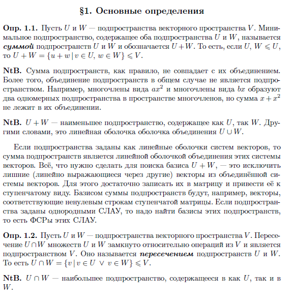  

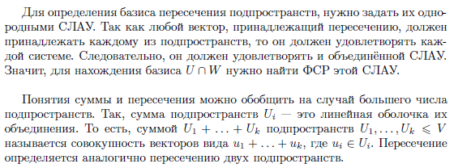  

**定义 1.1.** 设 \( U \) 和 \( W \) 是向量空间 \( V \) 的子空间。包含 \( U \) 和 \( W \) 的最小子空间称为  **子空间的和**，  
记作 \( U + W \)。即，如果 \( U, W \leq V \)，  
则 \( U + W = \{ u + w \mid u \in U, w \in W \} \leq V \)。

**注**：子空间的和通常不等于它们的并集。  
此外，子空间的并集在一般情况下不是子空间。例如，形如 \( ax^2 \) 的多项式和形如 \( bx \) 的多项式在多项式空间中形成两个一维子空间，但它们的和 \( x + x^2 \) 不在它们的并集中。  

**注**：\( U + W \) 是包含 \( U \) 和 \( W \) 的最小子空间。换句话说，它是 \( U \cup W \) 的线性包。

如果子空间由向量组的线性包定义，则子空间的和是这些向量组并集的线性包。为了找到 \( U + W \) 的基，只需从并集的向量组中排除多余的（可以通过其他向量线性表示的）向量。为此，只需将这些向量写成矩阵并将其化为阶梯形。子空间和的基可以是阶梯形矩阵中非零行对应的向量。如果子空间由齐次线性方程组定义，则需要找到这些子空间的基，即这些方程组的**基本解系**（ФСР）。  

**定义 1.2.** 设 \( U \) 和 \( W \) 是向量空间 \( V \) 的子空间。集合 \( U \) 和 \( W \) 的交集 \( U \cap W \) 关于 \( V \) 中的运算是封闭的，并且是 \( V \) 的一个子空间。它称为子空间 \( U \) 和 \( W \) 的**交集**。即 \( U \cap W = \{ v \mid v \in U \text{ 且 } v \in W \} \leq V \)。

**注**：\( U \cap W \) 是同时包含在 \( U \) 和 \( W \) 中的最大子空间。  

为了确定子空间交集的基，需要用齐次线性方程组来描述它们。由于任何属于交集的向量必须同时属于每个子空间，因此它必须满足每个方程组。因此，它也必须满足合并后的方程组。因此，为了找到 \( U \cap W \) 的基，需要找到该方程组的基本解系（ФСР）。

子空间的和与交集的概念可以推广到更多子空间的情况。例如，子空间 \( U_i \) 的和是它们并集的线性包。也就是说，子空间 \( U_1, \ldots, U_k \leq V \) 的和 \( U_1 + \ldots + U_k \) 是形如 \( u_1 + \ldots + u_k \) 的向量的集合，其中 \( u_i \in U_i \)。交集的定义类似于两个子空间的交集。  

## Согласованный базис  
## 协调基  

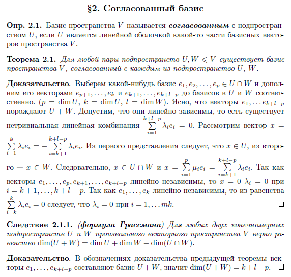  

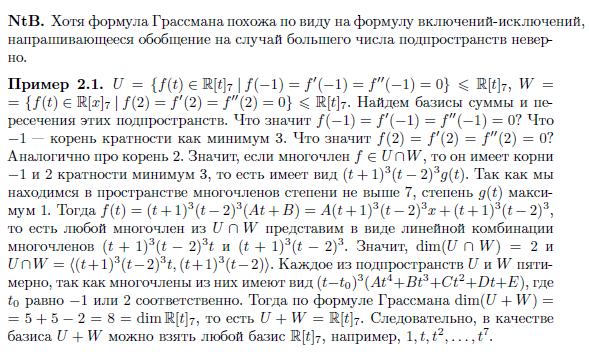  

**定义 2.1.** 空间 \( V \) 的基称为与子空间 \( U \) **协调的**，如果 \( U \) 是 \( V \) 的某部分基向量的线性包。

**定理 2.1.** 对于任意一对子空间 \( U, W \leq V \)，存在一个与每个子空间 \( U \) 和 \( W \) 协调的空间 \( V \) 的基。  

**证明**：选择 \( U \cap W \) 的一个基 \( e_1, e_2, \ldots, e_p \)，并将其分别用向量 \( e_{p+1}, \ldots, e_k \) 和 \( e_{k+1}, \ldots, e_{k+l-p} \) 扩展为 \( U \) 和 \( W \) 的基。（\( p = \dim(U \cap W) \)，\( k = \dim U \)，\( l = \dim W \)）。显然，向量 \( e_1, \ldots, e_{k+l-p} \) 生成 \( U + W \)。假设它们是线性相关的，即存在一个非平凡的线性组合 \( \sum_{i=1}^{k+l-p} \lambda_i e_i = 0 \)。考虑向量 \( x = \sum_{i=1}^k \lambda_i e_i = -\sum_{i=k+1}^{k+l-p} \lambda_i e_i \)。从第一个表示可以看出 \( x \in U \)，从第二个表示可以看出 \( x \in W \)。因此，\( x \in U \cap W \)，并且 \( x = \sum_{i=1}^p \mu_i e_i = \sum_{i=k+1}^{k+l-p} \lambda_i e_i \)。由于向量 \( e_1, \ldots, e_p, e_{k+1}, \ldots, e_{k+l-p} \) 是线性无关的，所以 \( x = 0 \) 且 \( \lambda_i = 0 \) 对于 \( i = k + 1, \ldots, k + l - p \)。由于 \( e_1, \ldots, e_k \) 是线性无关的，从等式 \( \sum_{i=1}^k \lambda_i e_i = 0 \) 可以得出 \( \lambda_i = 0 \) 对于 \( i = 1, \ldots, k \)。  

**格拉斯曼公式**：对于任意向量空间 \( V \) 中的两个有限维子空间 \( U \) 和 \( W \)，以下等式成立：
\[
\dim(U + W) = \dim U + \dim W - \dim(U \cap W)
\]

**证明**：在前一个定理的证明中，向量 \( e_1, \ldots, e_{k+l-p} \) 构成 \( U + W \) 的一个基，因此：
\[
\dim(U + W) = k + l - p
\]  

**注**：尽管格拉斯曼公式在形式上类似于容斥原理，但将其推广到更多子空间的情况是不正确的。  

**示例 2.1**：设 \( U = \{f(t) \in \mathbb{R}[t]_7 \mid f(-1) = f'(-1) = f''(-1) = 0\} \leq \mathbb{R}[t] \)，\( W = \{f(t) \in \mathbb{R}[t]_7 \mid f(2) = f'(2) = f''(2) = 0\} \leq \mathbb{R}[t]_7 \)。我们需要找到这两个子空间的和与交的基。

**分析**：
- \( f(-1) = f'(-1) = f''(-1) = 0 \) 表示 \(-1\) 是 \( f(t) \) 的至少三重根。
- \( f(2) = f'(2) = f''(2) = 0 \) 表示 \( 2 \) 是 \( f(t) \) 的至少三重根。
- 如果多项式 \( f \in U \cap W \)，则 \( f(t) \) 具有 \(-1\) 和 \( 2 \) 作为至少三重根，即 \( f(t) \) 可以表示为：
  \[
  f(t) = (t+1)^3(t-2)^3 g(t)
  \]
  其中 \( g(t) \) 是一个次数不超过 1 的多项式（因为 \( f(t) \) 的次数不超过 7）。因此：
 \[
 f(t) = (t+1)^3(t-2)^3(At + B) = A(t+1)^3(t-2)^3 t + B(t+1)^3(t-2)^3
 \]
  即 \( U \cap W \) 的基为：
  \[
  U \cap W = \langle (t+1)^3(t-2)^3 t, (t+1)^3(t-2)^3 \rangle
  \]
  且 \( \dim(U \cap W) = 2 \)。

- 每个子空间 \( U \) 和 \( W \) 的维数为 5，因为它们的多项式可以表示为：
  \[
  f(t) = (t - t_0)^3 (At^4 + Bt^3 + Ct^2 + Dt + E)
  \]
  其中 \( t_0 \) 分别为 \(-1\) 或 \( 2 \)。

- 根据格拉斯曼公式：
  \[
  \dim(U + W) = \dim U + \dim W - \dim(U \cap W) = 5 + 5 - 2 = 8 = \dim \mathbb{R}[t]_7
  \]
  因此，\( U + W = \mathbb{R}[t] \)，其基可以是 \( \mathbb{R}[t] \) 的任意基，例如 \( 1, t, t^2, \ldots, t^7 \)。

---

- **交的基**：\( U \cap W = \langle (t+1)^3(t-2)^3 t, (t+1)^3(t-2)^3 \rangle \)，维数为 2。
- **和的基**：\( U + W = \mathbb{R}[t] \)，基为 \( 1, t, t^2, \ldots, t^7 \)，维数为 8。  

## Прямая сумма подпространств  
## 子空间的直接和  

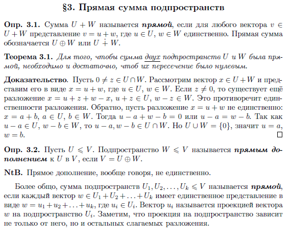  

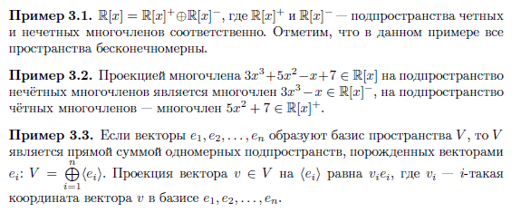  

**定义 3.1.** 如果对于任意向量 \( v \in U + W \)，表示 \( v = u + w \)（其中 \( u \in U \)，\( w \in W \)）是唯一的，则称和 \( U + W \) 为**直和**。直和记作 \( U \oplus W \) 或 $U \dot{+} W$。

**定理 3.1.** 两个子空间 \( U \) 和 \( W \) 的和是直和的充分必要条件是它们的交集为零空间，即 \( U \cap W = \{0\} \)。  

**证明**：假设 \( 0 \neq z \in U \cap W \)。考虑向量 \( x \in U + W \)，并将其表示为 \( x = u + w \)，其中 \( u \in U \)，\( w \in W \)。如果 \( z \neq 0 \)，则存在另一种分解 \( x = u + z + w - z \)，其中 \( u + z \in U \)，\( w - z \in W \)。这与分解的唯一性矛盾。反之，假设分解 \( x = u + w \) 不唯一：\( x = a + b \)，其中 \( a \in U \)，\( b \in W \)。则 \( u - a + w - b = 0 \) 或 \( u - a = w - b \)。由于 \( u - a \in U \)，\( w - b \in W \)，所以 \( u - a, w - b \in U \cap W \)。但 \( U \cap W = \{ 0 \} \)，因此 \( u = a \)，\( w = b \)。  

**定义 3.2.** 设 \( U \leq V \)。子空间 \( W \leq V \) 称为 \( U \) 在 \( V \) 中的**直和补空间**，如果 \( V = U \oplus W \)。

**注**：直和补空间通常不是唯一的。

更一般地，子空间 \( U_1, U_2, \ldots, U_k \leq V \) 的和称为**直和**，如果每个向量 \( w \in U_1 + U_2 + \ldots + U_k \) 都有唯一的表示形式 \( w = u_1 + u_2 + \ldots + u_k \)，其中 \( u_i \in U_i \)。向量 \( u_i \) 称为向量 \( w \) 在子空间 \( U_i \) 上的**投影**。需要注意的是，子空间上的投影不仅依赖于该子空间，还依赖于分解中的其他部分。  

**示例 3.1.** \( \mathbb{R}[x] = \mathbb{R}[x]^+ \oplus \mathbb{R}[x]^- \)，其中 \( \mathbb{R}[x]^+ \) 和 \( \mathbb{R}[x]^- \) 分别是偶次多项式和奇次多项式的子空间。注意，在此示例中，所有空间都是无限维的。

**示例 3.2.** 多项式 \( 3x^3 + 5x^2 - x + 7 \in \mathbb{R}[x] \) 在奇次多项式子空间上的投影是多项式 \( 3x^3 - x \in \mathbb{R}[x]^- \)，在偶次多项式子空间上的投影是多项式 \( 5x^2 + 7 \in \mathbb{R}[x]^+ \)。

**示例 3.3.** 如果向量 \( e_1, e_2, \ldots, e_n \) 构成空间 \( V \) 的一个基，则 \( V \) 是由这些向量生成的一维子空间的直和：\( V = \bigoplus_{i=1}^n \langle e_i \rangle \)。向量 \( v \in V \) 在 \( \langle e_i \rangle \) 上的投影为 \( v_i e_i \)，其中 \( v_i \) 是向量 \( v \) 在基 \( e_1, e_2, \ldots, e_n \) 中的第 \( i \) 个坐标。  

# Преобразование базисов  
# 基的变换  

## Матрица перехода  
## 过渡矩阵  

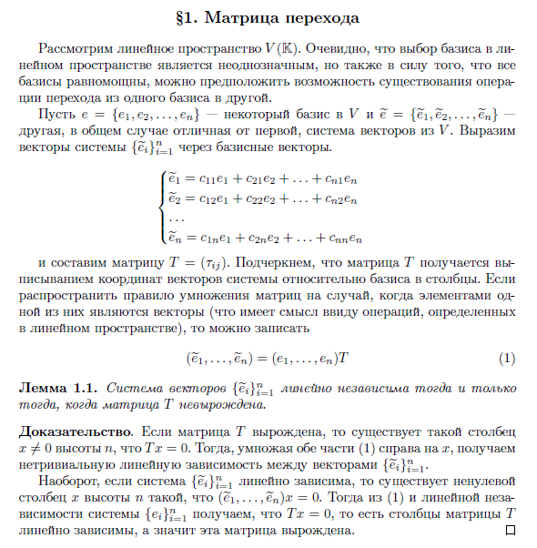  

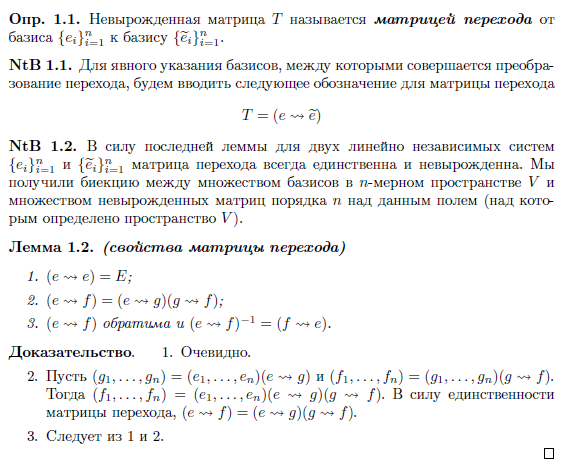  

考虑线性空间 \( V(\mathbb{K}) \)。显然，在线性空间中选择基是不唯一的，但由于所有基的维数相同，可以假设存在从一个基转换到另一个基的操作。

设 \( e = \{e_1, e_2, \ldots, e_n\} \) 是 \( V \) 的一个基，\( \tilde{e} = \{\tilde{e}_1, \tilde{e}_2, \ldots, \tilde{e}_n\} \) 是另一个向量组（通常与第一个基不同）。我们将向量组 \(\{\tilde{e}_i\}_{i=1}^n\) 表示为基向量的线性组合：

\[
\begin{cases}
\tilde{e}_1 = c_{11}e_1 + c_{21}e_2 + \ldots + c_{n1}e_n \\
\tilde{e}_2 = c_{12}e_1 + c_{22}e_2 + \ldots + c_{n2}e_n \\
\vdots \\
\tilde{e}_n = c_{1n}e_1 + c_{2n}e_2 + \ldots + c_{nn}e_n
\end{cases}
\]

并构造矩阵 \( T = (\tau_{ij}) \)。需要注意的是，矩阵 \( T \) 是通过将向量组的坐标相对于基写成列向量得到的。如果将矩阵乘法的规则扩展到其中一个矩阵的元素是向量的情况（这在线性空间中定义的操作下是有意义的），则可以写成：

\[
(\tilde{e}_1, \ldots, \tilde{e}_n) = (e_1, \ldots, e_n)T
\]  

**引理 1.1.** 向量组 \(\{\widehat{e}_i\}_{i=1}^n\) 线性无关当且仅当矩阵 \(T\) 非奇异。

**证明**：如果矩阵 \(T\) 是奇异的，则存在一个高度为 \(n\) 的非零列向量 \(x\)，使得 \(Tx = 0\)。然后，将等式 (1) 两边右乘 \(x\)，得到向量组 \(\{\widehat{e}_i\}_{i=1}^n\) 的一个非平凡线性相关性。

反之，如果向量组 \(\{\widehat{e}_i\}_{i=1}^n\) 线性相关，则存在一个高度为 \(n\) 的非零列向量 \(x\)，使得 \(\{\widehat{e}_1, \ldots, \widehat{e}_n\} x = 0\)。然后，根据等式 (1) 和向量组 \(\{e_i\}_{i=1}^n\) 的线性无关性，我们得到 \(Tx = 0\)，即矩阵 \(T\) 的列向量线性相关，因此该矩阵是奇异的。  

**引理 1.1.** 向量组 \(\{\widehat{e}_i\}_{i=1}^n\) 线性无关当且仅当矩阵 \(T\) 非奇异。

**证明**：如果矩阵 \(T\) 是奇异的，则存在一个高度为 \(n\) 的非零列向量 \(x\)，使得 \(Tx = 0\)。然后，将等式 (1) 两边右乘 \(x\)，得到向量组 \(\{\widehat{e}_i\}_{i=1}^n\) 的一个非平凡线性相关性。

反之，如果向量组 \(\{\widehat{e}_i\}_{i=1}^n\) 线性相关，则存在一个高度为 \(n\) 的非零列向量 \(x\)，使得 \(\{\widehat{e}_1, \ldots, \widehat{e}_n\} x = 0\)。然后，根据等式 (1) 和向量组 \(\{e_i\}_{i=1}^n\) 的线性无关性，我们得到 \(Tx = 0\)，即矩阵 \(T\) 的列向量线性相关，因此该矩阵是奇异的。  

**定义 1.1.** 非奇异矩阵 \( T \) 称为从基 \(\{e_i\}_{i=1}^n\) 到基 \(\{\widehat{e}_i\}_{i=1}^n\) 的**过渡矩阵**。

**注 1.1.** 为了明确表示进行过渡变换的基，我们引入以下符号来表示过渡矩阵：

\[
T = (e \leadsto \widehat{e})
\]  

**注 1.2.** 根据最后的引理，对于两个线性无关的向量组  
\[
\{e_i\}_{i=1}^n \text{ 和 } \{\widetilde{e}_i\}_{i=1}^n
\]  
过渡矩阵总是唯一且非奇异的。我们得到了 \(n\) 维空间 \(V\) 中所有基的集合与定义在该域上的 \(n\) 阶非奇异矩阵集合之间的双射。

**引理 1.2.**（过渡矩阵的性质）

1. \((e \leadsto e) = E\)；

2. \((e \leadsto f) = (e \leadsto g)(g \leadsto f)\)；

3. \((e \leadsto f)\) 是可逆的，且 \((e \leadsto f)^{-1} = (f \leadsto e)\)。  

## Изменение координат при изменении базиса  
## 基变换时的坐标变化  

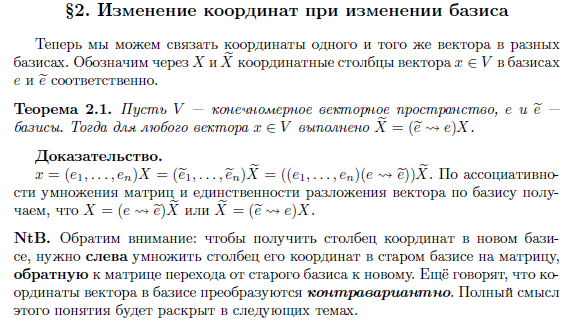  

现在我们可以将同一个向量在不同基中的坐标联系起来。设 \( X \) 和 \( \tilde{X} \) 分别是向量 \( x \in V \) 在基 \( e \) 和基 \( \tilde{e} \) 中的坐标列向量。

**定理 2.1.** 设 \( V \) 是一个有限维向量空间，\( e \) 和 \( \tilde{e} \) 是 \( V \) 的两个基。则对于任意向量 \( x \in V \)，有 \( \tilde{X} = (\tilde{e} \leadsto e)X \)。

---

**证明**：

\( x = (e_1, \ldots, e_n)X = (\tilde{e}_1, \ldots, \tilde{e}_n)\tilde{X} = ((e_1, \ldots, e_n)(e \leadsto \tilde{e}))\tilde{X} \)。根据矩阵乘法的结合性和向量在基中分解的唯一性，我们得到 \( X = (e \leadsto \tilde{e})X \) 或 \( \tilde{X} = (\tilde{e} \leadsto e)X \)。

**注**：需要注意的是，为了得到向量在新基中的坐标列向量，需要将向量在旧基中的坐标列向量**左乘**从旧基到新基的过渡矩阵的**逆矩阵**。我们还说，向量在基中的坐标是**反变**的。这个概念的全部意义将在后续的主题中进一步展开。  

## Матричные группы  
## 矩阵群  

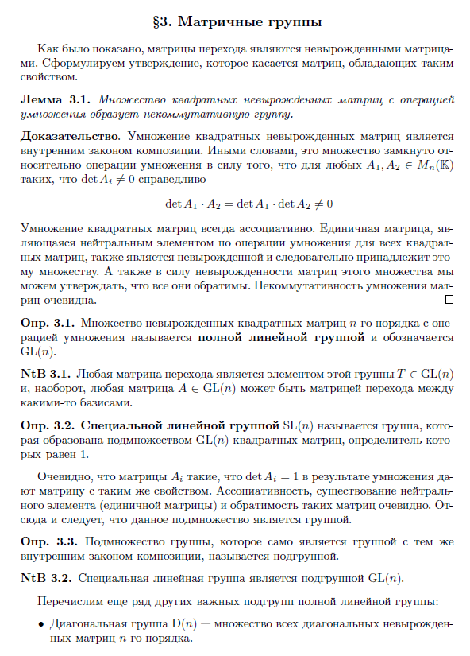  

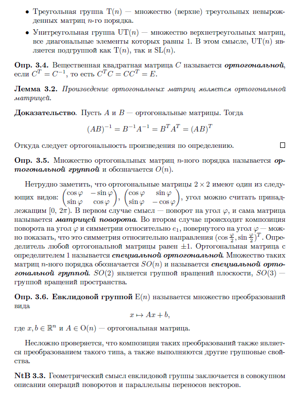  

正如前面所示，过渡矩阵是非奇异矩阵。我们提出一个关于具有这种性质的矩阵的命题。

**引理 3.1.** 所有非奇异方阵在矩阵乘法运算下形成一个非交换群。  

**证明**：非奇异方阵的乘法是一个内部合成法则。换句话说，这个集合在乘法运算下是封闭的，因为对于任意 \( A_1, A_2 \in M_n(\mathbb{K}) \) 且 \(\det A_i \neq 0\)，有  
\[
\det A_1 \cdot A_2 = \det A_1 \cdot \det A_2 \neq 0
\]

方阵的乘法总是结合的。单位矩阵是所有方阵乘法运算的中性元素，它也是非奇异的，因此属于这个集合。此外，由于这个集合中的矩阵都是非奇异的，我们可以断言它们都是可逆的。矩阵乘法的非交换性是显而易见的。  

**定义 3.1.** 所有 \( n \) 阶非奇异方阵在乘法运算下形成的集合称为**一般线性群**，记作 \( \text{GL}(n) \)。

**注 3.1.** 任何过渡矩阵都是这个群的一个元素，即 \( T \in \text{GL}(n) \)。反之，任何矩阵 \( A \in \text{GL}(n) \) 都可以作为某些基之间的过渡矩阵。  

**定义 3.2.** **特殊线性群 \( \text{SL}(n) \)** 是由 \( \text{GL}(n) \) 中行列式为 1 的方阵组成的子集形成的群。

显然，行列式为 1 的矩阵 \( A_i \) 在乘法运算下仍然保持行列式为 1 的性质。结合律、单位元（单位矩阵）的存在性以及这些矩阵的可逆性都是显而易见的。因此，这个子集构成一个群。

**定义 3.3.** 如果一个群的子集在相同的内部合成法则下也构成一个群，则称该子集为**子群**。  

**注 3.2.** 特殊线性群 \( \text{SL}(n) \) 是 \( \text{GL}(n) \) 的一个子群。

我们列举一些其他重要的 \( \text{GL}(n) \) 的子群：

- **对角群 \( \text{D}(n) \)**：所有 \( n \) 阶非奇异对角矩阵的集合。

- **三角群 \( \text{T}(n) \)**：所有 \( n \) 阶非奇异（上）三角矩阵的集合。

- **单位三角群 \( \text{UT}(n) \)**：所有对角元素为 1 的上三角矩阵的集合。在这个意义上，\( \text{UT}(n) \) 既是 \( \text{T}(n) \) 的子群，也是 \( \text{SL}(n) \) 的子群。  

**定义 3.4.** 实方阵 \( C \) 称为**正交矩阵**，如果 \( C^T = C^{-1} \)，即 \( C^T C = C C^T = E \)。

**引理 3.2.** 正交矩阵的乘积仍然是正交矩阵。

**证明**：设 \( A \) 和 \( B \) 是正交矩阵。则  
\[
(AB)^{-1} = B^{-1}A^{-1} = B^T A^T = (AB)^T
\]

根据定义，这证明了乘积 \( AB \) 是正交矩阵。  

**定义 3.5.** 所有 \( n \) 阶正交矩阵的集合称为**正交群**，记作 \( O(n) \)。

不难注意到，\( 2 \times 2 \) 正交矩阵具有以下形式之一：
\[
\begin{pmatrix}
\cos \varphi & -\sin \varphi \\
\sin \varphi & \cos \varphi
\end{pmatrix},
\begin{pmatrix}
\cos \varphi & \sin \varphi \\
\sin \varphi & -\cos \varphi
\end{pmatrix},
\]
其中角度 \( \varphi \) 可以认为属于 \([0, 2\pi]\)。在第一种情况下，矩阵表示旋转角度 \( \varphi \)，称为**旋转矩阵**。在第二种情况下，矩阵表示旋转角度 \( \varphi \) 后关于旋转后的 \( e_1 \) 轴的对称变换。任何正交矩阵的行列式为 \( \pm 1 \)。行列式为 1 的正交矩阵称为**特殊正交矩阵**。所有 \( n \) 阶特殊正交矩阵的集合记作 \( SO(n) \)，称为**特殊正交群**。\( SO(2) \) 是平面旋转群，\( SO(3) \) 是空间旋转群。  

**定义 3.6.** **欧几里得群 \( E(n) \)** 是指所有形如  
\[
x \rightarrow A x + b
\]  
的变换的集合，其中 \( x, b \in \mathbb{R}^n \)，且 \( A \in O(n) \) 是一个正交矩阵。

容易验证，这些变换的复合仍然是这种类型的变换，并且满足其他群的性质。

**注 3.3.** 欧几里得群的几何意义在于它同时描述了向量的旋转和平移操作。  