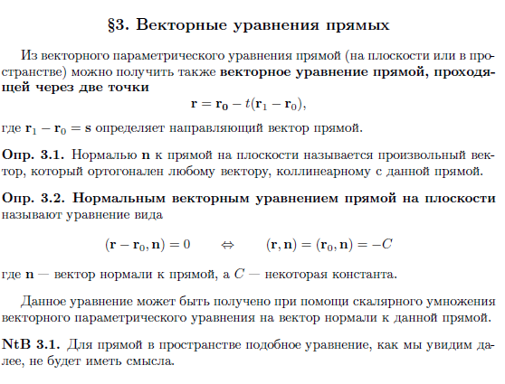
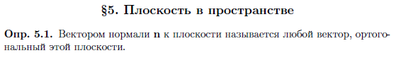

# Геометрическое пространство  
# 几何空间  

## Системы координат  
## 坐标系  

  

在描述平面（或空间）上向量的几何空间时，我们将从直观的概念和明显的构造出发，这些构造能够将几何方法与代数方法联系起来。几何学中基本的自然对象是点，我们将从点开始我们的讨论。  

定义1.1. 坐标法是一种方法，它允许在几何对象（点）与代数对象（数）之间建立对应关系，并通过解析关系来描述它们的性质及它们之间的关系。  

定义1.2. 坐标线是一条无自交的连续线，其上的每一点都对应一个实数。  

定义1.3. 坐标轴α是指一条有方向的直线，它具有一个起点O和一个尺度（比例尺）E。对于坐标轴上的任意一点P，都对应一个实数xP，称为该点的坐标：
P ∈ α ↔ xP ∈ R  

注：平面（或空间）上的坐标轴共同构成了一个坐标系。  

  

  

定义1.4. 平面（或空间）上的直线坐标系是指由两条（或三条）不同方向的坐标轴组成的系统，这些坐标轴具有共同的起点。  

在固定的平面坐标系中，每个点都对应一对实数。

\[\forall P \iff (x_P, y_P) \in \mathbb{R} \times \mathbb{R} = \mathbb{R}^2\]

在固定的空间坐标系中，每个点都对应一个三元实数。

\[\forall P \iff (x_P, y_P, z_P) \in \mathbb{R}^3\]  

定义1.5. 平面上的坐标水平线是指与任一坐标轴平行的直线。  

定义1.6. 空间中的坐标水平面是指与任一坐标平面平行的平面。  

定义1.7. 直角坐标系是指其中每对坐标轴之间的夹角为直角的系统。如果在坐标轴上选择了相同的尺度，则这种系统称为笛卡尔直角坐标系。  

定义1.8. 极坐标系是一种坐标系，其中每个点对应一个极半径 r（从坐标原点（极点）到点的距离）和一个极角 ϕ，极角从坐标原点出发的射线（极轴）逆时针方向测量。  

**注：** 一对极坐标 \((r, \phi)\) 可以通过三角函数转换为笛卡尔坐标 \((x, y)\)，假设极轴与 \(Ox\) 轴的正方向重合。

\[
\begin{cases} 
x = r \cos \phi \\
y = r \sin \phi
\end{cases}
\]  

## Векторы  
## 向量  

除了点之外，另一个自然对象是几何向量。在初等数学中，通常不会明确指出向量和有向线段之间的区别，但两者之间存在差异。在本课程中，我们将明确区分这两个概念。  

  

  

定义2.1. 有向线段，或称为固定向量，是由明确确定的点所定义的线段，这些点被称为有向线段的起点和终点。  

例2.1. 点A的径向量是指从坐标原点到点A的有向线段。  

定义2.2. 如果有向线段位于平行直线上，则称它们为共线的。  

定义2.3. 如果有向线段位于平行平面上，则称它们为共面的。  

注：任何两个有向线段都是共面的。  

定义2.4. 有向线段AB的模（或长度）是指线段AB的长度。  

定义2.5. 集合M上的等价关系∼是指具有自反性、对称性和传递性的关系。  

定义2.6. 元素a ∈ M的等价类是指集合M中所有与a等价的元素的子集。  

定义2.7. 如果有向线段方向相同且它们的模相等，则称它们为等价的。  

定义2.8. 自由向量，或简称为向量，是指有向线段的等价类。  

## Множество векторов  
## 向量集合  

  

  

考虑两个自由向量a和b。从任意点A出发，画出有向线段AB，它是自由向量a的表示，然后从点B出发，画出属于向量b的向量BC。  

定义3.1. 向量a和b的和是指向量c，它是有向线段AC的等价类，其起点与向量AB的起点重合，终点与向量BC的终点重合。  

定义3.2. 向量a与标量\(\lambda\)的乘积是指向量\(b = \lambda a\)，满足以下条件：

(a) \(|b| = |\lambda||a|\)

(б) \(\lambda > 0 \Rightarrow a \uparrow  \uparrow b\)

(в) \(\lambda < 0 \Rightarrow a \uparrow \downarrow b\)

(г) \(\lambda = 0 \Rightarrow b = 0\)  

引理3.1. 具有加法和标量乘法运算的自由向量集合构成一个线性空间。  

证明：线性空间的公理显然成立。

在自由向量集合上引入线性空间结构，可以重新表述生成它的等价关系。  

定义3.3. 点 \( P \) 的平移（或位移）\( T_a \) 是指将点 \( P \) 映射到点 \( P' \) 的变换，使得有向线段 \( PP' \) 的长度和方向与称为平移向量的 \( a \) 一致。  

引理3.2. 平移的集合形成一个阿贝尔群。  

阿贝尔群（Abelian Group）是满足以下条件的群：

1. **封闭性**：对于任意 \( a, b \in G \)，\( a * b \in G \)。
2. **结合律**：对于任意 \( a, b, c \in G \)，\( (a * b) * c = a * (b * c) \)。
3. **单位元**：存在 \( e \in G \)，使得对于任意 \( a \in G \)，\( a * e = e * a = a \)。
4. **逆元**：对于任意 \( a \in G \)，存在 \( a^{-1} \in G \)，使得 \( a * a^{-1} = a^{-1} * a = e \)。
5. **交换律**：对于任意 \( a, b \in G \)，\( a * b = b * a \)。

**证明：** 平移 \( T_a \circ T_b \) 的复合可以唯一地解释为将点 \( P \) 映射到另一个点 \( P' \)，使得  
\[PP' = a + b.\]  
因此，向量集合上的阿贝尔群结构唯一地转移到平移变换的集合上。  

**注3.1：** 平移群是欧几里得变换群（子群）的特例，其中正交矩阵 \( A \) 与单位矩阵一致。  

注3.2. 有向线段的等价性等同于存在一个平移变换，该变换唯一地将有向线段的对应点映射起来。零向量的平移（恒等变换）确保了关系的自反性，平移的可逆性保证了对称性。传递性来自于将平移的复合表示为向量和的形式。  

## Аффинное пространство  
## 仿射空间  

  

  

考虑一种更一般的方法，它不仅允许描述几何空间中的点和向量，还可以描述具有类似结构的其他集合。

设 \( A \) 是一个非空集合，其元素我们称为*点*，\( L(\mathbb{B}) \) 是域 \( \mathbb{K} \) 上的线性空间，并且定义了一个映射（向量化）

\[\Phi : A \times A \rightarrow L\]

将 \( A \) 中的点对 \((A, B)\) 映射为向量 \(\mathbf{AB} = x \in L\)。  

**定义4.1.** 三元组 \((A, L, \Phi)\) 称为具有域 \(\mathbb{K}\) 上关联线性空间 \(L\) 的仿射空间，如果满足以下条件：

- 对于任意点 \(A \in A\) 和任意向量 \(x \in L\)，存在唯一的点 \(B \in A\)，使得  
  \[  \mathbf{AB} = x \in L.\]

- 对于任意三个点 \(A, B, C \in A\)，成立（三角形）等式  
  \[  \mathbf{AC} = \mathbf{AB} + \mathbf{BC}\]  

注4.1. 显然，平面（或空间）上的点集与关联的自由向量线性空间满足这些要求。  

将几何空间中的点和向量视为仿射空间，可以将线性空间的基的概念转移到这种结构中。  

**定义4.2.** 标架（或点基）是指固定点 \( O \)（坐标原点）和关联线性空间的基 \(\{e_i\}_{i=1}^n\) 的组合。  

**注4.2.** 引入点基后，可以为每个点 \( P \) 关联一个向量 \(\mathbf{OP} \in L\)，这是径向量的一种推广。由于线性空间基的唯一分解性，可以断言向量 \(\mathbf{OP}\) 唯一地表示为基向量 \( L \) 的线性组合：

\[
\mathbf{r}_P = \mathbf{OP} = \alpha_1 e_1 + \alpha_2 e_2 + \ldots + \alpha_n e_n
\]  

注：定义不同空间中的基：
(a) 在直线上，基是任意非零向量；
(b) 在平面上，基是任意一对不共线的有序向量；
(c) 在三维空间中，基是任意三个不共面的有序向量。  

**注：** 笛卡尔直角坐标系轴的单位向量 i、j 和 k 构成空间的基。因此，任意点 \( A \) 的径向量可以按基分解为

\[
\Gamma_A = x_A i + y_A j + z_A k,
\]

其中 \( x_A \)、\( y_A \) 和 \( z_A \) 是该点在该坐标系中的坐标。  

# Векторы на плоскости и в пространстве  
# 平面和空间中的向量  

## Проекция вектора  
## 向量的投影  

  

**定义1.1.** 点A在直线L上的正交投影是指从点A向直线L作垂线得到的点A′。  

**定义1.2.** 向量 **a = [AB]** 在直线 _L_ 上的正交投影是指有向线段 **A′B′** 的等价类 **a′**，其中点 _A′_ 是有向线段 AB 的起点 A 的正交投影，点 B′ 是有向线段 AB 的终点 B 的正交投影。

$\mathbf{a}^{\prime}=\operatorname{Pr}_L^{\perp} \mathbf{a}$  

**定义1.3.** 有向直线L的单位向量e是指模等于|e| = 1且方向与直线方向一致的向量。  

**定义1.4.** 设在直线 \( L \) 上给定方向，\( e \) 是其单位向量。向量 **a** 在轴 \( L \) 上的投影量是指满足以下条件的数 $\mathbf{a}^{\prime}=\operatorname{Pr}_L^{\perp} \mathbf{a}$：  
\[ a' = x_a e \]  

**注：** 对于任何在 \( L \) 上给定的向量 **a**，存在唯一的表示  
\[ a = x_a e \]  
其中 \( e \) 是轴 \( L \) 的单位向量。  

**注：** 对于任何在平面上给定的向量 **a**，存在唯一的表示在笛卡尔直角坐标系基 {i,j} 中，其中 i 和 j 是坐标轴 \( Ox \) 和 \( Oy \) 的单位向量。

\[a = x_a i + y_a j,\]

其中 $\mathbf{x_a}=\operatorname{Pr}_x^{\perp} \mathbf{a}$ 且 $\mathbf{y_a}=\operatorname{Pr}_y^{\perp} \mathbf{a}$。

**注：** 对于任何在空间中给定的向量 **a**，存在唯一的表示在笛卡尔直角坐标系基 {i,j,k} 中，其中 i、j 和 k 是坐标轴 \( Ox \)、\( Oy \) 和 \( Oz \) 的单位向量。

\[a = x_a i + y_a j + z_a k,\]

其中 $\mathbf{x_a}=\operatorname{Pr}_x^{\perp} \mathbf{a}$、$\mathbf{y_a}=\operatorname{Pr}_y^{\perp} \mathbf{a}$ 且 $\mathbf{z_a}=\operatorname{Pr}_z^{\perp} \mathbf{a}$。  

## Скалярное произведение  
## 点积（标量积） 

  

**定义2.1.** 向量 **a** 和 **b** 的点积是指由以下等式定义的数：

$(\mathbf{a}, \mathbf{b})=|\mathbf{a}| \cdot \operatorname{Pr}_{\mathbf{a}}^{\perp} \mathbf{b}$  

**定义2.2.** 对于点积，有几种表示方法。

\[(\mathbf{a}, \mathbf{b}) = (\mathbf{a} \cdot \mathbf{b}) = \mathbf{a} \cdot \mathbf{b}\]

(a) 与向量间角度的关系。

\[(\mathbf{a}, \mathbf{b}) = |\mathbf{a}| |\mathbf{b}| \cos \varphi\]

(б) 线性。

\[(\lambda \mathbf{a} + \mu \mathbf{b}, \mathbf{c}) = \lambda (\mathbf{a}, \mathbf{c}) + \mu (\mathbf{b}, \mathbf{c})\]

(b) 对称性。

\[(\mathbf{a}, \mathbf{b}) = (\mathbf{b}, \mathbf{a})\]

**定义2.3.** 如果向量 **a** 和 **b** 不是零向量，并且满足以下条件，则称它们是正交的：

\[
(a, b) = 0 \quad \Leftrightarrow \quad a \perp b, \quad a, b \neq 0
\]

**注：** 考虑笛卡尔直角坐标系中的向量点积。

(a) 单位向量的点积。

\[
i \cdot i = 1 \quad j \cdot j = 1 \quad k \cdot k = 1  
\]
\[
i \cdot j = 0 \quad j \cdot k = 0 \quad i \cdot k = 0  
\]

(б) 向量 **a** 和 **b** 的点积。

\[
a \cdot b = (a_x i + a_y j + a_z k) \cdot (b_x i + b_y j + b_z k) = a_x b_x + a_y b_y + a_z b_z  
\]

(в) 向量 **a** 的长度。

\[
|a| = \sqrt{(a, a)} = \sqrt{a_x^2 + a_y^2 + a_z^2}
\]  

## Векторное произведение  
## 向量积  

**定义3.1.** 三元组 {a, b, c} 被称为**右手系**，如果观察者沿着向量 **c** 的方向看，从 **a** 到 **b** 的最短旋转是顺时针方向。

**定义3.2.** 向量 **a** 和 **b** 的**向量积**是指满足以下条件的向量 **c**：

(a) |c| = |a||b| sin ϕ，其中 ϕ 是向量之间的夹角；

(б) **c** ⊥ **a**，**c** ⊥ **b**；

(b) {a, b, c} 形成一个右手系。

**注：** 向量积的表示方法如下：

\[
[a, b] = [a \times b] = a \times b
\]

**注：** 向量 **a** 和 **b** 的向量积的模等于由这两个向量构成的平行四边形的面积。  

**向量积的性质**

(a) 线性。

\[
(\lambda a + \mu b) \times c = \lambda a \times c + \mu b \times c
\]

(б) 反交换性。

\[
a \times b = -b \times a
\]

(b) 与向量共线性的关系。

\[
a \times b = 0 \iff a \parallel b
\]

(r) 正交分量的分解。

\[
a \times b = (a_{\perp}b) \times b = a \times (b_{\perp} a),
\]

其中 \(a_{\perp} b\) 是向量 **a** 中与向量 **b** 正交的分量，反之 \(b_{\perp} a\) 是向量 **b** 中与向量 **a** 正交的分量。  

**注：笛卡尔直角坐标系中的向量积**

(a) 单位向量的向量积

\[
i \times j = k \quad j \times k = i \quad k \times i = j
\]
\[
i \times i = 0 \quad j \times j = 0 \quad k \times k = 0
\]

(б) 向量 **a** 和 **b** 的向量积

\[
a \times b = (a_x i + a_y j + a_z k) \times (b_x i + b_y j + b_z k) =
\]
\[
= (a_y b_z - a_z b_y)i + (a_z b_x - a_x b_z)j + (a_x b_y - a_y b_x)k
\]

笛卡尔直角坐标系中的向量积可以表示为行列式：

$\mathbf{a} \times \mathbf{b}=\left|\begin{array}{ll}a_y & a_z \\ b_y & b_z\end{array}\right| \mathbf{i}-\left|\begin{array}{cc}a_x & a_z \\ b_x & b_z\end{array}\right| \mathbf{j}+\left|\begin{array}{cc}a_x & a_y \\ b_x & b_y\end{array}\right| \mathbf{k}=\left|\begin{array}{ccc}\mathbf{i} & \mathbf{j} & \mathbf{k} \\ a_x & a_y & a_z \\ b_x & b_y & b_z\end{array}\right|$  

## Смешанное произведение
## 混合积  

**定义4.1.** 三个向量 **a**、**b** 和 **c** 的**混合积**是指对该三元组依次应用向量积和点积运算的结果：

\[
a \cdot (b \times c) \equiv (a, b, c)
\]

### 混合积的性质

(a) 与向量共面性的关系。

\[
(a, b, c) = 0 \quad \Leftrightarrow \quad a, b, c \text{ 共面}
\]

(б) 循环置换。

\[
a \cdot (b \times c) = b \cdot (c \times a) = c \cdot (a \times b)
\]

(b) 非循环置换（由于反交换性）。

\[
a \cdot (b \times c) = -a \cdot (c \times b) = -b \cdot (a \times c) = -c \cdot (b \times a)
\]

(r) 乘法的可交换性。

\[
a \cdot (b \times c) = (a \times b) \cdot c
\]

(д) 混合积的符号。

\[
(a, b, c) > 0 \quad \Leftrightarrow \quad \{a, b, c\} \text{ 是右手系}
\]

(e) 平行六面体的体积。

\[
|\{a, b, c\}| = V_{abc}
\]  

**注：** 笛卡尔直角坐标系中的混合积。

\[
(a, b, c) = a_x \left| \begin{array}{cc} b_y & b_z \\ c_y & c_z \end{array} \right| - a_y \left| \begin{array}{cc} b_x & b_z \\ c_x & c_z \end{array} \right| + a_z \left| \begin{array}{cc} b_x & b_y \\ c_x & c_y \end{array} \right| = \left| \begin{array}{ccc} a_x & a_y & a_z \\ b_x & b_y & b_z \\ c_x & c_y & c_z \end{array} \right|
\]

上述定义乘积的方法为描述某些几何对象提供了方便的方式，这些内容将在后续课程中讨论。  

# Прямая на плоскости  
# 平面上的直线  

## Аналитическая геометрия  
## 解析几何  

  

**§1. 解析几何**

任何几何问题的主要对象都是点。最令人感兴趣的是由某些性质联合起来的点集。这样的集合我们称之为**几何轨迹**。列举一些例子：

(a) 平面上与两个给定点等距的点的几何轨迹定义了矩形\(\mathbb{R}^2\)。

(б) 空间中与两个给定点等距的点的几何轨迹定义了平面\(\mathbb{R}^3\)。

(в) 空间中与三个不共线的给定点等距的点的几何轨迹定义了矩形\(\mathbb{R}^3\)。

**解析几何的任务**

(a) 用解析表达式或其集合描述几何轨迹；

(б) 找到满足给定条件的几何轨迹；

(в) 找到几何轨迹的交集；

(c) 寻找并描述几何轨迹的性质；

(d) 寻找几何轨迹的不变（几何）性质；

(e) 坐标系的转换及其解析描述；

(ж) 在坐标变换下几何轨迹方程的转换。  

## Общий подход к рассмотрению прямых и плоскостей  

## 直线和平面的通用分析方法  

  

考虑线性空间 \( \mathbb{R}^n \)，当 \( n = 2 \) 时为平面，\( n = 3 \) 时为三维几何空间，并固定一个子空间 \( L \leq \mathbb{R}^n \)。线性流形 \( M \) 是指通过将某个线性子空间“平移”一个向量 \( \mathbf{r}_0 \) 得到的线性空间的子集。

\[
M = \mathbf{r}_0 + L \quad \Leftrightarrow \quad \forall \mathbf{r} \in M \quad \exists \mathbf{s} \in L : \quad \mathbf{r} = \mathbf{r}_0 + \mathbf{s}
\]

**定义2.1.** 用于构建线性流形 \( M \) 的线性子空间 \( L \) 称为方向子空间。

根据几何空间的维度 \( n \) 和线性子空间 \( L \leq \mathbb{R}^n \) 的维度 \( k = \dim L \) 之间的关系，我们可以在几何空间中得到不同类型的线性流形。可能的情况包括：

- \( n = 2, k = 1 \)：\( M \) 是端点位于平面上一条直线的径向量。此时
  \[
  \mathbf{r} = \mathbf{r}_0 + \alpha \mathbf{s}, \quad (1)
  \]
  其中 \( \mathbf{r}_0 \) 是该直线的参考点的径向量，\( \mathbf{s} \) 是方向子空间中的非零向量，也称为方向向量。

- \( n = 3, k = 1 \)：\( M \) 是端点位于空间中一条直线的径向量。此时与上述情况类似
  \[
  \mathbf{r} = \mathbf{r}_0 + \alpha \mathbf{s}. \quad (2)
  \]

- \( n = 3, k = 2 \)：\( M \) 是端点位于空间中一个平面的径向量。此时
  \[
  \mathbf{r} = \mathbf{r}_0 + \alpha \mathbf{a} + \beta \mathbf{b}, \quad (3)
  \]
  其中 \( \mathbf{r}_0 \) 是该平面的参考点的径向量，\( \mathbf{a} \) 和 \( \mathbf{b} \) 是空间中线性无关（不共线）的向量，它们的线性张成构成了线性子空间 \( L \)。

**注2.1.** 引入点基可以在上述方程中建立直线或平面上的点与径向量 \( \mathbf{r} \) 之间的对应关系。

**定义2.2.** 通过参考点的径向量和方向子空间的向量来描述直线（在平面或空间中）和平面（在空间中）的方程称为直线和平面的向量参数方程。

## Векторные уравнения прямых  
## 直线的向量方程  

  

从直线的向量参数方程（在平面或空间中）还可以得到通过两点的直线的向量方程：
\[
\mathbf{r} = \mathbf{r}_0 + t(\mathbf{r}_1 - \mathbf{r}_0),
\]
其中 \( \mathbf{r}_1 - \mathbf{r}_0 = s\) 是直线的方向向量。

**定义3.1.** 平面上直线的法向量是指与任何与该直线平行的向量正交的任意向量。

**定义3.2.** 平面上直线的法向量方程是指以下形式的方程：
\[
(\mathbf{r} - \mathbf{r}_0, \mathbf{n}) = 0 \quad \iff \quad (\mathbf{r}, \mathbf{n}) = (\mathbf{r}_0, \mathbf{n}) = -C
\]
其中 \( \mathbf{n} \) 是直线的法向量，\( C \) 是某个常数。

该方程可以通过将直线的向量参数方程与直线的法向量进行点积得到。

**注3.1.** 对于空间中的直线，类似的方程将不再有意义。

## Взаимное расположение прямых  
## 直线的相互位置关系  

  

  

**平面上的直线**

假设平面上的直线由向量参数方程（或法向量方程）给出：

\[
\mathbf{r} = \mathbf{r}_1 + t_1 \mathbf{s}_1 \quad (\mathbf{r}, \mathbf{n}_1) = (\mathbf{r}_1, \mathbf{n}_1)
\]
\[
\mathbf{r} = \mathbf{r}_2 + t_2 \mathbf{s}_2 \quad (\mathbf{r}, \mathbf{n}_2) = (\mathbf{r}_2, \mathbf{n}_2)
\]

可能出现以下几种情况：

(a) 对于平行直线，满足以下等价条件：

(1) \( \mathbf{n}_1 \parallel \mathbf{n}_2 \quad \iff \quad \mathbf{n}_1 = \alpha \mathbf{n}_2 \)

(2) \( \mathbf{s}_1 \parallel \mathbf{s}_2 \quad \iff \quad \mathbf{s}_1 = \alpha \mathbf{s}_2 \)

(3) \( \mathbf{n}_1 \perp \mathbf{s}_2 \quad \iff \quad (\mathbf{n}_1, \mathbf{s}_2) = 0 \)

(б) 当直线重合时（平行的一种特殊情况），还需满足：

\[
\mathbf{s}_1 \parallel \mathbf{s}_2 \parallel (\mathbf{r}_1 - \mathbf{r}_2)
\]  

(b) 直线相交时，满足以下条件：
\[
(\mathbf{n}_1, \mathbf{s}_2) \neq 0, \quad (\mathbf{n}_2, \mathbf{s}_1) \neq 0
\]

(r) 对于正交直线（相交直线的一种特殊情况），可以断言：
\[
\mathbf{n}_1 \parallel \mathbf{s}_2, \quad \mathbf{n}_2 \parallel \mathbf{s}_1
\]  

**空间中的直线**

假设空间中的直线由向量参数方程给出：

\[
\mathbf{r} = \mathbf{r}_1 + t \mathbf{s}_1
\]
\[
\mathbf{r} = \mathbf{r}_2 + t \mathbf{s}_2
\]

可能出现以下几种情况：

(a) 直线平行

$\mathbf{s}_1 \| \mathbf{s}_2 \quad \Leftrightarrow \quad \mathbf{s}_1=\lambda \mathbf{s}_2$

(б) 直线重合

$\mathbf{s}_1\left\|\mathbf{s}_2\right\|\left(\mathbf{r}_2-\mathbf{r}_1\right)$

(b) 直线相交

$\left\{\begin{array}{l}\left(\mathbf{r}_2-\mathbf{r}_1, \mathbf{s}_1, \mathbf{s}_2\right)=0 \\ \mathbf{s}_1 \neq \lambda \mathbf{s}_2\end{array}\right.$

(c) 直线异面

$\left(\mathbf{r}_1-\mathbf{r}_2, \mathbf{s}_1, \mathbf{s}_2\right) \neq 0$

这些性质基于一个自然的假设：如果两条直线相交，则它们位于同一平面内，因此向量 \(\mathbf{r}_2 - \mathbf{r}_1\)、\(\mathbf{s}_1\) 和 \(\mathbf{s}_2\) 是共面的。对于异面直线，无法找到这样的平面，因此这三个向量的不共面性是判断直线异面的标准。

## Плоскость в пространстве  
## 空间中的平面  

  

  

**定义5.1.** 平面的法向量 \( \mathbf{n} \) 是指与该平面正交的任意向量。  

**注5.1.** 如果已知两个不共线的向量 **a** 和 **b** 属于该平面，则法向量可以自然地通过这两个向量的向量积得到：

\[
\mathbf{n} = \mathbf{a} \times \mathbf{b} \quad 
\]

除了向量参数方程外，还可以定义其他向量方程来描述空间中的平面：

(a) 空间中的平面法向量方程：

\[
(\mathbf{r} - \mathbf{r}_0, \mathbf{n}) = 0 \quad \iff \quad (\mathbf{r}, \mathbf{n}) = (\mathbf{r}_0, \mathbf{n}) = -D
\]

(б) 由共面条件得到的方程：

\[
(\mathbf{r} - \mathbf{r}_0, \mathbf{a} \times \mathbf{b}) = (\mathbf{r} - \mathbf{r}_0, \mathbf{a}, \mathbf{b}) = 0 \quad 
\]

实际上，对于属于平面的点，表达式 \(\mathbf{r} - \mathbf{r}_0\) 也定义了一个位于该平面内的向量，因此它与向量 **a** 和 **b** 共面。

## Взаимное расположение плоскостей в пространстве  
## 空间中平面的相互位置关系  

  

假设平面由向量参数方程（或法向量方程）给出：

\[
\mathbf{r} = \mathbf{r}_1 + \alpha_1\mathbf{a}_1 + \beta_1\mathbf{b}_1 \quad (\mathbf{r}, \mathbf{n}_1) = (\mathbf{r}_1, \mathbf{n}_1) = -D_1 \\
\mathbf{r} = \mathbf{r}_2 + \alpha_2\mathbf{a}_2 + \beta_2\mathbf{b}_2 \quad (\mathbf{r}, \mathbf{n}_2) = (\mathbf{r}_2, \mathbf{n}_2) = -D_2
\]

可能出现以下几种情况：

(a) 平面平行

\[
\mathbf{n}_1 \parallel \mathbf{n}_2 \iff \mathbf{n}_1 = \lambda \mathbf{n}_2
\]

(б) 平面重合

\[
\begin{cases}
\mathbf{n}_1 = \lambda \mathbf{n}_2 \\
D_1 = \lambda D_2
\end{cases}
\]

或

\[
(\mathbf{r}_1 - \mathbf{r}_2, \mathbf{a}_1, \mathbf{b}_1) = (\mathbf{r}_1 - \mathbf{r}_2, \mathbf{a}_2, \mathbf{b}_2) = 0
\]

(в) 平面相交

\[
\mathbf{n}_1 \neq \lambda \mathbf{n}_2
\]

或

\[
[\mathbf{n}_1 \times \mathbf{n}_2] = \mathbf{s} \neq 0
\]

(г) 平面正交

\[
(\mathbf{n}_1, \mathbf{n}_2) = 0
\]

## Взаимное расположение прямой и плоскости в пространстве  
## 空间中直线与平面的相互位置关系  

  

假设平面由法向量方程给出，空间中的直线由向量参数方程给出：

\[
(\mathbf{r}, \mathbf{n}) = (\mathbf{r}_1, \mathbf{n}) = -D
\]

\[
\mathbf{r} = \mathbf{r}_2 + t \cdot \mathbf{s}
\]

可能出现以下几种情况：

(a) 直线与平面平行

\[
(\mathbf{s}, \mathbf{n}) = 0
\]

(b) 直线属于平面（平行的一种特殊情况）

\[
(\mathbf{r}_1 - \mathbf{r}_2, \mathbf{n}) = 0
\]

(c) 直线与平面相交

\[
(\mathbf{s}, \mathbf{n}) \neq 0
\]

且交点可以通过参数 \( t \) 确定：

\[
t = \frac{(\mathbf{r}_1 - \mathbf{r}_2, \mathbf{n})}{(\mathbf{s}, \mathbf{n})}
\]

(d) 直线与平面正交（相交的一种特殊情况）

\[
\mathbf{s} \parallel \mathbf{n}
\]

\[
\Leftrightarrow \quad \mathbf{s} = \lambda \mathbf{n}
\]

# Кривые второго порядка на плоскости  
# 平面上的二次曲线  

## Линии на плоскости  
## 平面上的线  

  

  

让我们继续探讨点的几何位置，将直线的概念推广到可以用方程描述的任意曲线。  

**定义 1.1.** 在 \( \mathbb{R}^2 \) 上，线的方程是指坐标 \( x \) 和 \( y \) 之间的这样一种关系，即线上任何点的坐标都满足该方程，而线外任何点的坐标都不满足该方程。  

**定义线的方式**

(a) 显式定义线  
\[ y = f(x), \quad \text{或} \quad x = g(y) \]

(b) 隐式定义线  
\[ F(x, y) = 0 \]

(c) 参数式定义线  
\[\begin{cases} 
x = x(t) \\ 
y = y(t) 
\end{cases}\]  

**定义 1.2.** **平面上的代数曲线** 是指点的几何位置，其中坐标之间的关系可以通过幂函数表达。

\[ F(x, y) = a_1x^{m_1}y^{n_1} + \ldots + a_kx^{m_k}y^{n_k} = 0, \quad m_i, n_i \in \mathbb{N} \] 

**定义 1.3.** **线的阶数p** 是指定义坐标之间关系的多项式的阶数，即

\[ p = \max_{i=1,\ldots,k} (m_i + n_i) \]  

**定义 1.4.** 二阶代数线（曲线）的一般方程是指形如

\[ Ax^2 + 2Bxy + Cy^2 + Dx + Ey + F = 0 \] 

的方程，其中左边部分是由属于曲线的点的坐标 \( x \) 和 \( y \) 组成的二次多项式。

接下来我们将考虑二阶曲线的特殊情况。  

## Эллипс  
## 椭圆  

  

  

**定义 2.1.** 椭圆是指平面上到两个给定点（焦点фокус）的距离之和为常数的点的几何轨迹。  

我们这样安排坐标系，使得 \( Ox \) 轴通过椭圆的两个焦点 \( F_1 \) 和 \( F_2 \)，而 \( Oy \) 轴通过它们所形成线段的中点。这个线段的长度 \( |F_1F_2| = 2c \) 称为焦距。根据这一点，焦点的坐标为

\[ F_1(-c,0), \quad F_2(c,0) \tag{7} \]

那么，属于椭圆的任意点 \( M(x,y) \) 将满足等式

\[ |\mathbf{r}_1| + |\mathbf{r}_2| = 2a = \text{常数}, \tag{8} \]

其中 \( \mathbf{r}_{1,2} \) 是从焦点 \( F_{1,2} \) 到点 \( M(x,y) \) 的向量，称为焦半径(фокальный радиус)。  

**定义 2.2.** 形如

\[
\frac{x^2}{a^2} + \frac{y^2}{b^2} = 1, \quad b^2 = a^2 - c^2
\]

的方程称为椭圆的**标准方程**，其中 \( a \) 和 \( b \) 分别是长半轴和短半轴的长度。

**定义 2.3.** 椭圆的离心率(Эксцентриситет)是指 \( \varepsilon = c/a \)，它描述了椭圆的“拉伸”程度。  

**特殊情况**

(a) \( c = 0 \): 圆。

\[ c = 0 \Rightarrow r_1 = r_2 = a = R, \quad \varepsilon = 0 \] 

(b) \( c = a \): 线段。

\[ c = a \Rightarrow |F_1 F_2| = r_1 + r_2 = 2c, \quad \varepsilon = 1 \]   

**定义 2.4.** 椭圆的参数方程称为  
\[
\begin{cases} 
x = a \cos t \\ 
y = b \sin t 
\end{cases}
\]  

**定义 2.5.** 椭圆的切线方程称为形如  
\[
\frac{x x_0}{a^2} + \frac{y y_0}{b^2} = 1
\]   
的方程。

**定义 2.6.** 椭圆的准线(Директрис)是指平行于椭圆短轴并与其距离为 \( a / \varepsilon \) 的直线。  

**椭圆的性质**

(a) 椭圆的准线性质。椭圆是满足以下条件的点的集合：点到焦点的距离 \( r_{1,2} \) 与到相应准线的距离 \( d_{1,2} \) 的比值是常数，且等于偏心率 \( \varepsilon \)：

\[
\frac{r_1}{d_1} = \frac{r_2}{d_2} = \varepsilon \quad 
\]

(b) 椭圆的光学性质。椭圆上任意点 \( M_0 \) 的焦半径与该点处椭圆的切线形成相等的角度。

(c) 椭圆的对称性质。对于属于椭圆 \( E \) 的任意点 \( M(x, y) \)，以下性质成立：

- \( M_1(-x, y) \in E \) —— 关于 \( Oy \) 轴的轴对称
- \( M_1(x, -y) \in E \) —— 关于 \( Ox \) 轴的轴对称
- \( M_1(-x, -y) \in E \) —— 关于原点 \( O \) 的中心对称  

  

  

  

**关于椭圆**
https://www.zhihu.com/question/313445879  

## Гипербола  
## 双曲线  

  

  

  

**定义 3.1.** **双曲线** 是指平面上满足到两个固定点（焦点）的距离之差的绝对值为常数的点的几何轨迹。

\[
|r_1 - r_2| = 2a = \text{常数}, \quad |F_1F_2| = 2c, \quad 0 \leqslant a \leqslant c, \quad \varepsilon = \frac{c}{a} \quad 
\]

由于双曲线的定义与椭圆的定义极为相似，其方程和性质的形式也非常相似。因此，在描述双曲线时，我们将仅限于简要描述。  

(a) 双曲线的标准方程

\[
\frac{x^2}{a^2} - \frac{y^2}{b^2} = 1, \quad b^2 = c^2 - a^2, \quad 
\]

其中 \( a \) 和 \( b \) 分别是实轴和虚轴的长度。

(b) 双曲线有两个连通分支（称为双曲线的两支）

\[
|r_1 - r_2| = 2a > 0, \implies \begin{cases} 
r_1 > r_2 \\ 
r_2 > r_1 
\end{cases}, \quad 
\]  

(с) 特殊情况  
  - (a) \( a = 0 \): \( Oy \) 轴  
\( a = 0 \) \(\iff\) \(\varepsilon = \infty \)   

  - (b) \( a = c \): 在 \( Oz \) 上的两条射线，从焦点出发  
\( a = c \) \(\iff\) \(\varepsilon = 1 \)   

(d) 对称性。同样存在轴对称和中心对称  

(e) 双曲线的参数方程。定义方式类似，但不是通过三角函数的正弦和余弦，而是通过双曲函数  
\[
\begin{cases} 
x = a \, \text{ch}\, t \\ 
y = b \, \text{sh}\, t 
\end{cases}
\]   

  

  - **关于双曲函数**  
  - https://zhuanlan.zhihu.com/p/20042215  

(f) 双曲线的切线方程

\[
\frac{xx_0}{a^2} - \frac{yy_0}{b^2} = 1
\]

(g) 双曲线的准线。类似于椭圆的准线——平行于虚轴并位于距离 \( a / \varepsilon \) 处的直线

\[
x = \pm \frac{a}{\varepsilon}, \quad \frac{r_1}{d_1} = \frac{r_2}{d2} = \varepsilon
\]

(h) 光学性质。双曲线上任意点 \( M_0 \) 的焦半径与该点处双曲线的切线形成相等的角度。  

**定义 3.2.** **渐近线** 是指对于一条无限延伸的曲线，当曲线上的点趋向于无穷远时，该点到渐近线的距离趋近于零的直线。

**定理 3.1.** 在标准坐标系中，双曲线的渐近线为以下直线：

\[
y = \pm \frac{b}{a} x \quad 
\]  

## Парабола  
## 抛物线  

**定义 4.1.** **抛物线** 是指平面上到固定点（焦点）和固定直线（准线）的距离相等的点的几何轨迹。

设焦点位于点 \( F \left( \frac{p}{2}, 0 \right) \)，准线由方程

\[
x = -\frac{p}{2} \quad
\]

定义。  

(a) 抛物线的标准方程  
\[
y^2 = 2px,
\]  

其中 \( p \) 是焦点参数，定义为从焦点到准线的距离。  

(b) 抛物线在点 \((x, y)\) 处的切线方程  
\[
yy_0 = p(x + x_0)
\]  

(c) 抛物线的光学性质。抛物线在每一点 \( M_0 \) 处的切线与点 \( M_0 \) 的焦半径和抛物线的轴形成相等的角度。  

(d) 抛物线 \( P \) 关于 \( O_x \) 轴具有轴对称性：  
\[
M(x, y) \in P \iff M(x, -y) \in P
\]    

# Общие уравнения кривых 2-го порядка  
# 二阶曲线的一般方程  

## Полярные уравнения  
## 极坐标方程  

  

  

  

**关于极坐标**  
https://zhuanlan.zhihu.com/p/203377553  

**关于圆锥曲线**
https://www.zhihu.com/column/c_1466922775361818625  

我们从椭圆开始讨论。

**引理 1.1.** 在标准坐标系中，椭圆上点 \( M(x,y) \) 的焦半径 \( r_{1,2} \) 可以表示为

\[
r_{1,2} = a \pm \varepsilon x
\]

**证明.** 焦半径可以根据定义表示为点 \( M \) 到焦点 \( F_1 \) 和 \( F_2 \) 的距离

\[
r_{1,2} = \sqrt{(x \pm c)^2 + y^2}
\]

同时，点的坐标满足椭圆的标准方程

\[
y^2 = b^2 \left( 1 - \frac{x^2}{a^2} \right)
\]

通过直接代入和明显的变换，我们可以验证该命题的正确性。

\[
r_{1,2} = \sqrt{(x \pm c)^2 + b^2 - \frac{b^2}{a^2}x^2}
\]

\[
= \sqrt{\left( 1 - \frac{b^2}{a^2} \right)x^2 \pm 2xc + a^2} = \sqrt{\left(a \pm \frac{c}{a} x \right)^2} = a \pm \varepsilon x,
\]

其中 \( c^2 = a^2 - b^2 \) 且 \( \varepsilon = \frac{c}{a} \)。

通过类似的推理，我们可以得到双曲线的焦半径。  

**引理 1.2.** 在标准坐标系中，双曲线上点 \( M(x, y) \) 的焦半径 \( r_1, r_2 \) 可以表示为

\[
r_1, r_2 = |a \pm \varepsilon x|
\]

这些关系式使得我们可以用极坐标方程统一描述椭圆、双曲线和抛物线。  

**定理 1.1.** 形如

\[
\rho = \frac{p}{1 - \varepsilon \cos \phi}
\]

的方程描述了椭圆、双曲线和抛物线，具体取决于参数：

- **椭圆**
  \[
  \varepsilon \in [0,1) \quad p = a - \varepsilon c
  \]

- **抛物线**
  \[
  \varepsilon = 1 \quad p = 2c
  \]

- **双曲线**
  \[
  \varepsilon \in (1, \infty) \quad p = \pm (\varepsilon c - a)
  \]

其中，\( p \) 是焦点参数(фокальный параметр)，\( \rho \) 是极径(полярный радиус)，\( \phi \) 是极角(полярный угол,)。  

**证明.** 我们从椭圆开始证明。  
将坐标系的极点放在（左侧）焦点 \( F_1 \)。那么任意点的极径将与第一个焦半径重合  

\[
|r_1| = \rho
\]

根据椭圆的方程以及坐标之间的关系，我们得到  

\[
r_1 + r_2 = 2a, \quad r_1 = \rho, \quad r_2 = a - \varepsilon x, \quad x + c = \rho \cos \phi
\]

将这些关系整合起来  

\[
\rho + a - \varepsilon (\rho \cos \phi - c) = 2a \Rightarrow (1 - \varepsilon \cos \phi) \rho = a - \varepsilon c
\]

由此得出定理的结论。  

\[
\rho = \frac{a - \varepsilon c}{1 - \varepsilon \cos \phi} = \frac{p}{1 - \varepsilon \cos \phi}
\]  

**双曲线。**

同样选择左侧焦点作为极点。利用以下关系：

\[
|r_1 - r_2| = 2a, \quad r_1 = \rho, \quad r_2 = \varepsilon x - a, \quad x + c = \rho \cos \phi
\]

展开绝对值后，得到对应于双曲线两支的方程：

\[
\rho = \frac{\pm (a - \varepsilon c)}{1 - \varepsilon \cos \phi} = \frac{p}{1 - \varepsilon \cos \phi},
\]

其中“+”号对应于双曲线的左支 \( p = a - \varepsilon c \)，而“−”号对应于右支 \( p = \varepsilon c - a \)。

**抛物线。**

再次将极点放在焦点处。那么

\[
r = d, \quad r = \rho, \quad d = \frac{p}{2} + x, \quad x - \frac{p}{2} = \rho \cos \phi
\]

从中得到

\[
\rho = \frac{p}{1 - \cos \phi},
\]

其中偏心率 \(\varepsilon = 1\)，这完成了定理的证明。  

## Уравнение через эксцентриситет  
## 通过离心率表示方程  

  

  

我们得到笛卡尔坐标系中曲线的一般方程。  
为此，我们将椭圆的标准坐标系 \( Ox'y' \) 平移至其左顶点。相应的新坐标系 \( Oxy \) 的变换为  

\[
\begin{cases} 
x = x' + a \\ 
y = y' 
\end{cases}
\]

然后，方程将按以下方式变换  

\[
\frac{x'^2}{a^2} + \frac{y'^2}{b^2} = 1
\]

\[
\frac{(x - a)^2}{a^2} + \frac{y'^2}{b^2} = 1
\]

\[
\frac{y'^2}{b^2} = 1 - \frac{(x - a)^2}{a^2}
\]

\[
y^2 = 2\frac{b^2}{a}x - \frac{b^2}{a^2}x^2
\]

引入符号  

\[
\frac{b^2}{a} = p \quad \frac{b^2}{a^2} = \frac{a^2 - c^2}{a^2} = 1 - \varepsilon^2
\]

最终得到  

\[
y^2 = 2px - (1 - \varepsilon^2)x^2
\]  

类似形式的方程也适用于双曲线，如果将新坐标系放置在双曲线的右顶点。回想一下，对于抛物线，我们设 \(\varepsilon = 1\)。因此，这个方程显然描述了所有三种曲线。

当 \(p\) 固定且 \(\varepsilon \in [0, +\infty)\) 变化时，我们依次得到：

- \(\varepsilon = 0\) —— 圆
- \(\varepsilon \in (0, 1)\) —— 椭圆
- \(\varepsilon = 1\) —— 抛物线
- \(\varepsilon \in (1, +\infty)\) —— 双曲线

**注 2.1.** 离心率的几何意义是曲线与圆的偏离程度。  

## Общее уравнение кривой 2-го порядка  
## 二阶曲线的一般方程  

  

  

  

**二阶曲线的一般方程**

二阶曲线的一般方程为：

\[
Ax^2 + 2Bxy + Cy^2 + Dx + Ey + F = 0
\]

这个方程不仅包含了所有特殊情况，还可能包含额外的信息。我们来看一下这个方程的性质：

- **二次项** \( Ax^2 + 2Bxy + Cy^2 \)：这一项的存在表明方程描述的是二阶曲线。此外，与标准方程比较可以发现，包含 \( xy \) 的项只有在旋转标准坐标系时才会出现（由于交叉相乘的存在）。
- **线性项** \( Dx + Ey \)：这表明可能存在标准坐标系的平移。如果对任何标准方程应用平移变换，这一点会变得显而易见。

我们考虑一种将曲线化简为标准形式的可能算法。显然，在标准坐标系中不存在 \(2Bxy\) 这样的项，因此消除这一项将使我们朝着标准方程迈进一步。

考虑将平面旋转一个未知角度 \(\theta\)：

\[
\begin{cases} 
x = x' \cos \theta - y' \sin \theta \\
y = x' \sin \theta + y' \cos \theta,
\end{cases}
\]

假设 \(x'\) 和 \(y'\) 是曲线在新坐标系中的点的坐标。  

将这个变换代入二阶曲线的一般方程：

\[
A(x^{\prime 2}\cos^{2}\theta - 2x^{\prime}y^{\prime}\cos\theta\sin\theta + y^{\prime 2}\sin^{2}\theta)+
\]

\[
+2B(x^{\prime 2}\cos\theta\sin\theta + x^{\prime}y^{\prime}(\cos^{2}\theta-\sin^{2}\theta)-y^{\prime 2} \cos\theta\sin\theta)+
\]

\[
+C(x^{\prime 2}\sin^{2}\theta + 2x^{\prime}y^{\prime}\cos\theta\sin\theta + y^{\prime 2}\cos^{2}\theta)+
\]

\[
+D(x^{\prime}\cos\theta - y^{\prime}\sin\theta) + E(x^{\prime}\sin\theta + y^{\prime}\cos\theta) + F = 0
\]

选择角度 \(\theta\) 使得 \(x^{\prime}y^{\prime}\) 项的系数为零。我们尝试找出这个角度：

\[
-2A\cos\theta\sin\theta + 2B(\cos^{2}\theta-\sin^{2}\theta) + 2C\cos\theta\sin\theta = 0
\]

\[
2B\cos 2\theta = (A-C)\sin 2\theta
\]

\[
\tg 2\theta = \frac{2B}{A-C}
\]

因此，我们找到了使 \(x^{\prime}y^{\prime}\) 项为零的角度。  

**注 3.1.** 可以注意到，当 \( A = C \) 时，分数的分母为零。然而，这并不令人困惑，因为当 \(\theta = \pi/2\) 时，正切值为 \(\infty\)。因此，所求的角度为 \(\theta = \pi/4\)。

在找到角度 \(\theta\) 后，完成变换，得到如下形式的方程：

\[
A'x'^2 + C'y'^2 + D'x' + E'y' + F = 0
\]  

如果假设系数 \( A' \) 和 \( C' \) 都不为零，那么可以通过考虑另一个变换——将坐标系的原点平移到曲线的中心——来将方程化简为标准形式。

\[
\begin{cases} 
\xi = x_0 + x' \\ 
\eta = y_0 + y'
\end{cases}
\]

然后通过消去线性项的系数来完成化简。这种方法在思路上与旋转变换类似。  

第二种方法使用配方法。将项按以下方式分组：

\[
A' \left( x^2 + \frac{D'}{A'} x \right) + C' \left( y^2 + \frac{E'}{C'} y \right) + F = 0
\]

\[
A' \left( x + \frac{D'}{2A'} \right)^2 - \frac{D'^2}{4A'} + C' \left( y + \frac{E'}{2C'} \right)^2 - \frac{E'^2}{4C'} + F = 0
\]  

引入符号

\[
x_0 = -\frac{D'}{2A'} \quad y_0 = -\frac{E'}{2C'} \quad F' = F - \frac{D'^2}{4A'} - \frac{E'^2}{4C'}
\]

得到曲线在标准坐标系中的方程：

\[
A'(x - x_0)^2 + C'(y - y_0)^2 + F' = 0
\]

或

\[
A' \xi^2 + C' \eta^2 + F' = 0
\]

根据变换后方程中系数的符号和绝对值，可以得到之前讨论过的特殊情况或尚未讨论的情况。  

**注 3.2.** 所进行的变换的组合——旋转和平移——正是欧几里得群的一个元素。换句话说，正是这种类型的变换使得我们可以从曲线的一般方程得到其标准形式：

\[
\begin{cases} 
\xi = x \cos \theta + y \sin \theta - x_0 \\
\eta = -x \sin \theta + y \cos \theta - y_0 
\end{cases}
\]  

## Классификация кривых 2-го порядка  
## 二阶曲线的分类  

  

  

  

为了方便，我们重新标记所有字母如下：

\[
Ax^2 + By^2 + C = 0
\]

根据系数 \(A, B\) 和 \(C\)，将方程分为三组：

(a) **椭圆型方程**。这类方程中 \(A\) 和 \(B\) 具有相同的符号：

\[
AB > 0
\]

根据系数 \(C\) 的不同，可以得到以下几种情况：

- 如果 \(C\) 的符号与 \(A\) 和 \(B\) 不同，则方程可以改写为：

\[
\frac{x^2}{a^2} + \frac{y^2}{b^2} = 1
\]

这个方程描述的是**实**椭圆。

- 如果 \( C \) 的符号与 \( A \) 和 \( B \) 相同，则：

\[
\frac{x^2}{a^2} + \frac{y^2}{b^2} = -1
\]

这个方程描述的是**虚**椭圆。该方程在笛卡尔平面上表示一个空集。

- 如果 \( C = 0 \)，则：

\[
\frac{x^2}{a^2} + \frac{y^2}{b^2} = 0
\]

在这种情况下，方程表示**一对相交的虚直线**。在实平面上，只有唯一一个点 \((0, 0)\) 满足这个方程。  

(b) **双曲型方程**。这类方程中 \( AB < 0 \) —— 系数具有不同的符号。不失一般性，我们可以假设 \( A > 0 \)。由于 \( C \) 的符号不影响曲线的类型，可以区分以下两种情况：

- \( C \neq 0 \)。在这种情况下，方程给出**双曲线**（当 \( C < 0 \) 时）或**其对偶双曲线**（当 \( C > 0 \) 时）：
  - \[
    \frac{x^2}{a^2} - \frac{y^2}{b^2} = 1
    \]
  - \[
    \frac{y^2}{b^2} - \frac{x^2}{a^2} = 1
    \]

- \( C = 0 \)。在这种情况下：
  - \[
    \frac{x^2}{a^2} - \frac{y^2}{b^2} = 0
    \]

方程描述的是**两条相交的直线**。  

(b) **抛物型方程**。考虑退化情况——即系数 \( A \) 或 \( B \) 中有一个为零。不失一般性，我们可以假设系数 \( B \) 为零。那么方程

\[
A'x'^2 + C'y'^2 + D'x' + E'y' + F = 0
\]

通过平移可以化简为

\[
Sy^2 + Px + Q = 0
\]

这个方程也表示几种类型：

- 如果 \( P \neq 0 \)，则是我们熟悉的**抛物线**情况：

\[
y^2 = 2px
\]  

- 如果 \( P = 0 \)，且 \( SQ \leq 0 \)。换句话说，\( S \) 和 \( Q \) 具有不同的符号，或者 \( Q = 0 \)。在这种情况下，方程描述的是平行直线（当 \( Q = 0 \) 时重合）：

\[
y^2 = a^2
\]

- 如果 \( P = 0 \)，且 \( PQ > 0 \)。那么方程将变为：

\[
y^2 + a^2 = 0
\]

这个方程在实平面上表示一个空集，但一般来说，它描述的是**虚平行直线**。

通过这些描述，涵盖了所有可以由二阶曲线的一般方程描述的可能的点集。  

# Координатные уравнения прямых и плоскостей  
# 直线和平面的坐标方程  

## Прямая на плоскости: уравнения в координатах  
## 平面上的直线：坐标方程  

  

  

我们固定一个笛卡尔直角坐标系，其中表示  
\[\mathbf{r} = (x, y) \quad \mathbf{r}_0 = (x_0, y_0) \quad s = (s_x, s_y) \quad \mathbf{n} = (A, B)\]

然后可以得到以下平面上的直线方程，表示为坐标之间的解析关系：  

(a) 平面直线的坐标参数方程

\[\begin{cases} 
x = x_0 + t \cdot s_x \\ 
y = y_0 + t \cdot s_y 
\end{cases}\]

这是由直线的向量参数方程推导出的结果。

(b) 平面直线的标准方程

\[\frac{x - x_0}{s_x} = \frac{y - y_0}{s_y},\]

这个方程可以从平面直线的坐标参数方程系统中得到。

(c) 通过两点的直线方程

\[\begin{cases} 
x = x_0 + t(x_1 - x_0) \\ 
y = y_0 + t(y_1 - y_0) 
\end{cases}
\Leftrightarrow
\frac{x - x_0}{x_1 - x_0} = \frac{y - y_0}{y_1 - y_0},\]

这些方程是从通过两点的直线的向量方程以及平面直线的标准方程中得到的，如果将方向向量设为 \( s = (s_x, s_y) = (x_1 - x_0, y_1 - y_0) \)。

(r) 平面直线的一般方程

\[Ax + By + C = 0\]

以及通过某点的平面直线的法式方程

\[A(x - x_0) + B(y - y_0) = 0\]

这两个方程都可以从平面直线的向量法式方程

\[(\mathbf{r}, \mathbf{n}) = (\mathbf{r}_0, \mathbf{n}) = -C\]

中推导出来。

(d) 带斜率的直线方程

\[y - y_0 = k(x - x_0) \iff y = kx + b,\]

其中 \(k = s_y / s_x\) 是斜率，而 \(b = y_0 - kx_0\) 是截距。  

(e) 轴截距方程

\[\frac{x}{a} + \frac{y}{b} = 1,\]

其中 \( a = -C/A \) 和 \( b = -C/B \) 是平面直线一般方程中的表示。

(f) 带瞄准参数的方程

\[x \cdot \cos \alpha + y \cdot \cos \beta = p,\]

其中 \(\cos \alpha = \frac{A}{|n|}\)，\(\cos \beta = \frac{B}{|n|}\) 是直线的方向余弦，而  
\(p = (\mathbf{r}_0, \frac{\mathbf{n}}{|\mathbf{n}_0|}) \) 是直线的瞄准参数。  

## Плоскость в пространстве: уравнения в координатах  
## 空间上的平面：坐标方程  

  

  

根据空间中平面的定义方式，需要以下对象：

(a) \( \mathbf{n} = (A, B, C) \)：平面的法向量；

(b) \( \mathbf{a} = (a_x, a_y, a_z), \, \mathbf{b} = (b_x, b_y, b_z) \)：属于平面的一对非共线向量；

(c) \( \mathbf{r}_{0,1,2} = (x_{0,1,2}, y_{0,1,2}, z_{0,1,2}) \)：平面参考点的半径向量。

这些对象用于定义和描述空间中的平面，具体使用哪种方式取决于问题的需求和已知条件。  

使用这些对象的不同组合可以通过平面点的坐标之间的解析关系来描述空间中平面的几种定义方式：

(a) 空间平面的参数方程：

\[
\begin{cases} 
x = x_0 + \alpha a_x + \beta b_x \\ 
y = y_0 + \alpha a_y + \beta b_y \\ 
z = z_0 + \alpha a_z + \beta b_z 
\end{cases}
\]

其中，\((x_0, y_0, z_0)\) 是平面上的一个参考点，\((a_x, a_y, a_z)\) 和 \((b_x, b_y, b_z)\) 是平面内的两个非共线向量，\(\alpha\) 和 \(\beta\) 是参数。这个方程描述了通过参考点和两个方向向量的平面。  

(6) 由共面条件得到的方程：

\[
(\mathbf{r} - \mathbf{r}_0, \mathbf{a}, \mathbf{b}) = 0 \quad \Leftrightarrow \quad \begin{vmatrix}
x - x_0 & y - y_0 & z - z_0 \\
a_x & a_y & a_z \\
b_x & b_y & b_z
\end{vmatrix} = 0
\]

这个方程表示向量 \(\mathbf{r} - \mathbf{r}_0\)、\(\mathbf{a}\) 和 \(\mathbf{b}\) 共面，即它们位于同一平面内。

(в) 空间平面的一般方程

\[
Ax + By + Cz + D = 0
\]

以及空间平面的法式方程

\[
A(x - x_0) + B(y - y_0) + C(z - z_0) = 0
\]

这两个方程，类似于平面直线的情况，可以从空间平面的向量法式方程

\[
(\mathbf{r}, \mathbf{n}) = (\mathbf{r}_0, \mathbf{n}) = -D
\]

中推导出来。其中，\(\mathbf{n} = (A, B, C)\) 是平面的法向量，\((x_0, y_0, z_0)\) 是平面上的一个点。  

(r) 平面的截距式方程：

\[
\frac{x}{a} + \frac{y}{b} + \frac{z}{c} = 1,
\]

其中 \( a = -D/A \)、\( b = -D/B \) 和 \( c = -D/C \) 是在空间平面一般方程中的表示。这个方程表示平面在 \(x\)、\(y\) 和 \(z\) 轴上的截距。

(д) 带瞄准参数的平面方程

\[
x \cdot \cos \alpha + y \cdot \cos \beta + z \cdot \cos \gamma = p
\]

其中 \(\cos \alpha\)、\(\cos \beta\) 和 \(\cos \gamma\) 是方向余弦，其意义与平面直线方程中的方向余弦相同，而 \(p\) 是瞄准参数。这个方程描述了平面在空间中的位置和方向。  

## Прямая в пространстве: уравнения в координатах  
## 空间上的直线：坐标方程  

  

  

(a) 空间直线的参数方程

\[
\mathbf{r} = \mathbf{r}_0 + t \cdot \mathbf{s} \Leftrightarrow 
\begin{cases} 
x = x_0 + ts_x \\ 
y = y_0 + ts_y \\ 
z = z_0 + ts_z 
\end{cases}, \tag{7}
\]

其中，\(\mathbf{r}_0 = (x_0, y_0, z_0)\) 是直线上的一个参考点，\(\mathbf{s} = (s_x, s_y, s_z)\) 是直线的方向向量，\(t\) 是参数。

(6) 空间直线的标准方程

\[
\frac{x - x_0}{s_x} = \frac{y - y_0}{s_y} = \frac{z - z_0}{s_z} \tag{8}
\]

这个方程表示通过点 \((x_0, y_0, z_0)\) 且方向向量为 \((s_x, s_y, s_z)\) 的直线。  

(b) 通过两点的直线方程

\[
\frac{x - x_0}{x_1 - x_0} = \frac{y - y_0}{y_1 - y_0} = \frac{z - z_0}{z_1 - z_0}
\]

(9)

这个方程表示通过两点 \((x_0, y_0, z_0)\) 和 \((x_1, y_1, z_1)\) 的直线。

(r) 作为平面交线的直线

\[
\begin{cases}
A_1 x + B_1 y + C_1 z + D_1 = 0 \\
A_2 x + B_2 y + C_2 z + D_2 = 0
\end{cases}
\]

(10)

**注 3.1.** 在最后的表示中，通常可以使用任意平面方程，但通常使用空间平面的一般方程，因为这样的方程组形成了一个线性代数方程组。  