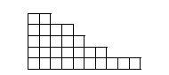
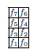

# 线性算子

上一节的最后一讲致力于讨论一般形式的线性映射。从本讲开始，第二部分的第一讲我们将更多地考虑将一个空间中的元素线性变换到另一个空间中的映射。

本部分的大部分内容将致力于所谓的线性映射的谱分析，这使得我们能够获得映射的最简单的矩阵表示。

集合A中的元素x称为原象，A集合也叫==原象集==，B中和x对应的元素y称为x的==象==。B中没有和A集对应的元素不能称为象。AB中所有有对应关系的称为==象集==

## §1. 映射的核与像

在讨论作为 $\varphi: V \to V$（自同态）作用的线性映射之前，让我们先讨论一些对一般形式的映射适用的重要定义和命题，但这些对于自同态来说尤其有价值。

**定义 1.1.** 线性映射 $\varphi \in \text{Hom}_{\mathbb{K}}(V, W)$ 的核被定义为 $V$ 的子集，记作
$$
\ker \varphi = \{x \in V : \varphi(x) = 0_W\}
$$

**引理 1.1.** 中性元素 $0_V \in V(\mathbb{K})$ 属于映射 $\varphi$ 的核。

**证明.**
$$
\varphi(0_V) = \varphi(0 \cdot x) = 0 \cdot \varphi(x) = 0_W
$$

$\square$

可以证明，线性映射的核不仅是一个 $V$ 的子集，而且具有线性子空间的结构。  

**引理 1.2.** 线性映射的核 $\ker \varphi$ 是 $V(\mathbb{K})$ 的线性子空间。

**证明.** 考虑任意属于映射 $\varphi$ 核的元素 $x_1, x_2 \in \ker \varphi$。它们属于核意味着
$$
\varphi(x_1) = 0 \quad \text{和} \quad \varphi(x_2) = 0
$$

考虑元素 $x_1$ 和 $x_2$ 的线性组合，系数为 $\alpha_1$ 和 $\alpha_2$，在映射作用下：
$$
\varphi(\alpha_1 x_1 + \alpha_2 x_2) = \alpha_1 \varphi(x_1) + \alpha_2 \varphi(x_2) = \alpha_1 \cdot 0_W + \alpha_2 \cdot 0_W = 0_W
$$

因此，我们证明了核对于线性运算封闭，从而核是线性子空间。
$\square$

任意线性映射的结果是一个来自 $W(\mathbb{K})$ 的元素，它本身具有线性空间的结构。

**定义 1.2.** 线性映射 $\varphi \in \text{Hom}_{\mathbb{K}}(V, W)$ 的像 $\text{Im}\,\varphi$ 被定义为 $W$ 的子集，记作
$$
\text{Im}\,\varphi = \{y \in W : \exists x \in V, \quad \varphi(x) = y\} = \varphi(V)
$$

**引理 1.3.** 线性映射的像 $\text{Im}\,\varphi$ 是 $W(\mathbb{K})$ 的线性子空间。  

**证明.** 设 $x, x_1, x_2 \in V$ 是空间 $V$ 的任意元素，它们对应的像是
$$
y = \varphi(x) \quad y_1 = \varphi(x_1) \quad y_2 = \varphi(x_2)
$$

为了证明映射的像对于线性运算封闭，我们需要证明两个像的和仍然是一个像：
$$
y_1 + y_2 = \varphi(x_1) + \varphi(x_2) = \varphi(x_1 + x_2) \in W
$$

类似地，对于标量乘法：
$$
\alpha y = \alpha \varphi(x) = \varphi(\alpha x) \in W
$$

因此，像对于由 $W$ 诱导的线性运算封闭，这意味着它是线性子空间。
$\square$

**例 1.1.**

(a) 考虑平面上的向量空间以及投影到由向量 $\mathbf{a}$ 确定的方向上的映射。该映射的像是所有与向量 $\mathbf{a}$ 共线的向量（平面上的一条直线），而核是所有垂直于该方向的向量（包括零向量）。

(b) 在不超过 $n$ 次的多项式空间中定义的微分映射的像是所有不超过 $n-1$ 次的多项式，而核是零次多项式，即常数。

(c) 考虑可以引入对称化（反对称化）映射的方阵空间。对称化的像是同阶的对称矩阵，而核是反对称矩阵。

**定理 1.1.** 线性映射 $\varphi: V \to W$ 的核和像的维度之和等于空间 $V(\mathbb{K})$ 的维度。
$$
\dim_{\mathbb{K}} \ker \varphi + \dim_{\mathbb{K}} \text{Im}\,\varphi = \dim_{\mathbb{K}} V
$$  

**证明.** 首先，我们引入映射核的基：
$$
\ker \varphi: \quad \{e_1, e_2, \ldots, e_k\}
$$

将其扩充为整个空间 $V$ 的基：
$$
\{e_1, \ldots, e_k, e_{k+1}, \ldots, e_n\}
$$

那么对于任意元素 $x \in V$，我们有
$$
x = \sum_{i=1}^{n} \xi^i e_i \quad \varphi(x) = \varphi\left(\sum_{i=1}^{n} \xi^i e_i\right) = \sum_{i=1}^{n} \xi^i \varphi(e_i) = \sum_{i=k+1}^{n} \xi^i \varphi(e_i),
$$
考虑到映射将核的基向量映射到零元素。

向量组
$$
\{\varphi(e_{k+1}), \ldots, \varphi(e_n)\}
$$
是完备的，因为任意像都可以表示为上述线性组合，如上所示。  

证明线性独立性的反证法。

假设向量组 $\{\varphi(e_{k+1}), \ldots, \varphi(e_n)\}$ 是线性相关的。那么存在一组非零系数，使得
$$
\alpha^{k+1} \varphi(e_{k+1}) + \ldots + \alpha^n \varphi(e_n) = 0
$$

考虑线性组合
$$
z = \alpha^{k+1} e_{k+1} + \ldots + \alpha^n e_n
$$
并对它应用映射 $\varphi$：
$$
\varphi(z) = \alpha^{k+1} \varphi(e_{k+1}) + \ldots + \alpha^n \varphi(e_n) = 0
$$

这意味着 $z$ 属于映射的核，但同时它有非平凡的基向量分解，这些基向量不属于该核——这与假设矛盾。因此，向量组 $\{\varphi(e_{k+1}), \ldots, \varphi(e_n)\}$ 是线性无关的。从上述讨论中还可以得出结论：唯一可以表示为既属于 $\ker \varphi$ 的基又属于 $\{e_{k+1}, \ldots, e_n\}$ 的基的向量是零向量。

由于这个向量组既是线性无关的又是完备的，我们可以断言
$$
\dim \text{Im}\,\varphi = n - k
$$

因此，
$$
\dim_{\mathbb{K}} \ker \varphi + \dim_{\mathbb{K}} \text{Im}\,\varphi = k + (n - k) = n
$$

$\square$

**注释 1.1.** 这个定理也被称为秩和亏数定理，其中映射的像的维度称为秩，而核的维度称为亏数。

## §2. 自同态代数

**定义 2.1.** 在线性空间 $V(\mathbb{K})$ 中的线性映射$\varphi: V \to W$ 被称为线性算子（自同态），如果 $V = W$。

**注释 2.1.** 线性空间 $V(\mathbb{K})$ 中的所有线性算子的集合记为 $\text{End}_{\mathbb{K}}(V)$。

**引理 2.1.** 集合 $\text{End}_{\mathbb{K}}(V)$ 与映射的复合运算一起构成一个非交换幺半群。

---

==非交换幺半群==

**定义**

一个非交换幺半群 \( M \) 由以下两个部分构成：

1. **一个集合** \( M \)。
2. **一个二元运算** \( \cdot : M \times M \rightarrow M \)，这个运算满足：
   - **结合律**：对于所有的 \( a, b, c \in M \)，有 \( (a \cdot b) \cdot c = a \cdot (b \cdot c) \)。
   - **存在幺元**：存在一个元素 \( e \in M \)，称为幺元（或单位元），使得对于所有的 \( a \in M \)，有 \( e \cdot a = a \cdot e = a \)。

**非交换性**

与交换幺半群（或称为可交换幺半群）不同，非交换幺半群不要求运算满足交换律，即对于某些 \( a, b \in M \)，可能 \( a \cdot b \neq b \cdot a \)。

---

**证明.** 如前所述，线性映射的复合仍然是线性映射。因此，在考虑 $\varphi, \psi \in \text{End}_{\mathbb{K}}(V)$ 时，我们有 $\chi = \psi \circ \varphi$ 也属于 $\text{End}_{\mathbb{K}}(V)$，因为它是一个线性映射并且作用于 $\chi: V \to V$。

对于线性算子的复合，满足结合律，根据复合的定义可以很容易验证：
$$
(\varphi \circ (\psi \circ \chi))(x) = \varphi(\psi(\chi(x))) = ((\varphi \circ \psi) \circ \chi)(x)
$$

在集合 $\text{End}_{\mathbb{K}}(V)$ 中存在一个中性元素——恒等变换。复合的非交换性是显而易见的。因此，$\text{End}_{\mathbb{K}}(V)$ 确实具有非交换幺半群的结构。
$\square$  

**引理 2.2.** 集合 $\text{End}_{\mathbb{K}}(V)$ 与加法和复合运算一起构成一个环。

**证明.** 加法和复合运算是一致的：
$$
\forall \varphi, \psi, \chi \in \text{End}_{\mathbb{K}}(V) \quad \varphi \circ (\psi + \chi) = \varphi \circ \psi + \varphi \circ \chi
$$

因此，形成了环的结构。
$\square$

之前也提到过，任何线性映射集合 $\text{Hom}_{\mathbb{K}}(V, W)$ 形成一个线性空间，这意味着 $\text{End}_{\mathbb{K}}(V)$ 也是一个线性空间。这样一个集合，既可以赋予环的结构，也可以赋予线性空间的结构，在自同态集合的情况下并不是唯一的。

**定义 2.2.** 在域 $\mathbb{K}$ 上的代数 $\mathcal{A}(\mathbb{K})$ 被定义为一个线性空间，它被赋予了环的结构，并且所有操作都是一致的。

**定理 2.1.** 集合 $\text{End}_{\mathbb{K}}(V)$ 形成在域 $\mathbb{K}$ 上的代数。

**定理 2.2.** 证明总结了前面的所有讨论。  

由于任何线性算子在固定基下都对应一个矩阵，而算子运算唯一地由矩阵运算确定，可以断言线性算子代数与方阵代数同构。

$$
\text{End}_{\mathbb{K}}(V) \simeq M_n(\mathbb{K})
$$

对于矩阵，我们定义了一个数值特征——行列式，它与矩阵非奇异性的判据相关联。类似地，我们可以为线性算子引入类似的特征。

**定义 2.3.** 线性算子的行列式被定义为该算子在固定基下的矩阵的行列式。
$$
\det \varphi = \det A_{\varphi}
$$

**引理 2.3.** 线性算子的行列式不依赖于基的选择。

**证明.** 实际上，对于线性算子的矩阵，在改变基时适用变换
$$
A'_{\varphi} = T^{-1} A_{\varphi} T
$$

我们将利用行列式的性质来证明其不依赖于基的选择：
$$
\det A'_{\varphi} = \det(T^{-1} A_{\varphi} T) = \det T^{-1} \det A_{\varphi} \det T = \frac{1}{\det T} \det A_{\varphi} \det T = \det A_{\varphi}
$$

$\square$

因此，我们得出结论，算子行列式的定义是正确的，即线性算子的矩阵总是方阵，并且其行列式不依赖于基的选择。  

**定义 2.4.** 线性算子 $\varphi \in \text{End}_{\mathbb{K}}(V)$ 被称为可逆的，如果存在映射 $\psi \in \text{End}_{\mathbb{K}}(V)$ 使得
$$
\psi \circ \varphi = \mathcal{I}, \quad \varphi \circ \psi = \mathcal{I}
$$

**引理 2.4.** 线性算子是可逆的当且仅当其行列式不等于零。

**证明.** 由于自同态代数与方阵代数之间的同构关系，对于可逆元素有
$$
\psi \circ \varphi = \mathcal{I} \quad \Leftrightarrow \quad A_{\varphi} \cdot B_{\psi} = E
$$

由此得出，如果算子 $\varphi$ 是可逆的，则存在一个算子 $\psi$，其矩阵满足 $B_{\psi} = A_{\varphi}^{-1}$，而矩阵是可逆的当且仅当其行列式不等于零。
$\square$

最后，我们注意到一个与当前课程中讨论自同态相关的事实。  

**注释 2.2.** 对于自同态 $\varphi \in \text{End}_{\mathbb{K}}(V)$，其核和像是 $V$ 的线性子空间，并且
$$
\dim_{\mathbb{K}} \ker \varphi + \dim_{\mathbb{K}} \text{Im}\,\varphi = \dim_{\mathbb{K}} V
$$

然而，这并不意味着线性空间 $V$ 总是可以表示为算子的核和像的直和。以下反例展示了这一点。

**例 2.1.** 设 $V = \mathbb{R}^{\leqslant 3}[x]$，定义算子为 $\mathcal{D}^2(p) = \frac{d^2p}{dx^2}$。它的像和核将重合：
$$
\ker \mathcal{D}^2 = \text{Im}\,\mathcal{D}^2 = \mathbb{R}^{\leqslant 1}[x]
$$

换句话说，核和像的维度之和确实给出了空间的维度，但在这种情况下，我们得到的是多项式的集合，显然不等于所有不超过三次的多项式空间。  

# 引言：谱分析

之前提到，任何线性算子在固定基下都有对应的矩阵。然而，这些矩阵可能因其结构不同而各异，因此可能会出现寻找一个基的问题，在该基中算子的矩阵形式最为简单。为了逐步找到这种基的方法，我们首先进行一些初步的讨论。

## §1. 不变子空间

**定义 1.1.** 子空间 $U \leqslant V$ 被称为相对于算子 $\varphi$ 的不变子空间（$\varphi$-不变），如果 $\varphi U \leqslant U$，即对于任意 $x \in U$，其像 $\varphi x \in U$。  

---

**定义解释**

1. **子空间 \( U \)**：
   - \( U \) 是向量空间 \( V \) 的一个子集，它本身也是一个向量空间，这意味着它满足向量空间的所有公理，包括加法封闭性和标量乘法封闭性。

2. **线性算子 \( \varphi \)**：
   - \( \varphi \) 是从向量空间 \( V \) 到自身的线性映射，即 \( \varphi: V \rightarrow V \)。线性映射满足线性的两个基本性质：加法封闭性和齐次性。

3. **不变子空间**：
   - 子空间 \( U \) 被称为相对于线性算子 \( \varphi \) 的不变子空间（或 \( \varphi \)-不变），如果对于 \( U \) 中的任意向量 \( x \)，其在 \( \varphi \) 下的像 \( \varphi(x) \) 仍然属于 \( U \)。用数学符号表示就是：对于所有 \( x \in U \)，有 \( \varphi(x) \in U \)。

4. **符号 \( \varphi U \leqslant U \)**：
   - 这里的 \( \varphi U \) 表示所有形如 \( \varphi(x) \) 的向量的集合，其中 \( x \) 是 \( U \) 中的任意向量。符号 \( \varphi U \leqslant U \) 是在强调 \( \varphi U \) 是 \( U \) 的子集，即 \( \varphi U \subseteq U \)。

**几何解释**

不变子空间的概念可以直观地理解为：在向量空间 \( V \) 中，如果有一个子空间 \( U \)，当我们应用线性算子 \( \varphi \) 时，所有从 \( U \) 中的向量映射得到的向量仍然落在 \( U \) 内，那么 \( U \) 就是一个不变子空间。这就像是一个“安全区域”，无论我们如何应用 \( \varphi \)，都不会“跳出”这个区域。

---  

**注释 1.1.** 零子空间和整个空间 $V$ 对于任何算子都是不变的。包含在算子 $\varphi$ 核中的任何子空间以及包含其像的任何子空间都是 $\varphi$-不变的。不变子空间的和与交集也是不变子空间。

**例 1.1.** 设算子为关于坐标轴的轴对称变换在平面上的笛卡尔坐标系中。那么 $U_1 = \langle \mathbf{i} \rangle$ 和 $U_2 = \langle \mathbf{j} \rangle$ 是不变的，而 $U_3 = \langle \mathbf{i} + \mathbf{j} \rangle$ 不是。

**例 1.2.** 微分算子在 $\mathbb{R}^{\leqslant n}[x]$ 中的不变子空间具有形式 $\mathbb{R}^{\leqslant k}[x], k \leqslant n$。

线性算子 $\varphi$ 在不变子空间 $U$ 上的限制（约束）是一个在 $U$ 上的线性算子。

如果选择空间 $V$ 的基 $e_1, e_2, \ldots, e_n$，使得不变子空间 $U$ 是前 $k$ 个基向量的线性包，则算子在该基下的矩阵将具有形式 $\begin{pmatrix} B & D \\ 0 & C \end{pmatrix}$，其中 $B$ 是算子 $\varphi|_U$ 在基 $e_1, e_2, \ldots, e_k$ 下的矩阵。反之，如果算子 $\varphi$ 的矩阵具有这样的块状形式（其中 $B$ 是 $k \times k$ 的方阵，其下方是零矩阵），则 $U = \langle e_1, e_2, \ldots, e_k \rangle$ 是不变子空间。

如果能够将 $V$ 分解为不变子空间 $V_i$ 的直和 $V = V_1 \oplus V_2 \oplus \ldots \oplus V_k$，那么在由这些子空间的基组成的 $V$ 的基中，算子 $\varphi$ 的矩阵具有块对角形式
$$
\begin{pmatrix}
A_1 & & \text{O} \\
& A_2 & \\
& & \ddots \\
\text{O} & & A_k
\end{pmatrix},
$$
其中 $A_i$ 是算子 $\varphi|_{V_i}$ 的矩阵。由此可见，寻找不变子空间是解决寻找线性算子“最简”矩阵形式问题的重要步骤。  

**例 1.3.** 对于 $\mathbb{R}[x]_n$ 中的微分算子，其不变子空间相互嵌套，因此任何非平凡不变子空间都没有不变的直和补。因此，在任何基下，该算子的矩阵都不可能具有块对角形式。

**例 1.4.** 考虑在三维空间 $E^3$ 中绕任意轴旋转角度 $\alpha$ 的操作。在正交归一化基 $e_1, e_2, e_3$ 下，如果向量 $e_3$ 沿着旋转轴方向，则旋转算子的矩阵为
$$
\begin{pmatrix}
\cos \alpha & -\sin \alpha & 0 \\
\sin \alpha & \cos \alpha & 0 \\
0 & 0 & 1
\end{pmatrix},
$$
这与将 $E^3$ 分解为直和 $E^3 = \langle e_1, e_2 \rangle \oplus \langle e_3 \rangle$ 相一致。

特别地，一维不变子空间起着重要作用，它们引出了特征向量的概念。  

## §2. 特征向量和特征值

**定义 2.1.** 非零向量 $x \in V$ 被称为算子 $\varphi$ 的特征向量，如果 $\varphi x = \lambda x$。此时的数 $\lambda \in \mathbb{K}$ 称为算子 $\varphi$ 的特征值（或特征数），对应于特征向量 $x$。

特征向量生成一维不变子空间。在由特征向量组成的基中（如果存在的话），算子的矩阵具有对角形式，这是“最简单”的形式。  

---

**特征方程** \( \varphi x = \lambda x \)：当线性算子 \( \varphi \) 作用于向量 \( x \) 时，结果仅为原向量的标量倍数 \( \lambda x \)。此时：
  - \( x \) 称为 **特征向量**（非零），表示 \( x \) 在 \( \varphi \) 作用下方向不变（或反向）。
  - \( \lambda \in \mathbb{K} \) 称为 **特征值**，表示缩放比例。特征值可为零（当 \( \varphi x = 0 \) 时，对应非零 \( x \)）。

---

**例 2.1.**
a) 对于零算子 $\mathcal{O}$，每个向量都是特征向量，其特征值为 0；
b) 对于恒等算子 $\mathcal{I}$，每个向量都是特征向量，其特征值为 1；
c) 对于“拉伸”算子 $\lambda \mathcal{I}$，每个向量都是特征向量，其特征值为 $\lambda$；
d) 在三维空间 $E^3$ 中，旋转角度为 $\alpha$ 的算子的特征向量：如果 $\alpha \neq \pi k$，那么位于旋转轴上的向量是特征值为 1 的特征向量；如果 $\alpha = \pi k$，则除了这些向量外，还有垂直于旋转轴的向量，它们的特征值为 $(-1)^k$；
e) 设 $V = U \oplus W$，$\mathcal{P}$ 是平行于 $W$ 到 $U$ 的投影算子，则 $\mathcal{P}$ 是 $V$ 上的线性算子。已知 $\mathcal{P}^2 = \mathcal{P}$。那么如果 $x$ 是特征向量，则
$$
\lambda x = \mathcal{P} x = \mathcal{P}^2 x = \mathcal{P}(\mathcal{P} x) = \mathcal{P}(\lambda x) = \lambda \mathcal{P} x = \lambda^2 x,
$$
这意味着 $\lambda$ 等于 0 或 1。任何来自 $U$ 的向量——特征值为 1 的特征向量，来自 $W$ 的向量——特征值为 0 的特征向量。
f) 对于微分算子 $\mathcal{D}: \mathbb{R}^{\leqslant n}[x] \to \mathbb{R}^{\leqslant n}[x]$，常数是特征向量，对应的特征值为 0。
g) 转置算子满足条件 $\mathcal{P}^2 = \mathcal{I}$。类似于 d)，可以证明，对合的特征值只有 $\pm 1$。在这种情况下，值 1 对应于对称矩阵，-1 对应于反对称矩阵。  

**注释 2.1.** 数 $\lambda \in \mathbb{K}$ 是算子 $\varphi$ 的特征值当且仅当子空间 $\ker(\varphi - \lambda \mathcal{I}) \leqslant V$ 非零（存在非零向量 \(x\) 使得 \((\varphi - \lambda \mathcal{I})x = 0\)），即当算子 $\varphi - \lambda \mathcal{I}$ 奇异（不可逆）时，也就是 $\det(\varphi - \lambda \mathcal{I}) = 0$。

**定义 2.2.** 子空间 $\ker(\varphi - \lambda \mathcal{I})$ 被称为算子 $\varphi$ 对应于特征值 $\lambda$ 的特征子空间，并记为 $V_{\lambda}$。除了特征向量外，它还包含零向量。

**注释 2.2.** 算子 $\varphi$ 的任何特征子空间都是 $\varphi$-不变的。

**定义 2.3.** 特征值 $\lambda$ 的几何重数 $g(\lambda)$ 被定义为对应特征子空间的维度：$g(\lambda) = \dim V_{\lambda}$。  

## §3. 特征多项式

为了找到特征子空间，首先从条件 $\det(\varphi - \lambda \mathcal{I}) = 0$ 中找到特征值更为方便。设 $A_{\varphi}$ 是算子 $\varphi$ 在任意基下的矩阵，则
$$
\det(\varphi - \lambda \mathcal{I}) = \begin{vmatrix}
a_{11} - \lambda & a_{12} & \dots & a_{1n} \\
a_{21} & a_{22} - \lambda & \dots & a_{2n} \\
\vdots & \vdots & \ddots & \vdots \\
a_{n1} & a_{n2} & \dots & a_{nn} - \lambda
\end{vmatrix}.
$$

**定义 3.1.** 多项式 $\chi_{\varphi}(\lambda) = (-1)^n \det(\varphi - \lambda \mathcal{I}) = \det(\lambda \mathcal{I} - \varphi)$ 被称为算子 $\varphi$ 的特征多项式。特征多项式的根被称为算子 $\varphi$ 的特征数。

**注释 3.1.** 并非每个特征数都是特征值。实际上，根据代数基本定理，任何具有实系数的多项式都有复根，但这些根不一定属于实数域 $\mathbb{R}$。如果算子定义在实线性空间中，那么它的特征数可以是复数也可以是实数，但只有实根才是特征值。

**定义 3.2.** 线性算子 $\varphi$ 的谱 $\sigma_{\varphi}$ 被定义为其所有特征值的集合。

**注释 3.2.** 根据代数基本定理，多项式的根的数量不超过其次数，这意味着线性算子的谱最多包含 $n = \dim V$ 个特征数。

如果从上下文中可以清楚地知道讨论的是哪个算子，我们将省略索引 $\varphi$。  

**注释 3.3.** 由于特征多项式由算子 $\varphi - \lambda \mathcal{I}$ 的行列式确定，而任何算子的行列式不依赖于基的选择（是关于基变换的不变量），因此可以断言其所有系数也不依赖于基的选择。由此得出，算子的不变量不仅包括其行列式，还包括迹 $\text{tr}\,\varphi = \sum_{i=1}^{n} a_{ii}$，因为特征多项式中 $\lambda^n$ 前的系数字面上等于 $(-1)^n \text{tr}\,\varphi$。

**定义 3.3.** 特征值 $\lambda$ 的代数重数 $m(\lambda)$ 被定义为它作为特征多项式的根的重数。

**注释 3.4.** 如果 $\lambda \in \sigma$ 是算子 $\varphi$ 的特征数，则 $\varphi - \lambda \mathcal{I}$ 是奇异算子，因为它的行列式为零。因此，该算子的核 $\ker(\varphi - \lambda \mathcal{I})$ 至少包含一个非零向量。

**引理 3.1.** 特征值的几何重数不超过其代数重数。

**证明.** 考虑特征子空间 $V_{\mu} \leqslant V$，它是不变的，因此在一致的基下算子的矩阵具有形式
$$
A = \begin{pmatrix}
\mu E & D \\
0 & C
\end{pmatrix},
$$
其中 $\mu E$ 是大小为 $g(\mu)$ 的方阵。那么特征多项式的形式为 $\chi(\lambda) = (\mu - \lambda)^{g(\mu)} \cdot f(\lambda)$，其中 $f(\lambda) = \det(C - \lambda E)$。由于多项式 $f$ 可能有根 $\mu$，所以 $m(\mu) \geqslant g(\mu)$。  

## §4. 特征基与对角化

**定义 4.1.** 子空间 $V_1, \ldots, V_k$ 被称为线性无关的，如果等式 $v_1 + \ldots + v_k = 0$，其中 $v_i \in V_i$，意味着 $v_1 = \ldots = v_k = 0$。

**注释 4.1.** 可以说，将空间 $V$ 分解为子空间 $V_1, \ldots, V_k$ 的直和就是将其分解为线性无关子空间 $V_1, \ldots, V_k$ 的和。

**定理 4.1.** 对应于算子 $\varphi$ 的不同特征值 $\lambda_1, \lambda_2, \ldots, \lambda_n$ 的特征子空间是线性无关的。

**证明.** 使用数学归纳法对 $k$ 进行证明。当 $k=1$ 时，无需证明。假设 $k > 1$ 并且 $x_1 + \ldots + x_k = 0$。将算子 $\varphi$ 应用于等式的两边：
$$
\lambda_1 x_1 + \ldots + \lambda_k x_k = 0.
$$
从这个等式中减去乘以 $\lambda_k$ 的等式 $x_1 + \ldots + x_k = 0$，得到
$$
(\lambda_1 - \lambda_k)x_1 + \ldots + (\lambda_{k-1} - \lambda_k)x_{k-1} = 0.
$$
每个项都位于相应的子空间中。由于根据归纳假设它们是线性无关的，并且考虑的是不同的特征值，因此 $x_1 = \ldots = x_{k-1} = 0$。那么 $x_k = 0$。

**推论 4.1.1.** 如果算子的特征多项式有 $n = \dim V$ 个不同的根（即具有简单谱的算子），则存在由该算子的特征向量组成的基。

**注释 4.2.** 这个条件不是特征基存在的必要条件。例如，任何基都由恒等算子的特征向量组成，但其特征多项式只有一个根 1（重数为 $n$）。  

**定义 4.2.** 在有限维向量空间中的线性算子被称为可对角化的，如果存在一个基，在该基中算子的矩阵具有对角形式。

换句话说，算子的可对角化等价于特征基的存在。

假设算子 $\varphi$ 是可对角化的且 $V = \bigoplus_{i=1}^{n} V_{\lambda_i}$。考虑投影算子 $\mathcal{P}_i$ 到子空间 $V_{\lambda_i}$ 平行于剩余子空间的直和。那么 $\mathcal{P}_i^2 = \mathcal{P}_i$，$\mathcal{P}_i \mathcal{P}_j = \mathcal{O}$ 当 $i \neq j$ 且 $\sum_{i=1}^{k} \mathcal{P}_i = \mathcal{I}$。容易验证，算子 $\varphi$ 对任何向量的作用与算子 $\sum_{i=1}^{k} \lambda_i \mathcal{P}_i$ 的作用相同。表达式 $\varphi = \sum_{i=1}^{k} \lambda_i \mathcal{P}_i$ 被称为算子 $\varphi$ 的谱分解。

**定理 4.2.（对角化准则）**
算子是可对角化的当且仅当下列两个条件满足：
- 特征多项式可以分解为线性因子的乘积，即其所有根都在域 $\mathbb{K}$ 中；
- 每个特征值的几何重数等于其代数重数。

**证明.** 可对角化等价于特征基的存在，由此得出 $V = \bigoplus_{i=1}^{n} V_{\lambda_i}$（特征子空间基的并集——$V$ 的特征基），此时 $n = \dim V = g(\lambda_1) + \ldots + g(\lambda_k)$。但 $m(\lambda_i) \geqslant g(\lambda_i)$，且 $m(\lambda_1) + \ldots + m(\lambda_k) \leqslant \deg \chi_{\varphi} = n$。因此，$n = g(\lambda_1) + \ldots + g(\lambda_k)$ 当且仅当 $m(\lambda_i) = g(\lambda_i)$。  

**例 4.1.** 设 $\varphi$ 是在笛卡尔平面上相对于坐标原点的旋转算子，旋转角度为 $\frac{\pi}{2}$。在正交归一化基 $\mathbf{i}, \mathbf{j}$ 下，算子的矩阵形式为
$$
\begin{pmatrix}
0 & 1 \\
-1 & 0
\end{pmatrix}.
$$
因此，$\chi_{\varphi}(t) = t^2 + 1$。其根不在实数域 $\mathbb{R}$ 中。因此，算子 $\varphi$ 在 $\mathbb{R}$ 上不可对角化。但如果考虑该矩阵在复数域 $\mathbb{C}$ 上，则它与以下矩阵相似：
$$
\begin{pmatrix}
i & 0 \\
0 & -i
\end{pmatrix}.
$$

**例 4.2.** 设 $D$ 是在 $\mathbb{R}[x]_1$ 中的微分算子。在基 $x, 1$ 下，算子的矩阵形式为
$$
\begin{pmatrix}
0 & 1 \\
0 & 0
\end{pmatrix},
$$
$\chi_D(t) = t^2$。其根 0 的重数为 2，在实数域 $\mathbb{R}$ 中。$\text{Ker}(D - 0\mathcal{I}) = \mathbb{R}[x]_0$，$\dim \text{Ker}(D - 0\mathcal{I}) = 1$。因此，算子 $D$ 不可对角化。  

# 根空间

对角矩阵一次又一次地被认为是线性算子矩阵的“最简单”形式。如果我们能够将算子矩阵化为对角形式，那么我们就可以很容易地找到算子的任意幂次。这为计算开辟了道路，例如，算子的多项式。但正如前面的例子所示，即使在这种情况下，当所有特征多项式的根都在定义向量空间的域中时，线性算子也可能没有自身的基底。接下来我们将引入根向量的概念，它包含了固有向量的概念，并且我们将证明，在线性算子的谱包含在定义向量空间的域中的情况下，空间可以分解为所谓的根子空间的直和。

## §1. 根向量和根子空间

**定义 1.1.** 向量 \( x \in V \) 被称为算子 \( \mathcal{A} \) 的 **根向量**，对应于特征值 \( \lambda \in F \)，如果存在一个非负整数 \( k \)，使得 \( (\mathcal{A} - \lambda \mathcal{E})^k x = 0 \)。最小的这样的 \( k \) 称为根向量 \( x \) 的 **高度**。

**注释 1.1.** 如果 \( x \) 是高度为 \( k \) 的根向量，那么 \( \widetilde{x} = (\mathcal{A} - \lambda \mathcal{E})x \) 是高度为 \( k-1 \) 的根向量。  

**示例 1.1**

a) 高度为 0 的根向量——零向量；

b) 高度为 1 的根向量——固有向量；

c) 每个多项式都是算子 \( \mathcal{D} \) 的根向量，该算子在多项式空间上进行微分，其中特征值为 0。多项式的高度作为根向量等于 \( n+1 \)，其中 \( n \) 是该多项式的次数。

**示例 1.2**

设 \( V \) 是实数轴上具有实数值的无限可微函数的空间，\( \mathcal{D} \) 是微分算子。那么：

1) \( f \in V \) ——具有特征值 \( \lambda \) 的固有向量：\( \mathcal{D}f = f' = \lambda f \)。因此 \( \frac{f'}{f} = \lambda \Rightarrow \ln |f| = \lambda x + C \Rightarrow |f| = e^C e^{\lambda x} \Rightarrow f = Ce^{\lambda x}, C \in \mathbb{R} \setminus \{0\} \)。

2) 根向量：假设 \( f(t) = e^{\lambda t} g(t), g \in V \)，则 \( (\mathcal{D} - \lambda \mathcal{E})f = f'(t) - \lambda f(t) = \lambda e^{\lambda t} g(t) + e^{\lambda t} g'(t) - \lambda f(t) = e^{\lambda t} g'(t) \)。因此 \( f \) 是根向量当且仅当存在这样的 \( k \)，使得 \( g^{(k)}(t) = 0 \)，即 \( g \in \mathbb{R}[t] \)。因此，微分算子的根向量是形式为 \( e^{\lambda t} g(t) \) 的函数，其中 \( g(t) \) 是多项式。这种根向量的高度等于 \( \deg g + 1 \)。它们被称为准多项式。当我们学习线性微分方程时会再次遇到它们。  

根向量与特征值 \( \lambda \) 对应，高度 \( \leq k \) ——这是 \( \ker(\mathcal{A} - \lambda \mathcal{E})^k \leq V \)。出现了一条子空间链

\[ V_\lambda = \ker(\mathcal{A} - \lambda \mathcal{E}) \leq \ker(\mathcal{A} - \lambda \mathcal{E})^2 \leq \ldots \leq \ker(\mathcal{A} - \lambda \mathcal{E})^k \leq \ldots \leq V^\lambda, \]

其中 \( V^\lambda = \{\text{所有根向量与特征值 } \lambda\} \) ——是 **根子空间** 与特征值 \( \lambda \) 相关：

\[ V^\lambda = \bigcup_{i=1}^{\infty} \ker(\mathcal{A} - \lambda \mathcal{E})^i. \]

在有限维情况下，这条链从某个时刻开始稳定——子空间的维度增长到我们达到根子空间的维度为止。假设 \( \dim V < \infty \)。

**定理 1.1.（根子空间的性质）**

1) \( V^\lambda \) 是 \( \mathcal{A} \)-不变的；

2) \( (\mathcal{A} - \lambda \mathcal{E})|_{V^\lambda} = \mathcal{N} \) ——是一个幂零算子，即存在一个非负整数 \( m \)，使得 \( \mathcal{N}^m = \mathcal{O} \)；

3) \( (\mathcal{A} - \mu \mathcal{E})|_{V^\lambda} \) 在 \( \mu \neq \lambda \) 时是非奇异的；

4) \( \dim V^\lambda = m(\lambda) \) （几何重数的代数意义）。  

**证明**

1) 假设 \( V_\lambda^k = \ker(\mathcal{A} - \lambda \mathcal{E})^k \)，当 \( V_\lambda \leqslant V_1^\lambda \leqslant V_2^\lambda \leqslant \ldots \leqslant V_m^\lambda = V^\lambda \)。请注意，\( (\mathcal{A} - \lambda \mathcal{E})V_k^\lambda \leqslant V_{k-1}^\lambda \leqslant V_k^\lambda \)。也就是说，\( V_k^\lambda \) 相对于 \( \mathcal{A} - \lambda \mathcal{E} \) 是不变的，因此 \( V_k^\lambda \) 和 \( \mathcal{A} \)-不变。这是真的，并且对于 \( V_m^\lambda = V^\lambda \) 也成立。

2) 在 \( V^\lambda \) 中选择一个与子空间链一致的基：\( e_1, \ldots, e_{l_1} \) ——是 \( V_1^\lambda \) 的基；\( e_1, \ldots, e_{l_1}, \ldots, e_{l_2} \) ——是 \( V_2^\lambda \) 的基；以此类推，\( e_1, \ldots, e_{l_m} \) ——是 \( V_m^\lambda = V^\lambda \) 的基。那么 \( \mathcal{N}(V_k^\lambda) \leqslant V_{k-1}^\lambda \)（注意 \( V_0^\lambda = \{0\} \)）。由此得出 \( \mathcal{N}e_j \in \langle e_1, \ldots, e_{j-1} \rangle \)，因此 \( \mathcal{N}^m = \mathcal{O} \)，其中 \( l_m = \dim V^\lambda \)。

3) 在基 \( e_1, \ldots, e_{l_m} \) 下，算子 \( \mathcal{N} \) 的矩阵是上三角形的，对角线上的元素为零（反三角形），则算子 \( \mathcal{A}|_{V^\lambda} = \mathcal{N} + \lambda \mathcal{E} \) 的矩阵是上三角形的，对角线上有 \( \lambda \)-倍单位矩阵，而算子 \( (\mathcal{A} - \mu \mathcal{E})|_{V^\lambda} \) 的矩阵是上三角形的，对角线上有 \( \lambda - \mu \)。因此（由于 \( \lambda \neq \mu \)）它是非奇异的，这意味着算子 \( (\mathcal{A} - \mu \mathcal{E})|_{V^\lambda} \) 也是非奇异的。

4) 将 \( V^\lambda \) 的基扩展到整个空间 \( V \) 的基。在这个基下，算子 \( \mathcal{A} \) 的矩阵具有分块上三角形的形式：

\[
\begin{pmatrix}
A|_{V^\lambda} & D \\
0 & C
\end{pmatrix}.
\]

此时 \( \chi_A(t) = \chi_{A|_{V^\lambda}}(t) \det(tE - C) = (t - \lambda)^m \det(tE - C) \)。需要证明 \( \lambda \) 不是算子 \( C \) 在空间 \( \langle e_{l_m+1}, \ldots, e_n \rangle \) 上的特征值，该空间的矩阵为 \( C \)。假设存在这样的向量 \( 0 \neq x \in \langle e_{l_m+1}, \ldots, e_n \rangle \)，使得

\[ Cx = \lambda x. \]

这意味着 \( \mathcal{A}x = \lambda x + y, y \in V^\lambda \)。因此，\( (\mathcal{A} - \lambda \mathcal{E})x = y \) ——是一个根向量，但那时 \( x \) ——也是一个根向量，这与 \( V^\lambda \) 的定义相矛盾。  

**定理 1.2**

对应于不同特征值的根子空间是线性无关的。

**证明。** 类似于固有子空间定理的证明。

**定理 1.3**

空间 \( V \) 的基可以由根子空间的基的并集构成。

**证明** 根子空间是线性无关的，这意味着它们的和是一个直和。根子空间维度的总和给出了线性空间 \( V \) 的维度：

\[
\sum_{i} \dim V^{\lambda_i} = \sum_{i} m(\lambda_i) = n = \dim V
\]

因此，空间 \( V \) 可以表示为

\[
V = V^{\lambda_1} \oplus \ldots \oplus V^{\lambda_p},
\]

其中 \( p \) 是不同特征值的数量。

从直和分解中可以得出该命题的正确性。  

## §2. 幂零算子的结构

假设 \( \mathcal{N} \) 是一个幂零算子，即存在一个非负整数 \( m \)，使得 \( \mathcal{N}^m = \mathcal{O} \)。最小的这样的 \( m \) 称为幂零算子的高度。对于它，所有向量 \( V \) 都是特征值为 0 的根向量，高度不超过 \( m \)。

**示例 2.1**

在空间 \( \mathbb{R}[x]_n \) 中的微分算子是一个幂零算子，其高度为 \( n+1 \)。

根据定理 7.1 的第 3 点，研究任意算子归结为在相应的根子空间上研究幂零算子。

**引理 2.1**

设 \( x \in V \) 是高度为 \( k > 0 \) 的向量。那么向量 \( x, \mathcal{N}x, \ldots, \mathcal{N}^{k-1}x \) 是线性无关的。

**证明** 对 \( k \) 进行归纳。如果 \( k = 1 \)，在这种情况下 \( x \neq 0 \)，没有什么需要证明的。假设 \( \alpha_0 x + \alpha_1 \mathcal{N}x + \ldots + \alpha_{k-1} \mathcal{N}^{k-1}x = 0 \)。将算子 \( \mathcal{N} \) 应用于等式的两边，我们得到 \( \alpha_0 \mathcal{N}x + \alpha_1 \mathcal{N}^2 x + \ldots + \alpha_{k-2} \mathcal{N}^{k-1}x = 0 \)，因为 \( \mathcal{N}^k x = 0 \)。设 \( \mathcal{N}x = y \)，它的高度为 \( k-1 \)，且 \( \alpha_0 y + \alpha_1 \mathcal{N}y + \ldots + \alpha_{k-2} \mathcal{N}^{k-2}y = 0 \)。由于归纳假设，向量 \( y, \mathcal{N}y, \ldots, \mathcal{N}^{k-1}y \) 是线性无关的，因此 \( \alpha_0 = \ldots = \alpha_{k-2} = 0 \)。但那时 \( \alpha_{k-1} \mathcal{N}x = 0 \)。由于 \( x \) 的高度为 \( k \)，所以 \( \mathcal{N}^{k-1}x \neq 0 \)，这意味着 \( \alpha_{k-1} = 0 \)，因此，\( x, \mathcal{N}x, \ldots, \mathcal{N}^{k-1}x \) 是线性无关的。  

**定义 2.1**

子空间 \( U = \langle x, \mathcal{N}x, \mathcal{N}^2 x, \ldots \rangle \) 被称为幂零算子 \( \mathcal{N} \) 的 **循环子空间**，由向量 \( x \) 生成。

循环子空间 \( U \) ——是最小的 \( \mathcal{N} \)-不变子空间，包含 \( x \)，\( \dim U = k \)，其中 \( k \) 是向量 \( x \) 的高度。

基 \( U \): \( x_1, x_2, \ldots, x_k \)，其中 \( x_i = \mathcal{N}^{k-i} x \)。这样的基被称为 **若尔当链**：第一个向量在 \( \mathcal{N} \) 的作用下变为零，第二个变为第一个，以此类推，最后一个变为倒数第二个。因此，算子 \( \mathcal{N} \) 在基 \( x_1, x_2, \ldots, x_k \) 下的矩阵形式为

\[
J_k(0) =
\begin{pmatrix}
0 & 1 & 0 & \ldots & 0 & 0 \\
0 & 0 & 1 & \ldots & 0 & 0 \\
0 & 0 & 0 & \ldots & 0 & 0 \\
\ldots & \ldots & \ldots & \ldots & \ldots & \ldots \\
0 & 0 & 0 & \ldots & 0 & 1 \\
0 & 0 & 0 & \ldots & 0 & 0
\end{pmatrix},
\]

称为 **幂零若尔当块** 阶数为 \( k \)。

**示例 2.2**

设 \( \mathcal{N} = \mathcal{D}^2 = \frac{d^2}{dx^2}: \mathbb{R}[x]_7 \to \mathbb{R}[x]_7 \)，\( f_i = \frac{x^i}{i!}, i = \overline{0,7} \) ——是 \( \mathbb{R}[x]_7 \) 的基。算子 \( \mathcal{N} \) 在基向量上的作用给出以下若尔当链：

\[
0 \stackrel{\mathcal{N}}{\leftarrow} f_0 \stackrel{\mathcal{N}}{\leftarrow} f_2 \stackrel{\mathcal{N}}{\leftarrow} f_4 \stackrel{\mathcal{N}}{\leftarrow} f_6,
\]
\[
0 \stackrel{\mathcal{N}}{\leftarrow} x_1 \stackrel{\mathcal{N}}{\leftarrow} x_3 \stackrel{\mathcal{N}}{\leftarrow} x_5 \stackrel{\mathcal{N}}{\leftarrow} x_7.
\]

**定理 2.1（幂零算子结构的基本定理）**

设 \( \mathcal{N} \) 是 \( V \) 上的幂零算子。那么存在将空间 \( V \) 分解为该算子的循环子空间的直和 \( V = \oplus U_i \)。在这种分解中可数的数目等于 \( \dim \ker \mathcal{N} \)。

**示例 2.3**

在前面的例子中 \( \mathbb{R}[x]_7 = \langle f_1, f_3, f_5, f_7 \rangle \oplus \langle f_0, f_4, f_2, f_6 \rangle \)。\( \dim \ker \mathcal{N} = \dim \langle f_0, f_1 \rangle = \dim \mathbb{R}[x]_1 = 2 \)。不难看出，在这种情况下，循环子空间的直和分解——就是不超过 7 次多项式的奇数项和偶数项的直和分解。  

**定义 2.2**

空间 \( V \) 相对于算子 \( \mathcal{A} \) 的 **若尔当基** 是由所有根子空间的循环子空间的若尔当链构成的集合所构建的基。

幂零算子的结构可以通过所谓的 **杨氏图** 直观地表示，该图在本例中以示意图的形式显示了幂零算子如何作用于若尔当基的基向量：

  

通过这样的图，幂零算子被唯一确定。正方形代表若尔当基的向量，幂零算子从上到下作用于它们。

- 行的高度对应于基向量的高度，而生成向量（基向量的线性组合）的高度定义为具有非零系数的基向量的最大高度。
- 第 \( i \) 列对应于若尔当链——循环子空间 \( U_i \) 的基。
- 算子 \( \mathcal{N}^k \) 的核是高度不超过 \( k \) 的行中的向量的线性包络。
- 位于最下行的向量在算子的作用下变为零向量。  

**示例 2.4**

对于示例 8.2 和 8.3，杨氏图如下所示：

  

向量 \( 2f_4 - 8f_1 \) 的高度等于 \( \max\{3, 1\} = 3 \)，\( \ker \mathcal{N}^2 = \langle f_0, f_1, f_2, f_3 \rangle \)。

# 乔尔当标准型

在这节课中，我们将讨论线性算子在乔尔当基下的形式。正如已经提到的，如果一个算子不是可对角化的，它仍然可以在某个基下获得“足够简单”的形式。因此，出现了关于这个矩阵表示结构的问题以及如何构建使得算子具有这种形式的基。

## §1. 乔尔当标准型

设 $\varphi \in \text{End}(V)$ 是一个线性算子，已找到其特征值 $\lambda$。首先考虑幂零算子 $\mathcal{N} = (\varphi - \lambda I)\big|_{U^\lambda}$ 在其可能的循环子空间 $U^\lambda$ 上的作用。根据定义，它可以表示为相应乔尔当链 $\{x_1, x_2, \ldots, x_k\}$ 的线性包络。此时有：

\[ x_i = \mathcal{N}^{k-i} x_k \]

在循环子空间的基下，算子将具有以下矩阵表示：

\[
\mathcal{N} \leftrightarrow J(0) =
\begin{pmatrix}
0 & 1 & 0 & \cdots & 0 & 0 \\
0 & 0 & 1 & \cdots & 0 & 0 \\
0 & 0 & 0 & \cdots & 0 & 0 \\
\vdots & \vdots & \vdots & \ddots & \vdots & \vdots \\
0 & 0 & 0 & \cdots & 0 & 1 \\
0 & 0 & 0 & \cdots & 0 & 0
\end{pmatrix}
\]

\[
\lambda I \leftrightarrow \lambda E =
\begin{pmatrix}
\lambda & 0 & 0 & \cdots & 0 & 0 \\
0 & \lambda & 0 & \cdots & 0 & 0 \\
0 & 0 & \lambda & \cdots & 0 & 0 \\
\vdots & \vdots & \vdots & \ddots & \vdots & \vdots \\
0 & 0 & 0 & \cdots & \lambda & 0 \\
0 & 0 & 0 & \cdots & 0 & \lambda
\end{pmatrix}
\]

由此得出结论，在该子空间上算子 $\varphi$ 在此基下的矩阵是 $J(\lambda)$：

\[
\varphi\big|_{U^\lambda} \leftrightarrow J(\lambda) = J(0) + \lambda E =
\begin{pmatrix}
\lambda & 1 & 0 & \cdots & 0 & 0 \\
0 & \lambda & 1 & \cdots & 0 & 0 \\
0 & 0 & \lambda & \cdots & 0 & 0 \\
\vdots & \vdots & \vdots & \ddots & \vdots & \vdots \\
0 & 0 & 0 & \cdots & \lambda & 1 \\
0 & 0 & 0 & \cdots & 0 & \lambda
\end{pmatrix}
\]  

**定义 1.1**

乔尔当块是指上三角矩阵 $J(\lambda) = J(0) + \lambda E$，它对应于线性算子 $\varphi$ 在循环子空间（乔尔当链）上的限制，并在该循环子空间的基下找到。

请注意，该矩阵完全符合定义中的构造。为了在某个基下获得任何算子的矩阵，我们需要对基向量进行操作。设 $x_k$ 是乔尔当链的元素。我们用算子 $\varphi\big|_{U_\lambda}$ 对这个循环子空间进行作用：

\[
\varphi\big|_{U_\lambda}(x_k) = (\lambda I + \mathcal{N})(x_k) = \lambda I x_k + \mathcal{N} x_k = \lambda x_k + x_{k-1}
\]

由此我们可以确实地得到乔尔当块列中向量 $x_k$ 的像的坐标表示。

现在假设根子空间 $V^\lambda$ 由几个循环子空间组成。这对应于杨图包含多个列的情况。之前我们已经确认，根子空间可以表示为循环子空间的直接和：

\[
V^\lambda = U_1^\lambda \oplus U_2^\lambda \oplus \ldots \oplus U_g^\lambda
\]

在这种情况下，算子在与每个子空间对应的基下的矩阵具有分块对角形式。因此，我们有以下定义。  

**定义 1.2**

与算子 $\varphi$ 的特征值 $\lambda$ 相对应的乔尔当块是指由相应乔尔当链构成的分块对角矩阵。

最后，整个空间 $V$，其中算子 $\varphi$ 作用且具有完整的一组特征值（特征值重数之和等于空间维度），可以表示为根子空间的直接和：

\[
V = V^{\lambda_1} \oplus \ldots \oplus V^{\lambda_m}
\]

因此，在与每个根子空间对应的基下，算子的矩阵具有分块对角形式。

**定义 1.3**

算子 $\varphi$ 的乔尔当标准型是指由对应于所有特征值的乔尔当块组成的分块对角矩阵。

**定理 1.1**

如果算子 $\varphi$ 的特征多项式可以表示为线性因子的乘积，则存在一个基（乔尔当基），在该基下算子的矩阵表示为乔尔当标准型。  

**证明**

设算子的特征多项式表示为线性因子的乘积：

\[
\chi(\lambda) = (\lambda - \lambda_1)^{m_1} \cdot \ldots \cdot (\lambda - \lambda_s)^{m_s}
\]

那么每个特征值生成一个根子空间 $V^{\lambda_i}$，这些子空间的维度之和等于空间 $V$ 的维度，并且每个子空间可以表示为相应幂零算子的循环子空间的直接和。

将这些基在直接和中合并，可以得到整个空间 $V$ 的基，在这个基下算子的矩阵与乔尔当标准型的定义一致。

$\square$

**推论 1.1.1**

任何复线性空间 $V(\mathbb{C})$ 中的算子都具有乔尔当标准型。

**证明**

根据代数基本定理及其推论，每个多项式在复数域上都可以分解为线性因子。因此，算子的特征多项式也可以分解为线性因子，从而存在一个基（乔尔当基），在这个基下算子的矩阵表示为乔尔当标准型。

$\square$  

**关于乔尔当标准型的结构**

设 $\varphi \in \text{End}(V)$ 是复线性空间中的一个线性算子，$\sigma = \{\lambda_1^{(m_1)}, \ldots, \lambda_s^{(m_s)}\}$ 是该算子的谱，其中上标表示特征值的代数重数。设 $\{g_1, \ldots, g_s\}$ 是这些特征值的几何重数。

- 乔尔当块的数量等于不同特征值的数量 $s$，这也等于杨图中图的数量，如果认为每个图对应一个特征值。
- 乔尔当块的维度等于特征值 $\lambda_i$ 的代数重数 $m_i$ 和相应杨图中“格子”的数量。
- 乔尔当块中乔尔当链的数量等于特征值 $\lambda_i$ 的几何重数 $g_i$ 或者是杨图中与该特征值对应的列的数量。
- 乔尔当链的长度对应于杨图中列的高度，并且不超过该根子空间中根向量的最大高度。  

## §2. 乔尔当基的构建

有两种主要方法来构建乔尔当基。我们可以根据杨图——这个基的可视化表示来制定这些方法。

- 第一种方法：寻找最大高度的根向量，并从上到下补充乔尔当链至特征向量。
- 第二种方法：找到特征向量并为它们寻找所有通向最大高度根向量的根向量。路径是从下到上。

第一种方法在计算机代数系统中使用得更广泛。这是因为接近“最高”的向量往往很多，很有可能会遇到标准基中的某些向量或它们的非零线性组合。

为此可以遵循以下算法，假设算子的谱已知：

(a) 构造幂零算子 $\mathcal{N}_i = \varphi - \lambda_i I$ 及其在某个标准基下的相应矩阵。

(b) 找出算子的幂零阶，从而找到最大高度 $k$ 的根向量。

(c) 寻找 $\ker \mathcal{N}^k$ 的基，从而获得一个或多个最大高度的根向量（杨图的最上一行），使得它们在 $\mathcal{N}^{k-1}$ 的作用下不变成零向量。

(d) 对它们应用幂零算子，以获得较低高度的根向量，从而得到相应的乔尔当链（杨图中具有最大高度的列）。

(e) 如果需要，将高度为 $i$ 的向量补充到 $\ker \mathcal{N}^i$ 的基中，这对应于杨图中比最大高度低的列中最“高”的向量。对它们也应用上述步骤直到变为零向量。  

**示例 2.1**

找到算子 $\varphi \in \text{End}(\mathbb{R}^4)$ 的乔尔当标准型和乔尔当基，该算子由矩阵 $A$ 给出：

\[
A = \begin{pmatrix}
1 & -3 & 0 & 3 \\
-2 & -6 & 0 & 13 \\
0 & -3 & 1 & 3 \\
-1 & -4 & 0 & 8
\end{pmatrix}
\]

不难证明，其谱仅包含一个特征值 $\lambda = 1$，重数为 $m = 4$。根据定理，算子可以被转换为乔尔当标准型，我们现在尝试构建它。

这个特征值的几何重数 $g = 2$，因为这等于算子 $\varphi - I$ 的核的维度，该算子具有矩阵：

\[
A = \begin{pmatrix}
0 & -3 & 0 & 3 \\
-2 & -7 & 0 & 13 \\
0 & -3 & 0 & 3 \\
-1 & -4 & 0 & 7
\end{pmatrix}
\]

因此，乔尔当标准型将由一个块组成，而该块由两个乔尔当链构成。我们将构造幂零算子 $\mathcal{N}^k = (\varphi - I)^k$ 的矩阵，直到整个空间成为它的根子空间。这种情况在 $k = 3$ 时达到——你可以验证这一点。

“最高”的向量应该使矩阵 $(A - E)^3$ 变为零，但不应使矩阵 $(A - E)^2$ 变为零。由于

\[
(A - E)^2 = \begin{pmatrix}
3 & 9 & 0 & -18 \\
1 & 3 & 0 & -6 \\
3 & 9 & 0 & -18 \\
1 & 3 & 0 & 6
\end{pmatrix},
\]

因此，作为乔尔当基中的“最高”向量 $e_4$，我们可以选择标准基中的第一个或第四个向量，因为它们的像不是零向量（确切地说，它们记录在矩阵的第一、第二和第四列中）。设 $e_4 = (1, 0, 0, 0)^T$。那么 $(A - E)e_4 = e_3$，$(A - E)^2e_4 = (A - E)e_3 = e_2$：

\[
e_3 = \begin{pmatrix}
0 & -3 & 0 & 3 \\
-2 & -7 & 0 & 13 \\
0 & -3 & 0 & 3 \\
-1 & -4 & 0 & 7
\end{pmatrix}
\begin{pmatrix}
1 \\ 0 \\ 0 \\ 0
\end{pmatrix}
= \begin{pmatrix}
0 \\ -2 \\ 0 \\ -1
\end{pmatrix}
\]  

这正是我们期望得到的结果 😊

剩下要找的是向量 $e_1$。它与向量 $e_2$ 一起构成 $\ker(\varphi - I)$ 的基，因此可以取这个核中的任意一个线性独立于 $e_2$ 的向量，例如 $e_1 = (0, 0, 1, 0)^T$。

因此，我们得到了以下乔尔当基：$e_1 = (0, 0, 1, 0)^T$，$e_2 = (3, 1, 3, 1)^T$，$e_3 = (0, -2, 0, -1)^T$，$e_4 = (1, 0, 0, 0)$，而对应的乔尔当标准型如下所示：

\[
J(\varphi) = \begin{pmatrix}
1 & 0 & 0 & 0 \\
0 & 1 & 1 & 0 \\
0 & 0 & 1 & 1 \\
0 & 0 & 0 & 1
\end{pmatrix}.
\]  

# 运算符函数计算

在这节课中，我们将讨论线性运算符在乔尔当基下的形式。正如已经提到的，如果一个运算符不是可对角化的，它仍然可以在某个基下获得“足够简单”的形式。因此，出现了关于这个矩阵表示结构的问题以及如何构建使得运算符具有这种形式的基。

## §1. 运算符多项式

设 $p(t) = a_0 + a_1 t + a_2 t^2 + \ldots + a_m t^m \in \mathbb{K}[t]$ 是系数来自域 $\mathbb{K}$ 的 $m$ 次多项式，且 $\varphi \in \text{End}(V)$，其中空间 $V$ 的维度为 $n = \dim(V)$。

**定义 1.1**：运算符多项式（或运算符的多项式）是指线性运算符 $p(\varphi)$，满足：

\[
p(t) \mapsto p(\varphi) = a_0 I + a_1 \varphi + a_2 \varphi^2 + \ldots + a_m \varphi^m \in \text{End}(V)
\]

如果在某个基下线性运算符 $\varphi$ 对应于矩阵 $A_\varphi \in M_n(\mathbb{K})$，那么 $p(\varphi)$ 在同一基下具有矩阵：

\[
p(A_\varphi) = a_0 E + a_1 A_\varphi + a_2 A_\varphi^2 + \ldots + a_m A_\varphi^m \in M_n(\mathbb{K})
\]

让我们考虑运算符多项式与运算符不变子空间之间的联系。

**引理 1.1**：如果子空间 $U \leqslant V$ 相对于运算符 $\varphi$ 是不变的，那么它相对于运算符多项式 $p(\varphi)$ 也是不变的。  

**证明**

设 $U \leqslant V$，使得 $\varphi U \leqslant U$。由此可以得出，子空间 $U$ 对于运算符 $\varphi^k$ 的任意次幂也具有相同的性质，即 $\varphi^k U \leqslant U$。由于运算符多项式 $p(\varphi)$ 是运算符 $\varphi$ 的线性组合，因此子空间 $U$ 相对于 $p(\varphi)$ 也是不变的。

$\square$

此外，我们可以注意到，在同一个不变子空间上，运算符和运算符多项式的限制之间存在联系：

\[
p(\varphi)\big|_U = p(\varphi\big|_U)
\]

其中一类重要的运算符多项式是那些将运算符转换为零运算符的多项式。

**定义 1.2**

称多项式 $p(t) \in \mathbb{K}[t]$ 为运算符的零化多项式，如果对应的运算符多项式等于零运算符：

\[
p(\varphi) = \Theta
\]

对于每个线性运算符都存在零化多项式，特别是以下定理确认了这一点。

**定理 1.1（哈密尔顿-凯莱）**

特征多项式 $\chi(t)$ 是一个零化多项式：

\[
\chi(\varphi) = \Theta
\]  

**证明**

我们将证明该定理在代数闭合域 $\mathbb{K}$ 的情况下是正确的，即特征多项式可以表示为线性因子的乘积。作为这样的域的一个例子，我们可以考虑复数域 $\mathbb{C}$，对于它来说，代数基本定理成立，其推论之一就是这种分解的存在。

在这种情况下，特征多项式可以表示为：

\[
\chi(t) = (-1)^n (t - \lambda_1)^{m_1} \ldots (t - \lambda_s)^{m_s}
\]

并且可以根据它构建相应的运算符多项式：

\[
\chi(\varphi) = (-1)^n (\varphi - \lambda_1 I)^{m_1} \ldots (\varphi - \lambda_s I)^{m_s}
\]

任意运算符生成了空间 $V$ 在此类不变子空间上的直接和分解：

\[
V = V_1 \oplus V_2 \oplus \ldots \oplus V_s, \quad V_i = \ker(\varphi - \lambda_i I)^{m_i}
\]

我们之前已经展示过，子空间 $V_i$ 是 $\varphi$-不变的。此时，运算符 $\varphi$ 在这个子空间上的限制 $\varphi_i = \varphi\big|_{V_i}$ 显然由幂零算子确定，该算子由特征多项式的因子 $\chi_i(t)$ 定义：

\[
\chi_i(\varphi_i) = (\varphi_i - \lambda_i I)^{m_i} = \mathcal{N}_i^{m_i}\big|_{V_i}
\]

幂零算子在 $V_i$ 中恰好是零运算符，即幂零阶 $k_i \leqslant m_i$。因此，

\[
\chi_i(\varphi_i) = \Theta \quad \Rightarrow \quad \chi(\varphi_i) = \chi(\varphi)\big|_{V_i} = \Theta,
\]

这意味着如果一个因子将运算符归零，则整个多项式也将归零，并且运算符和运算符多项式之间的联系得到了验证。

总结这些讨论，可以断言，特征多项式在空间 $V$ 的每个直接和分解组件上都是零化多项式，也就是说，在整个空间 $V$ 上它是零化多项式。

$\square$  

## §2. 可对角化算子的函数计算

**引理 2.1**

对于任意自然数 $m \in \mathbb{N}$ 和可对角化算子 $\varphi \in \text{End}(V)$，有：

\[
\varphi^m = \sum_{i=1}^{s} \lambda_i^m \mathcal{P}_i,
\]

其中 $\mathcal{P}_i$ 是对应于特征值 $\lambda_i$ 的子空间上的谱投影。

**证明**

我们将使用数学归纳法来证明这个引理。当 $m = 1$ 时，根据可对角化算子的谱分解，命题成立：

\[
\varphi = \sum_{i=1}^{s} \lambda_i \mathcal{P}_i
\]

假设对于任意自然数 $m \in \mathbb{N}$，定理的陈述是正确的。考虑：

\[
\varphi^{m+1} = \varphi^m \circ \varphi = \left(\sum_{i=1}^{s} \lambda_i^m \mathcal{P}_i\right) \circ \varphi = \left(\sum_{i=1}^{s} \lambda_i^m \mathcal{P}_i\right) \circ \left(\sum_{j=1}^{s} \lambda_j \mathcal{P}_j\right),
\]

这里我们再次利用了谱分解。考虑到 $\mathcal{P}_i^2 = \mathcal{P}_i$ 和如果 $i \neq j$ 则 $\mathcal{P}_i \mathcal{P}_j = \Theta$，我们可以得出求和结果为：

\[
\varphi^{m+1} = \sum_{i=1}^{s} \sum_{j=1}^{s} \lambda_i^m \lambda_j \mathcal{P}_i \mathcal{P}_j = \sum_{i=1}^{s} \lambda_i^{m+1} \mathcal{P}_i \mathcal{P}_i = \sum_{i=1}^{s} \lambda_i^{m+1} \mathcal{P}_i
\]

$m = 0$ 的情况也满足这个条件，如果我们定义 $\varphi^0 = I$，已知：

\[
I = \sum_{i=1}^{s} \mathcal{P}_i
\]

$\square$  

**推论 2.0.1**

对于可对角化算子的运算符多项式，有：

\[
p(\varphi) = \sum_{i=1}^{s} p(\lambda_i) \mathcal{P}_i
\]

**证明**

我们将构建一个具有任意系数的运算符多项式：

\[
p(\varphi) = \sum_{k=0}^{n} a_k \varphi^k = \sum_{k=0}^{n} a_k \left( \sum_{i=1}^{s} \lambda_i^k \mathcal{P}_i \right) = \sum_{i=1}^{s} \left( \sum_{k=0}^{n} a_k \lambda_i^k \right) \mathcal{P}_i = \sum_{i=1}^{s} p(\lambda_i) \mathcal{P}_i
\]

$\square$

考虑 $A_\varphi^D = \text{diag}\{\lambda_1, \ldots, \lambda_n\}$ —— 可对角化算子 $\varphi$ 在特征向量基下的矩阵。那么根据上述结论，我们有：

\[
p(A_\varphi^D) = \begin{pmatrix}
p(\lambda_1) & 0 & \ldots & 0 \\
0 & p(\lambda_2) & \ldots & 0 \\
\ldots & \ldots & \ldots & \ldots \\
0 & 0 & \ldots & p(\lambda_n)
\end{pmatrix},
\]

这里假设 $\lambda_i$ 不必互不相同。

这种方法同样适用于寻找由算子及其矩阵产生的任意解析函数。**解析函数** $f(t)$ 由收敛幂级数定义：$f(t) = a_0 + a_1 (t - t_0) + a_2 (t - t_0)^2 + \ldots + a_m (t - t_0)^m + \ldots$，其中 $t_0 \in \mathbb{C}$。在研究这类函数时，自然会出现关于收敛性的问题，即给定的级数通常表示为无穷级数，但在我们的课程范围内，我们可以假设所有必要的性质都得到满足。

在这些假设下，我们可以进行同样的讨论，以获得类似多项式的结论：

\[
f(\varphi) = \sum_{i=1}^{s} f(\lambda_i) \mathcal{P}_i \quad \Rightarrow \quad f(A_\varphi^D) = \begin{pmatrix}
f(\lambda_1) & 0 & \ldots & 0 \\
0 & f(\lambda_2) & \ldots & 0 \\
\ldots & \ldots & \ldots & \ldots \\
0 & 0 & \ldots & f(\lambda_n)
\end{pmatrix}
\]  

## §3. 乔尔当标准型的函数计算

现在我们转向一般情况，即对于算子来说，找不到一个基使得其矩阵为对角形式，但可以构建乔尔当标准型。这在与所有根子空间相一致的基（乔尔当基）中是可能的。它们的存在允许我们将空间分解为直接和：

\[
V = V_1 \oplus V_2 \oplus \ldots \oplus V_s, \quad V_i = \ker(\varphi - \lambda_i I)^{m_i},
\]

其中每个子空间 $V_i$ 可以表示为循环子空间的直接和。

设 $U_i$ 是一个循环子空间，在其中运算符 $\varphi_i = \varphi\big|_{U_i} = \lambda_i I_i + \mathcal{N}_i$ 作用，其中 $I_i$ 是 $U_i$ 上的恒等运算符，而 $\mathcal{N}_i$ 是对应于该循环子空间的幂零运算符。

**定理 3.1**

设 $\varphi \in \text{End}(V)$ 是一个线性运算符，它具有一组完整的特征值，即代数重数之和等于空间维度 $\sum_{i=1}^{s} m_i = n = \dim V$。那么有：

\[
\varphi = \sum_{i=1}^{s} \varphi_i \mathcal{P}_i = \sum_{i=1}^{s} (\lambda_i I_i + \mathcal{N}_i) \mathcal{P}_i,
\]

其中 $\mathcal{P}_i$ 是到循环子空间 $U_i$ 的投影，而 $\varphi_i = \varphi\big|_{U_i}$。

**证明**

证明类似于谱分解的证明。

$\square$  

运算符在与不变子空间一致的基下的块对角形式

运算符在与这些子空间一致的基下呈现为块对角矩阵，其中每个块代表乔尔当单元（即运算符在循环子空间上的限制矩阵），而所有乔尔当单元的集合形成乔尔当块。换句话说，在任何情况下，我们都有一个块对角矩阵。

**引理 3.1**

运算符矩阵在与不变子空间一致的基下的块对角形式在运算符升幂时保持不变：

\[
A_\varphi^m = \begin{pmatrix}
A_1 & 0 & \ldots & 0 \\
0 & A_2 & \ldots & \Theta \\
\ldots & \ldots & \ldots & \ldots \\
0 & 0 & \ldots & A_s
\end{pmatrix}^m = \begin{pmatrix}
A_1^m & 0 & \ldots & 0 \\
0 & A_2^m & \ldots & \Theta \\
\ldots & \ldots & \ldots & \ldots \\
0 & 0 & \ldots & A_s^m
\end{pmatrix}
\]

**证明**

直接结果来自之前讨论的事实：

\[
\varphi U \leqslant U \quad \Rightarrow \quad \varphi^m U \leqslant U
\]

$\square$

从这些陈述中可以得出结论，在考虑运算符及其乔尔当形式的解析函数时，仅需关注函数在一个乔尔当单元上的作用，或者等价地，在运算符在循环子空间上的限制上的作用。

为了计算解析函数，我们使用泰勒级数展开在点 $t_0 = \lambda_i$ 处：

\[
f(\varphi_i) = f(\lambda_i) I + \frac{1}{1!} f'(\lambda_i) \cdot (\varphi_i - \lambda_i I) + \frac{1}{2!} f''(\lambda_i) \cdot (\varphi_i - \lambda_i I)^2 + \ldots
\]

请注意每个项中出现的差异，它们给出了幂零运算符 $\mathcal{N}_i$ 的幂次：

\[
f(\varphi_i) = f(\lambda_i) I + \frac{1}{1!} f'(\lambda_i) \cdot \mathcal{N}_i + \frac{1}{2!} f''(\lambda_i) \cdot \mathcal{N}_i^2 + \ldots + \frac{1}{r!} f^{(r)}(\lambda_i) \mathcal{N}_i^r
\]  

由于幂零算子的幂零性，上述求和将是有限的，而最后一项将对应于该算子的最大非零幂次 $r$。因此，从乔尔当标准型得到的函数在循环子空间上的限制变得容易计算。在乔尔当基下，它将表示为以下形式的上三角矩阵：

\[
f(\varphi_i) \mapsto f(J(\lambda_i)) = \begin{pmatrix}
f(\lambda_i) & \frac{1}{1!} f'(\lambda_i) & \frac{1}{2!} f''(\lambda_i) & \ldots & \frac{1}{r!} f^{(r)}(\lambda_i) \\
0 & f(\lambda_i) & \frac{1}{1!} f'(\lambda_i) & \ldots & \frac{1}{(r-1)!} f^{(r-1)}(\lambda_i) \\
0 & 0 & f(\lambda_i) & \ldots & \frac{1}{(r-2)!} f^{(r-2)}(\lambda_i) \\
\ldots & \ldots & \ldots & \ldots & \ldots \\
0 & 0 & 0 & \ldots & f(\lambda_i)
\end{pmatrix}
\]

由此可以得出结论，从乔尔当标准型得到的函数是一个块对角矩阵，其中每个乔尔当单元具有上述形式。

为了从运算符矩阵在任意基下的形式找到函数，只需找到从乔尔当标准型得到的函数，然后进行基变换即可。

$f(A_\varphi) = T^{-1} f(J) T$
